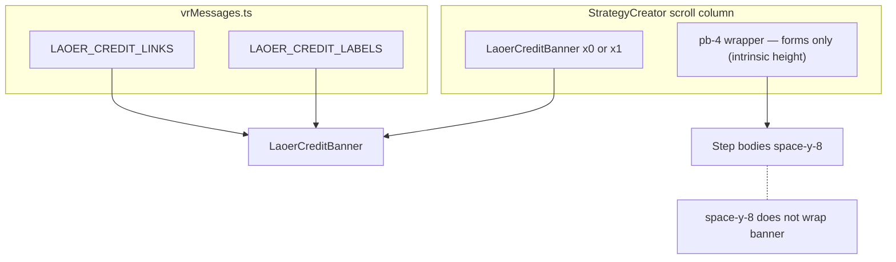

# 라오어 출처 UI — 아키텍처 계획서 (Strict / S급)

> **상태:** **코드베이스 반영 완료** (2026-03 기준). 본 문서는 설계 근거이자 **현재 구현(as-built)과의 대조용 SSOT**로 유지한다.  
> **오해 방지:** 과거 초안에 있던 **「`renderMultiSplitStep1` / `renderNoStopMultiSplitStep1` / `VrBandStrategyForm` 하단에 배너 3중 삽입」**, **렌더 루프 내 `strategy.id === …` 나열**, **「PR에서 i18n」 유예**, **동일 `<a>` 블록 3회 나열**은 **채택하지 않는다**. 아래가 유일한 정식 설계다.  
> **구 초안 §2 / §5.4 / §5.5 / §5.6 등으로 다시 지적되는 경우** → **부록 B**에서 “현재 문서에 그 절이 없음”을 먼저 확인한다.

## 구현 현황 요약 (As-Built)

| 구분 | 반영 내용 |
|------|-----------|
| SSOT | `constants/vrMessages.ts` — `LaoerCreditLinkId`, `LaoerCreditLabels`, `LAOER_CREDIT_LINKS`, `LAOER_CREDIT_LABELS` + `lucide-react` (`Youtube`, `Users`, `BookOpen`, `LucideIcon`) |
| 배너 | `components/strategies/LaoerCreditBanner.tsx` — `LAOER_CREDIT_LINKS.map`, `ANCHOR_CLASS`, 문구는 `LAOER_CREDIT_LABELS[lang]`만 |
| 생성기 | `components/StrategyCreator.tsx` — `isLaoerOriginal`, `strategyDefinitions` / `isSelectedStrategyLaoer` `useMemo`, 카드 `flex-wrap` + 배지(`LAOER_CREDIT_LABELS[lang].badge`만, **선택 연산·한글 폴백 없음**), `renderMultiSplitStep1` 하단 유튜브 출처 **삭제됨**, 스크롤 `flex min-h-0 flex-1 flex-col` + 내부 **`pb-4`만(폼 intrinsic 높이·단일 스크롤 스택)** + `step === 1 && isSelectedStrategyLaoer` 시 단일 `<LaoerCreditBanner />` |
| 푸터 | 동일 파일 — 모듈 레벨 `TWO_STEP_STRATEGY_IDS`, `WIZARD_LAST_STEP_TWO_FLOW`(2), `WIZARD_LAST_STEP_RSI`(3), `isTwoStepWizardStrategy`, `getFooterPrimaryCtaLabel`, `shouldShowFooterNextChevron`로 **스텝·라벨·Chevron SSOT**. **Primary CTA**는 `handleFooterAction`(`useCallback`) + `handleSaveRef`로 인라인 거대 `onClick` 제거; 2단계/RSI 라우팅은 `isTwoStepWizardStrategy`·상수만 사용(문자열 `||` 나열 없음) |
| 미변경 | `components/strategies/VrBandStrategyForm.tsx` — **diff 없음** |

`yarn tsc --noEmit`은 저장소 내 기존 타입 이슈로 전체 통과가 어려울 수 있으나, 위 변경 파일들은 IDE 기준 신규 진단 없이 맞춰 둔 상태다.

---

## 부록 A — 지적 사항 대응 매핑 (코드 리뷰용)

| # | 지적 | 본 문서의 처리 |
|---|------|----------------|
| 1 | 배너 3중 복제 + `space-y-8`과 네거티브 마진 충돌 | **§0, §4.4**: 폼 **내부 삽입 금지**. `StrategyCreator` 스크롤 컨테이너 **`flex flex-col`** + 폼만 **`flex-1` 래퍼** + 배너 **형제 1회** |
| 2 | `strategy.id` 하드코딩 분기 | **§4.3–4.4**: `isLaoerOriginal` + `isSelectedStrategyLaoer`만 사용 |
| 3 | I18N 미루기 / JSX 하드코딩 | **§2**: `LAOER_CREDIT_LABELS`에 **ko/en 전 필드** 즉시 정의. JSX에는 **조회 결과만** |
| 4 | `<a>` 3개 수동 나열 | **§2–3**: `LAOER_CREDIT_LINKS` + `.map()` + 공통 `ANCHOR_CLASS` |

---

## 부록 B — 구(舊) 계획서 § 번호와의 대조 (오탐 방지)

아래는 **과거 다른 초안**에서 쓰이던 절 번호를 기준으로 한 위반 제보이다. **현재 본 문서에는 해당 항목이 존재하지 않는다.**

| 제보의 “위반 위치” | 현재 문서에서의 사실 |
|---------------------|----------------------|
| §2 컴포넌트 분리를 「권장·선택」 | **없음**. §2는 **`vrMessages.ts` SSOT** 전용이며, 배너 컴포넌트는 §3에서 **필수 신규 파일**로 기술됨. |
| §5.4 폼 3곳에 배너 추가 | **없음**. 현재 §5는 **import 요약**뿐. 배너 단일 슬롯은 **§4.4**. |
| §6의 3·4·5번 순서가 “3곳 삽입” 절차 | **없음**. 현재 §6은 **체크리스트**이며 “폼별 삽입” 단계를 두지 않음. |
| §4.2 배지에 `strategy.id === …` | **없음**. 현재 §4.2는 **`getStrategyDefinitions` 데이터만** 서술. 배지 JSX는 **§4.3**이며 **`isLaoerOriginal`만** 사용. |
| §5.5 / §5.6 하드코딩·PR 이연 | **없음**. 현재 문서는 §5가 import 요약이며, 문자열은 전부 **§2 `LAOER_CREDIT_LABELS`**에 즉시 정의. |

**결론:** 제보 내용은 **타당한 설계 원칙**과 **오래된 초안의 절 구조**가 섞인 상태다. 구현·리뷰 시 **본 파일의 §0·§2·§3·§4.3–4.4**만 따르면 된다.

### 부록 B-1 — 외부에서 제안된 스니펫 중 채택하지 않는 것 (Strict)

| 제안 | 채택 여부 | 이유 |
|------|-----------|------|
| `LAOER_CREDIT_LINKS`에 `label: '유튜브'` 등 **한국어만** 두고 `.map`에서 `{label}` 표시 | **채택 안 함** | `lang === 'en'`일 때 링크가 한글로 남아 **Rule 3 위반**. 링크 표시문은 **`LAOER_CREDIT_LABELS[lang].linkLabels[id]`**만 사용. |
| `{LAOER_CREDIT_LABELS[lang]?.badge \|\| '라오어 Original'}` | **채택 안 함** | JSX에 한글 폴백·Dead Code. **`LAOER_CREDIT_LABELS[lang].badge`**만 사용. |
| Primary 푸터에 `multi_split \|\| no_stop \|\| vr_band` 등 **문자열 나열 `onClick`** | **채택 안 함** | **`isTwoStepWizardStrategy`** + **`WIZARD_LAST_STEP_*`** + **`handleFooterAction`** (`§4.6`). |
| `isSelectedStrategyLaoer`에서 매번 `getStrategyDefinitions(t, vrT)` 호출만 | **비권장** | **§4.3**처럼 `strategyDefinitions`를 `useMemo`로 한 번 두고 `find`하면 정의 배열 생성이 한 곳으로 모임 (DRY). |

---

## 0. 금지 패턴 (회귀 방지 — 리팩터링 시에도 준수)

- **`renderMultiSplitStep1` / `renderNoStopMultiSplitStep1` / `VrBandStrategyForm`에 `<LaoerCreditBanner` 또는 동등 JSX를 한 줄이라도 추가** → **금지**.
- **`strategy.id === 'multi_split' \|\| …`** 로 배지·배너 노출 판단 → **금지**.
- **`LAOER_CREDIT_LINKS` 항목에 `label: '유튜브'`만 두고 `en`에서 그대로 쓰기** → **금지** (링크 라벨은 **반드시** `LAOER_CREDIT_LABELS[lang].linkLabels[id]`).
- **배지에 `LAOER_CREDIT_LABELS[lang]?.badge \|\| '라오어 Original'`** → **금지** (`Record<AppLang, …>`가 완전하므로 폴백 불필요·Rule 3 위반 소지).

---

## 1. 영향 파일

| 파일 | 상태 |
|------|------|
| `constants/vrMessages.ts` | **완료** — `LAOER_*` 상수·타입 및 Lucide import 반영됨 |
| `components/strategies/LaoerCreditBanner.tsx` | **완료** — 신규 파일 존재 |
| `components/StrategyCreator.tsx` | **완료** — 플래그·배지·스크롤 레이아웃·단일 배너·출처 블록 제거·푸터 헬퍼 반영 |
| `components/strategies/VrBandStrategyForm.tsx` | **변경 없음** (의도대로 미수정) |

---

## 2. Step 1 — SSOT: `constants/vrMessages.ts`

### 2.1 원칙

- 심볼 이름은 **`LAOER_` 접두**로 네임스페이스 충돌 방지.
- `Record<AppLang, any>` **사용 금지** — 아래 `LaoerCreditLabels` 인터페이스로 고정.

### 2.2 스니펫

```ts
import { BookOpen, Users, Youtube, type LucideIcon } from 'lucide-react';
import type { AppLang } from '../types';

export type LaoerCreditLinkId = 'youtube' | 'cafe' | 'blog';

export interface LaoerCreditLabels {
  badge: string;
  title: string;
  desc: string;
  ariaRegion: string;
  linkLabels: Record<LaoerCreditLinkId, string>;
}

/** URL·아이콘·id만 — 표시 문자열은 LAOER_CREDIT_LABELS에만 둔다 (Strict I18N). */
export const LAOER_CREDIT_LINKS: readonly {
  id: LaoerCreditLinkId;
  url: string;
  icon: LucideIcon;
}[] = [
  { id: 'youtube', url: 'https://www.youtube.com/@laofus', icon: Youtube },
  { id: 'cafe', url: 'http://cafe.naver.com/infinitebuying', icon: Users },
  { id: 'blog', url: 'http://m.blog.naver.com/edgar0418', icon: BookOpen },
];

export const LAOER_CREDIT_LABELS: Record<AppLang, LaoerCreditLabels> = {
  ko: {
    badge: '라오어 Original',
    title: 'Official Strategy Credit',
    desc: "본 전략은 작가 '라오어'님의 독창적인 투자 철학을 바탕으로 설계되었습니다. 전략의 깊은 이해를 위해 원작자의 철학을 꼭 확인해 보세요.",
    ariaRegion: '전략 출처 및 공식 채널',
    linkLabels: {
      youtube: '유튜브',
      cafe: '네이버 카페',
      blog: '블로그',
    },
  },
  en: {
    badge: 'Laoer Original',
    title: 'Official Strategy Credit',
    desc: "This strategy is based on the original investment philosophy of author 'Laoer'. Be sure to review the author's philosophy for a deeper understanding.",
    ariaRegion: 'Strategy Credit and Official Channels',
    linkLabels: {
      youtube: 'YouTube',
      cafe: 'Naver Cafe',
      blog: 'Blog',
    },
  },
};
```

---

## 3. Step 2 — `LaoerCreditBanner.tsx`

```tsx
import React from 'react';
import { Info } from 'lucide-react';
import { LAOER_CREDIT_LABELS, LAOER_CREDIT_LINKS } from '../../constants/vrMessages';
import type { AppLang } from '../../types';

export interface LaoerCreditBannerProps {
  lang: AppLang;
}

const ANCHOR_CLASS =
  'inline-flex items-center gap-1 rounded-lg border border-white/10 bg-white/20 px-2.5 py-1.5 text-[10px] font-bold text-white backdrop-blur-sm transition-all hover:bg-white/30 active:scale-95';

export default function LaoerCreditBanner({ lang }: LaoerCreditBannerProps) {
  const t = LAOER_CREDIT_LABELS[lang];

  return (
    <div
      className="relative mt-8 w-full shrink-0 overflow-hidden rounded-2xl bg-gradient-to-br from-indigo-700 via-blue-600 to-indigo-800 p-4 sm:rounded-3xl"
      role="region"
      aria-label={t.ariaRegion}
    >
      <div
        className="pointer-events-none absolute -right-4 -top-4 h-24 w-24 rounded-full bg-white/10 blur-2xl"
        aria-hidden
      />
      <div
        className="pointer-events-none absolute -bottom-6 -left-6 h-32 w-32 rounded-full bg-blue-400/10 blur-3xl"
        aria-hidden
      />

      <div className="relative z-10 flex items-start gap-3">
        <div className="mt-0.5 flex-shrink-0 rounded-lg border border-white/10 bg-white/15 p-1.5 backdrop-blur-md">
          <Info size={16} className="text-white" aria-hidden />
        </div>

        <div className="min-w-0 flex-1">
          <div className="mb-1 flex items-center gap-1.5">
            <h4 className="text-xs font-black uppercase tracking-widest text-white opacity-90">
              {t.title}
            </h4>
            <div className="h-px min-w-[2rem] flex-1 bg-white/20" />
          </div>

          <p className="mb-3 text-[11px] font-medium leading-relaxed text-blue-50/90">{t.desc}</p>

          <div className="flex flex-wrap items-center gap-2">
            {LAOER_CREDIT_LINKS.map(({ id, url, icon: Icon }) => (
              <a
                key={id}
                href={url}
                target="_blank"
                rel="noopener noreferrer"
                className={ANCHOR_CLASS}
              >
                <Icon size={12} className="shrink-0 opacity-80" aria-hidden />
                {t.linkLabels[id]}
              </a>
            ))}
          </div>
        </div>
      </div>
    </div>
  );
}
```

- **`mt-8`**: 폼과 배너 사이 세로 간격.
- **Contained card**: 네거티브 마진 없음 — 부모 `p-6 md:p-8` 안에서 `rounded-2xl`/`sm:rounded-3xl`로 정렬 (에지 투 에지 비사용).

---

## 4. Step 3 — `StrategyCreator.tsx`

### 4.1 `StrategyDefinition`

```tsx
interface StrategyDefinition {
  id: StrategyType;
  title: string;
  description: string;
  tier: 'FREE' | 'PRO' | 'PREMIUM';
  icon: React.ReactNode;
  gradient: string;
  disabled?: boolean;
  comingSoon?: boolean;
  isLaoerOriginal?: boolean;
}
```

### 4.2 `getStrategyDefinitions`

`multi_split`, `no_stop_multi_split`, `vr_band`에만 `isLaoerOriginal: true`.

### 4.3 메모 · 배지

```tsx
import LaoerCreditBanner from './strategies/LaoerCreditBanner';
import { LAOER_CREDIT_LABELS } from '../constants/vrMessages';

const strategyDefinitions = React.useMemo(() => getStrategyDefinitions(t, vrT), [t, vrT]);

const isSelectedStrategyLaoer = React.useMemo(() => {
  if (!selectedStrategy) return false;
  const def = strategyDefinitions.find((s) => s.id === selectedStrategy);
  return Boolean(def?.isLaoerOriginal);
}, [selectedStrategy, strategyDefinitions]);
```

- `renderStrategySelection`의 `map`은 **`strategyDefinitions`**만 순회 (`getStrategyDefinitions` 직접 중복 호출 금지).

**배지 (폴백 없음):**

```tsx
{strategy.isLaoerOriginal && (
  <div className="ml-1.5 inline-flex items-center gap-1 rounded-full border border-amber-200/50 bg-amber-50 px-1.5 py-0.5 align-middle shadow-sm dark:border-amber-700/30 dark:bg-amber-900/20">
    <Sparkles size={10} className="animate-pulse text-amber-500" aria-hidden />
    <span className="whitespace-nowrap text-[10px] font-bold tracking-tight text-amber-700 dark:text-amber-400">
      {LAOER_CREDIT_LABELS[lang].badge}
    </span>
  </div>
)}
```

### 4.4 스크롤 영역 — 단일 배너 슬롯

```tsx
<div className="flex min-h-0 flex-1 flex-col overflow-y-auto overscroll-contain p-6 md:p-8 scrollbar-hide bg-slate-50/50 dark:bg-gradient-to-b dark:from-slate-900/80 dark:via-slate-950/80 dark:to-slate-950">
  <div className="pb-4">
    {step === 0 && renderStrategySelection()}
    {step === 1 && selectedStrategy === 'rsi_ma_interval' && renderStep1()}
    {step === 2 && selectedStrategy === 'rsi_ma_interval' && renderStep2()}
    {step === 3 && renderStep3()}
    {step === 1 && selectedStrategy === 'multi_split' && renderMultiSplitStep1()}
    {step === 2 && selectedStrategy === 'multi_split' && renderMultiSplitStep2()}
    {step === 1 && selectedStrategy === 'no_stop_multi_split' && renderNoStopMultiSplitStep1()}
    {step === 2 && selectedStrategy === 'no_stop_multi_split' && renderNoStopMultiSplitStep2()}
    {step === 1 && selectedStrategy === 'vr_band' && <VrBandStrategyForm ... />}
    {step === 2 && selectedStrategy === 'vr_band' && renderMultiSplitStep2()}
  </div>

  {step === 1 && isSelectedStrategyLaoer && <LaoerCreditBanner lang={lang} />}
</div>
```

- 바깥 컬럼에 **`min-h-0`**를 함께 두면 flex 자식 스크롤이 깨지는 경우를 줄인다 (구현 시 기존 클래스 문자열과 병합).
- **`VrBandStrategyForm`**: 위 스니펫의 `...`는 실제 코드에서 `lang`, `vrMode`, `onVrModeChange` 등 **기존과 동일한 개별 props**로 치환된다.

### 4.5 `renderMultiSplitStep1` — 삭제 대상

다음 **전체** 제거: `전략 로직 요약` 카드 하단 `border-t` 블록 안의 `출처` / `Source` 문구 및 `https://www.youtube.com/@laofus` 링크.  
→ **저장소 기준 삭제 완료.**

### 4.6 푸터 CTA (구현됨) — JSX 중첩 삼항 제거 · 스텝 상수화 · Primary 핸들러 분리

`StrategyCreator.tsx` 모듈 스코프에 다음이 정의되어 있으며, **2단계 마법사**(`multi_split`, `no_stop_multi_split`, `vr_band`)에서 Step 2일 때 **「전략 시작」/ Start Strategy** 및 **Chevron**이 `rsi` 3단계와 충돌 없이 동작하도록 한다. **매직 넘버**(`2`, `3`)는 JSX·`onClick`에 직접 쓰지 않고 아래 상수와 헬퍼만 사용한다.

- `TWO_STEP_STRATEGY_IDS`: `readonly StrategyType[]` — `['multi_split', 'no_stop_multi_split', 'vr_band']`
- `WIZARD_LAST_STEP_TWO_FLOW` = `2` — 2단계 플로우에서 마지막 스텝(이 스텝에서 저장 트리거)
- `WIZARD_LAST_STEP_RSI` = `3` — `rsi_ma_interval` 마지막 스텝
- `isTwoStepWizardStrategy(id)` — Primary CTA `onClick`, 라벨, Chevron이 **동일 판별**을 공유(DRY)
- `getFooterPrimaryCtaLabel(selectedStrategy, step, lang)` — 위 상수·`isTwoStepWizardStrategy` 사용
- `shouldShowFooterNextChevron(selectedStrategy, step)` — 동일

**Primary 파란 버튼:** `type="button"` + `onClick={handleFooterAction}`. `handleFooterAction`은 컴포넌트 내부 `React.useCallback`으로 정의하고, `handleSave`는 의존성 폭발·매 렌더 재생성을 피하기 위해 **`handleSaveRef.current = handleSave`**(렌더 시 동기 갱신) 후 `void handleSaveRef.current()`로 호출한다. JSX 안에 `selectedStrategy === 'multi_split' \|\| …` 같은 **문자열 나열 분기**를 두지 않는다.

**헤더 스텝 인디케이터**(점 배열·`Step n of m`): 동일하게 `isTwoStepWizardStrategy`·`WIZARD_LAST_STEP_*`·`Array.from({ length: … })`로 맞춰 **푸터와 스텝 개수 SSOT**를 유지한다.

---

## 5. import 요약

| 파일 | 추가 |
|------|------|
| `vrMessages.ts` | `LAOER_CREDIT_LINKS`, `LAOER_CREDIT_LABELS`, 타입 |
| `LaoerCreditBanner.tsx` | `LAOER_*`, `Info`, `AppLang` |
| `StrategyCreator.tsx` | `LaoerCreditBanner`, `LAOER_CREDIT_LABELS` |

---

## 6. 구현 체크리스트

- [x] 배너가 **스크롤 컨테이너 하단에만** 1회 (`step === 1 && isSelectedStrategyLaoer`)
- [x] 폼 파일·`render*Step1` **내부에 배너 없음**
- [x] `flex flex-col` + 내부 `pb-4` 래퍼(단일 스크롤 스택) + 배너 형제
- [x] 배지·배너 문자열 전부 `LAOER_CREDIT_LABELS` / `linkLabels`
- [x] 앵커는 `LAOER_CREDIT_LINKS.map` + `ANCHOR_CLASS`
- [x] `VrBandStrategyForm.tsx` diff 없음
- [x] 푸터: `vr_band` 포함 2단계 CTA·Chevron + 스텝 상수 + `handleFooterAction` (`§4.6`)

---

## 7. 다이어그램



---

**본 문서에 ‘폼 3곳 하단 삽입’ 항은 없다.** 추가 변경 시 §0·§부록 A·**구현 현황 요약**을 우선 확인한다.
