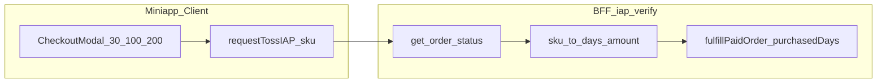

# 토스 미니앱 IAP: PRO 30·100·200일 상품 및 `purchasedDays` 지원 계획

**문서 목적**: 토스 미니앱 IAP를 30·100·200일 SKU 3종으로 나누고, 서버 Fulfillment에 `purchasedDays` 오버라이드를 추가해 스토어 결제 금액과 지급 일수가 일치하도록 하는 구현 계획을 기록합니다.  
**범위**: 웹(포트원) 경로는 기존 `quantity`(30일 단위)를 유지합니다.

## 단계적 출시와의 관계

- **Phase 1 (빠른 출시)**: 미니앱에서는 **30일권 1건만** 노출·구매 가능하도록 UI를 제한합니다. 서버 다중 SKU·`purchasedDays`는 이 단계에서 다루지 않습니다. 상세는 [IAP_PHASED_ROLLOUT_PLAN.md](./IAP_PHASED_ROLLOUT_PLAN.md)를 참고합니다.
- **Phase 2 (본 문서)**: 아래부터 기술한 **다중 SKU·판매가·서버 검증·Fulfillment** 전체를 적용합니다.

---

## 배경

- 현재 `server/src/services/paymentFulfillment.ts`의 `computeSubscriptionUpdate`는 `purchasedDays = PLAN_DAYS_PER_UNIT * quantity`(30×개수)만 지원합니다.
- 미니앱에서 SKU는 **건당 1회 결제**이므로 100·200일은 **별도 SKU + 서버에서 고정 일수 지급**이 적절합니다.
- `server/src/routes/payment.ts`의 `iap-verify`는 이미 `sku`를 토스 `get-order-status`로 검증하므로, **SKU → (planId, purchasedDays, amount)** 매핑만 확장하면 됩니다.

---

## 콘솔 확정 값 (판매가 = 결제창 표시 금액)

클라이언트·서버 `iapConstants` 및 기본 `PLAN_AMOUNT_*` / `VITE_PLAN_AMOUNT_*` 동기화 기준입니다.

| 이용 기간 | 상품 ID (SKU) | 판매가 (KRW) |
|-----------|---------------|--------------|
| 30일 | `ait.0000019657.865b2b73.2082393ca6.1984429523` | **5,907** |
| 100일 | `ait.0000019657.b6e131bc.d2bd403943.4503986864` | **16,500** |
| 200일 | `ait.0000019657.005e04f0.5f5cce8e7f.4504114505` | **29,920** |

- 서버 환경변수 예시: `PLAN_AMOUNT_PRO=5907`, `PLAN_AMOUNT_PRO_100=16500`, `PLAN_AMOUNT_PRO_200=29920`  
- 프론트 대응: `VITE_PLAN_AMOUNT_PRO`, `VITE_PLAN_AMOUNT_PRO_100`, `VITE_PLAN_AMOUNT_PRO_200`
- **공급가**(콘솔)는 정산·콘솔 참고용이며, **주문 UI·DB 기록·검증 기준은 판매가**와 맞춥니다.

---

## 설계 요약

- **`purchasedDays`**: `FulfillPaidOrderParams` / `computeSubscriptionUpdate` 입력에 선택 필드로 추가. 지정 시 그대로 사용, 미지정 시 기존처럼 `30 * quantity`(포트원·웹훅·Edge Function 호환).
- **`quantity`**: IAP 경로에서는 `1` 유지, 주문 메타데이터에 `purchased_days`를 넣어 추적을 명확히 합니다.

---

## 1. 서버: `paymentFulfillment`

**파일**: `server/src/services/paymentFulfillment.ts`

- `FulfillPaidOrderParams`에 `purchasedDays?: number` 추가 (양의 정수만 허용, `fulfillPaidOrder` 진입 시 가드).
- `computeSubscriptionUpdate` 인자에 `purchasedDays?: number` 추가.
  - 계산: `const purchasedDays = input.purchasedDays ?? PLAN_DAYS_PER_UNIT * Math.max(1, input.quantity);`
- `fulfillPaidOrder`에서 `computeSubscriptionUpdate` 호출 시 `params.purchasedDays` 전달.
- `claim_order_processing` / `markOrderStatus` 메타데이터에 `purchased_days` 병합(기존 `quantity` 유지).

**테스트**: `server/src/services/paymentFulfillment.test.ts`에 `purchasedDays: 100` 등 만료일 검증 케이스 추가.

**후속(참고)**: PRO 잔여일이 있을 때 PREMIUM 업그레이드 분기의 `remainingValue`는 현재 `(pro 단가 / 30) * 잔여일` 기준입니다. 100·200일 직후 업그레이드가 드물면 이번 범위에서 생략 가능합니다.

---

## 2. 서버: `iap-verify` 라우트

**파일**: `server/src/routes/payment.ts`

- `server/src/services/iapConstants.ts`에 위 표의 SKU 3개와 **SKU → `{ planId: 'pro', purchasedDays, amount }`** 맵(기본 amount는 표의 판매가, env로 덮어쓰기 가능).
- `PLAN_AMOUNT_PRO`, `PLAN_AMOUNT_PRO_100`, `PLAN_AMOUNT_PRO_200` 기본값 **5907 / 16500 / 29920**. `payment.ts` 상단 주석과 프론트 `VITE_*`와 동기화.
- `fulfillPaidOrder` 호출: `quantity: 1`, `purchasedDays`·`amount`는 맵에서, `orderName` 예: `PRO Plan (100일)`.

---

## 3. 클라이언트: IAP 상수 및 결제 UI

| 파일 | 작업 |
|------|------|
| `services/iap/iapConstants.ts` | `PRO_30` / `PRO_100` / `PRO_200` SKU, `IapProDurationDays`, `getProIapSku` 등 |
| `server/src/services/iapConstants.ts` | 클라이언트와 동일 SKU·맵(서버 검증용) |
| `services/payment/tossIapService.ts` | `planId` + `durationDays` 또는 `sku`로 `requestTossIAP` 확장(BFF는 SKU만 신뢰) |
| `components/CheckoutModal.tsx` | `isInTossApp`일 때 1~12개 대신 **30 / 100 / 200일** 3옵션, 금액은 위 `VITE_*` |
| `constants/paymentCheckoutMessages.ts` | **필수·신설** — 체크아웃/결제 카피 전용 i18n (`vrMessages`에 결제 문구 넣지 않음) |
| `constants/membership.ts` (선택) | PRO IAP 표시 금액 3종 로드 헬퍼로 SSOT 정리 |

**UI·상태 원칙 (Phase 2 포함)**: [IAP_PHASED_ROLLOUT_PLAN.md](./IAP_PHASED_ROLLOUT_PLAN.md)의 **아키텍처 리뷰 반영**(§1–§7) 및 **i18n 파일 정책**과 동일 — `useEffect` 수량 동기화 금지, **파생 수량·고정 상수**, **`paymentCheckoutMessages.ts`**, 단가·총액 **NaN/비정상 방어**, **KRW 총액은 정수·제품 정책 내림(`Math.floor`·`*100/100` 미사용)**, **렌더 경로에서 throw 금지**(Fallback 0 + 버튼 비활성), 고정 기간 UI **A11y 시맨틱**, **`totalAmount` 등은 return 이전 계산**, 결제 핸들러는 **도출된 수량/금액만** payload.

---

## 4. 약관·카피

- `components/Terms.tsx` 등 “30일 이용권”만 단정하는 문구가 있으면 100·200일 옵션을 포괄하도록 수정.

---

## 5. 배포·검증 (코드 외)

- 100·200일 상품은 앱인토스 콘솔에 등록됨(본 문서 표의 SKU·판매가 기준).
- Railway/BFF·프론트 `.env`에 `PLAN_AMOUNT_PRO_100` / `PLAN_AMOUNT_PRO_200` 및 대응 `VITE_*` 설정, 또는 코드 fallback만 사용.
- **출시 전** 실기기에서 3 SKU 각각 결제창 표시 금액 재확인 권장.

---

## 구현 순서 제안

**전제**: [IAP_PHASED_ROLLOUT_PLAN.md](./IAP_PHASED_ROLLOUT_PLAN.md)의 **Phase 1**(토스에서 30일 1건만)을 먼저 반영한 뒤, 본 문서(Phase 2) 순서를 진행하는 것을 권장합니다.

1. `paymentFulfillment` + 테스트 (`purchasedDays`).
2. 서버 `iapConstants` 확장 + `iap-verify` 맵핑·`fulfillPaidOrder` 연동.
3. 클라이언트 `iapConstants` + `tossIapService` + `CheckoutModal` 토스 분기.
4. 약관 문구 최소 수정.

---

## 작업 체크리스트 (참고)

| ID | 내용 |
|----|------|
| fulfillment-purchased-days | `FulfillPaidOrderParams` + `computeSubscriptionUpdate`에 `purchasedDays?`, 가드, 테스트 |
| iap-verify-sku-map | 서버 `iapConstants` + `iap-verify`: 3 SKU → 일수·판매가, env 기본값 5907/16500/29920 |
| client-iap-ui | 클라 `iapConstants`, `tossIapService`, `CheckoutModal` 토스 전용 30/100/200 + 금액 env |
| terms-copy | Terms 등 30일 단정 문구 → 100·200일 포함 |

---

*본 문서는 구현 진행 시 상태를 여기 또는 PR 설명에 맞춰 갱신하면 됩니다.*
