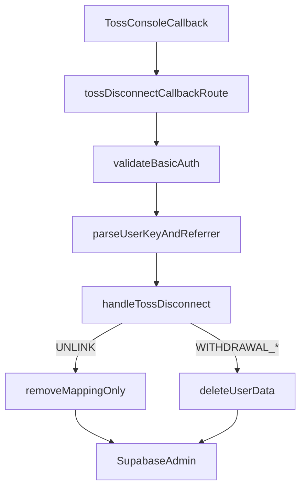

# 토스 연결 끊기 콜백 구현 계획서

> 역할: 토스 미니앱의 `UNLINK`, `WITHDRAWAL_TERMS`, `WITHDRAWAL_TOSS` 콜백을 안전하게 도입하기 위한 구현 계획 문서입니다.  
> 전략: 기존 레거시 웹훅은 유지하고, 새 라우트와 핸들러를 병행 구축한 뒤 토스 콘솔 URL만 전환하는 **Side-by-side (Isolate & Switch)** 방식으로 진행합니다.

---

## 0. 외부 리뷰 반영 요약

### 0.1 발견된 문제점 (중요도 순) 및 본 문서의 입장

**1) [CRITICAL] `auth.admin.listUsers` 페이지 순회**

- **동의 (웹훅 경로에서는 금지)**: 토스 연결 끊기 콜백은 **수 초 내 200 응답**이 기대되고, 실패 시 **재시도**가 붙을 수 있어, 사용자 수가 커질수록 **지연·타임아웃·재시도 폭증** 위험이 큽니다.
- **보완 (OOM 표현)**: 구현이 페이지 단위라면 **“전 사용자를 한 번에 메모리에 적재”**와는 다릅니다. 다만 **최악 경우 매우 많은 Admin API 왕복**이 생기므로, **운영 규모에서 사실상 사용 불가**한 패턴으로 취급하는 것이 맞습니다.
- **본 문서의 수정안**: 콜백 핸들러에서는 **`toss_accounts` 단일 조회**로 `auth_user_id` 를 해석합니다. 매핑이 없으면 **`noop`(200) + 구조화 로그**(빠른 응답)로 **확정**합니다.
- **선택 확장 (제품 요구 시)**: `toss_accounts` 이전 레거시까지 반드시 철회해야 하면, **`auth.users` 를 단일 SQL로 조회하는 RPC**(SECURITY DEFINER, 권한·감사 최소화)를 **별도 마이그레이션**으로 추가합니다. ([§7 콜백 스펙](https://developers-apps-in-toss.toss.im/login/develop.html#_7-%E1%84%8F%E1%85%A9%E1%86%AF%E1%85%A2%E1%86%A8%E1%84%87%E1%85%B3%E1%86%AF-%E1%84%90%E1%85%A9%E1%86%BC%E1%84%92%E1%85%A2-%E1%84%85%E1%85%A9%E1%84%80%E1%85%B3%E1%84%8B%E1%85%B5%E1%86%AB-%E1%84%81%E1%85%B3%E1%86%AD%E1%84%80%E1%85%B5) 준수·응답 SLA가 우선입니다.)

**2) [HIGH] `FastifyRequest` 에 `correlationId` 부재로 `tsc` 실패**

- **부분 동의**: 타입 보강 자체는 맞는 방향입니다.
- **현재 레포 사실**: [`server/src/types/fastify.d.ts`](server/src/types/fastify.d.ts) 에 이미 `correlationId` 모듈 보강이 있습니다. 루트 `types/fastify.d.ts` 가 아니라 **서버 `src` 포함 경로**에 있습니다.
- **추가 정리 (2차 리뷰 반영)**: [`server/src/index.ts`](server/src/index.ts) 에서는 `request.log` 를 **`request.log = request.log.child({ correlationId })`** 로 갱신합니다. 객체 전체에 대한 타입 캐스팅은 사용하지 않습니다. (§0.3)

**3) [MEDIUM] 삭제 원자성 부재·에러 문자열 하드코딩**

- **동의**: `portfolio_history` / `portfolios` 삭제 후 `auth.admin.deleteUser` 가 실패하면 **부분 삭제(좀비 상태)** 가 될 수 있습니다. BFF만으로 완전한 단일 트랜잭션은 어렵습니다.
- **본 문서의 수정안**: `throw new Error('한글/임의 문자열')` 대신 **에러 코드 상수**를 사용하고, 로그에 **삭제 단계(stage)** 를 남깁니다. 완전 원자성은 **기술부채 B안(Postgres RPC 단일 진입점)** 으로 이관합니다.

### 0.2 제품·운영 정책 (확정)

**`toss_accounts` 에 해당 `userKey` 행이 없을 때** `UNLINK` 및 `WITHDRAWAL_*` 모두 **`noop`(200)** 으로 처리하고 종료합니다.

- **이유**: 콜백 SLA·재시도 부담을 줄이고, 매핑이 없으면 서비스 측에서 이미 연결이 없거나 정리된 상태로 간주합니다.
- **로그**: `userKey` 는 원문 전체 로그 금지 원칙을 지키고, **마스킹·해시 등 최소 식별자**만 남깁니다.
- **레거시 사용자 전량 삭제**가 향후 필수로 바뀌면 §10 선택 RPC 등으로 별도 확장합니다.

### 0.3 2차 외부 리뷰 반영 (동의·수정 사항)

아래는 리뷰 의견에 대한 검토 결과이며, 구현 스니펫에 그대로 반영합니다.

**1) [HIGH] `userKey` 에 대한 중복 `.trim()` (DRY)**

- **동의**: Zod에서 `String(value).trim()` 까지 끝낸 뒤 핸들러·서비스에서 다시 `trim()` 하는 것은 중복이며, **경계는 스키마 한 곳**에 둡니다.
- **보완**: `trim()` 만으로는 빈 문자열이 남을 수 있으므로 스키마에 **`.refine((s) => s.length > 0)`** (또는 `.pipe(z.string().min(1))` 등 동등한 제약)을 추가해 **공백-only 입력은 400**으로 걸러냅니다. 핸들러에서는 `userKey` 를 **정제 완료 값**으로만 취급합니다.
- **`deleteUserData(authUserId)`**: 인자는 **DB에서 온 UUID 문자열**이므로 `trim()` 및 `INVALID_AUTH_USER_ID` 분기는 **제거**합니다. 검증 경계에 대한 **운영 확정**은 §0.4 를 따릅니다.

**2) [HIGH] `index.ts` 의 `request.log` 강제 캐스팅**

- **동의**: `(request as { log: ... }).log = ...` 는 타입 우회입니다.
- **수정**: Fastify·Pino에서 권장되는 패턴인 **`request.log = request.log.child({ correlationId })`** 로 교체합니다. ([`server/src/types/fastify.d.ts`](server/src/types/fastify.d.ts) 의 `correlationId` 보강은 유지.)

**3) [MEDIUM] 범용 `Error` 만으로 HTTP 의미가 뭉개짐 (SRP)**

- **동의**: 매핑 조회 실패(500·재시도)와 검증 실패(400)를 구분하려면 **코드·상태를 타입에 실어** 라우터는 `instanceof` 분기만 하면 됩니다.
- **수정**: `server/src/toss/errors.ts` 에 **`TossDisconnectError`** 를 두고, 핸들러는 이 타입만 던집니다. **`deleteUserData`** 는 동일 패턴의 **`DeleteUserDataError`**(또는 공통 베이스 1개)로 던져 라우트에서 **기계적 `errorCode` + HTTP 상태**를 일관되게 반환합니다. **인간용 `message` 와 `code` 분리**는 §0.6 을 따릅니다.

**4) [LOW] `maybeSingle()` 과 DB 제약**

- **확인 완료**: [`server/migrations/20260304_add_toss_accounts.sql`](server/migrations/20260304_add_toss_accounts.sql) 에서 `toss_user_key` 는 **`primary key (toss_user_key)`** 로 선언되어 있어, 복수 행이 나올 수 없습니다. 별도 `UNIQUE(toss_user_key)` 문구는 없어도 **PK = 유일성 보장**이므로 `maybeSingle()` 사용에 문제 없습니다.

### 0.4 `deleteUserData(authUserId)` 검증 위치 (확정)

- **전제**: 인자는 **이미 검증된 UUID** (또는 동일하게 신뢰할 수 있는 출처, 예: `toss_accounts` 조회 결과)임을 가정합니다.
- **함수 내부**: `trim`·정규식 UUID 검사 등 **방어 로직을 넣지 않습니다**. 입력 정규화·검증은 **호출 경계**(Zod 스키마 등)의 책임으로 두는 것이 DRY·SRP 에 부합합니다.
- **향후 확장**: 사내 관리자 API 등 다른 진입점에서 `deleteUserData` 를 재사용하게 되면, 그때 해당 **라우터/컨트롤러**에 Zod 검증 스키마를 추가해 방어선을 구축합니다.

### 0.5 3차 외부 리뷰 반영 (동의·수정 사항)

**1) [CRITICAL] `handleUnlink` 실행 순서와 재시도 멱등성**

- **동의**: `toss_accounts` 를 먼저 삭제한 뒤 `user_profiles` 갱신이 실패하면, 재시도 시 매핑이 없어 **`noop`(200)** 이 되고 **`user_profiles.toss_user_key` 가 영구 오염**될 수 있습니다.
- **수정**: **조회 기준점**인 `toss_accounts` 는 **가장 마지막에 삭제**합니다. 순서는 **`user_profiles.toss_user_key` null 갱신 → `toss_accounts` 삭제** (Step 2 스니펫). 프로필 갱신은 동일 값으로 재실행해도 무방해 재시도에 유리합니다.

**2) [MEDIUM] `deleteUserData` 의 `from(tableName)` 루프와 Supabase 제네릭**

- **동의**: 테이블이 소수(2개)일 때 변수·유니온으로 `from()` 에 넘기면 클라이언트 타입 추론이 약해질 수 있습니다.
- **수정**: **`portfolio_history` → `portfolios` → `auth.admin.deleteUser`** 를 **루프 없이 선형 호출**로 작성합니다 (Step 1 스니펫).

**3) [LOW] 라우트의 `rawBody` 선행 검사와 Zod 중복**

- **동의**: `z.object().strict().safeParse(request.body)` 가 `null`·배열·원시값·비객체 입력을 실패로 처리하므로, **`typeof rawBody !== 'object'` 선행 분기**는 제거해도 됩니다.
- **보완**: 검증 실패 시 메시지는 통일된 `Invalid payload` 로 두고, 로그에 `zodError` 를 남깁니다.

### 0.6 4차 외부 리뷰 반영 — 도메인 에러의 `message` 와 `code` 분리

**1) [LOW] `super(code)` 만으로 `Error.message` 와 HTTP `errorCode` 가 동일해짐**

- **동의**: 기계용 상수를 `message` 에 넣으면 라우트 응답에서 **`error` 와 `errorCode` 가 중복**되고, Sentry 등에서 **사람이 읽을 맥락**이 부족합니다.
- **수정**: `TossDisconnectError` / `DeleteUserDataError` 는 **`constructor(message: string, code: string, statusCode?: number)`** 형태로, **`message`** 는 인간용(로그·모니터링·선택적 HTTP `error`), **`code`** 는 기계용(`errorCode` 필드)으로 분리합니다 (Step 1 `errors.ts`).
- **PII·보안**: HTTP 응답에 실리는 `message` 문자열에는 **원문 `userKey`·전체 `authUserId`(UUID)** 를 **넣지 않습니다**. 식별자는 **`log.error({ ... })` 구조화 로그**와 `requestId` 로만 추적합니다. 리뷰 예시의 `` `...${userKey}` `` 는 **응답용으로는 사용하지 않습니다**.

---

## 1. 목표와 범위

토스 공식 가이드의 연결 끊기 콜백 스펙을 준수하면서, 리뷰 기준인 **"토스 앱에서 로그인 연결을 끊으면 사용자 데이터가 미니앱에 남아 있지 않아요"** 를 처리 가능한 구조로 만듭니다.

기준 문서:

- [토스 로그인 개발하기 - 콜백을 통해 로그인 끊기](https://developers-apps-in-toss.toss.im/login/develop.html#_7-%E1%84%8F%E1%85%A9%E1%86%AF%E1%85%A2%E1%86%A8%E1%84%87%E1%85%B3%E1%86%AF-%E1%84%90%E1%85%A9%E1%86%BC%E1%84%92%E1%85%A2-%E1%84%85%E1%85%A9%E1%84%80%E1%85%B3%E1%84%8B%E1%85%B5%E1%86%AB-%E1%84%81%E1%85%B3%E1%86%AD%E1%84%80%E1%85%B5)

이번 구현 범위:

- `UNLINK`
  - **`user_profiles.toss_user_key` 를 먼저 `null` 로 갱신한 뒤** `toss_accounts` 매핑을 삭제합니다 (재시도 멱등성 — §0.5).
  - 계정, 포트폴리오, 주문, 이력 데이터는 유지
- `WITHDRAWAL_TERMS`, `WITHDRAWAL_TOSS`
  - `portfolio_history`, `portfolios` 명시 삭제
  - `auth.admin.deleteUser()` 호출
  - FK `ON DELETE CASCADE` 테이블까지 정리

제외 범위:

- 기존 레거시 웹훅 즉시 제거
- Edge Function과 BFF의 완전 통합
- `UNLINK` 시 Supabase 활성 세션 강제 무효화

기술부채 1줄:

`회원 전량 삭제 로직을 Postgres RPC(또는 DB 단일 진입점)로 모아 Edge Function·BFF가 동일 호출만 하도록 통합한다.`

---

## 2. 현재 기준점

현재 서버 구조에서 이번 작업과 직접 연결되는 파일은 아래와 같습니다.

- 레거시 웹훅: `server/src/routes/tossWebhook.ts`
- 서버 진입점: `server/src/index.ts`
- Fastify 요청 타입 보강: `server/src/types/fastify.d.ts` (`correlationId` 이미 선언됨)
- 토스 계정 매핑/로그인 복구 로직: `server/src/toss/AuthService.ts`
- Supabase Admin 클라이언트: `server/src/supabaseClient.ts`
- 앱 내 탈퇴 기준 삭제 흐름: `supabase/functions/delete-account/index.ts`
- `toss_accounts` 스키마: `server/migrations/20260304_add_toss_accounts.sql`

현재 상태 요약:

- 레거시 웹훅은 `/webhook/toss-member-withdrawal` 에서 `{ user_id }` 만 받음
- 토스 공식 콜백은 `POST { userKey, referrer }` 또는 `GET ?userKey=&referrer=` 형식
- `AuthService` 는 `toss_accounts` 가 없어도 `toss_{userKey}@toss.placeholder` 이메일 규칙으로 기존 유저를 복구 가능 (로그인 경로 전용; **연결 끊기 콜백에서는 `listUsers` 스캔을 사용하지 않음**)
- 탈퇴 시 삭제 로직은 Edge Function과 레거시 웹훅에 중복되어 있음

---

## 3. 설계 원칙

### 3.1 Side-by-side 전략

- 기존 `tossWebhook.ts` 는 그대로 유지
- 새 라우트를 별도 path 로 추가
- Railway 배포 후 curl/수동 테스트
- 테스트가 끝나면 토스 콘솔의 콜백 URL만 새 path 로 변경

### 3.2 SRP와 DRY

- 라우트는 인증·파싱·응답만 담당
- 비즈니스 분기는 전용 핸들러에서 처리
- 탈퇴급 삭제는 단일 함수로 모아 재사용

### 3.3 토스 스펙 우선

- 공식 문서의 `userKey`, `referrer` 형식을 그대로 받음
- `referrer` 는 `UNLINK`, `WITHDRAWAL_TERMS`, `WITHDRAWAL_TOSS` 만 허용
- 콘솔 스크린샷 기준 현재 메서드가 `POST` 이므로 1차 구현은 POST 우선

### 3.4 토스 공식 문서 §6(로그인 끊기 API)·§7(콜백)와의 정합성

**§7 콜백을 통해 로그인 끊기** ([가이드 §7](https://developers-apps-in-toss.toss.im/login/develop.html))와의 관계:

- 콘솔에 등록한 URL·**Basic Auth** 로 알림을 받고, **`userKey`·`referrer`** 로 후처리하는 흐름은 가이드와 **일치**합니다.
- **POST** `Content-Type: application/json`, body `{"userKey", "referrer"}` 는 문서 예시와 **동일 패턴**입니다. `userKey` 가 문서 예시처럼 **숫자**일 수 있으므로 Zod 에서 `string | number` 를 받아 문자열로 정규화하는 것도 **가이드와 모순되지 않습니다**.
- 가이드는 **GET**(`?userKey=&referrer=`)도 허용합니다. 콘솔·토스 측이 **GET만**내도록 바뀌면 동일 핸들러 로직을 쓰는 **GET 라우트 추가**가 필요합니다. 현재는 **POST 우선**이며, **콘솔에서 POST 콜백으로 설정된 경우** 가이드 위반이 **아닙니다**.

**§6 로그인 끊기(AccessToken 삭제 API)** 와의 관계:

- §6은 가맹점이 **토스 파트너 API**(`remove-by-access-token` / `remove-by-user-key`)를 **직접 호출**할 때의 스펙입니다. 본 계획은 **§7 인바운드 콜백 수신**이 중심이므로, §6 API를 콜백 핸들러 안에서 **반드시 호출해야 한다는 요구는 가이드에 없습니다**.
- 가이드에 따르면 **가맹점이 직접 연결 끊기 API를 호출한 경우에는 §7 콜백이 오지 않습니다.** 본 흐름은 토스가 사용자 액션 후 **콜백을 보내는 경우**를 다루므로 **충돌하지 않습니다**.
- `readTimeout(3초)`·**즉시 재시도 금지** 등 §6 주의사항은 **가맹점 → 토스 API 호출** 시 적용됩니다. 콜백 수신 경로만 구현할 때는 해당 조항과 **무관**합니다. (향후 미니앱/서버에서 §6 API를 호출하는 코드를 넣을 때는 이 제약을 따릅니다.)

---

## 4. 전체 흐름



---

## 5. 단계별 구현 계획

## Step 1. Domain errors + Common Delete Module

### 목적

- 도메인 실패를 **타입으로 구분**해 라우터의 `catch` 를 단순화합니다.
- 에러는 **인간용 `message`** 와 **기계용 `code`** 를 분리합니다 (§0.6).
- 탈퇴급 삭제 로직의 서버 기준 단일 진입점을 만들고, `WITHDRAWAL_TERMS`, `WITHDRAWAL_TOSS` 에서 동일하게 사용합니다.

### 생성 파일

- `server/src/toss/errors.ts`
- `server/src/toss/deleteUserData.ts`

### 코드 스니펫

`errors.ts`:

```ts
/** 토스 연결 끊기 콜백 핸들러 전용 — message: 인간용, code: 기계용(응답 errorCode) */
export class TossDisconnectError extends Error {
  constructor(
    message: string,
    public readonly code: string,
    public readonly statusCode: number = 500
  ) {
    super(message);
    this.name = 'TossDisconnectError';
  }
}

/** deleteUserData 전용 — 라우트에서 TossDisconnectError 와 동일 패턴으로 분기 */
export class DeleteUserDataError extends Error {
  constructor(
    message: string,
    public readonly code: string,
    public readonly statusCode: number = 500
  ) {
    super(message);
    this.name = 'DeleteUserDataError';
  }
}
```

`deleteUserData.ts`:

```ts
import { supabaseAdmin } from '../supabaseClient';
import type { RequestLogger } from './logger';
import { DeleteUserDataError } from './errors';

/** 매직 스트링 금지: 라우트/알림에서 분기 가능한 기계적 코드 */
export const DELETE_USER_DATA_ERROR_CODES = {
  TABLE_DELETE_FAILED: 'DELETE_USER_DATA_TABLE_DELETE_FAILED',
  AUTH_DELETE_FAILED: 'DELETE_USER_DATA_AUTH_DELETE_FAILED',
} as const;

const DELETED_TABLE_NAMES = ['portfolio_history', 'portfolios'] as const;

export type DeleteUserDataStage = (typeof DELETED_TABLE_NAMES)[number] | 'auth_delete';

export interface DeleteUserDataResult {
  deletedAuthUserId: string;
  deletedTables: typeof DELETED_TABLE_NAMES;
}

/**
 * 토스 철회/탈퇴 시 "미니앱에 사용자 데이터가 남지 않음" 기준을 만족시키기 위한 단일 삭제 진입점.
 * 테이블이 2개뿐이므로 from() 에 리터럴 테이블명을 써 Supabase 제네릭 추론을 살립니다 (§0.5).
 *
 * 원자성: Auth Admin API와 PostgREST 삭제를 단일 DB 트랜잭션으로 묶을 수 없어, 중간 실패 시 부분 삭제가 가능합니다.
 * 이 경우 로그의 stage와 error code로 운영 대응합니다.
 *
 * authUserId: 호출자가 검증·신뢰 가능한 UUID만 전달합니다. 내부 trim/형식 검사 없음 (§0.4).
 */
export async function deleteUserData(
  authUserId: string,
  log: RequestLogger
): Promise<DeleteUserDataResult> {
  const { error: historyError } = await supabaseAdmin
    .from('portfolio_history')
    .delete()
    .eq('user_id', authUserId);

  if (historyError) {
    log.error(
      { authUserId, stage: 'portfolio_history' as const, error: historyError },
      'deleteUserData portfolio_history delete failed'
    );
    throw new DeleteUserDataError(
      'Failed to delete rows from portfolio_history',
      DELETE_USER_DATA_ERROR_CODES.TABLE_DELETE_FAILED
    );
  }

  const { error: portfoliosError } = await supabaseAdmin
    .from('portfolios')
    .delete()
    .eq('user_id', authUserId);

  if (portfoliosError) {
    log.error(
      { authUserId, stage: 'portfolios' as const, error: portfoliosError },
      'deleteUserData portfolios delete failed'
    );
    throw new DeleteUserDataError(
      'Failed to delete rows from portfolios',
      DELETE_USER_DATA_ERROR_CODES.TABLE_DELETE_FAILED
    );
  }

  log.info({ authUserId, stage: 'auth_delete' as const }, 'deleteUserData deleting auth user');

  const { error: deleteError } = await supabaseAdmin.auth.admin.deleteUser(authUserId);

  if (deleteError) {
    log.error({ authUserId, stage: 'auth_delete' as const, deleteError }, 'deleteUserData auth.deleteUser failed');
    throw new DeleteUserDataError(
      'Failed to delete user via Auth Admin API',
      DELETE_USER_DATA_ERROR_CODES.AUTH_DELETE_FAILED
    );
  }

  return {
    deletedAuthUserId: authUserId,
    deletedTables: DELETED_TABLE_NAMES,
  };
}
```

### 가상 시뮬레이션 및 충돌 예측

- `portfolio_history`, `portfolios` 는 현재 레거시 삭제 로직과 Edge Function 모두 명시 삭제 중이므로 먼저 지우는 순서가 안전합니다.
- `orders`, `toss_accounts`, `daily_execution_summaries`, `telegram_link_tokens`, `sent_alarms` 는 `auth.users` 삭제 시 FK CASCADE 로 따라 정리될 가능성이 높습니다.
- **부분 삭제 리스크**: `portfolios` 까지 삭제된 뒤 `deleteUser` 가 실패하면, 계정은 남고 포트폴리오만 없는 상태가 될 수 있습니다. 로그에 **stage** 와 **DELETE_USER_DATA_*** 코드를 남겨 재처리·수동 복구가 가능하게 합니다. 완전 원자성은 **기술부채 B안**으로 이전합니다.
- 동일 사용자의 탈퇴 콜백이 중복 수신되면 상위 핸들러에서 조회 실패를 `noop` 로 처리해 이 모듈은 정상 삭제 경로만 맡도록 합니다.
- Edge Function `supabase/functions/delete-account/index.ts` 와 삭제 범위가 중복되므로, 이번 작업은 **서버 기준 단일화만 먼저** 달성합니다.


---

## Step 2. Toss Handler

### 목적

`userKey` 기반으로 실제 사용자를 찾아 `referrer` 에 따라 `UNLINK` 와 `WITHDRAWAL_*` 를 분기합니다.

### 생성 파일

- `server/src/toss/tossDisconnectHandler.ts`

### 코드 스니펫

```ts
import type { RequestLogger } from './logger';
import { supabaseAdmin } from '../supabaseClient';
import { deleteUserData } from './deleteUserData';
import { TossDisconnectError } from './errors';

export const TOSS_DISCONNECT_REFERRERS = [
  'UNLINK',
  'WITHDRAWAL_TERMS',
  'WITHDRAWAL_TOSS',
] as const;

export type TossDisconnectReferrer = (typeof TOSS_DISCONNECT_REFERRERS)[number];

export const TOSS_DISCONNECT_ERROR_CODES = {
  MAPPING_LOOKUP_FAILED: 'TOSS_DISCONNECT_MAPPING_LOOKUP_FAILED',
  MAPPING_DELETE_FAILED: 'TOSS_DISCONNECT_MAPPING_DELETE_FAILED',
  PROFILE_UPDATE_FAILED: 'TOSS_DISCONNECT_PROFILE_UPDATE_FAILED',
  UNSUPPORTED_REFERRER: 'TOSS_DISCONNECT_UNSUPPORTED_REFERRER',
} as const;

/** userKey 는 라우트 Zod에서 trim + min(1) 까지 끝난 값만 전달한다. */
export interface TossDisconnectEvent {
  userKey: string;
  referrer: TossDisconnectReferrer;
}

export interface TossDisconnectResult {
  action: 'unlinked' | 'withdrawn' | 'noop';
  authUserId?: string;
}

/**
 * 토스 userKey → Supabase auth.users.id
 * - 콜백 SLA를 위해 toss_accounts 단일 조회만 사용 (listUsers 전수 스캔 금지).
 * - 매핑이 없으면 null: 상위에서 noop 처리 (§0.2 확정 정책).
 */
async function resolveAuthUserIdByTossUserKey(
  userKey: string,
  log: RequestLogger
): Promise<string | null> {
  const { data: mapping, error: mappingError } = await supabaseAdmin
    .from('toss_accounts')
    .select('auth_user_id')
    .eq('toss_user_key', userKey)
    .maybeSingle();

  if (mappingError) {
    log.error({ userKey, mappingError }, 'toss_accounts lookup failed');
    throw new TossDisconnectError(
      'Failed to query toss_accounts mapping',
      TOSS_DISCONNECT_ERROR_CODES.MAPPING_LOOKUP_FAILED
    );
  }

  return mapping?.auth_user_id ?? null;
}

async function handleUnlink(userKey: string, log: RequestLogger): Promise<TossDisconnectResult> {
  const authUserId = await resolveAuthUserIdByTossUserKey(userKey, log);

  if (!authUserId) {
    log.info({ userKey }, 'UNLINK noop: no toss_accounts row');
    return { action: 'noop' };
  }

  // §0.5: 프로필을 먼저 정리한 뒤 매핑 행을 삭제한다. 매핑을 먼저 지우면 프로필 갱신 실패 후 재시도가 noop 이 되어
  // user_profiles.toss_user_key 가 영구 오염될 수 있다.

  const { error: profileUpdateError } = await supabaseAdmin
    .from('user_profiles')
    .update({ toss_user_key: null })
    .eq('id', authUserId);

  if (profileUpdateError) {
    log.error({ userKey, authUserId, profileUpdateError }, 'UNLINK user_profiles update failed');
    throw new TossDisconnectError(
      'Failed to clear toss_user_key on user profile',
      TOSS_DISCONNECT_ERROR_CODES.PROFILE_UPDATE_FAILED
    );
  }

  const { error: mappingDeleteError } = await supabaseAdmin
    .from('toss_accounts')
    .delete()
    .eq('toss_user_key', userKey);

  if (mappingDeleteError) {
    log.error({ userKey, authUserId, mappingDeleteError }, 'UNLINK toss_accounts delete failed');
    throw new TossDisconnectError(
      'Failed to delete toss_accounts mapping row',
      TOSS_DISCONNECT_ERROR_CODES.MAPPING_DELETE_FAILED
    );
  }

  return {
    action: 'unlinked',
    authUserId,
  };
}

async function handleWithdrawal(userKey: string, log: RequestLogger): Promise<TossDisconnectResult> {
  const authUserId = await resolveAuthUserIdByTossUserKey(userKey, log);

  if (!authUserId) {
    log.info({ userKey }, 'WITHDRAWAL noop: no toss_accounts row');
    return { action: 'noop' };
  }

  await deleteUserData(authUserId, log);

  return {
    action: 'withdrawn',
    authUserId,
  };
}

export async function handleTossDisconnect(
  event: TossDisconnectEvent,
  log: RequestLogger
): Promise<TossDisconnectResult> {
  switch (event.referrer) {
    case 'UNLINK':
      return handleUnlink(event.userKey, log);
    case 'WITHDRAWAL_TERMS':
    case 'WITHDRAWAL_TOSS':
      return handleWithdrawal(event.userKey, log);
    default: {
      const exhaustiveCheck: never = event.referrer;
      log.error({ exhaustiveCheck }, 'Unsupported toss disconnect referrer');
      throw new TossDisconnectError(
        'Unsupported disconnect referrer',
        TOSS_DISCONNECT_ERROR_CODES.UNSUPPORTED_REFERRER
      );
    }
  }
}
```

### 가상 시뮬레이션 및 충돌 예측

- `UNLINK` 는 프로필의 토스 키를 먼저 비운 뒤 매핑만 제거하므로, 계정·포트폴리오는 유지되고 제품 정책과 일치합니다 (§0.5 순서).
- 이후 동일 사용자가 다시 토스 로그인하면 `AuthService.ts` 의 이메일 규칙으로 매핑이 다시 붙을 수 있습니다. 이는 현재 요구사항상 허용 가능한 동작입니다.
- `WITHDRAWAL_*` 는 `deleteUserData()` 로 통일되므로 탈퇴급 삭제 범위가 한곳에서 관리됩니다.
- **`UNLINK` 재시도**: 매핑 삭제 전 단계에서 실패하면 `toss_accounts` 가 남아 있어 동일 `userKey` 로 재진입 가능합니다. 매핑 삭제까지 끝난 뒤 중복 콜백은 `noop` 이 됩니다.
- **`toss_accounts` 조회 자체가 실패**하면 `noop` 로 삼키지 않고 `TossDisconnectError`(인간용 `message` + `MAPPING_LOOKUP_FAILED` 코드)로 500을 유도해, 일시 장애 시 토스 재시도를 허용합니다. (반복 실패는 별도 알람)
- **`userKey` 정규화**는 Zod 한 곳에서만 수행합니다. 핸들러는 중복 `trim()` 을 두지 않습니다 (§0.3).
- **매핑 행이 없음**은 **확정 정책**에 따라 `noop`(200) 으로 처리합니다. 향후 레거시까지 강제 철회가 필요해지면 §10 선택 RPC를 적용합니다.

---

## Step 3. Fastify Route

### 목적

토스 공식 스펙에 맞는 새 콜백 엔드포인트를 만들고, Basic Auth 와 payload 검증을 라우트에서 끝냅니다.

### 생성 파일

- `server/src/routes/tossDisconnectCallbackRoute.ts`

### 코드 스니펫

```ts
import { FastifyInstance, FastifyReply, FastifyRequest } from 'fastify';
import { z } from 'zod';
import {
  handleTossDisconnect,
  TOSS_DISCONNECT_REFERRERS,
  type TossDisconnectReferrer,
} from '../toss/tossDisconnectHandler';
import { DeleteUserDataError, TossDisconnectError } from '../toss/errors';

const TOSS_WEBHOOK_USER = process.env.TOSS_WEBHOOK_USER ?? '';
const TOSS_WEBHOOK_PASSWORD = process.env.TOSS_WEBHOOK_PASSWORD ?? '';
const TOSS_DISCONNECT_PATH = '/webhook/toss/disconnect';

const RESPONSE_CODES = {
  UNAUTHORIZED: 'UNAUTHORIZED',
  VALIDATION_ERROR: 'VALIDATION_ERROR',
  DISCONNECT_CALLBACK_FAILED: 'DISCONNECT_CALLBACK_FAILED',
} as const;

const INTERNAL_FALLBACK_MESSAGE = 'UNKNOWN_SERVER_ERROR';

const tossDisconnectBodySchema = z
  .object({
    userKey: z
      .union([z.string(), z.number()])
      .transform((value) => String(value).trim())
      .refine((s) => s.length > 0, { message: 'userKey must be non-empty' }),
    referrer: z.enum(TOSS_DISCONNECT_REFERRERS),
  })
  .strict();

function hasValidBasicAuth(authHeader: string | undefined): boolean {
  if (!authHeader?.startsWith('Basic ')) {
    return false;
  }

  if (!TOSS_WEBHOOK_USER || !TOSS_WEBHOOK_PASSWORD) {
    return false;
  }

  try {
    const encodedValue = authHeader.slice('Basic '.length).trim();
    const decodedValue = Buffer.from(encodedValue, 'base64').toString('utf8');
    const [user, password] = decodedValue.split(':');
    return user === TOSS_WEBHOOK_USER && password === TOSS_WEBHOOK_PASSWORD;
  } catch {
    return false;
  }
}

export async function tossDisconnectCallbackRoutes(fastify: FastifyInstance): Promise<void> {
  fastify.post(
    TOSS_DISCONNECT_PATH,
    async (request: FastifyRequest, reply: FastifyReply) => {
      const { correlationId, log } = request;

      if (!hasValidBasicAuth(request.headers.authorization)) {
        log.warn('Toss disconnect callback unauthorized');
        return reply.code(401).send({
          error: 'Unauthorized',
          errorCode: RESPONSE_CODES.UNAUTHORIZED,
          requestId: correlationId,
        });
      }

      const parsed = tossDisconnectBodySchema.safeParse(request.body);
      if (!parsed.success) {
        log.warn({ zodError: parsed.error.flatten() }, 'Toss disconnect callback payload validation failed');
        return reply.code(400).send({
          error: 'Invalid payload',
          errorCode: RESPONSE_CODES.VALIDATION_ERROR,
          requestId: correlationId,
        });
      }

      try {
        const result = await handleTossDisconnect(
          {
            userKey: parsed.data.userKey,
            referrer: parsed.data.referrer as TossDisconnectReferrer,
          },
          log
        );

        return reply.code(200).send({
          success: true,
          action: result.action,
          requestId: correlationId,
        });
      } catch (error: unknown) {
        if (error instanceof TossDisconnectError || error instanceof DeleteUserDataError) {
          log.error({ code: error.code, statusCode: error.statusCode }, error.message);
          return reply.code(error.statusCode).send({
            error: error.message,
            errorCode: error.code,
            requestId: correlationId,
          });
        }

        log.error({ error }, 'Toss disconnect unhandled exception');
        return reply.code(500).send({
          error: INTERNAL_FALLBACK_MESSAGE,
          errorCode: RESPONSE_CODES.DISCONNECT_CALLBACK_FAILED,
          requestId: correlationId,
        });
      }
    }
  );
}
```

### 가상 시뮬레이션 및 충돌 예측

- 현재 콘솔 설정이 POST 이므로 1차 구현은 POST 하나만 지원해도 충분합니다.
- 새 path 를 `/webhook/toss/disconnect` 로 잡으면 레거시 `/webhook/toss-member-withdrawal` 와 충돌하지 않습니다.
- `strict()` 로 문서에 없는 필드를 차단해 예상 밖 payload 로직 오염을 방지합니다.
- `request.body` 가 객체가 아닌 경우도 **`safeParse` 한 번**으로 400 처리합니다. 별도 `typeof === 'object'` 분기는 두지 않습니다 (§0.5).
- Basic Auth 환경변수가 비어 있으면 무조건 401 이므로, 배포 설정 누락을 조기에 발견할 수 있습니다.
- HTTP 응답의 `error` 필드는 토스 재시도 판별에 덜 쓰이고, **HTTP 상태 코드**가 더 중요합니다. **`error`(인간용 문장)** 와 **`errorCode`(기계용 상수)** 는 §0.6 에 따라 **서로 다른 값**입니다. 모니터링·알람은 우선 `errorCode` 와 `requestId` 를 쓰는 것을 권장합니다.
- `TossDisconnectError` / `DeleteUserDataError` 는 기본 **statusCode 500** 을 쓰며, 향후 일부 코드를 503 등으로 세분화할 때 클래스 생성자만 조정하면 됩니다.
- 운영 정책상 HTTP 본문에 **자세한 영어 문장조차**보내기 싫다면, `error` 를 짧은 고정 문구로 두고 `message` 전체는 로그에만 남기는 변형도 가능합니다 (§0.6 PII 원칙은 동일).

---

## Step 4. Index Registry

### 목적

새 라우트를 서버에 등록하되, 기존 레거시 웹훅과 병행 배포합니다.

### 수정 파일

- `server/src/index.ts`

### 코드 스니펫

```ts
import Fastify from "fastify";
import cors from "@fastify/cors";
import dotenv from "dotenv";
import { randomUUID } from "crypto";
import { tossAuthRoutes } from "./routes/tossAuthRoute";
import { paymentRoutes } from "./routes/payment";
import { tossSmartMessageRoutes } from "./routes/tossSmartMessageRoute";
import { tossWebhookRoutes } from "./routes/tossWebhook";
import { tossDisconnectCallbackRoutes } from "./routes/tossDisconnectCallbackRoute";

dotenv.config();

const server = Fastify({
  logger: {
    level: process.env.LOG_LEVEL || "info",
    ...(process.env.NODE_ENV !== "production" && {
      transport: { target: "pino-pretty", options: { colorize: true } },
    }),
  },
});

server.addHook("onRequest", async (request) => {
  const headerId = request.headers["x-correlation-id"];
  const correlationId =
    (typeof headerId === "string" && headerId.trim()) || randomUUID();

  request.correlationId = correlationId;
  request.log = request.log.child({ correlationId });
});

const start = async () => {
  try {
    await server.register(cors, {
      origin: process.env.CORS_ORIGIN || true,
      methods: ["GET", "POST", "PUT", "DELETE", "OPTIONS"],
    });

    await server.register(tossAuthRoutes);
    await server.register(paymentRoutes);
    await server.register(tossSmartMessageRoutes);
    await server.register(tossWebhookRoutes);
    await server.register(tossDisconnectCallbackRoutes);

    server.get("/health", async () => ({ status: "ok" }));

    const port = parseInt(process.env.PORT || "3000", 10);
    const host = "0.0.0.0";
    await server.listen({ port, host });
    console.log(`Server listening on ${host}:${port}`);
  } catch (error) {
    server.log.error(error);
    process.exit(1);
  }
};

start();
```

### 가상 시뮬레이션 및 충돌 예측

- 기존 `tossWebhookRoutes` 와 새 `tossDisconnectCallbackRoutes` 는 path 가 다르므로 라우트 충돌이 없습니다.
- 새 코드 배포만으로는 토스 콜백이 새 라우트로 오지 않습니다. 토스 콘솔 URL을 바꿔야 실제 전환이 완료됩니다.
- Side-by-side 방식이므로 새 라우트 QA 실패 시 즉시 롤백 없이 콘솔 URL을 유지하면 됩니다.

---

## 6. 운영 전환 절차

1. 새 라우트와 핸들러를 배포합니다.
2. `curl` 또는 토스 콘솔 테스트 버튼으로 `/webhook/toss/disconnect` 를 검증합니다.
3. 토스 콘솔의 콜백 URL을 기존 `/webhook/toss-member-withdrawal` 에서 새 `/webhook/toss/disconnect` 로 교체합니다.
4. `UNLINK`, `WITHDRAWAL_TERMS`, `WITHDRAWAL_TOSS` 를 각각 실테스트합니다.
5. 안정화 후 기존 `tossWebhook.ts` 제거 여부를 별도 판단합니다.

---

## 7. 테스트 체크리스트

### 7.1 UNLINK

- **적용 순서**: `user_profiles.toss_user_key` 가 `null` 로 바뀐 뒤 `toss_accounts` 행이 삭제되는지 확인 (§0.5).
- `toss_accounts` 매핑 삭제 확인
- `user_profiles.toss_user_key` 가 `null` 로 바뀌는지 확인
- `auth.users` 유지 확인
- `portfolios`, `portfolio_history`, `orders` 보존 확인

### 7.2 WITHDRAWAL_TERMS

- `portfolio_history` 삭제 확인
- `portfolios` 삭제 확인
- `auth.users` 삭제 확인
- `toss_accounts`, `orders`, `telegram_link_tokens`, `sent_alarms` 등 CASCADE 정리 확인

### 7.3 WITHDRAWAL_TOSS

- `WITHDRAWAL_TERMS` 와 동일한 결과 확인
- 이미 삭제된 사용자의 재호출 시 `noop` 또는 안정적 성공 응답 확인

---

## 8. 리스크와 대응

### 8.1 Basic Auth 값 노출

콘솔 스크린샷에 Basic Auth 원문이 노출되어 있습니다. 운영 반영 전 반드시 **비밀번호를 교체하고 환경변수도 함께 갱신**해야 합니다.

### 8.2 Edge Function과 BFF 이중 관리

이번 구현은 서버 기준 단일화만 달성합니다. 앱 내 탈퇴 Edge Function과 완전 통합은 기술부채로 남깁니다.

### 8.3 UNLINK 후 재로그인

현재 정책은 `UNLINK` 시 계정과 비즈니스 데이터를 유지하므로, 사용자가 다시 토스 로그인하면 동일 사용자로 복구될 수 있습니다. 이는 현재 제품 의사결정과 일치합니다.

### 8.4 UNLINK 단계 실패·재시도 (순서 위반 시 좀비 데이터)

`toss_accounts` 를 **프로필 갱신보다 먼저** 지우면, 프로필 갱신이 실패한 뒤 토스 재시도가 **`noop`** 으로 끝나 **`user_profiles.toss_user_key` 가 stale** 로 남을 수 있습니다. 구현 시 반드시 **§0.5 순서**(프로필 먼저, 매핑 마지막)를 지킵니다.

### 8.5 탈퇴 삭제의 부분 실패(좀비 상태)

`deleteUserData` 는 **PostgREST 삭제**와 **Auth Admin `deleteUser`** 가 분리되어 있어, 중간에 네트워크/권한 오류가 나면 **일부 테이블만 삭제된 상태**가 될 수 있습니다.

대응:

- 로그에 **단계(stage)** 와 **DELETE_USER_DATA_*** 코드를 남겨 재시도·수동 복구가 가능하게 합니다.
- 동일 `userKey` 콜백 재전송 시, 이미 `auth.users` 가 없으면 상위 `noop` 또는 삭제 루틴의 멱등성 정책을 문서화합니다.
- 완전 원자성은 **기술부채 B안(Postgres RPC 단일 진입점)** 으로 이전합니다.

---

## 9. 최종 판단

이 계획은 토스 공식 연결 끊기 콜백 스펙을 따르면서도, 현재 운영 중인 레거시 웹훅과 활성 로그인 흐름을 즉시 깨지 않는 가장 안전한 A안입니다.

핵심은 다음 4가지입니다.

- 삭제 로직을 새 서버 모듈로 단일화
- `referrer` 기준 분기를 전용 핸들러로 분리
- 새 Fastify 콜백 라우트를 별도 path 로 추가
- 토스 콘솔 URL 스위치로 최종 전환

---

## 10. 부록: 선택 확장 — 이메일 기준 `auth.users` 단일 조회 RPC

`toss_accounts` 가 없는 레거시 사용자까지 `WITHDRAWAL_*` 에서 반드시 삭제해야 한다면, `auth.admin.listUsers` 대신 **DB 단일 쿼리**를 고려합니다.

주의:

- `auth.users` 직접 조회는 **권한·감사·RLS** 이슈가 있으므로, 보안 담당과 합의 후 `SECURITY DEFINER` 범위를 최소화합니다.
- RPC 이름·파라미터는 팀 컨벤션에 맞게 조정합니다.

예시(개념 스케치, 그대로 복사 금지):

```sql
-- 예시: 서비스 롤만 실행 가능하도록 GRANT 제한 필요
create or replace function public.get_auth_user_id_by_email(email_param text)
returns uuid
language sql
security definer
set search_path = auth, public
as $$
  select id
  from auth.users
  where lower(email) = lower(trim(email_param))
  limit 1;
$$;
```

BFF에서는 `supabaseAdmin.rpc('get_auth_user_id_by_email', { email_param: '...' })` 형태로 호출합니다. **현재 §0.2 정책상 필수는 아님**이며, 레거시 철회가 향후 필수 요구로 바뀔 때만 구현합니다.
