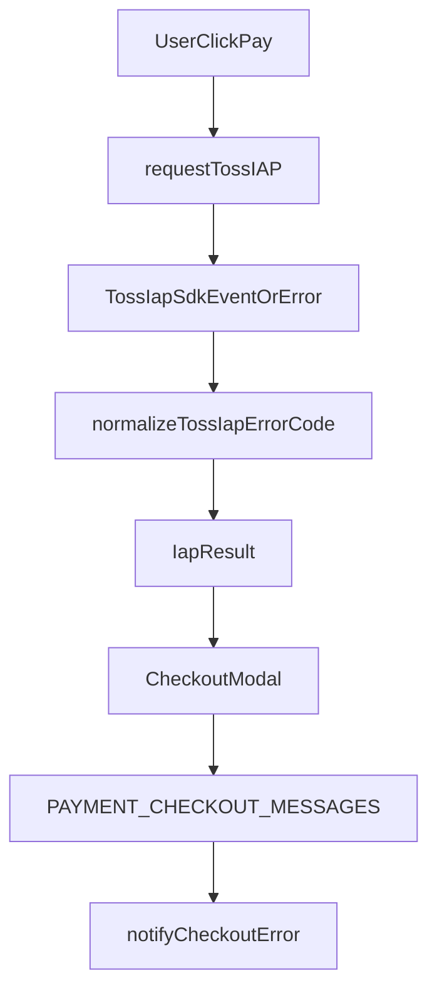

# Toss IAP 결제 에러 핸들링 계획서

> 목적: Toss IAP SDK의 원시 에러 코드와 기술적인 `message`를 그대로 사용자에게 노출하지 않고, 공식 문서 기준의 에러 코드를 `constants/paymentCheckoutMessages.ts` 단일 소스로 번역하여 `CheckoutModal`에서 일관되게 안내한다.
>
> 범위: `constants/paymentCheckoutMessages.ts`, `services/payment/tossIapService.ts`, `components/CheckoutModal.tsx`
>
> 근거 문서:
> - [개발하기 | 앱인토스 개발자센터](https://developers-apps-in-toss.toss.im/iap/develop.html)
> - [인앱 결제 IAP 레퍼런스](https://developers-apps-in-toss.toss.im/bedrock/reference/framework/%EC%9D%B8%EC%95%B1%20%EA%B2%B0%EC%A0%9C/IAP.html#createonetimepurchaseorder)

---

## 0. 시니어 리뷰 반영 (OCP·가독성)

| 심각도 | 내용 | 조치 |
|--------|------|------|
| 치명적 | 초안 §5-2에서 실패 메시지를 `rawMessage`만 조회해, **PortOne(`handlePortOnePay`)이 넘기는 `message`가 무시**되어 웹 결제 에러 문구가 빈 값·`UNKNOWN`으로 뭉개질 수 있음 (OCP 위반). | 아래 **§5-2 최종 스니펫**처럼 `rawMessage`와 `message`를 **동일 변수(`extractedMessage`)로 통합 추출**한 뒤 분기. |
| 경고 | 인라인 삼항으로 `rawMessage`만 평가하면 가독성·버그 재발 위험. | Guard 스타일 + **명시적 `extractedMessage` 추출**으로 평탄화. |

구현 시 `handleTossIapPay` 결과는 `errorCode`/`rawMessage` 중심, `handlePortOnePay` 결과는 `message`/`needRefresh`/`configMissing` 중심이므로, **공통 `outcome` 타입은 필드 optional union**으로 두고 메시지는 항상 `extractedMessage` 경로로만 넘긴다.

---

## 1. 목표 상태

1. Toss IAP 에러 코드는 문자열 비교가 아니라 **명시적인 에러 코드 ID**로만 처리한다.
2. 사용자에게 보이는 친화적 문구는 모두 **`constants/paymentCheckoutMessages.ts`** 에서 관리한다.
3. `tossIapService.ts`는 **코드 정규화와 런타임 안전성**만 담당하고, JSX나 UI 문구를 직접 소유하지 않는다.
4. `CheckoutModal.tsx`는 **결제 결과 -> 사용자 안내 문구 선택**만 담당한다.
5. `unknown` 기반 타입 가드로 처리하고, **`any`는 사용하지 않는다.**

---

## 2. 공식 Toss IAP 에러 코드 반영 범위

본 계획서는 아래 공식 문서에 공개된 코드를 기준으로 SSOT를 만든다.

```typescript
// 공식 Toss IAP 문서 기준 매핑 대상
type TossIapKnownErrorCode =
  | 'INVALID_PRODUCT_ID'
  | 'PAYMENT_PENDING'
  | 'NETWORK_ERROR'
  | 'INVALID_USER_ENVIRONMENT'
  | 'APP_MARKET_VERIFICATION_FAILED'
  | 'TOSS_SERVER_VERIFICATION_FAILED'
  | 'INTERNAL_ERROR'
  | 'KOREAN_ACCOUNT_ONLY'
  | 'USER_CANCELED'
  | 'PRODUCT_NOT_GRANTED_BY_PARTNER';
```

추가로, 문서에 없는 에러 객체 형태 또는 메시지 누락 상황을 위해 내부 전용 코드 `UNKNOWN`을 둔다.

```typescript
type TossIapErrorCode = TossIapKnownErrorCode | 'UNKNOWN';
```

---

## 3. `constants/paymentCheckoutMessages.ts`에 SSOT 추가

### 3-1. 에러 코드 타입과 메시지 레코드 추가

**타겟 파일:** `constants/paymentCheckoutMessages.ts`

```typescript
// [수정 전 (현재 문제 코드)]
export interface PaymentCheckoutMessageSet {
  CLOSE_MODAL: string;
  CONFIG_MISSING: string;
  DISCOUNT: string;
  DISCOUNT_ZERO_LINE: (formattedZero: string) => string;
  DURATION_LABEL: string;
  DURATION_PACKAGE_LABEL: (days: number) => string;
  DURATION_SELECT_ARIA: string;
  ERR_INVALID_PRICE: string;
  FAILED: (message: string) => string;
  ORDER_SUMMARY: string;
  PAID_SERVICE_PERIOD: string;
  PAID_SERVICE_PERIOD_HINT: string;
  PAY: string;
  PAYMENT_METHOD_HEADING: string;
  PAY_METHOD_LABELS: Record<PayMethod, string>;
  PAY_NOW: string;
  PLAN_NAME_WITH_SUFFIX: (planDisplayName: string) => string;
  PLAN_PRICE: string;
  PREMIUM_COMING_SOON: string;
  PREMIUM_UNAVAILABLE_DETAIL: string;
  PROCESSING: string;
  PROCESSING_ERROR: string;
  QUANTITY_OPTION: (count: number, days: number) => string;
  REFUND_BULLET_1: string;
  REFUND_BULLET_2: string;
  REFUND_BULLET_3: (totalDays: number) => string;
  REFUND_INQUIRY: (email: string) => string;
  REFUND_SECTION_TITLE: string;
  SECURE_CHECKOUT: string;
  SUCCESS: string;
  TERMS_CONSENT_NOTICE: string;
  TOSS_FIXED_DURATION_LABEL: string;
  TOSS_FIXED_DURATION_VALUE: (days: number) => string;
  TOSS_IAP_NOTICE: string;
  TOTAL: string;
  UNKNOWN: string;
  UNKNOWN_PLAN_LABEL: string;
  VALIDITY_NOTICE: (days: number) => string;
  VAT_INCLUDED: string;
  VERIFY_FAILED: (error: string) => string;
}
```

```typescript
// [수정 후 (적용될 실제 스니펫)]
export type TossIapKnownErrorCode =
  | 'INVALID_PRODUCT_ID'
  | 'PAYMENT_PENDING'
  | 'NETWORK_ERROR'
  | 'INVALID_USER_ENVIRONMENT'
  | 'APP_MARKET_VERIFICATION_FAILED'
  | 'TOSS_SERVER_VERIFICATION_FAILED'
  | 'INTERNAL_ERROR'
  | 'KOREAN_ACCOUNT_ONLY'
  | 'USER_CANCELED'
  | 'PRODUCT_NOT_GRANTED_BY_PARTNER';

export type TossIapErrorCode = TossIapKnownErrorCode | 'UNKNOWN';

export interface PaymentCheckoutMessageSet {
  CLOSE_MODAL: string;
  CONFIG_MISSING: string;
  DISCOUNT: string;
  DISCOUNT_ZERO_LINE: (formattedZero: string) => string;
  DURATION_LABEL: string;
  DURATION_PACKAGE_LABEL: (days: number) => string;
  DURATION_SELECT_ARIA: string;
  ERR_INVALID_PRICE: string;
  FAILED: (message: string) => string;
  ORDER_SUMMARY: string;
  PAID_SERVICE_PERIOD: string;
  PAID_SERVICE_PERIOD_HINT: string;
  PAY: string;
  PAYMENT_METHOD_HEADING: string;
  PAY_METHOD_LABELS: Record<PayMethod, string>;
  PAY_NOW: string;
  PLAN_NAME_WITH_SUFFIX: (planDisplayName: string) => string;
  PLAN_PRICE: string;
  PREMIUM_COMING_SOON: string;
  PREMIUM_UNAVAILABLE_DETAIL: string;
  PROCESSING: string;
  PROCESSING_ERROR: string;
  QUANTITY_OPTION: (count: number, days: number) => string;
  REFUND_BULLET_1: string;
  REFUND_BULLET_2: string;
  REFUND_BULLET_3: (totalDays: number) => string;
  REFUND_INQUIRY: (email: string) => string;
  REFUND_SECTION_TITLE: string;
  SECURE_CHECKOUT: string;
  SUCCESS: string;
  TERMS_CONSENT_NOTICE: string;
  TOSS_FIXED_DURATION_LABEL: string;
  TOSS_FIXED_DURATION_VALUE: (days: number) => string;
  TOSS_IAP_ERROR_MESSAGES: Record<TossIapErrorCode, string>;
  TOSS_IAP_NOTICE: string;
  TOTAL: string;
  UNKNOWN: string;
  UNKNOWN_PLAN_LABEL: string;
  VALIDITY_NOTICE: (days: number) => string;
  VAT_INCLUDED: string;
  VERIFY_FAILED: (error: string) => string;
}
```

**왜 이렇게 바꾸는가**

- 에러 코드 타입을 메시지 파일에 두면 **UI 문구와 코드 키가 한 곳에서 함께 진화**한다.
- 서비스 로직이 임의 문자열을 만들지 못하게 해서, 번역 누락과 하드코딩 재발을 막는다.

---

### 3-2. 한글/영문 친화 메시지 추가

**타겟 파일:** `constants/paymentCheckoutMessages.ts`

```typescript
// [수정 전 (현재 문제 코드)]
ko: {
  // ...
  TOSS_IAP_NOTICE: '토스 앱 인앱결제로 진행됩니다.',
  // ...
},
en: {
  // ...
  TOSS_IAP_NOTICE: 'Payment will be processed through Toss in-app purchase.',
  // ...
},
```

```typescript
// [수정 후 (적용될 실제 스니펫)]
ko: {
  // ...
  TOSS_IAP_NOTICE: '토스 앱 인앱결제로 진행됩니다.',
  TOSS_IAP_ERROR_MESSAGES: {
    INVALID_PRODUCT_ID: '현재 구매 가능한 상품 정보를 불러오지 못했습니다. 잠시 후 다시 시도해 주세요.',
    PAYMENT_PENDING: '이전 결제가 아직 처리 중입니다. 잠시 후 다시 확인해 주세요.',
    NETWORK_ERROR: '네트워크가 불안정합니다. 연결 상태를 확인한 뒤 다시 시도해 주세요.',
    INVALID_USER_ENVIRONMENT: '현재 계정 또는 기기 환경에서는 이 상품을 구매할 수 없습니다.',
    APP_MARKET_VERIFICATION_FAILED: '앱마켓 확인에 실패했습니다. 결제 내역을 확인한 뒤 필요하면 환불을 요청해 주세요.',
    TOSS_SERVER_VERIFICATION_FAILED: '결제 정보 전송이 지연되고 있습니다. 잠시 후 다시 열어 상태를 확인해 주세요.',
    INTERNAL_ERROR: '결제 처리 중 일시적인 오류가 발생했습니다. 잠시 후 다시 시도해 주세요.',
    KOREAN_ACCOUNT_ONLY: '한국 스토어 계정에서만 구매할 수 있는 상품입니다.',
    USER_CANCELED: '결제가 취소되었습니다.',
    PRODUCT_NOT_GRANTED_BY_PARTNER: '결제는 완료되었지만 이용권 지급이 지연되고 있습니다. 잠시 후 다시 열면 자동 복구를 시도합니다.',
    UNKNOWN: '결제 처리 중 알 수 없는 오류가 발생했습니다. 잠시 후 다시 시도해 주세요.',
  },
  // ...
},
en: {
  // ...
  TOSS_IAP_NOTICE: 'Payment will be processed through Toss in-app purchase.',
  TOSS_IAP_ERROR_MESSAGES: {
    INVALID_PRODUCT_ID: 'The product information is unavailable right now. Please try again later.',
    PAYMENT_PENDING: 'A previous payment is still being processed. Please check again shortly.',
    NETWORK_ERROR: 'Your network connection is unstable. Please check your connection and try again.',
    INVALID_USER_ENVIRONMENT: 'This product cannot be purchased in the current account or device environment.',
    APP_MARKET_VERIFICATION_FAILED: 'App market verification failed. Please review your purchase history and request a refund if needed.',
    TOSS_SERVER_VERIFICATION_FAILED: 'Payment confirmation is delayed. Please reopen the app and check again shortly.',
    INTERNAL_ERROR: 'A temporary payment error occurred. Please try again later.',
    KOREAN_ACCOUNT_ONLY: 'This product can only be purchased with a Korean store account.',
    USER_CANCELED: 'The payment was canceled.',
    PRODUCT_NOT_GRANTED_BY_PARTNER: 'Payment completed, but entitlement delivery is delayed. Reopening the app will retry recovery.',
    UNKNOWN: 'An unknown error occurred during payment. Please try again later.',
  },
  // ...
},
```

**왜 이렇게 바꾸는가**

- 잔액 부족, 네트워크 오류, 사용자 취소처럼 심사에서 자주 보는 케이스를 **기술 용어 대신 행동 가능한 문장**으로 바꿔 이탈을 줄인다.
- `PRODUCT_NOT_GRANTED_BY_PARTNER`는 문서상 중요한 복구 케이스라서, 단순 실패가 아니라 **앱 재진입 시 복원 시도**가 있다는 사실을 함께 안내한다.

---

## 4. `tossIapService.ts`에서 `any` 제거 및 에러 코드 정규화

### 4-1. Toss IAP 브리지 타입과 에러 타입 추가

**타겟 파일:** `services/payment/tossIapService.ts`

```typescript
// [수정 전 (현재 문제 코드)]
export interface IapResult {
  success: boolean;
  cancel?: boolean;
  message?: string;
  orderId?: string;
}

const iap = (WebFramework as any).IAP;
```

```typescript
// [수정 후 (적용될 실제 스니펫)]
import type { TossIapErrorCode, TossIapKnownErrorCode } from '../constants/paymentCheckoutMessages';

interface TossIapBridgeOrderGrantParams {
  orderId: string;
}

interface TossIapSuccessEvent {
  type: 'success';
  data: {
    orderId: string;
    displayName: string;
    displayAmount: string;
    amount: number;
    currency: string;
    fraction: number;
    miniAppIconUrl: string | null;
  };
}

interface TossIapCancelEvent {
  type: 'canceled';
}

type TossIapEvent = TossIapSuccessEvent | TossIapCancelEvent;

interface TossIapError {
  errorCode?: string;
  message?: string;
}

interface TossPendingOrder {
  orderId: string;
  sku?: string;
  paymentCompletedDate?: string;
}

interface TossIapBridge {
  createOneTimePurchaseOrder(params: {
    options: {
      sku: string;
      processProductGrant: (params: TossIapBridgeOrderGrantParams) => boolean | Promise<boolean>;
    };
    onEvent: (event: TossIapEvent) => void | Promise<void>;
    onError: (error: unknown) => void | Promise<void>;
  }): () => void;
  completeProductGrant(params: { orderId: string }): Promise<boolean | undefined>;
  getPendingOrders(): Promise<TossPendingOrder[] | { orders: TossPendingOrder[] } | undefined>;
}

export interface IapResult {
  success: boolean;
  cancel?: boolean;
  errorCode?: TossIapErrorCode;
  rawMessage?: string;
  orderId?: string;
}

function isTossIapError(value: unknown): value is TossIapError {
  if (typeof value !== 'object' || value == null) {
    return false;
  }
  const candidate = value as Record<string, unknown>;
  const hasErrorCode = typeof candidate.errorCode === 'string' || candidate.errorCode == null;
  const hasMessage = typeof candidate.message === 'string' || candidate.message == null;
  return hasErrorCode && hasMessage;
}

function getIapBridge(): TossIapBridge | null {
  const candidate = (WebFramework as { IAP?: unknown }).IAP;
  if (!candidate || typeof candidate !== 'object') {
    return null;
  }

  const bridge = candidate as Partial<TossIapBridge>;
  if (
    typeof bridge.createOneTimePurchaseOrder !== 'function' ||
    typeof bridge.completeProductGrant !== 'function' ||
    typeof bridge.getPendingOrders !== 'function'
  ) {
    return null;
  }

  return bridge as TossIapBridge;
}
```

**왜 이렇게 바꾸는가**

- `any`를 제거하면 SDK 오류 형식이 예상과 다를 때도 **의도적으로 좁혀서 처리**할 수 있다.
- 브리지 타입을 분리하면 이후 `getPendingOrders`, `completeProductGrant`도 같은 안전성 규칙을 공유한다.

---

### 4-2. 에러 코드 정규화 헬퍼 추가

**타겟 파일:** `services/payment/tossIapService.ts`

```typescript
// [수정 전 (현재 문제 코드)]
onError: (error: any) => {
  resolve({ success: false, message: error?.message || '결제 진행 중 오류가 발생했습니다.' });
}
```

```typescript
// [수정 후 (적용될 실제 스니펫)]
function normalizeTossIapErrorCode(code: string | undefined): TossIapErrorCode {
  switch (code) {
    case 'INVALID_PRODUCT_ID':
    case 'PAYMENT_PENDING':
    case 'NETWORK_ERROR':
    case 'INVALID_USER_ENVIRONMENT':
    case 'APP_MARKET_VERIFICATION_FAILED':
    case 'TOSS_SERVER_VERIFICATION_FAILED':
    case 'INTERNAL_ERROR':
    case 'KOREAN_ACCOUNT_ONLY':
    case 'USER_CANCELED':
    case 'PRODUCT_NOT_GRANTED_BY_PARTNER':
      return code;
    case undefined:
      return 'UNKNOWN';
    default: {
      const unknownCode: string = code;
      console.warn('[IAP] Unknown Toss error code:', unknownCode);
      return 'UNKNOWN';
    }
  }
}

function toTossIapResultFromError(error: unknown): IapResult {
  if (!isTossIapError(error)) {
    return {
      success: false,
      errorCode: 'UNKNOWN',
      rawMessage: undefined,
    };
  }

  const errorCode = normalizeTossIapErrorCode(error.errorCode);
  return {
    success: false,
    cancel: errorCode === 'USER_CANCELED',
    errorCode,
    rawMessage: error.message ?? undefined,
  };
}
```

**왜 이렇게 바꾸는가**

- SDK가 내려주는 `errorCode`를 표준화하면 UI는 더 이상 원시 메시지에 의존하지 않는다.
- 사용자 취소는 번역 문자열이 아니라 **`errorCode === 'USER_CANCELED'`** 로만 판단한다.

---

### 4-3. `requestTossIAP` 반환 구조를 UI 친화적으로 정리

**타겟 파일:** `services/payment/tossIapService.ts`

```typescript
// [수정 전 (문제 코드)]
export async function requestTossIAP(planId: string, quantity: number = 1): Promise<IapResult> {
  const sku = getSkuByPlanId(planId);
  if (!sku) return { success: false, message: `등록되지 않은 IAP 상품입니다.` };

  const iap = (WebFramework as any).IAP;
  if (!iap || typeof iap.createOneTimePurchaseOrder !== 'function') {
    return { success: false, message: '현재 환경에서 토스 인앱결제를 지원하지 않습니다.' };
  }

  return new Promise((resolve) => {
    iap.createOneTimePurchaseOrder({
      options: { sku },
      processProductGrant: async ({ orderId }: { orderId: string }) => {
        try {
          const isGranted = await verifyAndGrantProductOnServer(orderId, planId, quantity);
          if (isGranted) {
            await iap.completeProductGrant({ orderId });
            resolve({ success: true, orderId });
          } else {
            throw new Error('서버 상품 지급 실패');
          }
        } catch (error) {
          console.error('[IAP] 지급 처리 중 오류:', error);
          throw error;
        }
      },
      onEvent: (event: any) => {
        if (event.type === 'canceled') {
          resolve({ success: false, cancel: true, message: '사용자가 결제를 취소했습니다.' });
        }
      },
      onError: (error: any) => {
        resolve({ success: false, message: error?.message || '결제 진행 중 오류가 발생했습니다.' });
      }
    });
  });
}
```

```typescript
// [수정 후 (적용될 실제 스니펫)]
export async function requestTossIAP(planId: string, quantity: number = 1): Promise<IapResult> {
  const sku = getSkuByPlanId(planId);
  if (!sku) {
    return {
      success: false,
      errorCode: 'INVALID_PRODUCT_ID',
    };
  }

  const iap = getIapBridge();
  if (!iap) {
    return {
      success: false,
      errorCode: 'INVALID_USER_ENVIRONMENT',
    };
  }

  return new Promise((resolve) => {
    const cleanup = iap.createOneTimePurchaseOrder({
      options: {
        sku,
        processProductGrant: async ({ orderId }) => {
          try {
            const isGranted = await verifyAndGrantProductOnServer(orderId, planId, quantity);
            if (!isGranted) {
              resolve({
                success: false,
                errorCode: 'PRODUCT_NOT_GRANTED_BY_PARTNER',
                rawMessage: 'server_grant_failed',
              });
              return false;
            }

            await iap.completeProductGrant({ orderId });
            resolve({ success: true, orderId });
            return true;
          } catch (error) {
            console.error('[IAP] 상품 지급 처리 실패:', error);
            resolve({
              success: false,
              errorCode: 'PRODUCT_NOT_GRANTED_BY_PARTNER',
              rawMessage: error instanceof Error ? error.message : undefined,
            });
            return false;
          }
        },
      },
      onEvent: (event) => {
        if (event.type !== 'canceled') {
          return;
        }
        resolve({
          success: false,
          cancel: true,
          errorCode: 'USER_CANCELED',
        });
      },
      onError: (error) => {
        resolve(toTossIapResultFromError(error));
      },
    });

    // 앱 브릿지 리소스를 즉시 해제하지 않으면 재진입 시 이벤트 중복 가능성이 있어 cleanup 참조를 보존한다.
    void cleanup;
  });
}
```

**왜 이렇게 바꾸는가**

- 서비스는 더 이상 사용자 노출용 한글 메시지를 만들지 않고, **구조화된 결과**만 UI에 넘긴다.
- `processProductGrant` 실패를 단순 throw에 맡기지 않고 명시적 에러 코드로 고정해, 심사에서 중요한 **결제 완료 후 지급 실패** 케이스를 일관되게 다룬다.

---

### 4-4. `restorePendingIapOrders` 타입 안정성 보강

**타겟 파일:** `services/payment/tossIapService.ts`

```typescript
// [수정 전 (문제 코드)]
export async function restorePendingIapOrders() {
  const iap = (WebFramework as any).IAP;
  if (!iap || typeof iap.getPendingOrders !== 'function') return;

  try {
    const pendingOrders = await iap.getPendingOrders();
    for (const order of pendingOrders) {
      console.log('[IAP] 미결 주문 복원 시도:', order.orderId);
      const isGranted = await verifyAndGrantProductOnServer(order.orderId, 'restore', 1);
      if (isGranted) {
        await iap.completeProductGrant({ orderId: order.orderId });
      }
    }
  } catch (err) {
    console.error('[IAP] 미결 주문 복원 실패:', err);
  }
}
```

```typescript
// [수정 후 (적용될 실제 스니펫)]
function getPendingOrderList(
  response: TossPendingOrder[] | { orders: TossPendingOrder[] } | undefined,
): TossPendingOrder[] {
  if (!response) {
    return [];
  }
  if (Array.isArray(response)) {
    return response;
  }
  return Array.isArray(response.orders) ? response.orders : [];
}

export async function restorePendingIapOrders(): Promise<void> {
  const iap = getIapBridge();
  if (!iap) {
    return;
  }

  try {
    const pendingResponse = await iap.getPendingOrders();
    const pendingOrders = getPendingOrderList(pendingResponse);

    for (const order of pendingOrders) {
      if (!order?.orderId) {
        continue;
      }
      console.log('[IAP] 미결 주문 복원 시도:', order.orderId);
      const isGranted = await verifyAndGrantProductOnServer(order.orderId, 'restore', 1);
      if (isGranted) {
        await iap.completeProductGrant({ orderId: order.orderId });
      }
    }
  } catch (error) {
    console.error('[IAP] 미결 주문 복원 실패:', error);
  }
}
```

**왜 이렇게 바꾸는가**

- 공식 문서/런타임 차이로 응답 모양이 달라져도 복원 흐름이 깨지지 않도록 방어한다.
- 이 보강은 직접적인 번역 기능은 아니지만, `PRODUCT_NOT_GRANTED_BY_PARTNER` 안내 이후의 **자동 복구 신뢰성**을 높인다.

---

## 5. `CheckoutModal.tsx`에서 코드 기반으로 알림 메시지 선택

### 5-1. Toss IAP 실패 메시지 선택 헬퍼 추가

**타겟 파일:** `components/CheckoutModal.tsx`

```typescript
// [수정 전 (문제 코드)]
const handleTossIapPay = useCallback(async () => {
  const result = await requestTossIAP(effectivePlanId, effectiveQuantity);
  if (!result.success) {
    return {
      ok: false,
      cancel: result.cancel,
      message: result.message,
    };
  }
  return { ok: true, needRefresh: true };
}, [effectivePlanId, effectiveQuantity, requestTossIAP]);
```

```typescript
// [수정 후 (적용될 실제 스니펫)]
function getTossIapAlertMessage(
  messages: PaymentCheckoutMessageSet,
  errorCode: TossIapErrorCode | undefined,
  rawMessage: string | undefined,
): string {
  if (!errorCode) {
    return messages.TOSS_IAP_ERROR_MESSAGES.UNKNOWN;
  }

  const mappedMessage = messages.TOSS_IAP_ERROR_MESSAGES[errorCode];
  if (mappedMessage) {
    return mappedMessage;
  }

  return messages.FAILED(rawMessage ?? messages.UNKNOWN);
}

const handleTossIapPay = useCallback(async () => {
  const result = await requestTossIAP(effectivePlanId, effectiveQuantity);
  if (!result.success) {
    return {
      ok: false,
      cancel: result.cancel,
      errorCode: result.errorCode,
      rawMessage: result.rawMessage,
    };
  }
  return { ok: true, needRefresh: true };
}, [effectivePlanId, effectiveQuantity]);
```

**왜 이렇게 바꾸는가**

- UI는 `errorCode`만 받아 문구를 고르므로, 서비스 레이어와 번역 레이어가 분리된다.
- `rawMessage`는 최후 fallback용으로만 남기고, 기본 경로는 항상 SSOT를 탄다.

---

### 5-2. 결제 실패 분기 — Toss IAP·PortOne 공존 (OCP 보장)

**타겟 파일:** `components/CheckoutModal.tsx`

```typescript
// [수정 전 (문제 코드)]
let alertMessage = msgs.UNKNOWN;
if ('configMissing' in outcome && outcome.configMissing) {
  alertMessage = msgs.CONFIG_MISSING;
} else if (outcome.needRefresh) {
  alertMessage = msgs.VERIFY_FAILED(outcome.message ?? '');
} else {
  alertMessage = msgs.FAILED(outcome.message ?? msgs.UNKNOWN);
}

alert(alertMessage);
```

```typescript
// [수정 후 (적용될 실제 스니펫) — OCP 보장 및 타입 안전성·가독성 강화]

// 1. 에러 메시지 추출: Toss IAP의 rawMessage와 PortOne의 message 모두 지원
let extractedMessage: string | undefined;
if ('rawMessage' in outcome && typeof outcome.rawMessage === 'string') {
  extractedMessage = outcome.rawMessage;
} else if ('message' in outcome && typeof outcome.message === 'string') {
  extractedMessage = outcome.message;
}

// 2. 에러 분기 (Guard 스타일, 인라인 삼항 없음)
let alertMessage = msgs.UNKNOWN;

if ('configMissing' in outcome && outcome.configMissing) {
  alertMessage = msgs.CONFIG_MISSING;
} else if ('errorCode' in outcome && outcome.errorCode) {
  alertMessage = getTossIapAlertMessage(
    msgs,
    outcome.errorCode as TossIapErrorCode,
    extractedMessage,
  );
} else if ('needRefresh' in outcome && outcome.needRefresh) {
  alertMessage = msgs.VERIFY_FAILED(extractedMessage ?? '');
} else {
  alertMessage = msgs.FAILED(extractedMessage ?? msgs.UNKNOWN);
}

// 3. UI 알림
notifyCheckoutError(alertMessage);
```

**왜 이렇게 바꾸는가**

- Toss IAP 리팩터링으로 `message`가 `rawMessage`로 바뀌어도, **웹(PortOne) 경로의 `message`를 잃지 않는다** — 기존 결제 확장 시 기존 동작을 깨지 않는다(OCP).
- `extractedMessage`를 한 번만 계산해 `VERIFY_FAILED`·`FAILED`에 동일하게 전달하므로, 검증 실패와 PG 실패 모두 **원시 사유가 유실되지 않는다**.
- `errorCode`가 있는 경우만 `getTossIapAlertMessage`로 SSOT를 탄다 — PortOne outcome에는 `errorCode`가 없으므로 기존 PortOne 분기와 충돌하지 않는다.

**구현 순서:** §5-3의 `notifyCheckoutError`는 `handlePay`보다 **먼저** 선언하거나, `function notifyCheckoutError()` 형태로 두어 §5-2 스니펫이 참조할 때 TDZ 오류가 나지 않게 한다.

**타입 단언 정책:** `outcome.errorCode as TossIapErrorCode`는 **유지한다.** `errorCode`는 `requestTossIAP` 실패 경로에서만 채워지며 공식 코드 집합과 정규화 로직이 앞 단계에 있으므로, 별도 `isTossIapErrorCode` 런타임 가드는 **도입하지 않는다.**

---

### 5-3. 토스트 확장 여지를 남기되 현재 동작은 `alert` 유지

**타겟 파일:** `components/CheckoutModal.tsx`

```typescript
// [수정 전 (현재 문제 코드)]
alert(alertMessage);
```

```typescript
// [수정 후 (적용될 실제 스니펫)]
function notifyCheckoutError(message: string): void {
  // 현재는 기존 UX 회귀를 막기 위해 alert를 유지하고,
  // 이후 토스트 컴포넌트 도입 시 이 함수만 교체한다.
  alert(message);
}

notifyCheckoutError(alertMessage);
```

**왜 이렇게 바꾸는가**

- 지금 바로 토스트 시스템을 도입하지 않아도, 후속 작업에서 알림 구현만 교체할 수 있다.
- 메시지 선택 로직과 노출 수단을 분리해 SRP를 지킨다.

---

## 6. 적용 후 예상 흐름



---

## 7. 검증 체크리스트

1. `services/payment/tossIapService.ts`에 `any`가 0건인지 확인
2. `components/CheckoutModal.tsx`에서 **Toss IAP** 실패 시 구조화된 `errorCode`/`rawMessage`만 사용하고, **PortOne** 실패 시 기존처럼 `message`가 `VERIFY_FAILED`·`FAILED`에 전달되는지 확인 (§5-2 `extractedMessage` 경로)
3. `constants/paymentCheckoutMessages.ts`에 `TOSS_IAP_ERROR_MESSAGES`가 `ko`, `en` 모두 채워졌는지 확인
4. 아래 코드가 모두 사용자 친화 문구로 안내되는지 확인
   - `NETWORK_ERROR`
   - `USER_CANCELED`
   - `PRODUCT_NOT_GRANTED_BY_PARTNER`
   - `UNKNOWN`
5. 앱 재실행 시 `restorePendingIapOrders()`가 계속 동작하는지 확인

---

## 8. Mental Compile 포인트

1. `TossIapErrorCode`는 메시지 파일에서 export되므로, 서비스와 UI가 **같은 키 집합**을 공유한다.
2. `requestTossIAP()`는 더 이상 사용자 친화 문구를 만들지 않고, `errorCode`와 `rawMessage`만 반환한다.
3. `CheckoutModal`의 실패 분기에서는 **`extractedMessage`로 IAP `rawMessage`와 PortOne `message`를 합성**한 뒤에만 `VERIFY_FAILED`/`FAILED`에 넣는다 — 한 필드만 보면 OCP 위반으로 웹 결제 메시지가 증발한다.
4. `errorCode`가 존재할 때만 `messages.TOSS_IAP_ERROR_MESSAGES[errorCode]` 우선; PortOne outcome에는 `errorCode`가 없으므로 PG·검증 메시지 경로는 기존과 동일하게 유지된다.
5. `USER_CANCELED`는 번역 문자열 비교가 아니라 `cancel: true`와 `errorCode`로만 처리된다.
6. `PRODUCT_NOT_GRANTED_BY_PARTNER`는 공식 문서상 중요한 실패 케이스이므로, 단순 실패보다 강한 복구 안내 문구를 유지해야 한다.

---

## 9. 최종 적용 요약

- `paymentCheckoutMessages.ts`:
  - `TossIapErrorCode` 타입 추가
  - `TOSS_IAP_ERROR_MESSAGES` SSOT 추가

- `tossIapService.ts`:
  - `any` 제거
  - Toss IAP 에러 객체 타입 가드 추가
  - 에러 코드 정규화 헬퍼 추가
  - 사용자 문자열 직접 생성 제거

- `CheckoutModal.tsx`:
  - `errorCode` 기반 실패 메시지 선택 (Toss IAP 전용)
  - **`extractedMessage`로 PortOne `message`와 IAP `rawMessage` 통합** — 웹 결제 회귀 방지
  - `alert` 호출을 래핑해 토스트 전환 여지 확보

이 계획의 핵심은 **공식 Toss 에러 코드는 서비스에서 구조화하고, 사용자 번역은 SSOT에서만 관리하며, UI는 코드 기반으로만 문구를 고르는 것**이며, **기존 PortOne 경로의 에러 문자열 유실 없이 확장하는 것**입니다.

---

## 10. 문서 이력

| 일자 | 내용 |
|------|------|
| 초안 | Toss IAP 에러 SSOT·`tossIapService`·`CheckoutModal` 계획 |
| 리뷰 반영 | §5-2 OCP 결함 수정: `message`/`rawMessage` 통합 추출, §4-1 import 경로 정정 (`../constants/...`), §0·§7·§8·§9 동기화 |
| 구현 결정 | `errorCode as TossIapErrorCode` **단언 유지** — 런타임 `isTossIapErrorCode` 가드 미도입 |
