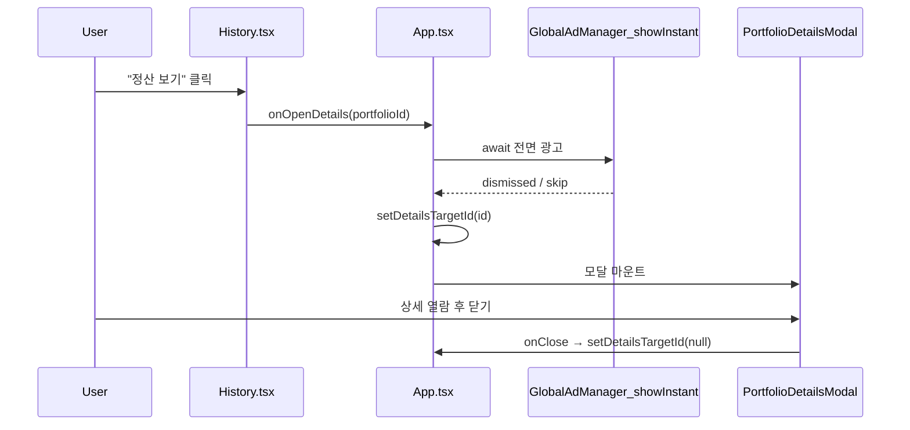
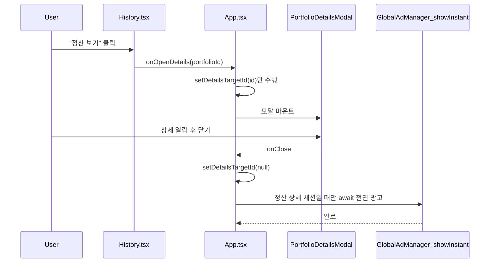

# 정산 상세 모달 전면 광고 플로우 리팩터링 계획

> **코드 현황 (2026-03)**  
> 레거시 `services/ads/adService.ts` 및 `showInterstitialOnTransition` 기반 전면은 **삭제·제거됨**. 전면은 `services/ads/globalAdManager.ts` + `interstitialPlacementConfig.ts`의 logical key(예: `INTERSTITIAL_PLACEMENT_KEYS.SETTLEMENT_DETAIL`)와 `showInstant`로 연결하고, 루트는 `AdPreloadProvider`가 매니저를 주입합니다(`docs2/ad-preload-architecture.md` 참고).  
> **아래 본문**은 v1.5 UX·가드 논의를 보존하며, 전면 호출 예시는 **`showInstant` + `INTERSTITIAL_PLACEMENT_KEYS`** 기준으로 맞춰 두었습니다.

**상태**: 설계·히스토리 보관 — 당시에는 프로덕션 변경 전 설계 문서였음. 현재 저장소는 전면 SSOT가 `GlobalAdManager` 쪽으로 이동함.

**문서 버전**: 1.5.1 (v1.5 + **`UI_DOUBLE_CLICK_PREVENTION_MS` 300ms 확정·실기기 QA 후 튜닝**)

**목표**: 토스 UX 가이드에 맞춰 **정산 상세(Settlement Detail)** 전면 광고를 “모달 오픈 직전”이 아니라 **사용자 작업 종료 시점(모달 닫힘 이후)**에 노출한다.

**범위 (당시)**: 정산 상세 한 지면의 트리거 위치만 조정. **현재** 전면 load/show·티어 가드는 **`GlobalAdManager` 옵션(`initialTier` 등)** 과 `showInstant` 내부 검증에서 처리한다.

---

## 0. 리뷰 반영 요약

| 우선순위 | 지적 | 판단 및 반영 |
|:--------:|------|----------------|
| 1 | A11y를 후순위로 둠 | **동의.** 백드롭 닫기는 본 리팩터 **필수 범위**로 승격. `PortfolioDetailsModal.tsx`에 반드시 적용(§5). |
| 2 | 무거운 자식에 인라인 화살표 | **동의.** `useCallback`으로 분리하거나 `setDetailsTargetId` 직접 전달 등 **안정적 참조**로 교체(§3.4–3.6). |
| 3 | 가드 순서·의존성 | **부분 동의 + 보완.** “타임스탬프 가드를 **무조건** 최상단”은 **위험**할 수 있음(§0.1). 동시 `onClose` 중복만 **최상단에서 차단**하고, 시간 기반 디바운스는 **광고 호출 직전**에만 둔다. `setDetailsTargetId`는 `useState` setter이므로 안정적이나, exhaustive-deps 준수를 위해 의존성 배열에 **명시**한다. |
| 4 | 락+비동기 `finally` 데드락 | **동의(v1.3).** UI 락을 광고 `await`와 결합하면 안 됨. **v1.5**에서는 UI 디듀프·광고 파이프라인 락을 **역할 분리**(§0.3·§0.5). |
| 5 | 분기마다 `queueMicrotask` 복붙 (DRY) | **v1.5에서 폐기** — `queueMicrotask` 자체가 UI 더블 클릭 방어에 부적합(항목 7). |
| 6 | `useCallback`에 객체 전체 의존성 | **동의 → §0.4로 확정.** `currentDetailsPortfolio`를 넘기지 않고 **`detailsTargetId`**와 **`portfolios.find()`**로 닫기 시점 스냅샷을 구한다(§3.5). |
| 7 | `queueMicrotask`로 UI 더블 클릭 방어 | **동의(§0.3 재정의).** 마이크로태스크는 **같은 macrotask 직후**에 실행되어, **수십 ms 뒤 두 번째 클릭**을 막지 못한다 → **폐기**. |
| 8 | `useCallback`에 `portfolios` 배열 | **동의.** 틱마다 재생성 → **§3.1 `portfoliosRef` 동기화**로 의존성에서 제거(§3.5). |
| 9 | 광고 로딩 중 재호출·쿨타임만으로 부족 | **동의(§0.5).** `isAdPipelineActiveRef`로 **`showInstant` 동시 실행** 방지. |

### 0.1 가드 설계에 대한 중요 보완 (반드시 읽을 것)

리뷰에서 제안된 **“800ms 타임스탬프 가드를 함수 최상단에 두고, 실패 시 `return`”** 패턴은, 다음 시나리오에서 **잘못된 동작**을 유발할 수 있다.

- 사용자가 정산 상세 A를 닫은 직후(800ms 이내) 히스토리에서 B를 열고 즉시 닫는 경우  
- 최상단 가드가 **`setDetailsTargetId(null)`까지 막아 버리면** 두 번째 닫기가 무시되어 **모달이 닫히지 않거나**, 광고가 **누락**될 수 있다.

**권장 분리** (v1.5 기준):

1. **UI 연속 닫기 디듀프 (물리적 더블 클릭, §0.3·§3.5)**  
   - **`queueMicrotask`로 락 해제는 사용하지 않는다** — 이벤트 루프상 다음 **클릭(macrotask)** 전에 락이 풀려 **더블 실행**이 가능하다.  
   - **전역 `setTimeout(..., 300ms)` 단일 플래그**만으로 막는 방식은, 그 사이 **다른** `detailsTargetId` 모달을 닫는 정상 동작까지 막을 수 있어 **비권장**.  
   - **권장**: **`openId` + 시각**을 저장해, **동일 포트폴리오**에 대해 `UI_DOUBLE_CLICK_PREVENTION_MS` 안의 **중복 닫기만** 무시한다.

2. **`lastSettlementExitInterstitialShownAtMsRef` + `SETTLEMENT_DETAIL_EXIT_INTERSTITIAL_COOLDOWN_MS` (제품 정책, §0.2)**  
   - **전면 광고가 실제로 노출된 시점**(`AdResult.shown === true`)을 기준으로 **5초(5000ms)** 동안 재노출을 완화한다.  
   - 검사는 **`showInstant` 호출 직전**에 하며, `setDetailsTargetId(null)` **이후**에 실행되므로 UI 닫힘은 항상 보장된다.

3. **`isAdPipelineActiveRef` (광고 SDK 동시성, §0.5)**  
   - 첫 닫기에서 광고가 **아직 `shown` 전**(로딩 중)일 때, 쿨타임 타임스탬프만으로는 **두 번째 `show` 호출**을 막지 못한다 → 파이프라인 락으로 **동시 호출 1개**만 허용.

이렇게 하면 Rule 6(가드 조항)과 Rule 10(불필요한 리렌더) 요구를 동시에 만족하면서, **크로스 세션**에서의 오동작을 피한다.

### 0.2 전면 광고 쿨타임 (제품 정책, 확정)

| 항목 | 내용 |
|------|------|
| **쿨타임 길이** | **5000ms (5초)** — 넉넉히 잡아 연속 노출 피로를 줄인다. |
| **시작 시점** | 정산 상세 모달을 닫는 흐름에서 **`showInstant`가 반환한 `InstantShowResult`의 `shown === true`**인 경우에만, 그 시각을 `lastSettlementExitInterstitialShownAtMsRef`에 기록한다. |
| **적용 범위** | 쿨타임 중에는 **다른 포트폴리오** 정산 상세를 열었다 닫아도 전면 광고 호출을 **생략**한다(모달 닫기·상태 정리는 항상 수행). |
| **미노출 시** | 광고가 뜨지 않은 경우(`shown === false`, 티어 면제, 미지원 등)에는 타임스탬프를 갱신하지 않는다 → 사용자가 곧바로 다시 닫기를 시도하면 **다시 광고 요청**이 가능하다. |

### 0.3 UI 디듀프 vs 비동기 광고 (필수, v1.5)

**금지 (v1.4 이전 스니펫)**:

1. `isPortfolioDetailsCloseInFlightRef` 해제를 **`queueMicrotask` 한 번**에만 맡기기 — **연속 클릭(별도 macrotask)** 을 막지 못해 `setDetailsTargetId` / 광고 로직이 **이중 실행**될 수 있다.
2. `isAdPipelineActiveRef` 해제를 **UI용 락**과 동일한 타이밍에만 두기 — §0.5와 역할이 다르다.

**금지 (여전히 유효)**: UI 닫기 가능성을 막기 위해 **`showInstant`의 `await` 완료**까지 UI 전용 락을 잡아 두는 것(§0.3 v1.3 데드락 논의와 동일).

**허용 (광고 파이프라인 전용)**: `isAdPipelineActiveRef`는 **`showInstant` 비동기 IIFE의 `finally`에서만** 해제한다 — UI 닫기와 생명주기가 분리된다(§0.5).

### 0.5 광고 파이프라인 동시성 락 (필수)

**문제**: A 모달 닫기로 광고 **로딩 중**(아직 `result.shown` 전)에 B 모달을 닫으면, **5초 쿨타임**은 첫 노출 시각이 없어 통과할 수 있고 **`showInstant`가 중복 호출**될 수 있다.

**대응**: `isAdPipelineActiveRef` — 호출 직전 `true`, 비동기 IIFE의 **`finally`에서 `false`**. 한 번에 **하나의 전면 광고 요청**만 진행한다.

**주의**: `setDetailsTargetId(null)`은 파이프라인 락 **앞**에서 실행한다 — 다른 모달은 **항상** 닫힌다. 막히는 것은 **추가 광고 호출**뿐이다.

### 0.4 닫기 핸들러에서의 `Portfolio` 조회 (확정 패턴)

**원칙**: `handlePortfolioDetailsModalClose`는 **`currentDetailsPortfolio` 객체를 클로저로 받지 않는다.**

**`detailsTargetId`**로 열린 ID를 잡고, **`portfoliosRef.current.find((p) => p.id === openId)`**로 닫기 시점의 `Portfolio`를 읽는다 — **`useCallback` 의존성에 `portfolios` 배열을 넣지 않기 위해** `useEffect`로 `portfoliosRef`를 동기화한다(§3.1).

**Why**: (1) 파생 객체 의존 제거, (2) 틱마다 `portfolios` 참조가 바뀌어도 **닫기 콜백 참조가 불필요하게 갱신되지 않음**(Rule 10). (3) `detailsTargetId`는 **열린 모달의 단일 키**이므로 SRP에 맞다.

**주의**: `find` 결과가 `undefined`면(목록에서 삭제된 등) **그래도 `setDetailsTargetId(null)`**으로 UI를 정리한다.

---

## 1. AS-IS vs TO-BE 아키텍처

### 1.1 AS-IS (현재)



**문제**: 광고가 **상세 진입 전**에 끼어 들어가 사용자가 “왜 지금?”이라고 느끼기 쉽고, 토스 체크리스트의 **예측 가능한 타이밍**과 어긋날 수 있다.

### 1.2 TO-BE (목표)



**효과**: 광고는 **해당 화면에서의 작업이 끝난 뒤**(모달이 닫힌 직후) 노출되어, “작업 단위 종료”와 정렬된다.

### 1.3 데이터/컴포넌트 경계

| 구분 | AS-IS | TO-BE |
|------|-------|-------|
| `History`의 `onOpenDetails` | `async`: 광고 → `setDetailsTargetId` | **Dashboard와 동일**: `setDetailsTargetId(id)`만 호출 (안정적 참조로 전달) |
| `App`의 `PortfolioDetailsModal` `onClose` | 항상 `setDetailsTargetId(null)`만 | **종료된 포트폴리오(`isClosed === true`)**일 때만 종료 후 `GlobalAdManager.showInstant(SETTLEMENT_DETAIL key)` 호출 |
| Dashboard에서 연 상세 | 광고 없음 | 광고 없음 유지 (진행 중 포트폴리오만 대시보드에 노출) |

**판별 규칙 (단일 진실)**: `portfolio.isClosed === true`인 경우에만 “정산 상세 종료” 광고를 고려한다.

---

## 2. 변경 대상 파일 (구현 시)

| 파일 | 변경 요약 |
|------|-----------|
| `App.tsx` | `History`에 넘기는 `onOpenDetails`에서 광고 제거; `closedPortfolios` 등 `useMemo`; `handlePortfolioDetailsModalClose`, `handleDeleteCurrentPortfolioTrade` 등 안정적 콜백; `PortfolioDetailsModal`의 `onClose` 교체 |
| `components/History.tsx` | `onOpenDetails` 타입을 `(id: string) => void`로 단순화 (async 제거) |
| `constants.tsx` | `I18N.ko` / `I18N.en`에 **백드롭 `aria-label` 전용 키** 추가 (Rule 3 준수) |
| `components/PortfolioDetailsModal.tsx` | 백드롭에 **필수** A11y 속성 + `role="button"` 키보드 처리 |

**별도 모듈 (전면 SSOT, 현재 코드)**:

- `services/ads/globalAdManager.ts`, `services/ads/interstitialPlacementConfig.ts`, `services/ads/AdPreloadProvider.tsx` — logical key·프리로드·`showInstant`. 레거시 `adService`·`AdPlacement` 전면 상수는 **삭제됨**.

---

## 3. 프로덕션 수준 코드 스니펫 (복사·검토용)

### 3.1 상수·Ref·`portfolios` 동기화

```typescript
/** 정산 상세 닫기 전면 광고가 *실제로 노출된* 뒤, 동일 플로우에서 재노출을 막는 쿨타임 */
const SETTLEMENT_DETAIL_EXIT_INTERSTITIAL_COOLDOWN_MS = 5_000;
/** 동일 포트폴리오 상세에 대한 연속 닫기(물리적 더블 클릭) 디듀프 윈도우 */
const UI_DOUBLE_CLICK_PREVENTION_MS = 300;

// App 컴포넌트 내부:
/** `showInstant` 비동기 호출이 겹치지 않도록 */
const isSettlementExitAdPipelineActiveRef = useRef(false);
/** 마지막으로 전면 광고가 성공적으로 *표시된* 시각(epoch ms). 미노출이면 갱신하지 않음. */
const lastSettlementExitInterstitialShownAtMsRef = useRef<number>(0);
/** 동일 openId에 대한 마지막 닫기 처리 시각 — UI 디듀프(§0.3) */
const lastSettlementModalCloseByOpenIdRef = useRef<{ openId: string; atMs: number } | null>(null);

const portfoliosRef = useRef(portfolios);
useEffect(() => {
  portfoliosRef.current = portfolios;
}, [portfolios]);
```

**제품 결정 (확정)**: `UI_DOUBLE_CLICK_PREVENTION_MS`는 **우선 300ms**로 둔다. **실기기 QA**에서 더블 탭·연속 닫기·다른 상세로의 전환이 자연스러운지 확인한 뒤, 필요하면 **이 상수만** 조정한다(로직 변경 없음).

### 3.2 import (현재 구조)

```typescript
import { INTERSTITIAL_PLACEMENT_KEYS } from '@/services/ads/interstitialPlacementConfig';
// `interstitialAdManager`: `AdPreloadProvider` 컨텍스트 등으로 주입된 `GlobalAdManager` 인스턴스
```

티어 면제 등은 **`GlobalAdManager` 생성 옵션(`initialTier` 등)** 에서 처리하므로, 닫기 핸들러에서 `UserTier`를 넘길 필요가 없다.

`App.tsx`에 이미 `useEffect`가 import되어 있어야 한다(없다면 추가).

### 3.3 `closedPortfolios` (렌더마다 filter 방지)

```typescript
const closedPortfolios = useMemo(
  () => portfolios.filter((p) => p.isClosed),
  [portfolios],
);
```

### 3.4 삭제 핸들러 (인라인 제거)

`detail` 객체는 넘기지 않고 **`detailsTargetId`**만 사용한다(열린 모달 ID = 삭제 대상 포트폴리오 ID).

```typescript
const handleDeleteCurrentPortfolioTrade = useCallback(
  (tradeId: string) => {
    if (detailsTargetId === null) {
      return;
    }
    handleDeleteTrade(detailsTargetId, tradeId);
  },
  [detailsTargetId, handleDeleteTrade],
);
```

### 3.5 모달 닫기 + 정산 종료 광고 (UI 디듀프 · `portfoliosRef` · 광고 파이프라인 락)

`interstitialAdManager`는 루트에서 주입한 `GlobalAdManager` 싱글턴(예: Context)을 가정한다.

```typescript
const handlePortfolioDetailsModalClose = useCallback(() => {
  const openId = detailsTargetId;
  if (openId === null) {
    return;
  }

  const nowMs = Date.now();
  const lastClose = lastSettlementModalCloseByOpenIdRef.current;
  if (
    lastClose !== null &&
    lastClose.openId === openId &&
    nowMs - lastClose.atMs < UI_DOUBLE_CLICK_PREVENTION_MS
  ) {
    return;
  }
  lastSettlementModalCloseByOpenIdRef.current = { openId, atMs: nowMs };

  const portfolio = portfoliosRef.current.find((p) => p.id === openId);

  setDetailsTargetId(null);

  if (!portfolio?.isClosed) {
    return;
  }

  if (
    Date.now() - lastSettlementExitInterstitialShownAtMsRef.current <
    SETTLEMENT_DETAIL_EXIT_INTERSTITIAL_COOLDOWN_MS
  ) {
    return;
  }

  if (isSettlementExitAdPipelineActiveRef.current) {
    return;
  }

  isSettlementExitAdPipelineActiveRef.current = true;

  void (async () => {
    try {
      const result = await interstitialAdManager.showInstant(
        INTERSTITIAL_PLACEMENT_KEYS.SETTLEMENT_DETAIL,
      );
      if (result.shown) {
        lastSettlementExitInterstitialShownAtMsRef.current = Date.now();
      }
    } catch (error: unknown) {
      console.error('[Ad] Settlement detail exit interstitial failed:', error);
    } finally {
      isSettlementExitAdPipelineActiveRef.current = false;
    }
  })();
}, [detailsTargetId, interstitialAdManager, setDetailsTargetId]);
```

**Why `openId` + 시간 디듀프 (전역 `setTimeout` 대신)**: 리뷰에서 제안한 **전역 `setTimeout` UI 락**은, 창이 바뀐 뒤 **다른** 정산 상세를 닫는 정상 플로우까지 막을 수 있다. **동일 `openId`**만 짧은 윈도우에서 디듀프하면 물리적 더블 클릭을 줄이면서 **교차 모달** 닫기는 막지 않는다.

**Why `portfoliosRef` (§0.4)**: `find`가 `useCallback` 의존성 배열에 `portfolios`를 넣지 않아도 **항상 최신 배열**을 참조한다 — Rule 10.

**Why `isSettlementExitAdPipelineActiveRef` (§0.5)**: 첫 노출 전 로딩 구간에서 **두 번째 `showInstant` 호출**이 나가지 않는다. 해제는 **광고 IIFE의 `finally`만** — UI와 분리.

**Why `result.shown`으로만 쿨타임 갱신**: 제품 정책상 “광고가 **한 번 뜬 뒤**”에만 5초 쿨타임을 적용한다.

**쿨타임 판정**: 스니펫은 디듀프용 `nowMs`와 분리해 **`Date.now()`**로 쿨타임을 검사한다.

### 3.6 `PortfolioDetailsModal` 렌더 (인라인 제거)

```tsx
{currentDetailsPortfolio && (
  <React.Suspense fallback={LAZY_MODAL_FALLBACK}>
    <PortfolioDetailsModal
      lang={lang}
      portfolio={currentDetailsPortfolio}
      onClose={handlePortfolioDetailsModalClose}
      onDeleteTrade={handleDeleteCurrentPortfolioTrade}
      isHistory={currentDetailsPortfolio.isClosed}
    />
  </React.Suspense>
)}
```

### 3.7 `History` 탭

```tsx
<History
  lang={lang}
  portfolios={closedPortfolios}
  onOpenDetails={setDetailsTargetId}
  onDeleteHistory={handleDeleteHistory}
  onClearHistory={handleClearHistory}
/>
```

**타입**: `setDetailsTargetId`는 `string`을 받을 수 있어 `onOpenDetails: (id: string) => void`에 호환된다.  
**Note**: `React.memo`로 `History`를 감쌀 경우, `setDetailsTargetId`는 상태 setter로 **참조가 안정적**이다.

### 3.8 `HistoryProps` (권장)

```typescript
interface HistoryProps {
  lang: 'ko' | 'en';
  portfolios: Portfolio[];
  onOpenDetails: (id: string) => void;
  onDeleteHistory?: (portfolioId: string) => void;
  onClearHistory?: () => void;
}
```

---

## 4. `constants.tsx` — I18N 키 추가 (필수)

**Rule 3**: 백드롭 `aria-label`에 하드코딩 문자열을 쓰지 않는다. 예시:

```typescript
// I18N.ko
closePortfolioDetailsBackdrop: '포트폴리오 상세 닫기',

// I18N.en
closePortfolioDetailsBackdrop: 'Close portfolio details',
```

구현 시 `PortfolioDetailsModal`에서 `aria-label={I18N[lang].closePortfolioDetailsBackdrop}` 형태로 사용한다.

---

## 5. `PortfolioDetailsModal.tsx` — 백드롭 A11y (필수)

**Rule 4**: 인터랙티브하지 않은 요소의 클릭 핸들러는 키보드·스크린리더와 함께 제공한다.

**AS-IS (개념)**:

```tsx
<div className="..." onClick={onClose} />
```

**TO-BE (스니펫)**:

```tsx
import { I18N } from '../constants';

const t = I18N[lang];

// ...

<div
  className="absolute inset-0 bg-slate-900/50 dark:bg-slate-950/80 backdrop-blur-md"
  onClick={onClose}
  role="button"
  tabIndex={0}
  onKeyDown={(e) => {
    if (e.key === 'Enter' || e.key === ' ') {
      e.preventDefault();
      onClose();
    }
  }}
  aria-label={t.closePortfolioDetailsBackdrop}
/>
```

**추가 확인**: 모달 내부에 `onClose`를 호출하는 다른 **버튼**은 네이티브 `<button>`이므로 `aria-label`은 필요 시에만 보강. 백드롭이 본 핵심이다.

---

## 6. 엣지 케이스 및 대응

| 엣지 케이스 | 대응 |
|-------------|------|
| 동일 `openId`에 대한 연속 닫기(더블 클릭) | **동일 `openId` + 시간 디듀프**(§3.5) |
| 광고 A 로딩 중 모달 B 닫기 | `setDetailsTargetId(null)` **먼저** — B는 닫힘. `isSettlementExitAdPipelineActiveRef`로 **두 번째 광고 호출**만 생략(§0.5) |
| 첫 광고 `shown` 전, 쿨타임 미갱신 상태에서 두 번째 정산 닫기 | **파이프라인 락**으로 중복 SDK 호출 방지(§0.5) |
| **전면 광고 노출 직후** 짧은 시간 안에 다른 상세 열고 닫기 | **5초 쿨타임**으로 `showInstant` 호출 생략; `setDetailsTargetId(null)`은 항상 실행 |
| **쿨타임 중** 다른 정산 상세 열고 닫기 | 모달은 정상 동작; 전면만 스킵 |
| Dashboard 상세 닫기 | `isClosed === false` → 광고 분기 미진입 |
| `showInstant`가 `shown: false`만 반환 | 쿨타임 타임스탬프 **미갱신** → 다음 닫기에서 다시 시도 가능 |
| `showInstant` throw | `catch` 로깅; `finally`에서 파이프라인 락 해제; 모달은 이미 닫힘 |

---

## 7. 국제화(I18N)

- **백드롭 `aria-label`**: `constants.tsx`에 키 추가(§4).  
- 기타 사용자 노출 문자열은 본 변경에서 추가하지 않는다.

---

## 8. 검증 체크리스트 (구현 후 QA)

1. **History** → 정산 보기 → 모달 즉시 오픈(전면 광고 없음).
2. 모달 닫기(X/백드롭) → 닫힌 뒤 **free + 토스**에서만 전면 광고 1회.
3. **Dashboard** → 포트폴리오 상세 → 닫기 시 전면 광고 **없음**.
4. PRO/PREMIUM에서 History 정산 상세 닫기 → 광고 **없음**.
5. 정산 상세 닫기로 전면 광고 **1회 노출** 후, **5초 이내**에 다른 정산 상세를 열고 닫기 → 모달 **정상 닫힘**, 전면 광고 **생략**(쿨타임).
6. **5초 경과 후** 다시 정산 상세 닫기 → 전면 광고 **재노출 가능**(티어·토스 조건 충족 시).
7. 동일 모달 닫기 버튼 **연속 더블 클릭** → 광고/SDK 이중 발사 **없음**(UI 디듀프).
8. 광고 로딩 중 **다른** 정산 상세 닫기 → 모달은 닫히고, **전면 SDK는 한 건만** 진행(파이프라인 락).
9. 백드롭에 포커스 후 **Enter/Space**로 닫힘, 스크린리더가 레이블 읽음.
10. **300ms UI 디듀프**: 실기기에서 과도하게 닫기가 무시되거나, 반대로 더블 실행이 남으면 `UI_DOUBLE_CLICK_PREVENTION_MS`만 QA 피드백에 맞게 조정.

---

## 9. 금융 수식·루프 관련 원칙

본 변경은 **광고 트리거·A11y·콜백**만 포함하며, 금액·수량·수수료 계산을 건드리지 않는다.

---

## 10. 승인 후 다음 단계

1. `constants.tsx`에 I18N 키 추가 → `PortfolioDetailsModal.tsx` 백드롭 → `App.tsx` 로직(v1.5: `portfoliosRef`, UI 디듀프, `isSettlementExitAdPipelineActiveRef`, 쿨타임) → `History` 타입.
2. 린트·타입체크·토스 실기기 QA(특히 §6·§8). **§8 항목 10**에 따라 `UI_DOUBLE_CLICK_PREVENTION_MS`(기본 300) 튜닝 여부를 정리한다.

---

**작성 의도**: 승인 전 설계 고정 — 프로덕션 코드 수정 없음.
