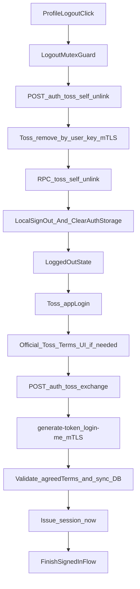

# TOSS UNLINK 재로그인 시뮬레이션 계획서

> **서비스 개요:** 토스 미니앱 + 일반 웹을 함께 운영하는 React/TypeScript 기반 주식 유틸리티 서비스  
> **문서 목적:** 토스 반려 사유를 해결하기 위한 리팩토링 전에, 현재 문제를 구조적으로 정리하고 **시뮬레이션 통과 기준**을 먼저 고정합니다.  
> **현재 상태:** 이 문서는 **문서화 전용**입니다. 승인 전까지 `App.tsx`, `components/**`, `services/**`, `hooks/**`, `server/**` 실제 구현 수정은 금지합니다.  
> **범위 고정:** 본 문서는 사용자가 선택한 **A안(토스 정품 활용)** 을 따릅니다. 즉, **미니앱 로그아웃 시 토스 공식 unlink API를 호출**하고, **다음 `appLogin()`의 토스 공식 약관 UI**를 그대로 사용합니다.

---

## 0. 문서 상태 및 성공 조건

### 0.1 배경

토스 반려 사유와 질의 응답을 종합하면, 이번 작업의 핵심 요구사항은 아래 두 가지입니다.

1. **미니앱 내부 로그아웃도 연결 끊기(UNLINK)와 같은 수준으로 처리**되어야 합니다.
2. **연결을 끊고 다시 로그인할 때 약관 동의가 다시 노출**되어야 합니다.

이번 문서는 이를 **우리 앱의 커스텀 재동의 UI**로 풀지 않고, **토스 공식 unlink + 다음 `appLogin()`의 공식 약관 UI**로 해결합니다.

### 0.2 이번 계획서의 성공 조건

- 로그아웃 시 **토스 공식 로그인 끊기 API**를 **mTLS 서버 통신**으로 호출하는 설계를 문서로 고정합니다.
- 로그아웃 시 **서버 매핑(`toss_accounts`)** 과 **프로필의 `toss_user_key`** 가 제거되는 설계를 문서로 고정합니다.
- 다음 로그인에서는 **`appLogin()`의 토스 공식 약관 UI**가 SSOT이고, **우리 앱이 별도의 약관 모달/게이트를 만들지 않음**을 명시합니다.
- `/auth/toss/exchange`는 **토스 공식 `generate-token` → `login-me` 결과**를 사용해 로그인 완료를 닫고, **`agreedTerms` 기반 검증·동의 시각 동기화**를 서버에서 처리합니다.
- **글로벌 동의 컬럼은 unlink로 지우지 않음**을 유지해 다중 소셜 계정을 보호합니다.
- 스니펫은 **11대 Core Rules** 를 위반하지 않아야 하며, **오버코딩 여부**를 별도로 검토합니다.

### 0.3 비목표

- `WITHDRAWAL_TERMS`, `WITHDRAWAL_TOSS`의 **신규 정책 설계/리팩토링**은 이번 범위가 아닙니다. 다만 **기존 운영 계약을 후퇴시키지 않는지 확인하는 것**은 이번 범위에 포함합니다.
- 신규 전역 상태관리 라이브러리, XState, 폼 라이브러리, 인증 프레임워크 교체는 하지 않습니다.
- 토스 로그인 전체 구조를 새로 짜지 않습니다. **기존 `appLogin()` + BFF exchange 구조를 유지**합니다.
- **커스텀 재동의 게이트**, `pendingAuthToken`, `POST /auth/toss/reconsent/complete` 축은 채택하지 않습니다.

### 0.4 외부 리뷰 반영 및 Hallucination 검증

이번 문서는 다른 AI 리뷰 제안을 그대로 수용하지 않고, **토스 문서 + 현재 레포 구현 상태** 기준으로 검증한 뒤 반영합니다.

- **수용:** self-unlink에서 `user_profiles` update와 `toss_accounts` delete를 분리하면 원자성 문제가 생길 수 있다는 지적
- **수용:** `localStorage.removeItem(...)` 예외가 전체 로그아웃을 취소시키지 않도록 격리해야 한다는 지적
- **수용:** 브리지·로그아웃·세션 정리 경로에 별도 mutex와 언마운트 가드가 필요하다는 지적
- **조건부 수용:** 세션 누수 방지용 전역 Guard는 유효하지만, **1차 방어선이 아니라 보조 방어선**으로 둡니다
- **수정 수용:** `request.user?.id`는 현재 서버에 존재하는 Fastify 계약이 아닙니다. 현재 서버는 `payment.ts`처럼 **`Authorization: Bearer ...` → `supabaseAdmin.auth.getUser(token)`** 패턴으로 인증합니다
- **수정 수용:** `rpc_toss_self_unlink`는 현재 레포에 존재하지 않습니다. 따라서 문서에서는 이를 **신규 마이그레이션 산출물**로만 제안합니다
- **토스 문서 정합(핵심):** 미니앱 로그아웃은 **우리 DB 정리만으로 끝내지 않고**, 토스 문서의 **공식 로그인 끊기 API**와 [mTLS 서버 연동](https://developers-apps-in-toss.toss.im/development/integration-process.html)을 포함해야 합니다
- **수용 (웹훅·self-unlink 동기화):** 사용자가 **토스 앱 설정**에서 연결을 끊으면 **웹훅**이 `handleUnlink`를 타므로, 웹훅과 미니앱 로그아웃은 **동일 DB RPC**로 정리 결과를 맞춥니다
- **수용 (커스텀 재동의 제거):** **`pendingAuthToken`·`reconsent/complete`·`TossReconsentGate`** 기반 자체 약관 UI는 **토스 공식 약관 플로우와 SSOT가 분리**되므로 채택하지 않습니다
- **수용 (토스 로그인 caller 보강):** `loginWithToss`는 **`Promise.resolve(wrapBridgeCall(() => appLogin()))`** 로 브리지 실패를 흡수하고, **`/auth/toss/exchange` 성공 시에만 `setSession`** 하도록 계획을 명시합니다

---

## 1. 현재 상태(As-Is) 스냅샷

### 1.1 현재 로그아웃은 "로컬 세션 정리" 중심입니다

현재 앱 로그아웃은 Supabase 세션 종료, 로컬 인증 저장소 삭제, React 상태 초기화 중심입니다.  
문제는 이 흐름만으로는:

- 토스 측 연결 끊기 사실이 보장되지 않고
- 우리 서버의 `toss_accounts` / `user_profiles.toss_user_key` 정리가 누락될 수 있으며
- 다음 `appLogin()`에서 토스 공식 약관 UI가 다시 나타나야 하는 전제가 약해진다는 점입니다

### 1.2 현재 토스 로그인은 `appLogin()` 이후 세션 복구에 집중되어 있습니다

현재 구조의 핵심 문제는 **약관 노출 책임을 우리 앱이 간접적으로 떠안게 되는 것**입니다.  
A안에서는 이 책임을 다시 **토스 공식 `appLogin()` UI**로 돌려보냅니다.

### 1.2.1 목표(To-Be): `loginWithToss`

이번 문서의 A안은 **우리 앱이 재동의 모달을 만들지 않습니다.** 사용자가 `appLogin()`을 실행하면, **토스가 필요하다고 판단한 경우 토스 공식 약관 UI가 먼저 노출**되고, 사용자가 동의한 뒤에만 `authorizationCode`가 반환됩니다.

따라서 클라이언트의 역할은 아래로 단순화됩니다.

- `appLogin()` 호출
- 인가 코드 수령
- BFF `/auth/toss/exchange` 호출
- `TossLoginView`는 **브리지 + BFF 통신 결과만 상위로 전달**
- `AuthModalCoordinator`는 **서버가 내려준 최종 세션을 오직 한 번만 `setSession`**

```ts
// simulation: services/toss/tossAuth.ts
import { appLogin } from '@apps-in-toss/web-framework';
import { fetchJsonWithTimeout, normalizeErrorMessage, wrapBridgeCall } from '../serviceUtils';
import { readTrimmedViteEnv } from '../../utils/viteImportMetaEnv';
import { isTossApp } from './tossBridge';

const BFF_URL = readTrimmedViteEnv('VITE_RAILWAY_BFF_URL');

export interface TossExchangeResult {
  access_token: string;
  refresh_token: string;
  user: { id: string; email: string };
}

export type TossLoginResult =
  | { success: true; exchangeResult: TossExchangeResult }
  | { success: false; error: string };

export async function loginWithToss(): Promise<TossLoginResult> {
  if (!isTossApp()) {
    return { success: false, error: '토스 앱 환경이 아닙니다.' };
  }

  try {
    const loginCallResult = await Promise.resolve(
      wrapBridgeCall<unknown>(() => appLogin(), null, { action: 'appLogin' }),
    );

    if (!loginCallResult.ok) {
      return {
        success: false,
        error: normalizeErrorMessage(loginCallResult.error.cause, '토스 로그인 요청 실패'),
      };
    }

    const decodedAppLogin = decodeAppLoginResponse(loginCallResult.data);
    if (decodedAppLogin == null) {
      return { success: false, error: '토스 인증 코드를 받지 못했습니다.' };
    }

    const exchangeResult = await fetchJsonWithTimeout<TossExchangeResult>(
      `${BFF_URL.replace(/\/+$/, '')}/auth/toss/exchange`,
      {
        method: 'POST',
        headers: { 'Content-Type': 'application/json' },
        body: JSON.stringify({
          authorizationCode: decodedAppLogin.authorizationCode,
          referrer: decodedAppLogin.referrer,
        }),
      },
      null,
      { context: { action: 'toss_exchange' } },
    );

    if (!exchangeResult.ok) {
      return {
        success: false,
        error: normalizeErrorMessage(exchangeResult.error.cause, '서버 인증 중 오류가 발생했습니다.'),
      };
    }

    return { success: true, exchangeResult: exchangeResult.data };
  } catch (bridgeError: unknown) {
    return { success: false, error: normalizeErrorMessage(bridgeError, '토스 로그인 브리지 오류') };
  }
}
```

```tsx
// simulation: components/TossLoginView.tsx
import React, { useCallback, useRef, useState } from 'react';
import { TDSButton } from './tds';
import {
  FALLBACK_AUTH_MESSAGES,
  getAuthModalMessages,
} from '../constants/messages/authMessages';
import { loginWithToss, type TossExchangeResult } from '../services/toss/tossAuth';

interface TossLoginViewProps {
  lang: AppLang;
  onSuccess: (exchangeResult: TossExchangeResult) => Promise<void> | void;
  onError: (message: string) => void;
}

export function TossLoginView({
  lang,
  onSuccess,
  onError,
}: TossLoginViewProps): React.ReactElement {
  const isExecutingLoginRef = useRef(false);
  const [isLoading, setIsLoading] = useState(false);
  const copy = getAuthModalMessages(lang) ?? FALLBACK_AUTH_MESSAGES;

  const handleTossLogin = useCallback(async (): Promise<void> => {
    if (isExecutingLoginRef.current) {
      return;
    }
    isExecutingLoginRef.current = true;
    setIsLoading(true);

    try {
      const result = await loginWithToss();
      if (!result.success) {
        onError(result.error);
        return;
      }

      await Promise.resolve(onSuccess(result.exchangeResult));
    } catch (error: unknown) {
      onError(
        error instanceof Error
          ? error.message
          : copy.validation.authenticationFailed,
      );
    } finally {
      isExecutingLoginRef.current = false;
      setIsLoading(false);
    }
  }, [copy?.validation?.authenticationFailed, onError, onSuccess]);

  return (
    <TDSButton
      type="button"
      fullWidth
      loading={isLoading}
      disabled={isLoading}
      onClick={handleTossLogin}
    >
      {isLoading ? copy.action.processing : copy.action.login}
    </TDSButton>
  );
}
```

### 1.3 현재 서버의 UNLINK는 토스 공식 unlink와 완전히 일치하지 않습니다

현재 기준으로는 **토스 공식 로그인 끊기 API 호출**과 **우리 DB 정리**가 한 흐름으로 묶여 있지 않습니다.  
이번 계획서의 핵심은 이 둘을 **한 BFF 경로**로 묶는 것입니다.

---

## 2. 반려 사유 기준 문제 매트릭스

| 반려/요구사항 | 현재 동작 | 문제점 | A안 최소 수정 원칙 |
|---|---|---|---|
| 미니앱 로그아웃도 연결 끊기 수준으로 처리 | 로컬 세션/상태만 정리 | 토스 측 연결 상태와 우리 DB 매핑이 남을 수 있음 | **토스 공식 unlink API + mTLS + DB RPC**를 한 BFF 경로로 묶음 |
| 연결 해제 후 재로그인 시 약관 노출 | `appLogin()` 후 곧바로 세션 복구 | 약관 노출 책임을 우리가 추측하는 구조 | **다음 `appLogin()`의 토스 공식 약관 UI**를 SSOT로 사용 |
| 유저 데이터가 남아있음 | 계정/포트폴리오 외 연동 식별자도 남을 수 있음 | 심사 기준상 "끊김"으로 보이지 않음 | `toss_accounts` 삭제 + `user_profiles.toss_user_key` null |
| 약관 화면 구현 주체 | 앱 내부에서 별도 재동의 UI를 만들 수 있음 | 토스 콘솔 약관·`agreedTerms`와 SSOT 분리 | **커스텀 게이트 금지**, `login-me.agreedTerms` 기반 서버 동기화 |

---

## 3. 목표 아키텍처(To-Be)

### 3.1 핵심 원칙

1. **로그아웃은 세 단계**여야 합니다.  
   `토스 공식 unlink API 호출(mTLS)` → `우리 DB unlink 정리` → `로컬 인증/상태 정리`

2. **재로그인은 그대로 `appLogin()`을 사용**합니다.  
   약관 UI는 **토스가 노출**하고, 우리는 그 이후 **exchange → 세션 발급**만 담당합니다

3. **우리 앱은 약관 재동의 모달을 만들지 않습니다.**  
   `pending token`, `reconsent complete`, 커스텀 체크박스 UI는 A안에서 제거합니다

4. **계정/포트폴리오는 유지**합니다.  
   따라서 WITHDRAWAL 로직은 건드리지 않습니다

### 3.2 권장 흐름



### 3.3 이번 문서가 채택하는 최소 침습 설계

- **채택:** 기존 `toss_accounts`, `user_profiles.toss_user_key`, `terms_consent_at`, `privacy_consent_at`를 재사용합니다
- **채택:** 기존 `appLogin()` + `/auth/toss/exchange` 구조를 유지합니다
- **채택:** 미니앱 로그아웃은 **BFF `/auth/toss/self-unlink`** 가 **토스 공식 unlink API**와 **우리 DB RPC**를 순서대로 호출합니다
- **채택:** 서버의 토스 API 호출은 **mTLS** 로만 수행합니다
- **채택:** `/auth/toss/exchange`는 **토스 공식 `generate-token` → `login-me`** 를 호출하고, **`agreedTerms` 검증 + 동의 컬럼 동기화 + 세션 발급**을 끝냅니다
- **채택:** 회원 식별의 1차 기준은 **`login-me.userKey`** 이며, 이메일은 **보조 프로필 정보**로만 취급합니다
- **채택:** `login-me.agreedTerms`는 **콘솔에 등록한 약관 tag의 서버 미러 설정값**과 비교합니다. 문서에 없는 tag 문자열 하드코딩은 금지합니다
- **보류:** 신규 전역 auth machine 도입
- **보류:** 신규 동의 이력 전용 테이블 도입
- **보류:** 커스텀 재동의 모달, pending JWT, `/reconsent/complete`

### 3.4 공식 약관 기준 판정 방식

이번 계획서의 기본안은 **토스 공식 약관 UI + 서버 검증**입니다.

- self-unlink·웹훅 UNLINK 시:
  - **토스 공식 unlink API** 호출
  - **공식 unlink가 성공했을 때만** `user_profiles.toss_user_key = null`, `toss_accounts` 삭제
  - **공식 unlink 선행 조건(`refreshToken` 등)이 없거나 호출이 실패하면 DB unlink 성공으로 간주하지 않음**
  - **`terms_consent_at`, `privacy_consent_at`는 unlink로 지우지 않음**
- 다음 `/auth/toss/exchange` 시:
  - `appLogin()`이 필요하면 **토스 공식 약관 UI**를 먼저 보여줌
  - BFF는 `generate-token`과 `login-me`로 **`userKey`, `agreedTerms`, `refreshToken`** 을 확보
  - **기존 사용자 조회는 `toss_accounts.toss_user_key = userKey`를 1차 기준**으로 수행
  - 이메일은 **`null` 가능·점유 미보장** 이므로 **회원 매칭의 기준으로 사용하지 않음**
  - 서버는 **필수 약관 tag가 `agreedTerms`에 모두 포함**되었는지 검증
  - 검증에 성공하면 **동의 시각을 서버 `now()`로 기록**하고 세션 발급

---

## 4. 시뮬레이션 스니펫

이 절의 스니펫은 **실제 코드가 아니라 설계 검증용**입니다.  
다만 그대로 구현해도 무리가 없도록 **Core Rules 11개**를 반영한 형태로 작성합니다.

### 4.1 클라이언트 로그아웃 오케스트레이터 스니펫

목표:

- 비동기 중복 클릭 방지
- **Rule 11·도메인 안전:** 토스 공식 unlink 호출·mTLS 통신·DB 정리·`safeRollbackLocalSession` 지연이 있어도, 사용자는 **`await` 이전에** 이미 **로그인 화면·비인가 UI**로 떨어지게 함
- **Rule 5 / SRP:** **React 상태 초기화는 UI 핸들러**에서만 수행하고, **`executeTossMiniAppLogout`은 UI 콜백을 받지 않음**
- **best-effort** 서버 self-unlink 시도(토스 공식 unlink + 우리 DB 정리)
- 서버 동기화 실패와 무관하게 **로컬 세션·스토리지 정리는 항상 수행**

#### 4.1.0 `safeRollbackLocalSession`

```ts
// simulation: services/toss/authRollbackHelper.ts
import { supabase, clearAuthStorage } from '../supabase';

export async function safeRollbackLocalSession(): Promise<void> {
  try {
    const { error: signOutError } = await supabase.auth.signOut({ scope: 'local' });
    if (signOutError != null) {
      console.warn('[Auth] Failed to cleanly sign out local session', signOutError);
    }
  } catch (rollbackError: unknown) {
    console.error('[Auth] Hard error during session rollback', rollbackError);
  } finally {
    clearAuthStorage();
  }
}
```

#### 4.1.1 `executeTossMiniAppLogout`

```ts
// simulation: services/toss/executeTossMiniAppLogout.ts
import { safeRollbackLocalSession } from './authRollbackHelper';
import { fetchJsonWithTimeout } from '../serviceUtils';

const PENDING_TOSS_LOGIN_STORAGE_KEY = 'btd_pending_toss_login';

interface LogoutCopy {
  networkError: string;
  partialUnlinkWarning: string;
}

interface ExecuteTossMiniAppLogoutArgs {
  bffUrl: string;
  accessToken: string;
  copy: LogoutCopy;
}

interface ExecuteTossMiniAppLogoutResult {
  isLocalLogoutCompleted: true;
  hasServerUnlinkFailed: boolean;
  warningMessage: string | null;
}

function safeClearPendingTossLoginStorage(): void {
  if (typeof window === 'undefined') {
    return;
  }

  try {
    window.localStorage.removeItem(PENDING_TOSS_LOGIN_STORAGE_KEY);
  } catch (error: unknown) {
    console.warn('[TossLogout] Failed to clear pending toss login cache', error);
  }
}

async function finalizeLocalLogout(): Promise<void> {
  await safeRollbackLocalSession();
  safeClearPendingTossLoginStorage();
}

export async function executeTossMiniAppLogout(
  args: ExecuteTossMiniAppLogoutArgs,
): Promise<ExecuteTossMiniAppLogoutResult> {
  const trimmedBffUrl = args.bffUrl.trim();
  const trimmedAccessToken = args.accessToken.trim();

  try {
    if (trimmedBffUrl.length === 0 || trimmedAccessToken.length === 0) {
      return {
        isLocalLogoutCompleted: true,
        hasServerUnlinkFailed: true,
        warningMessage: args.copy.partialUnlinkWarning,
      };
    }

    const unlinkResult = await fetchJsonWithTimeout<{
      action: 'unlinked' | 'noop' | 'official_unlink_failed';
    }>(
      `${trimmedBffUrl.replace(/\/+$/, '')}/auth/toss/self-unlink`,
      {
        method: 'POST',
        headers: {
          Authorization: `Bearer ${trimmedAccessToken}`,
          'Content-Type': 'application/json',
        },
      },
      null,
      { context: { action: 'toss_self_unlink' } },
    );

    if (!unlinkResult.ok) {
      return {
        isLocalLogoutCompleted: true,
        hasServerUnlinkFailed: true,
        warningMessage: args.copy.partialUnlinkWarning,
      };
    }

    if (unlinkResult.data.action === 'official_unlink_failed') {
      return {
        isLocalLogoutCompleted: true,
        hasServerUnlinkFailed: true,
        warningMessage: args.copy.partialUnlinkWarning,
      };
    }

    return {
      isLocalLogoutCompleted: true,
      hasServerUnlinkFailed: false,
      warningMessage: null,
    };
  } catch (error: unknown) {
    console.error('[TossLogout] self-unlink failed unexpectedly', error);
    return {
      isLocalLogoutCompleted: true,
      hasServerUnlinkFailed: true,
      warningMessage: args.copy.partialUnlinkWarning,
    };
  } finally {
    await finalizeLocalLogout();
  }
}
```

#### 4.1.2 로그아웃 총괄 훅 + `ProfileView` 얇게 유지

```tsx
// simulation: hooks/useTossLogoutFlow.ts
import { useCallback, useEffect, useRef } from 'react';
import { executeTossMiniAppLogout } from '../services/toss/executeTossMiniAppLogout';

interface UseTossLogoutFlowArgs {
  bffUrl: string;
  currentSessionAccessToken: string | null;
  logoutCopy: {
    networkError: string;
    partialUnlinkWarning: string;
  };
  onResetUiState: () => void;
  showWarningToast: (message: string) => void;
  showErrorToast: (message: string) => void;
}

export function useTossLogoutFlow({
  bffUrl,
  currentSessionAccessToken,
  logoutCopy,
  onResetUiState,
  showWarningToast,
  showErrorToast,
}: UseTossLogoutFlowArgs): {
  handleTossLogout: () => Promise<void>;
} {
  const isMountedRef = useRef(true);
  const isExecutingLogoutRef = useRef(false);

  useEffect(() => {
    isMountedRef.current = true;
    return () => {
      isMountedRef.current = false;
    };
  }, []);

  const handleTossLogout = useCallback(async (): Promise<void> => {
    if (isExecutingLogoutRef.current) {
      return;
    }
    isExecutingLogoutRef.current = true;

    onResetUiState();

    try {
      const result = await executeTossMiniAppLogout({
        bffUrl,
        accessToken: currentSessionAccessToken ?? '',
        copy: logoutCopy,
      });

      if (
        result.hasServerUnlinkFailed &&
        result.warningMessage != null &&
        isMountedRef.current
      ) {
        showWarningToast(result.warningMessage);
      }
    } catch (error: unknown) {
      console.error('[TossLogout] Unexpected error during logout flow', error);
      if (isMountedRef.current) {
        showErrorToast(logoutCopy.networkError);
      }
    } finally {
      if (isMountedRef.current) {
        isExecutingLogoutRef.current = false;
      }
    }
  }, [
    bffUrl,
    currentSessionAccessToken,
    logoutCopy,
    onResetUiState,
    showErrorToast,
    showWarningToast,
  ]);

  return { handleTossLogout };
}
```

```tsx
// simulation: App.tsx
const { handleTossLogout } = useTossLogoutFlow({
  bffUrl: BFF_URL,
  currentSessionAccessToken,
  logoutCopy,
  onResetUiState: () => {
    setUser(null);
    setUserProfile(null);
    setPortfolios([]);
    setShouldShowSignedInWelcome(false);
    setAuthModal('login');
  },
  showWarningToast,
  showErrorToast,
});

<ProfileView
  // ...other props
  onLogout={handleTossLogout}
/>
```

```tsx
// simulation: components/auth/ProfileView.tsx
const handleLogoutClick = useCallback((): void => {
  void onLogout();
}, [onLogout]);
```

### 4.2 서버 self-unlink API 스니펫

목표:

- 토스 문서의 **공식 로그인 끊기 API**를 **mTLS** 로 호출
- 그 뒤 기존 UNLINK와 동등한 **토스 연결 해제** 효과(`toss_user_key` + `toss_accounts`)
- **글로벌 약관 컬럼은 비우지 않음**
- 토스 공식 unlink와 우리 DB 정리를 **한 BFF 경로**로 묶어 투 페이스 상태를 줄임

```ts
// simulation: server/src/routes/tossSelfUnlinkRoute.ts
import type { FastifyInstance } from 'fastify';
import { supabaseAdmin } from '../supabaseClient';
import type { RequestLogger } from '../toss/logger';
import { getRefreshedTossAccessToken, removeTossAccessByUserKey } from '../toss/TossProvider';

const SELF_UNLINK_RESPONSE = {
  UNLINKED: 'unlinked',
  NOOP: 'noop',
  OFFICIAL_UNLINK_FAILED: 'official_unlink_failed',
} as const;

type SelfUnlinkAction =
  (typeof SELF_UNLINK_RESPONSE)[keyof typeof SELF_UNLINK_RESPONSE];

interface StoredTossLinkRecord {
  tossUserKey: string;
  refreshToken: string;
}

function parseTossUserKeyOrThrow(tossUserKey: string): number {
  const trimmedKey = tossUserKey.trim();
  if (!/^\d+$/.test(trimmedKey)) {
    throw new Error('Invalid toss user key format');
  }

  const parsed = Number(trimmedKey);
  if (!Number.isSafeInteger(parsed)) {
    throw new Error('toss user key exceeds Number safe integer range');
  }

  return parsed;
}

async function readStoredTossLinkRecord(
  authUserId: string,
  log: RequestLogger,
): Promise<StoredTossLinkRecord | null> {
  const { data, error } = await supabaseAdmin
    .from('toss_auth_links')
    .select('toss_user_key, encrypted_refresh_token')
    .eq('auth_user_id', authUserId)
    .maybeSingle();

  if (error != null) {
    log.error({ error, authUserId }, 'Failed to read stored toss auth link');
    throw error;
  }

  if (data == null) {
    return null;
  }

  return {
    tossUserKey: String(data.toss_user_key ?? '').trim(),
    refreshToken: decryptStoredRefreshToken(String(data.encrypted_refresh_token ?? '')),
  };
}

async function unlinkByAuthUserIdAtomic(
  authUserId: string,
  log: RequestLogger,
): Promise<SelfUnlinkAction> {
  const trimmedUserId = authUserId.trim();
  if (trimmedUserId.length === 0) {
    return SELF_UNLINK_RESPONSE.NOOP;
  }

  const storedLink = await readStoredTossLinkRecord(trimmedUserId, log);
  if (storedLink != null && storedLink.tossUserKey.length > 0 && storedLink.refreshToken.length > 0) {
    const freshAccessToken = await getRefreshedTossAccessToken(storedLink.refreshToken, log);
    await removeTossAccessByUserKey(freshAccessToken, storedLink.tossUserKey, log);
  } else {
    log.warn(
      { authUserId: trimmedUserId },
      'Missing stored toss refresh token; refusing to mark official unlink as completed',
    );
    return SELF_UNLINK_RESPONSE.OFFICIAL_UNLINK_FAILED;
  }

  const { error: rpcError } = await supabaseAdmin.rpc('rpc_toss_self_unlink', {
    target_user_id: trimmedUserId,
  });

  if (rpcError != null) {
    log.error({ rpcError, authUserId: trimmedUserId }, 'rpc_toss_self_unlink failed');
    throw rpcError;
  }

  return SELF_UNLINK_RESPONSE.UNLINKED;
}

export async function tossSelfUnlinkRoute(fastify: FastifyInstance): Promise<void> {
  fastify.post('/auth/toss/self-unlink', async (request, reply) => {
    try {
      const authHeader = request.headers.authorization ?? '';
      const accessToken = authHeader.replace(/^Bearer\s+/i, '').trim();

      if (accessToken.length === 0) {
        return reply.code(401).send({ error: 'Unauthorized' });
      }

      const { data: authUser, error: authError } = await supabaseAdmin.auth.getUser(accessToken);
      if (authError != null || authUser.user == null) {
        return reply.code(401).send({ error: 'Unauthorized' });
      }

      const action = await unlinkByAuthUserIdAtomic(authUser.user.id, request.log);
      return reply.send({ action });
    } catch (error: unknown) {
      request.log.error({ error }, 'self-unlink route failed');
      return reply.code(500).send({ error: 'SELF_UNLINK_FAILED' });
    }
  });
}
```

```ts
// simulation: server/src/toss/TossProvider.ts (append)
// 기존 mTLS 환경 변수 재사용: TOSS_API_URL, TOSS_CLIENT_CERT, TOSS_CLIENT_KEY
const REFRESH_TOKEN_PATH = '/api-partner/v1/apps-in-toss/user/oauth2/refresh-token';
const REMOVE_BY_USER_KEY_PATH =
  '/api-partner/v1/apps-in-toss/user/oauth2/access/remove-by-user-key';

export async function getRefreshedTossAccessToken(
  refreshToken: string,
  log: RequestLogger,
): Promise<string> {
  const client = getClient();
  const res = await client.post(REFRESH_TOKEN_PATH, { refreshToken });
  const parsed = parseTokenResponse(res.data);
  if (parsed == null) {
    log.error({ raw: res.data }, 'Invalid refresh-token response shape');
    throw new Error('Invalid refresh-token response');
  }
  return parsed.accessToken;
}

export async function removeTossAccessByUserKey(
  accessToken: string,
  tossUserKey: string,
  log: RequestLogger,
): Promise<void> {
  const parsedUserKey = parseTossUserKeyOrThrow(tossUserKey);
  const client = getClient();
  await client.post(
    REMOVE_BY_USER_KEY_PATH,
    { userKey: parsedUserKey },
    { headers: { Authorization: `Bearer ${accessToken}` } },
  );
  log.info({ tossUserKey }, 'Toss official unlink completed');
}
```

```sql
-- simulation: supabase/migrations/20260408_rpc_toss_self_unlink.sql
create or replace function public.rpc_toss_self_unlink(target_user_id uuid)
returns void
language plpgsql
security definer
as $$
begin
  update public.user_profiles
  set toss_user_key = null
  where id = target_user_id;

  delete from public.toss_accounts
  where auth_user_id = target_user_id;
end;
$$;
```

### 4.2.1 토스 웹훅 계약 유지: `UNLINK` + `WITHDRAWAL_*`

핵심은 **웹훅과 self-unlink가 같은 매핑 테이블을 바라보되, 기존 운영 계약(`WITHDRAWAL_TERMS`, `WITHDRAWAL_TOSS`)은 절대 후퇴시키지 않는 것**입니다.  
웹훅은 이미 **토스 쪽 공식 이벤트가 끝난 뒤** 들어오는 통보이므로, 여기서는 **토스 API를 다시 호출하지 않고** 라우트의 **Basic Auth 검증**과 핸들러의 **referrer 분기**만 정확히 유지합니다.

추가 계약:

- 웹훅 엔드포인트는 **콘솔에 등록한 Basic Auth 계정/비밀번호**를 검증합니다
- 웹훅 payload의 `referrer`는 **`UNLINK` / `WITHDRAWAL_TERMS` / `WITHDRAWAL_TOSS`** 세 가지를 모두 타입으로 고정합니다
- `UNLINK`는 **`rpc_toss_self_unlink`와 동등한 DB unlink 정리**를 수행합니다
- `WITHDRAWAL_TERMS`, `WITHDRAWAL_TOSS`는 **기존 회원 삭제/정리 정책**을 유지합니다

```ts
// simulation: server/src/routes/tossDisconnectCallbackRoute.ts
import { z } from 'zod';
import {
  handleTossDisconnect,
  TOSS_DISCONNECT_REFERRERS,
} from '../toss/tossDisconnectHandler';

const TOSS_WEBHOOK_USER = process.env.TOSS_WEBHOOK_USER ?? '';
const TOSS_WEBHOOK_PASSWORD = process.env.TOSS_WEBHOOK_PASSWORD ?? '';

const tossDisconnectBodySchema = z
  .object({
    userKey: z
      .union([z.string(), z.number()])
      .transform((value) => String(value).trim())
      .refine((value) => value.length > 0, { message: 'userKey must be non-empty' }),
    referrer: z.enum(TOSS_DISCONNECT_REFERRERS),
  })
  .strict();

function hasValidBasicAuth(authorizationHeader: string | undefined): boolean {
  if (!authorizationHeader?.startsWith('Basic ')) {
    return false;
  }

  if (TOSS_WEBHOOK_USER.length === 0 || TOSS_WEBHOOK_PASSWORD.length === 0) {
    return false;
  }

  try {
    const encodedValue = authorizationHeader.slice('Basic '.length).trim();
    const decodedValue = Buffer.from(encodedValue, 'base64').toString('utf8');
    const [user, password] = decodedValue.split(':');
    return user === TOSS_WEBHOOK_USER && password === TOSS_WEBHOOK_PASSWORD;
  } catch {
    return false;
  }
}

fastify.post('/webhook/toss/disconnect', async (request, reply) => {
  if (!hasValidBasicAuth(request.headers.authorization)) {
    return reply.code(401).send({ error: 'Unauthorized' });
  }

  const parsed = tossDisconnectBodySchema.safeParse(request.body);
  if (!parsed.success) {
    return reply.code(400).send({ error: 'Invalid payload' });
  }

  const result = await handleTossDisconnect(
    {
      userKey: parsed.data.userKey,
      referrer: parsed.data.referrer,
    },
    request.log,
  );

  return reply.send({
    success: true,
    action: result.action,
  });
});
```

```ts
// simulation: server/src/toss/tossDisconnectHandler.ts
export const TOSS_DISCONNECT_REFERRERS = [
  'UNLINK',
  'WITHDRAWAL_TERMS',
  'WITHDRAWAL_TOSS',
] as const;

export type TossDisconnectReferrer =
  (typeof TOSS_DISCONNECT_REFERRERS)[number];

interface TossDisconnectEvent {
  userKey: string;
  referrer: TossDisconnectReferrer;
}

export async function handleTossDisconnect(
  event: TossDisconnectEvent,
  log: RequestLogger,
): Promise<{ action: 'unlinked' | 'withdrawn' | 'noop' }> {
  log.info(
    { userKey: event.userKey, referrer: event.referrer },
    'Received Toss disconnect webhook event',
  );

  switch (event.referrer) {
    case 'UNLINK':
      return handleUnlink(event.userKey, log);
    case 'WITHDRAWAL_TERMS':
    case 'WITHDRAWAL_TOSS':
      return handleWithdrawal(event.userKey, log);
    default: {
      const exhaustiveCheck: never = event.referrer;
      log.error({ exhaustiveCheck }, 'Unsupported toss disconnect referrer');
      throw new Error('Unsupported disconnect referrer');
    }
  }
}
```

### 4.3 `/auth/toss/exchange`를 토스 공식 로그인 완료 경로로 정리하는 스니펫

목표:

- `appLogin()`은 유지
- 토스 공식 약관 UI는 **`appLogin()`** 이 담당
- BFF는 **`generate-token` → `login-me` → `agreedTerms` 검증 → 세션 발급**을 한 번에 끝냄
- `login-me.agreedTerms`를 **우리 DB 동의 컬럼과 동기화**

```ts
// simulation: server/src/toss/types.ts
export interface TossLoginMeSuccessDto {
  userKey: number;
  agreedTerms: string[];
  email: string | null;
}
```

```ts
// simulation: server/src/toss/responseParsers.ts
import type { TossLoginMeSuccessDto } from './types';

const RESULT_SUCCESS = 'SUCCESS';

function readStringArray(value: unknown): string[] | null {
  if (!Array.isArray(value)) {
    return null;
  }

  const normalizedValues = value
    .filter((item): item is string => typeof item === 'string')
    .map((item) => item.trim())
    .filter((item) => item.length > 0);

  return normalizedValues.length === value.length ? normalizedValues : null;
}

export function parseLoginMeResponse(data: unknown): TossLoginMeSuccessDto | null {
  if (data == null || typeof data !== 'object') {
    return null;
  }

  const payload = data as { resultType?: string; success?: unknown };
  if (payload.resultType !== RESULT_SUCCESS || payload.success == null || typeof payload.success !== 'object') {
    return null;
  }

  const success = payload.success as Record<string, unknown>;
  const userKey = success.userKey;
  const agreedTerms = readStringArray(success.agreedTerms);
  const emailValue = success.email;

  if (typeof userKey !== 'number') {
    return null;
  }

  if (agreedTerms == null) {
    return null;
  }

  if (emailValue !== null && emailValue !== undefined && typeof emailValue !== 'string') {
    return null;
  }

  return {
    userKey,
    agreedTerms,
    email: typeof emailValue === 'string' ? emailValue : null,
  };
}
```

```ts
// simulation: server/src/toss/TossProvider.ts (login-me 발췌)
export interface GetLoginMeResult {
  success: true;
  data: {
    userKey: string;
    agreedTerms: string[];
    email: string | null;
  };
}

export async function getLoginMe(
  accessToken: string,
  log: RequestLogger,
): Promise<GetLoginMeResult | GetLoginMeFailure> {
  const client = getClient();
  const res = await client.get(LOGIN_ME_PATH, {
    headers: { Authorization: `Bearer ${accessToken}` },
  });

  const parsed = parseLoginMeResponse(res.data);
  if (parsed == null) {
    log.warn({ raw: res.data }, 'Invalid login-me response shape');
    return { success: false, error: { error: 'Invalid login-me response shape' } };
  }

  return {
    success: true,
    data: {
      userKey: userKeyToString(parsed.userKey),
      agreedTerms: parsed.agreedTerms,
      email: parsed.email,
    },
  };
}
```

```ts
// simulation: server/src/toss/AuthService.ts (발췌)
interface TossSignedInResult {
  status: 'signed_in';
  access_token: string;
  refresh_token: string;
  user: {
    id: string;
    email: string;
  };
}

function readRequiredTossTermsTags(): string[] {
  const raw = process.env.TOSS_REQUIRED_TERMS_TAGS?.trim() ?? '';
  if (raw.length === 0) {
    throw new Error('TOSS_REQUIRED_TERMS_TAGS is required');
  }

  return raw
    .split(',')
    .map((value) => value.trim())
    .filter((value) => value.length > 0);
}

function hasAllRequiredTerms(agreedTerms: string[]): boolean {
  const requiredTermsTags = readRequiredTossTermsTags();
  return requiredTermsTags.every((tag) => agreedTerms.includes(tag));
}

export async function finalizeTossLoginExchange(
  tossUserKey: string,
  nullableEmail: string | null,
  agreedTerms: string[],
  refreshToken: string,
  log: RequestLogger,
): Promise<TossSignedInResult> {
  const existingAuthUserId = await findAuthUserIdByTossUserKey(tossUserKey, log);
  const authUserId =
    existingAuthUserId ??
    (await createManagedTossAuthUser(tossUserKey, log)).id;

  if (!hasAllRequiredTerms(agreedTerms)) {
    throw new Error('Required Toss terms are missing from login-me response');
  }

  await saveStoredTossRefreshToken(authUserId, tossUserKey, refreshToken, log);
  await syncTossLoginState(authUserId, tossUserKey, true, log);
  await syncOptionalProfileFieldsFromTossLogin(
    authUserId,
    {
      email: nullableEmail,
    },
    log,
  );

  const session = await issueSessionForUser(authUserId, log);
  return {
    status: 'signed_in',
    access_token: session.access_token,
    refresh_token: session.refresh_token,
    user: { id: session.user.id, email: session.user.email },
  };
}
```

```ts
// simulation: server/src/routes/tossAuthRoute.ts
const tokenResult = await getToken(authorizationCode, referrer, log);
const loginMeResult = await getLoginMe(tokenResult.data.accessToken, log);

const session = await finalizeTossLoginExchange(
  loginMeResult.data.userKey,
  decryptNullableEmail(loginMeResult.data.email),
  loginMeResult.data.agreedTerms,
  tokenResult.data.refreshToken,
  log,
);

return reply.send(session);
```

```sql
-- simulation: supabase/migrations/20260409_rpc_toss_login_sync_state.sql
create or replace function public.rpc_toss_login_sync_state(
  p_target_user_id uuid,
  p_toss_user_key text,
  p_mark_global_consent boolean
)
returns void
language plpgsql
security definer
set search_path = public
as $$
begin
  delete from public.toss_accounts
  where auth_user_id = p_target_user_id
    and toss_user_key is distinct from p_toss_user_key;

  insert into public.toss_accounts (auth_user_id, toss_user_key)
  values (p_target_user_id, p_toss_user_key)
  on conflict (toss_user_key) do update
    set auth_user_id = excluded.auth_user_id;

  update public.user_profiles
  set toss_user_key = null
  where toss_user_key is not distinct from p_toss_user_key
    and id is distinct from p_target_user_id;

  update public.user_profiles
  set
    toss_user_key = p_toss_user_key,
    terms_consent_at = case when p_mark_global_consent then now() else terms_consent_at end,
    privacy_consent_at = case when p_mark_global_consent then now() else privacy_consent_at end
  where id = p_target_user_id;

  if not found then
    raise exception 'user_profiles row missing for user %', p_target_user_id;
  end if;
end;
$$;
```

### 4.4 클라이언트 로그인 완료 스니펫

목표:

- `appLogin()`은 유지
- **`TossLoginView`는 브리지/BFF 통신만 담당**
- **`AuthModalCoordinator`는 세션 반영과 후속 UI만 담당**
- `setSession` 실패·언마운트·이중 호출은 기존처럼 방어
- 아래 스니펫은 **`AuthModalCoordinator` 전체를 `TossLoginView`로 교체하라는 뜻이 아니라**, **로그인 분기에서 토스 로그인 뷰를 연결하는 발췌**입니다

```tsx
// simulation: components/auth/AuthModalCoordinator.tsx
type TossExchangeResult = {
  access_token: string;
  refresh_token: string;
  user: { id: string; email: string };
};

const authFailedMessage =
  copy?.validation?.authenticationFailed ?? FALLBACK_AUTH_MESSAGES.validation.authenticationFailed;
const isExecutingExchangeRef = useRef(false);

const handleTossExchangeSuccess = useCallback(
  async (exchangeResult: TossExchangeResult): Promise<void> => {
    if (isExecutingExchangeRef.current) {
      return;
    }
    isExecutingExchangeRef.current = true;

    let isSessionIssuedLocally = false;

    try {
      const { error: exchangeSessionError } = await supabase.auth.setSession({
        access_token: exchangeResult.access_token,
        refresh_token: exchangeResult.refresh_token,
      });

      if (exchangeSessionError != null) {
        console.error('[Auth] Failed to set session on toss exchange path', exchangeSessionError);
        if (isMountedRef.current) {
          showErrorToast(authFailedMessage);
        }
        return;
      }

      isSessionIssuedLocally = true;

      if (!isMountedRef.current) {
        await safeRollbackLocalSession();
        return;
      }

      await Promise.resolve(onCommitSignedIn(exchangeResult.user));
      await Promise.resolve(
        onFinishSignedInFlow(exchangeResult.user, {
          shouldShowWelcome,
        }),
      );
    } catch (error: unknown) {
      console.error('[Auth] Unexpected error during toss sign-in flow', error);
      if (isSessionIssuedLocally) {
        await safeRollbackLocalSession();
      }
      if (isMountedRef.current) {
        showErrorToast(authFailedMessage);
      }
    } finally {
      isExecutingExchangeRef.current = false;
    }
  },
  [
    authFailedMessage,
    onCommitSignedIn,
    onFinishSignedInFlow,
    safeRollbackLocalSession,
    shouldShowWelcome,
    showErrorToast,
  ],
);

const handleTossLoginError = useCallback(
  (message: string): void => {
    if (isMountedRef.current) {
      showErrorToast(message);
    }
  },
  [showErrorToast],
);

return (
  <TossLoginView
    lang={lang}
    onSuccess={handleTossExchangeSuccess}
    onError={handleTossLoginError}
  />
);
```

핵심 계약:

- 위 `return`은 **코디네이터 전체 반환 교체본이 아니라, 로그인 분기 연결 예시 발췌**입니다
- `TossLoginView`는 **`loginWithToss()` 결과(`exchangeResult`)만 위로 올립니다**
- `AuthModalCoordinator`는 **`supabase.auth.setSession()`을 오직 한 번만 호출**합니다
- 즉, **브리지/BFF 통신 SSOT**와 **세션/UI SSOT**를 의도적으로 분리해 SRP를 지킵니다

### 4.5 선택적 전역 Guard

이번 A안에서는 **약관 재노출/재동의 자체를 전역 Guard로 해결하지 않습니다.**  
공식 약관 UI 노출은 **토스 unlink + 다음 `appLogin()`** 의 책임이며, Guard는 필요하다면 **토스 연동 세션의 데이터 꼬임 감지** 정도로만 제한합니다.

즉, **Guard는 보조 안전망**이고, **약관 재동의의 주 플로우는 아닙니다.**

---

## 5. Mental Compile

### 5.1 타입 관점

- `/auth/toss/exchange`는 **최종 세션 응답 하나**로 닫혀 있어야 합니다
- self-unlink API 응답은 **`'unlinked' | 'noop' | 'official_unlink_failed'`** 로 닫혀 있어야 합니다
- 즉, **토스 공식 unlink 미완료 상태를 성공과 구분**할 수 있어야 합니다
- 토스 공식 unlink 호출에는 **`userKey` + 갱신된 Toss access token** 이 필요합니다
- 클라이언트는 `loginWithToss()` 성공 시 **세션 JSON만** 받습니다

### 5.2 상태 전이 관점

- 로그아웃 클릭
  - 중복 클릭 차단
  - **UI 동기 박탈**
  - BFF self-unlink 호출
  - BFF는 **토스 공식 unlink(mTLS)** → **DB RPC**
  - 클라이언트는 항상 `finalizeLocalLogout`
- 재로그인
  - `appLogin()` 실행
  - 필요 시 **토스 공식 약관 UI**
  - BFF exchange
  - `generate-token` → `login-me`
  - `agreedTerms` 검증
  - 동의/매핑 동기화
  - 세션 발급

### 5.3 실패 관점

- 토스 공식 unlink 실패 시에도 **로컬 로그아웃은 완료**되어야 합니다
- 다만 **토스 공식 unlink가 실패했는데 DB까지 unlink 성공으로 기록하면 안 됩니다**
- `login-me.agreedTerms`에 필수 tag가 없으면 **세션을 발급하면 안 됩니다**
- `login-me.email`은 **null 가능·점유 미보장**이므로, 회원 식별 기준으로 쓰면 안 됩니다
- `setSession` 성공 후 UI 후속 단계가 실패하면 **`safeRollbackLocalSession()`** 으로 되돌립니다
- `window.location.reload()`는 즉시 사용하지 않습니다

### 5.4 보안 관점

- 토스 API는 **mTLS** 로만 호출합니다
- `refreshToken`은 **서버 암호화 저장소**에 저장하고 평문 저장을 금지합니다
- self-unlink는 **Supabase 사용자 인증 기반**이어야 하며, 임의의 `auth_user_id`를 body로 받지 않아야 합니다

### 5.5 원자성 관점

- 공식 unlink와 DB RPC는 개념적으로 다른 시스템이므로 완전한 단일 트랜잭션은 아닙니다
- 다만 **한 BFF 경로 안에서 순차 실행 + 실패 로깅 + 운영 보정 포인트**로 묶어 투 페이스 상태를 최소화합니다
- DB 내부 정리는 여전히 **`rpc_toss_self_unlink` 단일 RPC**로 유지합니다

---

## 6. 시뮬레이션 테스트 매트릭스

### 6.1 필수 시나리오

| 시나리오 | 기대 결과 | 통과 기준 |
|---|---|---|
| 미니앱 로그아웃 클릭 | **클릭 직후 동기 UI 박탈** + 토스 공식 unlink 시도 + **항상** `finalizeLocalLogout` | 로그인·비인가 UI 즉시; 최종적으로 클라이언트 세션·스토리지 비움 |
| 로그아웃 직후 재진입 | `appLogin()` 후 **토스 공식 약관 UI**가 필요 시 노출 | 우리 앱 내부 커스텀 약관 모달 없이 동작 |
| 토스 앱 설정에서 연결 끊기(웹훅 UNLINK) 후 미니앱 재진입 | 미니앱 로그아웃과 동일한 DB 정리 결과 | `toss_accounts` 없음·`toss_user_key` null |
| 토스 로그인 완료 | BFF exchange 후 바로 로그인 완료 | 커스텀 재동의 게이트 없음 |
| `login-me.agreedTerms` 누락/불일치 | 세션 발급 차단 | 서버가 실패로 닫고 클라이언트는 실패 처리 |

### 6.2 관찰 포인트

| 구분 | 관찰 항목 | 기대 상태 | 실패 신호 |
|---|---|---|---|
| 토스 서버 | 공식 unlink API | 2xx 성공 | 실패 로그 누락 |
| 서버 계약 | self-unlink 응답 상태 | `unlinked`와 `official_unlink_failed`가 구분됨 | 공식 unlink 실패가 성공처럼 응답 |
| 서버 DB | `user_profiles.toss_user_key` | 로그아웃 직후 `null` | 값이 남아 있음 |
| 서버 DB | `toss_accounts` | 로그아웃 직후 대상 매핑 삭제 | 행이 남아 있음 |
| 서버 DB | 저장된 Toss refresh token | 로그인 후 암호화 저장 | 누락되어 이후 unlink 불가 |
| 클라이언트 저장소 | Supabase auth session | 로그아웃 직후 비어 있음 | 세션 부활 |
| 로그인 상태 | `/auth/toss/exchange` 응답 | 최종 세션 JSON | 커스텀 pending/reconsent 응답 잔존 |

### 6.3 리뷰 체크포인트

#### 6.3.1 클라이언트 레이어

- `loginWithToss()`가 **`Promise.resolve(wrapBridgeCall(() => appLogin()))`** 를 사용하는지 확인합니다
- `loginWithToss()`가 더 이상 **`pendingAuthToken` / `reconsent_required`** 를 다루지 않는지 확인합니다
- `TossLoginView`가 **브리지/BFF 통신만 담당**하고 `setSession`을 직접 호출하지 않는지 확인합니다
- `handleTossExchangeSuccess`가 **`setSession` 실패·언마운트·예외**를 롤백하는지 확인합니다
- 로그아웃 버튼 클릭 시 **동기 UI 박탈이 먼저**인지 확인합니다

#### 6.3.2 서버 레이어

- self-unlink가 **토스 공식 unlink API**를 실제로 호출하는지 확인합니다
- self-unlink가 **공식 unlink 선행 실패를 `unlinked`로 위장하지 않는지** 확인합니다
- 토스 API 호출이 **mTLS Agent** 를 사용하는지 확인합니다
- exchange가 **`generate-token` → `login-me` → `agreedTerms` 검증** 순서를 지키는지 확인합니다
- `login-me` 결과에서 **`refreshToken` 저장 + DB sync + 세션 발급**이 빠지지 않는지 확인합니다
- 기존 사용자 조회가 **`userKey` 우선**이고, **이메일은 보조 정보 동기화만** 하는지 확인합니다
- 웹훅이 **`UNLINK` / `WITHDRAWAL_TERMS` / `WITHDRAWAL_TOSS`** 기존 운영 계약을 모두 유지하는지 확인합니다

#### 6.3.3 계약/타입 레이어

- `/auth/toss/exchange` 응답이 **최종 세션 타입 하나**인지 확인합니다
- `toss_auth_links` 등 서버 저장소 계약이 **암호화 refresh token** 전제를 가지는지 확인합니다
- `login-me` 응답 필드(`userKey`, `agreedTerms`, `email`)가 **`types.ts` + `responseParsers.ts` + `TossProvider.ts`** 경로에서만 확장되는지 확인합니다
- 토스 공식 약관 tag는 **문서에 없는 하드코딩 문자열이 아니라**, **콘솔 설정을 미러링한 서버 설정값**인지 확인합니다

#### 6.3.4 UX / 심사 대응 레이어

- unlink 후 첫 재로그인에서 사용자가 반드시 **토스 공식 약관 UI**를 인지할 수 있는지 확인합니다
- 우리 앱이 **별도 약관 체크박스 모달을 만들지 않는지** 확인합니다
- self-unlink 실패 시에도 **로컬 로그아웃은 완료**되고, 경고는 선택적으로만 보이는지 확인합니다

### 6.4 네거티브 케이스

| 실패 케이스 | 반드시 확인할 질문 | 승인 기준 |
|---|---|---|
| 토스 공식 unlink API 5xx | 로컬 세션이 남지 않는가 | `finalizeLocalLogout` 실행 |
| 저장된 refresh token 누락 | 공식 unlink 미완료가 성공처럼 응답되지 않는가 | `official_unlink_failed` 등 관측 가능한 실패 상태 |
| 저장된 refresh token 누락 | 운영 관측이 되는가 | 경고 로그 + 로컬 로그아웃 + 서버 재시도/보정 포인트 확보 |
| `appLogin()` 취소 | 이전 로그인 상태가 남지 않는가 | 깨끗한 재시도 가능 |
| `login-me.agreedTerms` 누락 | 세션이 발급되지 않는가 | 서버 차단 |
| `login-me.email`이 null 또는 다른 값 | 기존 회원이 잘못 매칭되지 않는가 | `userKey` 기준 조회, 이메일은 보조 동기화만 |
| `setSession` 실패 | 401 연쇄 없이 실패 처리되는가 | 완료 플로우 미호출 |

### 6.5 리뷰 승인 질문

1. 미니앱 로그아웃이 **토스 공식 unlink API + 우리 DB 정리 + 로컬 세션 정리**로 재정의되어 있습니까?
2. 토스 API 서버 호출이 **mTLS 인증서** 전제를 문서에 명시했습니까?
3. 다음 로그인에서 약관 노출 책임이 **토스 `appLogin()` 공식 UI** 임을 문서에 고정했습니까?
4. 우리 앱이 **커스텀 재동의 게이트**를 만들지 않습니까?
5. `/auth/toss/exchange`가 **`login-me.agreedTerms` 검증 후** 세션을 발급합니까?
6. 웹훅 UNLINK와 미니앱 self-unlink가 **동일 DB RPC**를 써 결과가 같습니까?
7. 회원 식별의 1차 기준이 **이메일이 아니라 `userKey`** 입니까?
8. 토스 공식 unlink 선행 실패가 **성공으로 위장되지 않습니까?**
9. 필수 약관 tag가 **문서에 없는 문자열 하드코딩이 아니라**, 콘솔 설정 미러 값입니까?

### 6.6 시뮬레이션 합격 기준

1. 로그아웃 이후 서버 상태가 **토스 연결 해제(UNLINK 동등)** 효과를 갖습니다
2. 다음 **토스** 로그인에서 약관은 **토스 공식 UI**로 다시 노출됩니다
3. 우리 앱은 **별도 재동의 화면을 만들지 않습니다**
4. 계정/포트폴리오는 유지됩니다
5. 토스 공식 API·mTLS·현재 코드 구조를 모두 존중합니다

---

## 7. 오버코딩 검토

### 7.1 채택하는 최소안

- 기존 `appLogin()` 유지
- 기존 `/auth/toss/exchange` 유지
- 기존 `TossProvider` mTLS 인프라 재사용
- 기존 `toss_accounts`, `user_profiles.toss_user_key`, 동의 컬럼 재사용
- 웹훅 `handleUnlink`도 `rpc_toss_self_unlink`로 self-unlink와 SSOT 유지

### 7.2 이번 단계에서 배제하는 안

1. **커스텀 재동의 모달**
   - 토스 공식 약관 UI와 SSOT가 분리됩니다

2. **pending JWT / `/reconsent/complete`**
   - 공식 약관 플로우를 우회하는 별도 auth 축이 됩니다

3. **localStorage 플래그 기반 재동의 강제**
   - 기기 변경, 캐시 삭제에 취약합니다

4. **WITHDRAWAL 로직 재사용**
   - 계정/포트폴리오 유지 범위를 위반합니다

### 7.3 최종 설계 판단

**기본안:**  
미니앱 로그아웃은 **토스 공식 unlink API** 를 먼저 호출하고, **공식 unlink가 성공한 경우에만** 우리 DB의 `toss_user_key`·`toss_accounts`를 정리합니다. 공식 unlink가 실패하면 로컬 세션만 종료하고, 서버는 이를 **성공으로 위장하지 않는 실패 상태**로 남깁니다. 다음 로그인에서는 **토스 공식 약관 UI** 와 **`login-me.agreedTerms`** 를 SSOT로 사용합니다.

**이유:**  
토스 심사 포인트인 “연결 해제 후 재연결 시 약관 노출”을 **토스 정품 플로우**로 해결하면서, 우리 앱이 약관 UI를 직접 복제하는 중복 책임을 제거할 수 있습니다.

---

## 8. 구현 착수 전 체크리스트

- [ ] `App.tsx` 인라인 로그아웃을 `useTossLogoutFlow` 같은 단일 오케스트레이터로 분리할지 확정
- [ ] `TossLoginView`와 `AuthModalCoordinator`의 책임이 **브리지/BFF 통신 vs 세션/UI 처리**로 단일화되는지 확정
- [ ] `server/src/toss/TossProvider.ts`에 **`refresh-token` / `remove-by-user-key`** 공식 API 함수 추가
- [ ] 서버 mTLS 설정이 **`TOSS_CLIENT_CERT` / `TOSS_CLIENT_KEY` / `TOSS_API_URL`** 로 정합인지 확인
- [ ] 토스 측 **“로그인 연결 끊기 API 사용 여부”** 가 실제 연동 환경에서 활성화되었는지 확인
- [ ] `/auth/toss/self-unlink`가 **토스 공식 unlink API 호출 후 `rpc_toss_self_unlink`** 를 수행하는지 확정
- [ ] `refreshToken` 누락/만료 등으로 **토스 공식 unlink가 불가능할 때 `unlinked` 성공으로 응답하지 않는 계약** 확정
- [ ] `toss_auth_links`(또는 동등 저장소)에 **암호화 refresh token** 저장 정책 확정
- [ ] `/auth/toss/exchange`가 **`generate-token` → `login-me` → `agreedTerms` 검증 → 세션 발급** 순서를 따르는지 확정
- [ ] `login-me` 응답 확장이 **`types.ts` + `responseParsers.ts` + `TossProvider.ts`** 단일 경로로만 반영되는지 확정
- [ ] 회원 식별 기준이 **`userKey` 우선**이고, 이메일은 **보조 프로필 정보**로만 쓰이도록 확정
- [ ] `login-me.agreedTerms` 검증 기준이 **문서에 없는 하드코딩 tag** 가 아니라 **콘솔 설정 미러 값**인지 확정
- [ ] 웹훅이 **`WITHDRAWAL_TERMS` / `WITHDRAWAL_TOSS` 기존 운영 계약**을 후퇴시키지 않는지 확정
- [ ] `rpc_toss_self_unlink` 신규 SQL 마이그레이션 확정
- [ ] `rpc_toss_login_sync_state` 신규 SQL 마이그레이션 확정
- [ ] 로그인/로그아웃 토스트가 **언마운트 후** 호출되지 않도록 `isMountedRef` 가드 확정
- [ ] `window.location.reload()` 제거 또는 지연 전략 확정
- [ ] 커스텀 재동의 게이트 / pending token / `/reconsent/complete` 제거 계획 확정

### 8.1 토스 가이드라인 대조(간단 확인)

- **로그인 진입점:** 실제 구현에서 토스 인증은 계속 [토스 로그인 개발 가이드](https://developers-apps-in-toss.toss.im/login/develop.html)의 `appLogin`을 사용합니다
- **공식 로그인 서버 플로우:** BFF는 **`generate-token` → `login-me` → 필요 시 `refresh-token`** 만 사용합니다
- **공식 연결 끊기:** 미니앱 로그아웃은 **`remove-by-user-key`** 를 기본안으로 사용합니다
- **연동·보안:** 토스 API 서버 호출은 [연동 절차](https://developers-apps-in-toss.toss.im/development/integration-process.html)의 **mTLS** 를 따릅니다
- **웹훅:** 토스 앱 설정 UNLINK 콜백은 **우리 DB 정리 동기화** 용도로만 사용합니다

---

## 9. 최종 결론

현재 반려 사유의 본질은 **"로그아웃이 토스 기준의 진짜 연결 끊기로 보이지 않고, 다음 로그인에서 약관이 토스 정품 흐름으로 다시 보이지 않는다"** 는 점입니다.

이번 계획서는 이를 다음 한 줄로 요약합니다.

**미니앱 로그아웃은 토스 공식 unlink API(mTLS) + 우리 DB unlink + 로컬 세션 정리로 처리하고, 다음 로그인은 `appLogin()`의 토스 공식 약관 UI를 그대로 사용한 뒤 `/auth/toss/exchange`에서 `login-me.agreedTerms` 검증과 세션 발급으로 마무리한다.**

이 설계는 아래 조건을 동시에 만족합니다.

- 토스 반려 사유에 직접 대응합니다
- 서비스 계정/포트폴리오를 유지합니다
- 토스 공식 약관 UI를 SSOT로 사용합니다
- 커스텀 재동의 UI라는 헛수고를 제거합니다
- 11대 Core Rules를 위반하지 않습니다

문서 시뮬레이션이 이 기준으로 승인되면, 그 다음 단계에서만 실제 코드 수정에 들어갑니다.
