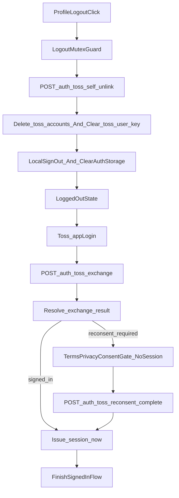

# TOSS UNLINK 재로그인 시뮬레이션 계획서

> **서비스 개요:** 토스 미니앱 + 일반 웹을 함께 운영하는 React/TypeScript 기반 주식 유틸리티 서비스  
> **문서 목적:** 토스 반려 사유를 해결하기 위한 리팩토링 전에, 현재 문제를 구조적으로 정리하고 **시뮬레이션 통과 기준**을 먼저 고정합니다.  
> **현재 상태:** 이 문서는 **문서화 전용**입니다. 승인 전까지 `App.tsx`, `components/**`, `services/**`, `hooks/**`, `server/**` 실제 구현 수정은 금지합니다.  
> **범위 고정:** 본 문서는 사용자가 선택한 **`unlink_only`** 기준을 따릅니다. 즉, **미니앱 로그아웃 시 UNLINK 동등 처리**를 목표로 하되, **서비스 계정/포트폴리오 데이터는 유지**합니다.

---

## 0. 문서 상태 및 성공 조건

### 0.1 배경

토스 반려 사유와 질의 응답을 종합하면, 이번 작업의 핵심 요구사항은 아래 두 가지입니다.

1. **미니앱 내부 로그아웃도 연결 끊기(UNLINK)와 같은 수준으로 처리**되어야 합니다.
2. **연결을 끊고 다시 로그인할 때 약관 동의가 다시 노출**되어야 합니다.

즉, 현재의 "로컬 세션만 종료하는 로그아웃"으로는 부족하며, 반대로 **WITHDRAWAL 수준의 계정 삭제**까지 가는 것도 범위 초과입니다.

### 0.2 이번 계획서의 성공 조건

- 로그아웃 시 **서버 매핑(`toss_accounts`)** 과 **프로필의 `toss_user_key`** 가 제거되는 설계를 문서로 고정합니다.
- 재로그인 시 **`appLogin()` 후 약관 재동의가 필요한지 판별하는 신호**를 서버 기준으로 설계합니다.
- 약관 재동의가 끝나기 전까지는 **로그인 완료 플로우를 닫지 않는 구조**를 시뮬레이션으로 증명합니다.
- 스니펫은 **11대 Core Rules** 를 위반하지 않아야 하며, **오버코딩 여부**를 별도로 검토합니다.
- 구현 착수 전 팀이 읽고 그대로 따라갈 수 있도록 **파일 경로, 계약, 시나리오, 실패 케이스**를 한 문서에 모읍니다.

### 0.3 비목표

- `WITHDRAWAL_TERMS`, `WITHDRAWAL_TOSS` 수준의 회원 탈퇴/포트폴리오 삭제는 이번 범위가 아닙니다.
- 신규 전역 상태관리 라이브러리, XState, 폼 라이브러리, 인증 프레임워크 교체는 하지 않습니다.
- 토스 로그인 전체 구조를 새로 짜지 않습니다. **기존 `appLogin()` + BFF exchange 구조를 유지**합니다.
- 로컬 스토리지 임시 플래그만으로 재동의를 강제하는 취약한 설계는 채택하지 않습니다.

### 0.4 외부 리뷰 반영 및 Hallucination 검증

이번 문서는 다른 AI 리뷰 제안을 그대로 수용하지 않고, **토스 문서 + 현재 레포 구현 상태** 기준으로 검증한 뒤 반영합니다.

- **수용:** self-unlink에서 `user_profiles` update와 `toss_accounts` delete를 분리하면 원자성 문제가 생길 수 있다는 지적
- **수용:** `localStorage.removeItem(...)` 예외가 전체 로그아웃을 취소시키지 않도록 격리해야 한다는 지적
- **수용:** 재동의 확인 액션에도 별도 mutex가 필요하다는 지적
- **수용:** 재동의 전 세션을 먼저 발급하면 F5/취소/앱 재시작으로 게이트 우회가 가능하다는 지적
- **조건부 수용:** 세션 누수 방지용 전역 Guard는 유효하지만, **1차 방어선이 아니라 보조 방어선**으로 둡니다.
- **수정 수용:** `request.user?.id`는 현재 서버에 존재하는 Fastify 계약이 아닙니다. 현재 서버는 `payment.ts`처럼 **`Authorization: Bearer ...` → `supabaseAdmin.auth.getUser(token)`** 패턴으로 인증합니다.
- **수정 수용:** `rpc_toss_self_unlink`는 현재 레포에 존재하지 않습니다. 따라서 문서에서는 이를 **신규 마이그레이션 산출물**로만 제안하며, 이미 있는 API처럼 서술하지 않습니다.
- **수정 수용:** `syncUserProfileClientFactsSafe()`의 실제 반환형은 `result.success`가 아니라 **`ServiceResult`의 `ok`** 기반입니다.
- **불수용:** `openAuthCompletion('login')` 예시는 현재 `AuthCompletionKind` 계약에 없는 값이라 그대로 채택하지 않습니다.
- **불수용:** `copy.validation.networkError`는 현재 auth 메시지 계약에 없습니다. 문서 스니펫은 **현재 존재하는 메시지 키 또는 공통 토스트 경로**만 사용합니다.
- **토스 문서 정합:** 토스 문서상 **연결 끊기 콜백은 서비스 내부에서 자체 처리한 unlink에는 자동 호출되지 않을 수 있으므로**, 미니앱 로그아웃용 self-unlink는 **토스 공식 콜백 대체가 아니라 우리 서비스 내부 정리 API**로 정의합니다.

---

## 1. 현재 상태(As-Is) 스냅샷

### 1.1 현재 로그아웃은 "로컬 세션 정리" 중심입니다

현재 `App.tsx`의 로그아웃은 Supabase 세션 종료, 로컬 인증 저장소 삭제, React 상태 초기화, 그리고 새로고침만 수행합니다.

```ts
// App.tsx (발췌)
onLogout={async () => {
  try {
    const { error } = await supabase.auth.signOut();
    if (error) {
      console.error('Logout error:', error);
    }

    clearAuthStorage();
    setUser(null);
    setUserProfile(null);
    setPortfolios([]);
    setShouldShowSignedInWelcome(false);
    setAuthModal(null);

    if (typeof window !== 'undefined') {
      window.location.reload();
    }
  } catch (err) {
    console.error('Unexpected logout error:', err);
    clearAuthStorage();
    setUser(null);
    setUserProfile(null);
    setPortfolios([]);
    setShouldShowSignedInWelcome(false);
    setAuthModal(null);
    if (typeof window !== 'undefined') {
      window.location.reload();
    }
  }
}}
```

이 흐름의 문제는 다음과 같습니다.

- 토스 연동 매핑을 서버에서 끊지 않습니다.
- `user_profiles.toss_user_key`가 남습니다.
- `toss_accounts` 매핑이 남습니다.
- 결과적으로 토스 심사 관점에서는 **"연결 해제 후에도 유저 데이터가 남아있음"** 으로 해석될 수 있습니다.

### 1.2 현재 토스 재로그인은 `appLogin()` 후 바로 세션을 발급합니다

```ts
// services/toss/tossAuth.ts (발췌)
export async function loginWithToss(): Promise<TossAuthResult> {
  if (!isTossApp()) {
    return { success: false, error: '토스 앱 환경이 아닙니다.' };
  }

  const loginCallResult = await wrapBridgeCall<unknown>(
    () => appLogin(),
    null,
    { action: 'appLogin' },
  );

  if (!loginCallResult.ok) {
    const message = normalizeErrorMessage(
      loginCallResult.error.cause,
      '토스 로그인 요청 실패',
    );
    return { success: false, error: message };
  }

  const decodedAppLogin = decodeAppLoginResponse(loginCallResult.data);
  if (decodedAppLogin == null) {
    return { success: false, error: '토스 인증 코드를 받지 못했습니다.' };
  }

  const exchangeResult = await fetchJsonWithTimeout<null>(
    `${BFF_URL.replace(/\/+$/, '')}/auth/toss/exchange`,
    {
      method: 'POST',
      headers: { 'Content-Type': 'application/json' },
      body: JSON.stringify({
        authorizationCode: decodedAppLogin.authorizationCode,
        referrer: decodedAppLogin.referrer,
      }),
    },
    null,
    { context: { action: 'toss_exchange' } },
  );
  // ...
}
```

현재 구조에는 **"이 사용자는 방금 UNLINK 되었으니 약관을 다시 보여줘야 한다"** 는 서버 신호가 없습니다. 따라서 `appLogin()`이 성공하면 거의 곧바로 기존 사용자 세션이 복구됩니다.

### 1.3 현재 서버의 UNLINK는 "연동만 해제"합니다

```ts
// server/src/toss/tossDisconnectHandler.ts (발췌)
async function handleUnlink(
  userKey: string,
  log: RequestLogger,
): Promise<TossDisconnectResult> {
  const authUserId = await resolveAuthUserIdByTossUserKey(userKey, log);

  if (!authUserId) {
    log.info({ userKey }, 'UNLINK noop: no toss_accounts row');
    return { action: 'noop' };
  }

  const { error: profileUpdateError } = await supabaseAdmin
    .from('user_profiles')
    .update({ toss_user_key: null })
    .eq('id', authUserId);

  if (profileUpdateError) {
    throw new TossDisconnectError(
      'Failed to clear toss_user_key on user profile',
      TOSS_DISCONNECT_ERROR_CODES.PROFILE_UPDATE_FAILED,
    );
  }

  const { error: mappingDeleteError } = await supabaseAdmin
    .from('toss_accounts')
    .delete()
    .eq('toss_user_key', userKey);

  if (mappingDeleteError) {
    throw new TossDisconnectError(
      'Failed to delete toss_accounts mapping row',
      TOSS_DISCONNECT_ERROR_CODES.MAPPING_DELETE_FAILED,
    );
  }

  return {
    action: 'unlinked',
    authUserId,
  };
}
```

이 자체는 나쁘지 않지만, **앱 내부 로그아웃**이 이 경로를 타지 않는다는 점이 현재 가장 큰 간극입니다.

### 1.4 현재 재로그인은 기존 계정을 쉽게 다시 붙입니다

```ts
// server/src/toss/AuthService.ts (발췌)
let authUserId: string | null = mapping?.auth_user_id ?? null;

if (authUserId) {
  await upsertUserProfileForToss(authUserId, tossUserKey, log);
  const session = await signInSupabaseUser(email, password, log);
  return session;
}

const existingAuthUser = await findAuthUserByEmail(email, log);

if (existingAuthUser?.id) {
  authUserId = existingAuthUser.id;
  await upsertTossAccount(tossUserKey, authUserId, log);
  await upsertUserProfileForToss(authUserId, tossUserKey, log);

  const session = await signInSupabaseUser(email, password, log);
  return session;
}
```

이 로직 때문에 UNLINK로 매핑이 삭제되어도, 다시 로그인하면 **같은 계정을 다시 찾아 연결**할 수 있습니다.  
계정/포트폴리오를 유지해야 한다는 점에서는 장점이지만, **재동의 강제 신호가 없으면 반려 사유를 해소하지 못합니다.**

### 1.5 기존 동의 동기화는 로컬 임시 저장에 의존합니다

`hooks/useAuthProfileSync.ts`는 `btd_pending_consent`를 읽어 프로필에 동의 정보를 반영합니다.  
하지만 이 구조는 **"UNLINK 후 재로그인이라서 재동의가 필요하다"** 는 서버 상태를 표현하지 못합니다.

---

## 2. 반려 사유 기준 문제 매트릭스

| 반려/요구사항 | 현재 동작 | 문제점 | 최소 수정 원칙 |
|---|---|---|---|
| 미니앱 로그아웃도 연결 끊기 수준으로 처리 | 로컬 세션/상태만 정리 | 서버 매핑과 `toss_user_key`가 남음 | 인증된 self-unlink API를 추가하고 UNLINK와 동등하게 정리 |
| 연결 해제 후 재로그인 시 약관 노출 | `appLogin()` 후 곧바로 세션 복구 | 재동의가 필요하다는 신호가 없고, 세션이 먼저 생기면 게이트 우회가 가능 | 재동의 전에는 세션을 발급하지 않는 2단계 로그인으로 변경 |
| 유저 데이터가 남아있음 | 계정/포트폴리오 외 연동 식별자도 남을 수 있음 | 심사 기준상 "끊김"으로 보이지 않음 | `toss_accounts` 삭제 + `user_profiles.toss_user_key` null |
| 다시 로그인은 `appLogin()`으로 처리 | 이미 그렇게 구현됨 | 로그인 자체는 맞지만, 현재 `loginWithToss()`가 `setSession()`까지 수행함 | `appLogin()`은 유지하되 재동의 필요 시 **session 미발급 응답**으로 분기 |

---

## 3. 목표 아키텍처(To-Be)

### 3.1 핵심 원칙

1. **로그아웃은 두 단계**여야 합니다.  
   `서버 UNLINK 동등 처리` 후 `로컬 인증/상태 정리` 순서로 닫습니다.

2. **재로그인은 그대로 `appLogin()`을 사용**합니다.  
   다만 재동의가 필요하면 exchange 단계에서 **세션을 발급하지 않고**, 재동의 완료 후 최종 세션을 발급해야 합니다.

3. **재동의가 필요한 사용자는 로그인 직후 대시보드에 진입시키지 않습니다.**  
   더 나아가 **재동의 완료 전에는 브라우저에 유효한 Supabase 세션이 존재해서도 안 됩니다.**

4. **계정/포트폴리오는 유지**합니다.  
   따라서 WITHDRAWAL 로직은 건드리지 않습니다.

### 3.2 권장 흐름



### 3.3 이번 문서가 채택하는 최소 침습 설계

오버코딩을 피하기 위해, 이번 문서는 아래 선택지를 채택합니다.

- **채택:** 기존 `toss_accounts`, `user_profiles.toss_user_key`, `terms_consent_at`, `privacy_consent_at`를 재사용합니다.
- **채택:** 기존 `appLogin()` + `/auth/toss/exchange` 구조를 유지합니다.
- **채택:** 기존 `syncUserProfileClientFactsSafe()` 계열을 재사용해 재동의 완료 시각을 반영합니다.
- **채택:** self-unlink 인증은 현재 서버와 동일하게 **Bearer token 검증(`supabaseAdmin.auth.getUser`)** 패턴을 사용합니다.
- **채택:** self-unlink의 DB 쓰기는 **신규 RPC 마이그레이션 또는 동등한 원자적 메커니즘**을 우선안으로 둡니다.
- **채택:** 재동의 필요 시 `/auth/toss/exchange`는 **세션 대신 pending token**만 반환하는 2단계 계약을 사용합니다.
- **채택:** 전역 Guard는 방어 보강용으로 두되, **세션 미선발급 구조를 대체하지 않습니다.**
- **보류:** 신규 전역 auth machine 도입
- **보류:** 신규 동의 전용 테이블 도입
- **보류:** 재동의 필요 여부를 localStorage만으로 추적하는 방식

### 3.4 재동의 판정 방식

이번 계획서의 기본안은 **서버 기준 판정**입니다.

- self-unlink 시:
  - `user_profiles.toss_user_key = null`
  - `toss_accounts` 매핑 삭제
  - `terms_consent_at = null`
  - `privacy_consent_at = null`
- 다음 `/auth/toss/exchange` 시:
  - 기존 계정이 다시 연결되더라도,
  - 프로필의 동의 타임스탬프가 비어 있으면 **세션 대신 `pendingAuthToken` + `status: 'reconsent_required'`** 를 반환합니다.

이 방식의 장점은 다음과 같습니다.

- 별도 스키마 추가 없이 현재 모델로 표현 가능합니다.
- 기기 변경, localStorage 삭제, WebView 재시작과 무관하게 일관됩니다.
- "다시 로그인하면 약관 동의가 다시 보여야 한다"는 심사 요구와 직접 연결됩니다.
- F5, 앱 재시작, 재동의 모달 취소로도 **세션 우회 진입이 불가능**합니다.

주의할 점도 있습니다.

- 서비스 전체 약관 타임스탬프를 비운다는 점에서 의미가 강합니다.
- 만약 법무/정책상 기존 동의 이력 보존이 필요하다면, **전용 `requires_toss_reconsent` 필드**가 대안이 될 수 있습니다.
- 다만 그 대안은 이번 단계에서는 **오버코딩 후보**로 분류하고, 우선순위에서 제외합니다.

---

## 4. 시뮬레이션 스니펫

이 절의 스니펫은 **실제 코드가 아니라 설계 검증용**입니다.  
다만 그대로 구현해도 무리가 없도록 **Core Rules 11개**를 전부 반영한 형태로 작성합니다.

### 4.1 클라이언트 로그아웃 오케스트레이터 스니펫

목표:

- 비동기 중복 클릭 방지
- 서버 self-unlink 먼저 수행
- 실패 시 사용자에게 명확한 오류 제공
- 성공 후 로컬 세션/상태 정리
- `btd_pending_consent` 같은 임시 동의 캐시도 같이 폐기

```ts
// simulation: services/toss/executeTossMiniAppLogout.ts
import { supabase, clearAuthStorage } from '../supabase';
import { fetchJsonWithTimeout } from '../serviceUtils';

const PENDING_CONSENT_STORAGE_KEY = 'btd_pending_consent';

interface LogoutCopy {
  logoutFailed: string;
  networkError: string;
}

interface ExecuteTossMiniAppLogoutArgs {
  bffUrl: string;
  accessToken: string;
  copy: LogoutCopy;
  isExecutingRef: { current: boolean };
  onClearUserState: () => void;
}

interface ExecuteTossMiniAppLogoutResult {
  ok: boolean;
  error?: string;
}

function safeClearPendingConsentStorage(): void {
  if (typeof window === 'undefined') {
    return;
  }

  try {
    window.localStorage.removeItem(PENDING_CONSENT_STORAGE_KEY);
  } catch (error: unknown) {
    console.warn('[TossLogout] Failed to clear pending consent storage', error);
  }
}

async function finalizeLocalLogout(onClearUserState: () => void): Promise<void> {
  try {
    await Promise.resolve(supabase.auth.signOut({ scope: 'local' }));
  } catch (error: unknown) {
    // 서버 unlink가 끝난 뒤에는 local signOut 실패가 React 상태 정리까지 막으면 안 됩니다.
    console.warn('[TossLogout] Local signOut failed, fallback cleanup continues', error);
  }

  clearAuthStorage();
  safeClearPendingConsentStorage();
  onClearUserState();
}

export async function executeTossMiniAppLogout(
  args: ExecuteTossMiniAppLogoutArgs,
): Promise<ExecuteTossMiniAppLogoutResult> {
  const trimmedBffUrl = args.bffUrl.trim();
  const trimmedToken = args.accessToken.trim();

  if (args.isExecutingRef.current) {
    return { ok: false, error: args.copy.logoutFailed };
  }

  if (trimmedBffUrl.length === 0 || trimmedToken.length === 0) {
    return { ok: false, error: args.copy.logoutFailed };
  }

  args.isExecutingRef.current = true;

  try {
    const unlinkResult = await fetchJsonWithTimeout<{ action: 'unlinked' | 'noop' }>(
      `${trimmedBffUrl.replace(/\/+$/, '')}/auth/toss/self-unlink`,
      {
        method: 'POST',
        headers: {
          'Content-Type': 'application/json',
          Authorization: `Bearer ${trimmedToken}`,
        },
      },
      null,
      { context: { action: 'toss_self_unlink' } },
    );

    if (!unlinkResult.ok) {
      return {
        ok: false,
        error: args.copy.networkError,
      };
    }

    await finalizeLocalLogout(args.onClearUserState);
    return { ok: true };
  } catch (error: unknown) {
    console.error('[TossLogout] Critical failure during logout sequence', error);
    return {
      ok: false,
      error: args.copy.logoutFailed,
    };
  } finally {
    args.isExecutingRef.current = false;
  }
}
```

#### Rule Check

- **Rule 6 / SRP:** 로그아웃 UI와 네트워크/세션 정리를 분리했습니다.
- **Rule 11 / Mutex:** `isExecutingRef`로 중복 요청을 차단합니다.
- **Rule 11 / Async Safety:** 서버 unlink 성공 후 localStorage 예외나 local signOut 예외가 상태 정리까지 막지 않도록 격리했습니다.
- **Rule 3 / I18N:** 문자열은 `copy`로만 주입받습니다.
- **Rule 7 / TS:** `any`와 non-null assertion을 사용하지 않습니다.

#### Overcoding Check

- 새 훅/전역 store를 만들지 않았습니다.
- 기존 `fetchJsonWithTimeout`, `clearAuthStorage`, `supabase.auth.signOut()`를 재사용합니다.
- 함수 하나가 하나의 책임만 갖습니다.

### 4.2 서버 self-unlink API 스니펫

목표:

- 토스 콜백과 별개로, **인증된 현재 사용자 본인만** self-unlink 호출 가능
- 기존 UNLINK와 동등한 정리 효과
- 재동의 강제를 위해 동의 타임스탬프를 비움
- 멱등성 유지

```ts
// simulation: server/src/routes/tossSelfUnlinkRoute.ts
import type { FastifyInstance } from 'fastify';
import { supabaseAdmin } from '../supabaseClient';
import type { RequestLogger } from '../toss/logger';

const SELF_UNLINK_RESPONSE = {
  UNLINKED: 'unlinked',
  NOOP: 'noop',
} as const;

const SELF_UNLINK_ERROR_CODE = {
  UNAUTHORIZED: 'UNAUTHORIZED',
  UNLINK_TRANSACTION_FAILED: 'UNLINK_TRANSACTION_FAILED',
} as const;

type SelfUnlinkAction =
  (typeof SELF_UNLINK_RESPONSE)[keyof typeof SELF_UNLINK_RESPONSE];

async function unlinkByAuthUserIdAtomic(
  authUserId: string,
  log: RequestLogger,
): Promise<SelfUnlinkAction> {
  const trimmedUserId = authUserId.trim();
  if (trimmedUserId.length === 0) {
    return SELF_UNLINK_RESPONSE.NOOP;
  }

  const { data: profile, error: profileError } = await supabaseAdmin
    .from('user_profiles')
    .select('toss_user_key')
    .eq('id', trimmedUserId)
    .maybeSingle();

  if (profileError) {
    throw profileError;
  }

  const tossUserKey = (profile?.toss_user_key ?? '').trim();
  if (tossUserKey.length === 0) {
    return SELF_UNLINK_RESPONSE.NOOP;
  }

  const { error: rpcError } = await supabaseAdmin.rpc('rpc_toss_self_unlink', {
    target_user_id: trimmedUserId,
  });

  if (rpcError) {
    log.error({ authUserId: trimmedUserId, rpcError }, 'RPC self-unlink failed');
    throw rpcError;
  }

  return SELF_UNLINK_RESPONSE.UNLINKED;
}

export async function tossSelfUnlinkRoutes(fastify: FastifyInstance): Promise<void> {
  fastify.post('/auth/toss/self-unlink', async (request, reply) => {
    const authHeader = request.headers.authorization;
    const accessToken = authHeader?.replace(/^\s*Bearer\s+/i, '').trim() ?? '';

    if (accessToken.length === 0) {
      return reply.code(401).send({
        error: 'Missing Authorization header',
        errorCode: SELF_UNLINK_ERROR_CODE.UNAUTHORIZED,
        requestId: request.correlationId,
      });
    }

    const {
      data: { user },
      error: authError,
    } = await supabaseAdmin.auth.getUser(accessToken);

    if (authError != null || user == null) {
      return reply.code(401).send({
        error: 'Invalid or expired token',
        errorCode: SELF_UNLINK_ERROR_CODE.UNAUTHORIZED,
        requestId: request.correlationId,
      });
    }

    try {
      const action = await unlinkByAuthUserIdAtomic(user.id, request.log);
      return reply.send({ action, requestId: request.correlationId });
    } catch (error: unknown) {
      request.log.error({ error, authUserId: user.id }, 'Self-unlink transaction failed');
      return reply.code(500).send({
        error: 'Failed to process self-unlink',
        errorCode: SELF_UNLINK_ERROR_CODE.UNLINK_TRANSACTION_FAILED,
        requestId: request.correlationId,
      });
    }
  });
}
```

```sql
-- simulation: supabase/migrations/20260408_rpc_toss_self_unlink.sql
create or replace function public.rpc_toss_self_unlink(target_user_id uuid)
returns void
language plpgsql
security definer
as $$
begin
  update public.user_profiles
  set
    toss_user_key = null,
    terms_consent_at = null,
    privacy_consent_at = null
  where id = target_user_id;

  delete from public.toss_accounts
  where auth_user_id = target_user_id;
end;
$$;
```

#### Rule Check

- **Rule 6 / Guard Clause:** Authorization 없음, 인증 실패, `toss_user_key` 없음은 곧바로 닫습니다.
- **Rule 7 / Exhaustive TS:** 반환 상태를 제한된 literal union으로 유지합니다.
- **Rule 11 / 멱등성:** 이미 unlink 된 사용자도 `noop`으로 안전하게 처리합니다.
- **Rule 5 / DRY:** 현재 서버의 Bearer 인증 패턴을 재사용하고, 쓰기 원자성은 DB 레벨 RPC로 위임합니다.

#### Overcoding Check

- `request.user` 같은 신규 서버 추상화를 가정하지 않았습니다.
- 신규 RPC는 **반드시 새 마이그레이션 산출물로 추가**되어야 하며, 현재 존재하는 API처럼 취급하지 않습니다.
- `WITHDRAWAL` 경로와 섞지 않습니다.
- 필요 시 기존 `handleUnlink`를 내부 helper로 더 추출해 재사용할 수 있지만, 문서 단계에서는 **공통 helper 추출 + RPC 도입**만 제안하고 **새 추상화 층 증설**은 제안하지 않습니다.

### 4.3 exchange 응답을 2단계 로그인 계약으로 바꾸는 스니펫

목표:

- `appLogin()`은 유지
- 재동의가 필요하면 **세션을 아직 발급하지 않음**
- 클라이언트가 F5/취소로 우회할 수 없도록 **pending token 기반 2단계 계약**을 사용

```ts
// simulation: server/src/toss/AuthService.ts
interface TossSignedInResult {
  status: 'signed_in';
  access_token: string;
  refresh_token: string;
  user: {
    id: string;
    email: string;
  };
}

interface TossReconsentRequiredResult {
  status: 'reconsent_required';
  pendingAuthToken: string;
  user: {
    id: string;
    email: string;
  };
}

type TossExchangeResult = TossSignedInResult | TossReconsentRequiredResult;

function shouldRequireReconsent(profile: {
  terms_consent_at?: string | null;
  privacy_consent_at?: string | null;
} | null): boolean {
  const termsConsentAt = (profile?.terms_consent_at ?? '').trim();
  const privacyConsentAt = (profile?.privacy_consent_at ?? '').trim();
  return termsConsentAt.length === 0 || privacyConsentAt.length === 0;
}
```

```ts
// simulation: server/src/routes/tossAuthRoute.ts
const exchangeResult = await ensureSessionForTossUserKey(loginMeResult.userKey, log);

return reply.send({
  ...exchangeResult,
});
```

#### Rule Check

- **Rule 6:** 판정 로직을 pure function으로 분리했습니다.
- **Rule 7:** 명시적 타입 계약을 가집니다.
- **Rule 5:** 클라이언트가 추측하지 않고 서버가 진실 공급원(SSOT)이 됩니다.
- **Rule 11:** 재동의가 필요한 경우 세션을 먼저 만들지 않아 우회 경로를 원천 차단합니다.

#### Overcoding Check

- 기존 exchange 엔드포인트는 유지합니다.
- 다만 `requiresReconsent: boolean`만 추가하는 방식은 세션 누수를 막지 못하므로 채택하지 않습니다.
- 새로 추가되는 것은 **pending token을 실어주는 응답 union**과 **재동의 완료용 후속 엔드포인트**뿐입니다.

### 4.4 클라이언트 재동의 게이트 스니펫

목표:

- `appLogin()`은 유지
- 재동의가 필요할 때는 **세션이 없는 대기 상태**를 유지
- 취소 시 단순 UI 닫기가 아니라 pending 상태 자체를 폐기
- 기존 동의 동기화 서비스 재사용

```tsx
// simulation: components/auth/TossReconsentGate.tsx
interface TossReconsentGateProps {
  isOpen: boolean;
  lang: AppLang;
  onConfirm: () => void;
  onCancel: () => void;
  termsConsent: boolean;
  privacyConsent: boolean;
  setTermsConsent: (nextValue: boolean) => void;
  setPrivacyConsent: (nextValue: boolean) => void;
}

export function TossReconsentGate({
  isOpen,
  lang,
  onConfirm,
  onCancel,
  termsConsent,
  privacyConsent,
  setTermsConsent,
  setPrivacyConsent,
}: TossReconsentGateProps): React.ReactElement | null {
  const copy = getAuthModalMessages(lang);

  if (!isOpen) {
    return null;
  }

  return (
    <ConsentSheet
      title={copy.signup.title}
      confirmLabel={copy.action.continue}
      cancelLabel={copy.profile.cancelDelete}
      termsConsent={termsConsent}
      privacyConsent={privacyConsent}
      onConfirm={onConfirm}
      onCancel={onCancel}
      onTermsConsentChange={setTermsConsent}
      onPrivacyConsentChange={setPrivacyConsent}
    />
  );
}
```

```ts
// simulation: components/auth/AuthModalCoordinator.tsx
if (signedInResult.status === 'reconsent_required') {
  setPendingSignedInUser(signedInResult.user);
  setPendingTossAuthToken(signedInResult.pendingAuthToken);
  setShowTossReconsentGate(true);
  return;
}

await Promise.resolve(onCommitSignedIn(signedInResult.user));
await Promise.resolve(
  onFinishSignedInFlow(signedInResult.user, {
    shouldShowWelcome,
  }),
);
```

```ts
const handleCancelTossReconsent = useCallback((): void => {
  setPendingSignedInUser(null);
  setPendingTossAuthToken(null);
  setShowTossReconsentGate(false);
  setTermsConsent(false);
  setPrivacyConsent(false);
  onSwitchType('login');
}, [onSwitchType]);
```

재동의 확정 시에는 기존 `syncUserProfileClientFactsSafe()` 또는 동등 helper로 동의 시각을 반영한 뒤, **그 다음에만** 세션 발급용 finalize endpoint를 호출합니다.

```ts
const isSubmittingReconsentRef = useRef(false);

const handleConfirmTossReconsent = useCallback(async (): Promise<void> => {
  if (isSubmittingReconsentRef.current) {
    return;
  }

  if (
    !termsConsent ||
    !privacyConsent ||
    pendingSignedInUser == null ||
    pendingTossAuthToken == null
  ) {
    return;
  }

  isSubmittingReconsentRef.current = true;

  try {
    const consentTimestamp = new Date().toISOString();
    const syncResult = await syncUserProfileClientFactsSafe({
      userId: pendingSignedInUser.id,
      profileTimezone,
      detectedTimezone,
      pendingConsent: {
        terms_consent_at: consentTimestamp,
        privacy_consent_at: consentTimestamp,
      },
    });

    if (!syncResult.ok) {
      showErrorToast(copy.profile.logoutFailed);
      return;
    }

    const finalizeResult = await fetchJsonWithTimeout<{
      access_token: string;
      refresh_token: string;
      user: { id: string; email: string };
    }>(
      `${trimmedBffUrl.replace(/\/+$/, '')}/auth/toss/reconsent/complete`,
      {
        method: 'POST',
        headers: {
          'Content-Type': 'application/json',
        },
        body: JSON.stringify({
          pendingAuthToken: pendingTossAuthToken,
        }),
      },
      null,
      { context: { action: 'toss_reconsent_complete' } },
    );

    if (!finalizeResult.ok) {
      showErrorToast(copy.profile.logoutFailed);
      return;
    }

    const finalizedSession = finalizeResult.data;
    await Promise.resolve(
      supabase.auth.setSession({
        access_token: finalizedSession.access_token,
        refresh_token: finalizedSession.refresh_token,
      }),
    );

    await Promise.resolve(onCommitSignedIn(pendingSignedInUser));
    await Promise.resolve(
      onFinishSignedInFlow(pendingSignedInUser, {
        shouldShowWelcome,
      }),
    );
    setPendingSignedInUser(null);
    setPendingTossAuthToken(null);
    setShowTossReconsentGate(false);
  } finally {
    isSubmittingReconsentRef.current = false;
  }
}, [
  copy.profile.logoutFailed,
  detectedTimezone,
  onCommitSignedIn,
  onFinishSignedInFlow,
  pendingSignedInUser,
  pendingTossAuthToken,
  privacyConsent,
  profileTimezone,
  shouldShowWelcome,
  termsConsent,
]);
```

#### Rule Check

- **Rule 2:** 중첩 삼항 없이 명시적 게이트로 분리했습니다.
- **Rule 3:** 문구는 기존 메시지 SSOT에서 가져옵니다.
- **Rule 5 / SRP:** 로그인 실행과 재동의 UI를 분리합니다.
- **Rule 11 / Mutex:** 재동의 확인 액션에도 별도 1-click lock을 둡니다.
- **Rule 6 / Failure Recovery:** sync 실패와 finalize 실패에 모두 명시적 토스트와 early return을 둡니다.
- **Rule 4 / A11y:** 실제 구현 시 재사용 컴포넌트가 접근성 규칙을 유지해야 합니다.

#### Overcoding Check

- 기존 signup 동의 UI 패턴과 메시지를 재사용할 수 있습니다.
- 재동의 전용 전역 모달 시스템을 새로 만들지 않습니다.
- 서버 신호가 있을 때만 게이트를 띄우므로 무분별한 상태 추가를 피합니다.
- 취소 시 local signOut이 필요하지 않은 이유는 **애초에 세션을 발급하지 않았기 때문**입니다.

### 4.5 전역 우회 방지 Guard 스니펫

목표:

- 주 방어선은 아니지만, 예기치 않은 세션 복원이나 과거 데이터 꼬임을 추가로 차단
- 다만 이를 위해 현재 프로필 타입과 조회 필드를 보강해야 함

```ts
// simulation: hooks/useAuth.ts
useEffect(() => {
  if (user == null || userProfile == null) {
    return;
  }

  const termsConsentAt = (userProfile.terms_consent_at ?? '').trim();
  const privacyConsentAt = (userProfile.privacy_consent_at ?? '').trim();

  if (termsConsentAt.length > 0 && privacyConsentAt.length > 0) {
    return;
  }

  void Promise.resolve(supabase.auth.signOut({ scope: 'local' }))
    .catch((error: unknown) => {
      console.warn('[AuthGuard] Failed to revoke orphaned session', error);
    })
    .finally(() => {
      clearAuthStorage();
      setUser(null);
      setUserProfile(null);
      setAuthModal('login');
    });
}, [setAuthModal, setUser, setUserProfile, user, userProfile]);
```

```ts
// simulation: types/appUserProfile.ts
export interface AppUserProfile {
  // ...
  terms_consent_at?: string | null;
  privacy_consent_at?: string | null;
}
```

```ts
// simulation: services/authProfileService.ts
const PROFILE_SELECT_FIELDS =
  'subscription_tier, max_portfolios, max_alarms, subscription_status, subscription_expires_at, pending_plan, pending_plan_effective_at, telegram_enabled, telegram_connected_at, telegram_last_error, preferred_language, timezone, ai_daily_usage, ai_monthly_usage, backtest_daily_usage, last_usage_reset_at, terms_consent_at, privacy_consent_at';
```

이 Guard는 **세션 누수의 1차 해결책이 아니라, 2단계 로그인 설계가 깨졌을 때를 감지하는 최후의 안전망**으로만 사용합니다.

---

## 5. Mental Compile

이 절은 "스니펫만 봐도 설계가 모순되지 않는지"를 확인하기 위한 체크입니다.

### 5.1 타입 관점

- exchange 응답이 `signed_in | reconsent_required` union으로 닫혀 있어야 합니다.
- 로그아웃 self-unlink API 응답은 `'unlinked' | 'noop'`만 허용해야 합니다.
- `AuthModalCoordinator` 또는 동등 controller는 "로그인 성공했지만 아직 완료하면 안 되는 상태"를 표현할 수 있어야 합니다.
- `rpc_toss_self_unlink`는 현재 코드베이스에 없는 신규 산출물이므로, **마이그레이션 문서/파일 없이는 구현 착수 불가**로 간주합니다.
- 전역 Guard를 쓰려면 `AppUserProfile`과 `PROFILE_SELECT_FIELDS`에 `terms_consent_at`, `privacy_consent_at`가 실제로 포함되어야 합니다.

### 5.2 상태 전이 관점

- 로그아웃 버튼 클릭
  - 중복 클릭 차단
  - self-unlink 호출
  - 로컬 세션 정리
  - 사용자 상태 제거
  - 로그인 모달/초기 상태 복귀
- 재로그인
  - `appLogin()` 실행
  - BFF exchange
  - `signed_in | reconsent_required` 판정
  - `reconsent_required`면 **세션 없는 게이트 상태** 유지
  - 동의 저장 + finalize 성공 후에만 setSession
  - 그 이후에만 signed-in flow 종료

### 5.3 실패 관점

- self-unlink 실패 시:
  - local signOut를 먼저 실행하면 안 됩니다.
  - 이유: 서버 매핑이 남은 상태에서 로컬만 종료되면 다시 반려 기준을 만족하지 못할 수 있습니다.
- exchange가 `reconsent_required`를 반환했는데 이미 세션이 발급되었다면:
  - 설계 실패로 간주해야 합니다.
  - 이유: F5/취소/재시작으로 우회 진입이 가능합니다.
- reconsent 저장 실패 시:
  - 로그인 완료로 넘기면 안 됩니다.
  - 이유: 약관 재동의 요구를 무력화하게 됩니다.
- reconsent 게이트 취소 시:
  - pending token과 UI 상태는 즉시 폐기되어야 합니다.
  - 이유: 취소 후 재개 가능한 half-auth 상태를 남기면 추론 비용과 결함 가능성이 커집니다.
- `window.location.reload()`는 즉시 유지하지 않습니다.
  - 이유: 비동기 정리 완료 전에 새로고침하면 경쟁 상태가 생길 수 있습니다.

### 5.4 보안 관점

- self-unlink는 토스 콜백용 Basic Auth와 별도입니다.
- self-unlink는 **사용자 인증 기반**이어야 하며, 임의의 `auth_user_id`를 body로 받지 않아야 합니다.
- 클라이언트는 자기 세션으로만 자기 unlink를 수행해야 합니다.
- 현재 서버에는 `request.user` 주입 계약이 없으므로, self-unlink 설계는 기존 `payment.ts`와 같은 **Bearer token 검증 경로**를 따라야 합니다.

### 5.5 원자성 관점

- self-unlink는 `user_profiles`와 `toss_accounts`를 나눠 쓰는 2-step 쿼리로 끝내면 안 됩니다.
- split write를 유지하려면 명시적 보상 트랜잭션/복구 전략이 필요하므로, 본 문서는 **RPC 기반 원자 처리**를 우선안으로 채택합니다.
- RPC를 택할 경우, 신규 SQL 마이그레이션 파일도 시뮬레이션 산출물로 함께 리뷰해야 합니다.

### 5.6 세션 누수 관점

- 재동의가 필요한 사용자는 **브라우저 저장소에 Supabase 세션이 없어야** 합니다.
- `loginWithToss()`가 exchange 직후 곧바로 `supabase.auth.setSession()`을 호출하는 현재 구조는 재동의 요구와 충돌합니다.
- 따라서 실제 구현 시 `services/toss/tossAuth.ts`도 2단계 결과 타입을 이해하도록 시뮬레이션을 갱신해야 합니다.

---

## 6. 시뮬레이션 테스트 매트릭스

### 6.1 필수 시나리오

| 시나리오 | 기대 결과 | 통과 기준 |
|---|---|---|
| 미니앱 로그아웃 클릭 | self-unlink 후 로컬 세션 종료 | `toss_accounts` 제거, `toss_user_key` null |
| 로그아웃 직후 재진입 | `appLogin()` 후 재동의 게이트 노출 | 대시보드 즉시 진입 금지 |
| 재동의 체크 없이 계속 시도 | 진행 차단 | 약관/개인정보 둘 다 체크 전에는 완료 불가 |
| 재동의 완료 | 기존 계정/포트폴리오 유지한 채 로그인 완료 | 환영 플로우 또는 정상 진입 |
| 중복 로그아웃 클릭 | 한 번만 수행 | 중복 API 호출 방지 |
| 네트워크 실패(self-unlink) | 사용자에게 오류 표시 | 로컬만 먼저 지워지지 않음 |

### 6.2 검증 쿼리/관찰 포인트

구현 전 문서 단계에서 아래 관찰 포인트를 고정합니다.

| 구분 | 관찰 항목 | 기대 상태 | 실패 신호 |
|---|---|---|---|
| 서버 DB | `user_profiles.toss_user_key` | 로그아웃 직후 `null` | 값이 남아 있음 |
| 서버 DB | `user_profiles.terms_consent_at` | self-unlink 직후 `null` | 이전 동의 시각 유지 |
| 서버 DB | `user_profiles.privacy_consent_at` | self-unlink 직후 `null` | 이전 동의 시각 유지 |
| 서버 DB | `toss_accounts.auth_user_id` | 대상 사용자 매핑 행 삭제 | 기존 매핑 행이 남아 있음 |
| 클라이언트 저장소 | `btd_pending_consent` | 로그아웃 직후 제거 | 이전 캐시가 남아 있음 |
| 클라이언트 저장소 | Supabase auth session | 재동의 필요 상태에서는 비어 있음 | access/refresh token이 먼저 저장됨 |
| 클라이언트 상태 | `user`, `userProfile`, `portfolios` | 로그아웃 직후 초기화 | 일부 상태가 남아 있음 |
| 인증 상태 | Supabase 세션 | 로그아웃 직후 local session 종료 | 세션이 재사용됨 |
| 로그인 상태 | exchange 결과 상태 | unlink 후 첫 재로그인에서 `reconsent_required` | `signed_in`으로 바로 내려옴 |
| UI 상태 | 재동의 게이트 노출 여부 | 대시보드보다 먼저 노출 | 곧바로 signed-in 완료 |
| UI 상태 | 재동의 완료 후 상태 전이 | 정상 로그인 완료 | 게이트에 고착 또는 중복 완료 |

### 6.3 시뮬레이션 리뷰 체크포인트

아래 체크포인트는 코드 구현 전, 문서와 스니펫만으로 먼저 검토해야 하는 항목입니다.

#### 6.3.1 클라이언트 레이어

- 로그아웃 버튼 클릭 시 **서버 self-unlink 이전에** `clearAuthStorage()` 또는 `window.location.reload()`가 실행되지 않는지 확인합니다.
- 로그아웃 경로가 기존 `onLogout` 인라인 구현과 새 오케스트레이터로 **이중 분산**되지 않는지 확인합니다.
- `isExecutingRef` 또는 동등 뮤텍스가 **성공/실패/예외 모든 경로에서 해제**되는지 확인합니다.
- 재동의 게이트가 `type === 'signup'` 같은 기존 회원가입 분기와 섞이지 않고, **토스 재로그인 전용 상태**로 분리되는지 확인합니다.
- `reconsent_required` 상태일 때 `supabase.auth.setSession()`이 조기 호출되지 않는지 확인합니다.
- `reconsent_required` 상태일 때 `onCommitSignedIn`, `onFinishSignedInFlow`가 조기 호출되지 않는지 확인합니다.
- `btd_pending_consent`가 기존 OAuth 회원가입 플로우와 토스 재동의 플로우에서 **의미 충돌**을 일으키지 않는지 확인합니다.

#### 6.3.2 서버 레이어

- self-unlink API가 **현재 인증된 사용자 기준**으로만 동작하고, body/query로 `auth_user_id`를 직접 받지 않는지 확인합니다.
- self-unlink 설계가 현재 서버에 없는 `request.user`를 당연시하지 않고, 실제 구현 중인 **Bearer token → `supabaseAdmin.auth.getUser()`** 경로를 따르는지 확인합니다.
- self-unlink 로직이 `WITHDRAWAL`과 섞여 **포트폴리오 삭제**까지 수행하지 않는지 확인합니다.
- self-unlink 후 재로그인 시 `ensureSessionForTossUserKey`가 **기존 계정을 다시 연결**하더라도, `reconsent_required` 분기가 유지되도록 판정 순서가 맞는지 확인합니다.
- 재동의 필요 판정이 **DB 상태 기반**인지 확인합니다. 로컬 스토리지나 클라이언트 파라미터에 의존하면 안 됩니다.
- `noop` 경로가 존재해 중복 요청 또는 이미 unlink 된 상태에서도 **500 없이 안전 종료**되는지 확인합니다.
- self-unlink의 DB 쓰기가 **RPC 또는 동등한 원자적 메커니즘**으로 묶여 있는지 확인합니다.
- reconsent complete endpoint가 pending token 없이 세션을 발급하지 않는지 확인합니다.

#### 6.3.3 계약/타입 레이어

- `/auth/toss/exchange` 응답 타입이 `signed_in | reconsent_required` union으로 닫혀 있고, 이를 소비하는 클라이언트 타입이 함께 업데이트되는지 확인합니다.
- `'unlinked' | 'noop'` 같은 상태값이 문자열 하드코딩으로 여기저기 흩어지지 않고, **한 곳의 literal union/상수**로 유지되는지 확인합니다.
- "로그인 성공했지만 아직 완료 전" 상태를 표현하는 타입이 모호한 `boolean` 남발 대신, **명확한 상태 이름**을 갖는지 확인합니다.

#### 6.3.4 UX / 심사 대응 레이어

- unlink 후 첫 재로그인에서 사용자가 반드시 **약관 UI를 인지**할 수 있는지 확인합니다.
- 재동의를 거부하거나 닫았을 때, 로그인된 대시보드로 우회 진입하지 않는지 확인합니다.
- self-unlink 실패 시 사용자에게 **토스트 또는 통일된 에러 UI**가 노출되는지 확인합니다.
- 재동의 완료 후에는 불필요하게 같은 게이트가 **반복 노출**되지 않는지 확인합니다.
- 재동의 확인 버튼 더블 클릭 시 중복 저장/중복 완료가 발생하지 않는지 확인합니다.
- F5, 앱 재실행, WebView 복원 후에도 재동의 전 세션 우회 진입이 발생하지 않는지 확인합니다.

### 6.4 네거티브 케이스 리뷰 체크포인트

아래는 시뮬레이션 승인 전에 반드시 머릿속으로 통과시켜야 하는 실패 시나리오입니다.

| 실패 케이스 | 반드시 확인할 질문 | 승인 기준 |
|---|---|---|
| self-unlink API 401/403 | 로컬 로그아웃만 먼저 진행되지는 않는가 | 서버 정리 실패 시 로그인 상태 유지 또는 명시적 실패 처리 |
| self-unlink API 500 | 매핑 절반만 지워진 뒤 종료될 가능성은 없는가 | 최소한 재시도 가능한 상태와 관찰 가능한 로그를 남김 |
| `appLogin()` 취소 | 이전 `reconsent_required` 대기 상태가 잘못 남지 않는가 | 재진입 시 깨끗한 로그인 시작점 유지 |
| exchange가 재동의 필요 응답 반환 | 세션이 먼저 저장되지 않는가 | 브라우저 저장소에 Supabase 세션 없음 |
| 재동의 저장 실패 | 대시보드로 들어가 버리지 않는가 | 재동의 게이트 유지, signed-in 완료 차단 |
| 재동의 UI 닫기 | pending token 또는 세션이 남지 않는가 | 취소 시 pending 상태 폐기, 우회 불가 |
| 중복 탭/빠른 연타 | self-unlink / reconsent sync가 두 번 실행되지 않는가 | 한 번만 실행되거나 idempotent |
| localStorage 접근 예외 | 임시 캐시 정리 실패가 로그아웃 전체를 막지 않는가 | 상태 정리와 로그아웃 성공은 계속 진행 |
| F5 / 앱 재시작 | 재동의 전 세션 복구로 메인 진입하지 않는가 | 2단계 계약 + 전역 Guard로 차단 |
| 새로고침 타이밍 개입 | 중간 상태로 꼬이지 않는가 | reload 제거 또는 완료 후로 지연 |

### 6.5 리뷰 승인 질문

시뮬레이션 리뷰어는 아래 질문에 모두 `예`라고 답할 수 있어야 합니다.

1. 미니앱 로그아웃이 이제 "로컬 로그아웃"이 아니라 **서버 UNLINK 동등 처리 + 로컬 정리**로 재정의되어 있습니까?
2. self-unlink가 **WITHDRAWAL과 혼동되지 않도록** 데이터 삭제 범위가 명확히 닫혀 있습니까?
3. 재로그인 후 약관 재동의 여부를 **서버가 결정**하고 있습니까?
4. 재동의가 필요한 경우, **세션이 발급되지 않은 상태**에서만 UI 게이트가 열립니까?
5. 실패 케이스에서 사용자가 **침묵 상태**에 빠지지 않고, 다음 행동이 가능한 UX로 닫힙니까?
6. self-unlink 인증 설계가 **현재 서버 구현과 동일한 Bearer 검증 패턴**을 따르고 있습니까?
7. 신규 RPC가 필요하다면, 그것이 **새 마이그레이션 산출물**로 명시되어 있습니까?
8. 전역 Guard는 보조 방어선일 뿐, **주 방어선이 세션 미선발급 구조**라는 점이 유지되고 있습니까?
9. 이번 설계가 신규 전역 상태, 신규 테이블, 대규모 auth 재설계 없이도 요구사항을 충족합니까?

### 6.6 시뮬레이션 합격 기준

아래를 모두 만족해야 실제 구현에 착수합니다.

1. 로그아웃 이후 서버 상태가 **UNLINK와 동일 효과**를 갖습니다.
2. 다음 로그인에서 **약관 재동의가 구조적으로 강제**됩니다.
3. 재동의 필요 상태에서는 **브라우저에 세션이 먼저 발급되지 않습니다.**
4. F5, 취소, 앱 재시작으로도 재동의 우회 진입이 불가능합니다.
5. 계정/포트폴리오는 유지됩니다.
6. 클라이언트/서버 모두 Core Rules 위반 포인트가 없습니다.
7. 실패 케이스에서 조용히 빠져나가는 silent failure 경로가 없습니다.
8. 설계가 기존 구조를 과도하게 갈아엎지 않습니다.

---

## 7. 오버코딩 검토

### 7.1 채택하는 최소안

- 기존 `appLogin()` 유지
- 기존 `/auth/toss/exchange` 유지
- 기존 프로필 동의 컬럼 재사용
- 기존 auth/profile sync 재사용
- 기존 UNLINK 의미를 self-unlink API에 재사용

### 7.2 이번 단계에서 배제하는 안

1. **새 동의 이력 테이블 도입**
   - 장점은 있으나 이번 요구를 만족하는 최소안은 아닙니다.
   - 스키마/마이그레이션/백필까지 붙으면 과합니다.

2. **전역 auth state machine 도입**
   - 로그인/재동의/로그아웃 상태를 엄밀하게 다룰 수 있으나, 현재 반려 대응 범위에 비해 큽니다.

3. **localStorage 플래그 기반 재동의 강제**
   - 기기 변경, 캐시 삭제, WebView 재기동에 취약합니다.
   - 서버 진실 공급원 원칙에 어긋납니다.

4. **WITHDRAWAL 로직 재사용**
   - 계정/포트폴리오 유지 범위를 위반합니다.
   - 이번 문서의 범위 고정(`unlink_only`)과 충돌합니다.

5. **세션을 먼저 발급하고 UI 게이트만 띄우는 방식**
   - 취소, F5, 앱 재시작 시 세션 우회 진입이 가능합니다.
   - 이번 외부 리뷰에서 지적된 핵심 결함이며, 토스 심사 리스크가 커서 배제합니다.

### 7.3 유일한 남는 설계 판단

`terms_consent_at`, `privacy_consent_at`를 self-unlink 때 null로 만드는 선택은 의미가 강합니다.  
하지만 현재 요구사항을 가장 적은 변경으로 만족시키는 방법이며, 별도 flag를 두는 것보다 구현 위험과 드리프트가 작습니다.

따라서 이번 시뮬레이션의 **기본안은 기존 동의 컬럼 null 처리**로 고정합니다.  
단, 실제 구현 직전 법무/정책 확인에서 "동의 이력을 절대 덮어쓰면 안 된다"가 나오면 그때만 전용 flag 설계로 갈아탑니다.

---

## 8. 구현 착수 전 체크리스트

- [ ] `App.tsx` 인라인 로그아웃을 별도 오케스트레이터로 분리할지 확정
- [ ] `server/src/toss/tossDisconnectHandler.ts` 공통 helper 추출 여부 확정
- [ ] `/auth/toss/self-unlink` 인증 방식 확정
- [ ] self-unlink를 `request.user` 가정 없이 Bearer token 검증 패턴으로 구현할지 확정
- [ ] `/auth/toss/exchange`를 `signed_in | reconsent_required` 2단계 계약으로 바꿀지 확정
- [ ] `/auth/toss/reconsent/complete` 후속 finalize endpoint 계약 확정
- [ ] 재동의 게이트를 `AuthModalCoordinator` 내부에 둘지, 별도 뷰로 둘지 확정
- [ ] `services/toss/tossAuth.ts`의 `setSession()` 시점을 finalize 이후로 옮길지 확정
- [ ] `window.location.reload()` 제거 또는 지연 전략 확정
- [ ] `btd_pending_consent` 정리 위치 확정
- [ ] `rpc_toss_self_unlink` 신규 SQL 마이그레이션 작성 여부 확정
- [ ] `AppUserProfile` 및 `PROFILE_SELECT_FIELDS`에 동의 시각 필드를 포함할지 확정
- [ ] 메시지 키 추가 범위(`authMessages`, `commonMessages` 등) 확정

---

## 9. 최종 결론

현재 반려 사유의 본질은 **"로그아웃이 진짜 연결 끊기로 보이지 않고, 다시 로그인할 때 재동의도 보이지 않는다"** 는 점입니다.

이번 계획서는 이를 해결하기 위해 다음 한 줄로 요약됩니다.

**미니앱 로그아웃을 인증된 self-unlink + 로컬 세션 정리로 재정의하고, 다음 `appLogin()` 성공 뒤에는 서버가 `signed_in` 또는 `reconsent_required`를 결정하며, 재동의가 필요하면 세션 없이 게이트를 거친 뒤에만 최종 세션을 발급한다.**

이 설계는 아래 조건을 동시에 만족합니다.

- 토스 반려 사유에 직접 대응합니다.
- 서비스 계정/포트폴리오를 유지합니다.
- 현재 코드 구조를 최대한 재사용합니다.
- 11대 Core Rules를 위반하지 않습니다.
- 별도 대형 리플랫폼 없이 구현 가능합니다.

문서 시뮬레이션이 이 기준으로 승인되면, 그 다음 단계에서만 실제 코드 수정에 들어갑니다.
