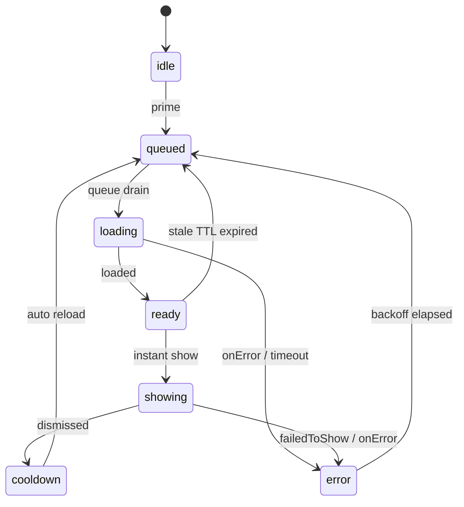

# Ad Preload Architecture

## 1. 문제 정의와 목표

현재 `App.tsx`는 `showInterstitialOnTransition()`을 사용해 저장 성공 직후 광고를 호출합니다. 하지만 현재 `services/ads/adService.ts`는 "클릭 또는 저장 완료 시점에 load + show를 한 번에 수행"하는 구조라서, 사용자가 `새 포트폴리오 저장`, `알람 저장`, `매수 저장` 같은 액션을 누른 뒤 광고 네트워크 응답을 기다리게 됩니다.

이 구조는 토스 공식 문서의 권장 흐름과 맞지 않습니다. 공식 문서 기준 핵심 원칙은 다음과 같습니다.

- 광고는 **표시 전에 미리 로드**해야 합니다.
- 흐름은 반드시 **`load -> show -> 다음 load`** 여야 합니다.
- **한 번에 하나의 광고만 로드**할 수 있습니다.
- **버튼 클릭 시 load를 시작하는 구조는 나쁜 예시**로 명시되어 있습니다.

즉, 지금 문제의 본질은 "광고 SDK가 느리다"가 아니라, **광고 호출 시점과 광고 노출 시점이 분리되지 않은 아키텍처**입니다.

### Delay Zero 목표

본 설계의 목표는 아래 네 가지입니다.

1. **사용자 클릭 시 네트워크 대기 0ms**
   - 클릭 시점에는 절대 광고 load를 시작하지 않습니다.
   - 클릭 시점에는 오직 `READY` 상태 광고만 즉시 show 하거나, 준비되지 않았다면 즉시 skip 합니다.

2. **비즈니스 액션 지연 0**
   - 저장/닫기/전환 액션은 광고 준비 상태와 무관하게 즉시 완료됩니다.
   - 광고는 "전환 직후 보여줄 수 있으면 보여주고, 아니면 그냥 지나간다"가 기본 정책입니다.

3. **토스 공식 API 정렬**
   - 신규 설계는 `@apps-in-toss/web-framework`의 최신 통합 광고 API인 `loadFullScreenAd` / `showFullScreenAd`를 기준으로 합니다.
   - 기존의 deprecated 경로 또는 추측 API에 의존하지 않습니다.

4. **Global 관리 + 관측 가능성**
   - 광고 상태는 각 화면/모달이 아니라 전역 매니저가 단일 소스로 관리합니다.
   - preload 성공률, show 성공률, skip 사유, 네트워크 실패를 모두 구조화 로그로 남깁니다.

---

## 2. 현재 구조의 핵심 결함

### 2.1 클릭 시점 load

현재 서비스는 `showInterstitialOnTransition()` 안에서 load와 show를 연속 실행합니다. 이 방식은 preload가 아니라 **on-demand network fetch** 입니다. 따라서 광고 fill, SDK 초기화, 네트워크 RTT가 모두 사용자 대기 시간으로 전가됩니다.

### 2.2 placement key와 adGroupId의 혼합

현재 `services/ads/adPlacements.ts`는 여러 logical placement가 하나의 문자열 값으로 수렴합니다.

- `INTERSTITIAL_STRATEGY_SAVE`
- `INTERSTITIAL_TRADE_SAVE`
- `INTERSTITIAL_ALARM_SAVE`
- `INTERSTITIAL_SETTLEMENT_DETAIL`

이 네 개가 모두 동일한 `INTERSTITIAL_AD_GROUP_ID` 값을 가집니다.

이 자체는 광고 콘솔 측 구성으로는 가능하지만, preload 상태 관점에서는 치명적입니다. 이유는 다음과 같습니다.

- preload 캐시 키는 "광고 그룹 ID"가 아니라 **"언제 어떤 UX에서 쓸 placement인지"** 를 기준으로 추적해야 합니다.
- 쿨타임, preload 우선순위, show rate, skip rate, 실패율은 logical placement마다 달라야 합니다.
- 하나의 문자열 값만 쓰면 `strategy_save`와 `settlement_detail`이 동일 슬롯으로 합쳐져 **정책 충돌**이 발생합니다.

따라서 새 설계에서는 아래 두 축을 반드시 분리합니다.

- `placementKey`: 논리적 placement 식별자
- `adGroupId`: 토스 콘솔에서 발급받은 실제 광고 그룹 ID

---

## 3. 제안 아키텍처

### 3.1 상위 구조

전역 구조는 아래 두 레이어로 나눕니다.

1. **`GlobalAdManager`**
   - Singleton service
   - preload queue, slot state machine, retry/backoff, auto reload를 담당
   - React에 의존하지 않음

2. **`AdPreloadProvider`**
   - React Context wrapper
   - `GlobalAdManager` snapshot을 구독해 UI에 전달
   - 실제 실행 함수는 state가 아니라 manager 인스턴스가 보유

이렇게 분리하는 이유는 다음과 같습니다.

- 광고는 앱 전역 자원이라 로컬 컴포넌트 state로 관리하면 재마운트 시 preload가 끊깁니다.
- React state에는 UI snapshot만 두고, 실제 `load()`/`show()` 실행 함수와 unregister는 manager 내부 필드로 유지해야 stale closure와 action/state 혼합을 막을 수 있습니다.

### 3.2 Slot 상태 머신

각 logical placement는 독립 slot을 가집니다.

| 상태 | 의미 | UI/행동 |
|---|---|---|
| `idle` | 아직 아무 작업 없음 | preload 후보 |
| `queued` | 전역 load queue 대기 중 | 클릭 시 즉시 skip |
| `loading` | SDK preload 진행 중 | 클릭 시 즉시 skip |
| `ready` | show 가능한 광고 보유 | 클릭 시 즉시 show |
| `showing` | 현재 표시 중 | 중복 show 금지 |
| `cooldown` | 노출 직후 짧은 안정화 구간 | 자동 reload 예약 |
| `error` | 마지막 preload 또는 show 실패 | backoff 후 자동 재시도 |
| `disabled` | 지원 환경 아님, tier 제외, 정책상 사용 안 함 | 항상 bypass |

### 3.3 전역 Queue

토스 공식 문서에는 "**한 번에 하나의 광고만 로드할 수 있다**"고 명시되어 있습니다. 따라서 매니저는 placement별 독립 load를 허용하지 않고, 반드시 **전역 FIFO queue 하나**로 직렬화합니다.

이 원칙을 어기면 아래 문제가 생깁니다.

- 여러 화면 진입 시 동시 preload 경쟁
- 특정 placement가 계속 재시도하면서 다른 placement preload 기아 발생
- SDK 내부 `one-load-at-a-time` 제약과 충돌

따라서 매니저는 다음 불변식을 유지합니다.

- 동시에 `loading` 상태인 slot은 최대 1개
- `showing` 중에는 동일 slot preload 금지
- 동일 slot에 대한 중복 `prime()` 요청은 dedupe

---

## 4. Global Ad Manager 상태 관리 전략

### 4.1 UI snapshot과 action ref 분리

React Context에 직접 callback을 state로 저장하지 않습니다. 대신 manager 내부에 아래를 유지합니다.

- `slots: Map<placementKey, AdSlotRuntime>`
- `loadQueue: placementKey[]`
- `isQueueDraining`
- `activeLoadPlacementKey`
- `retryTimerId`
- `cooldownTimerId`
- `show mutex`

React에는 아래 snapshot만 흘립니다.

- `phase`
- `readyAtMs`
- `lastLoadStartedAtMs`
- `lastLoadSucceededAtMs`
- `lastShowCompletedAtMs`
- `consecutiveFailures`
- `nextRetryAtMs`
- `lastResultCode`
- `lastErrorMessage`

### 4.2 tier와 정책 분기

광고 eligibility는 logical placement마다 config로 선언합니다.

예시:

- `INTERSTITIAL_STRATEGY_SAVE`: free만 허용
- `INTERSTITIAL_TRADE_SAVE`: free만 허용
- `INTERSTITIAL_ALARM_SAVE`: free만 허용
- `INTERSTITIAL_SETTLEMENT_DETAIL`: free만 허용

이 정책을 manager 바깥 호출부에서 `if (tier === 'free')`로 흩뿌리면 DRY가 깨집니다. eligibility는 slot config로 고정해야 합니다.

### 4.3 READY TTL

광고가 오래 전에 preload된 경우 stale 가능성이 있습니다. 따라서 `ready` 상태도 무기한 신뢰하지 말고 TTL을 둡니다.

권장:

- `MAX_READY_AGE_MS` 내에서는 즉시 show
- TTL 초과 시 즉시 show하지 않고 stale 처리
- stale 처리 시 사용자 액션은 막지 않고, background preload만 다시 시작

이 규칙이 필요한 이유는 "준비된 것처럼 보이지만 실제 show에서는 실패"하는 상태를 줄이기 위해서입니다.

---

## 5. Pre-load / Instant Show / Auto Reload Lifecycle

### 5.1 Pre-load 트리거

아래 시점만 허용합니다.

1. 앱 부트스트랩 직후
2. 대시보드 진입 직후
3. 저장/전환이 자주 발생하는 화면 진입 직후
4. 이전 광고가 `dismissed` 또는 `failedToShow`로 종료된 직후
5. 앱 foreground 복귀 직후

### 5.2 Instant Show 규칙

클릭 시점에는 아래 규칙만 허용합니다.

1. slot이 `ready`이고 TTL 유효하면 즉시 `show`
2. 아니면 즉시 `skipped_not_ready`
3. skip이어도 비즈니스 액션은 그대로 진행
4. skip된 slot은 background에서 `prime()` 재호출

즉, 클릭 시점에 `await loadFullScreenAd(...)`는 절대 금지입니다.

### 5.3 Auto Reload

`show` 종료 후에는 다음 사이클을 위해 자동 reload를 예약합니다.

- `dismissed`: 정상 종료 -> `cooldown -> queued -> loading`
- `failedToShow`: 오류 종료 -> `error -> backoff -> queued -> loading`
- `load error`: `error -> backoff -> queued -> loading`

권장 흐름은 공식 문서 그대로 **`load -> show -> load -> show`** 입니다.

### 5.4 Mermaid 상태도

---

## 6. 네트워크 실패 시 Fallback 및 Error Handling 전략

### 6.1 기본 정책

Interstitial의 기본 실패 정책은 **`proceed`** 입니다.

- 광고 준비 실패가 저장 실패가 되어서는 안 됩니다.
- 광고 준비 실패는 비즈니스 실패가 아니라 수익 기회 손실입니다.
- 따라서 저장/전환 액션은 항상 우선 완료됩니다.

### 6.2 오류 분류

아래 정도로 result code를 고정합니다.

- `skipped_unsupported`
- `skipped_ineligible_tier`
- `skipped_not_ready`
- `skipped_stale_ready`
- `skipped_show_in_progress`
- `load_timeout`
- `load_error`
- `failed_to_show`
- `show_error`
- `shown`

이 코드는 UI 문구가 아니라 telemetry용 식별자입니다.

### 6.3 Retry / Backoff

무한 재시도는 금지합니다. 권장 규칙은 다음과 같습니다.

- 첫 실패: `BASE_RETRY_DELAY_MS`
- 이후 실패: 지수 backoff
- 최대 지수는 clamp
- foreground 복귀 시 backoff 만료 여부를 다시 검사

예시:

`nextRetryAtMs = now + BASE_RETRY_DELAY_MS * 2 ^ min(failureCount - 1, MAX_BACKOFF_EXPONENT)`

이 backoff는 "SDK나 네트워크가 죽은 상태에서 앱 전체가 광고 load 루프로 CPU를 태우는 것"을 막기 위한 보호 장치입니다.

### 6.4 사용자 피드백

Interstitial은 사용자 자발 액션이 아니므로, preload 실패 시 매번 토스트를 띄우지 않습니다. 대신 아래만 수행합니다.

- 구조화 로그 기록
- analytics 카운트
- background retry 예약

반면 reward는 자발적 시청이므로, 별도 UX 정책이 필요합니다. 본 문서는 interstitial preload가 범위입니다.

### 6.5 장애 허용

아래 상황에서도 White Screen 없이 진행되어야 합니다.

- 토스 앱 버전 미지원
- 광고 그룹 ID 오설정
- 네트워크 오프라인
- `loaded` 이벤트 미도착
- `failedToShow`
- preload는 됐지만 TTL 만료

모든 경우의 공통 원칙은 동일합니다.

- 비즈니스 액션은 계속 진행
- slot 상태는 명시적으로 갱신
- 다음 preload 기회는 유지

---

## 7. 권장 마이그레이션 순서

1. `services/ads/` 아래에 `placementKey`와 `adGroupId`를 분리한 신규 config 도입
2. `GlobalAdManager`와 `TossIntegratedAdBridge` 추가
3. `AdPreloadProvider`를 `App.tsx` 루트에 연결
4. `showInterstitialOnTransition()` 호출부를 직접 SDK 호출에서 `manager.showInstant(key)` 래퍼로 교체
5. dashboard/landing 진입 시 `prime()` 또는 `primeScreen()` 호출
6. `dismissed` 후 auto reload 계측 추가
7. analytics/logging 대시보드 연결

---

## 8. 구현 원칙 요약

- 클릭 시점 load 금지
- logical placement key와 adGroupId 분리
- 전역 queue로 단일 load 직렬화
- manager는 singleton, React는 snapshot만 구독
- interstitial 실패는 항상 safe bypass
- 최신 공식 API `loadFullScreenAd` / `showFullScreenAd`만 사용

---

## 9. 첨부 스니펫

실행 가능한 예시 스니펫은 `docs2/ad-preload-simulation-snippets.ts`에 정리했습니다.

- `TossIntegratedFullScreenAdBridge`: 토스 공식 API 어댑터
- `GlobalAdManager`: singleton preload manager
- `VirtualFullScreenAdBridge`: 실패/성공 시나리오를 재현하는 시뮬레이션 어댑터
- `runVirtualAdSimulation()`: 가상 시뮬레이션 진입점
