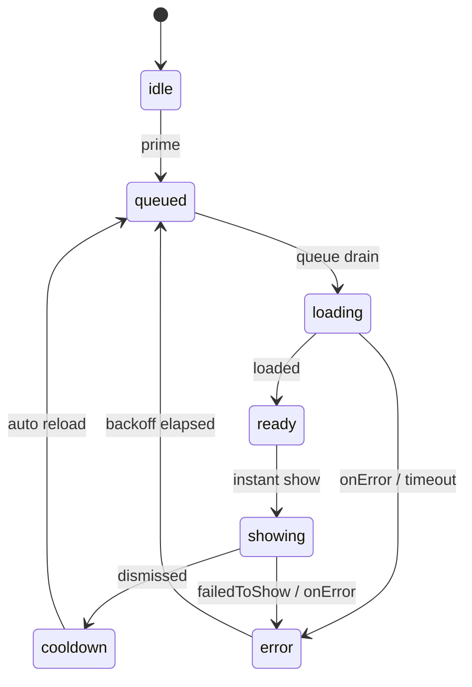

# Ad Preload Architecture

## 1. 문제 정의와 목표

현재 `App.tsx`는 `showInterstitialOnTransition()`을 사용해 저장 성공 직후 광고를 호출합니다. 하지만 현재 `services/ads/adService.ts`는 "클릭 또는 저장 완료 시점에 load + show를 한 번에 수행"하는 구조라서, 사용자가 `새 포트폴리오 저장`, `알람 저장`, `매수 저장` 같은 액션을 누른 뒤 광고 네트워크 응답을 기다리게 됩니다.

이 구조는 토스 공식 문서의 권장 흐름과 맞지 않습니다. 공식 문서 기준 핵심 원칙은 다음과 같습니다.

- 광고는 **표시 전에 미리 로드**해야 합니다.
- 흐름은 반드시 **`load -> show -> 다음 load`** 여야 합니다.
- **한 번에 하나의 광고만 로드**할 수 있습니다.
- **버튼 클릭 시 load를 시작하는 구조는 나쁜 예시**로 명시되어 있습니다.

즉, 지금 문제의 본질은 "광고 SDK가 느리다"가 아니라, **광고 호출 시점과 광고 노출 시점이 분리되지 않은 아키텍처**입니다.

### Delay Zero 목표

본 설계의 목표는 아래 네 가지입니다.

1. **사용자 클릭 시 네트워크 대기 0ms**
   - 클릭 시점에는 절대 광고 load를 시작하지 않습니다.
   - 클릭 시점에는 오직 `READY` 상태 광고만 즉시 show 하거나, 준비되지 않았다면 즉시 skip 합니다.

2. **비즈니스 액션 지연 0**
   - 저장/닫기/전환 액션은 광고 준비 상태와 무관하게 즉시 완료됩니다.
   - 광고는 "전환 직후 보여줄 수 있으면 보여주고, 아니면 그냥 지나간다"가 기본 정책입니다.

3. **토스 공식 API 정렬 (일괄 전환)**
   - `@apps-in-toss/web-framework` 통합 API **`loadFullScreenAd` / `showFullScreenAd`**만 사용한다. ([IntegratedAd.html](https://developers-apps-in-toss.toss.im/bedrock/reference/framework/%EA%B4%91%EA%B3%A0/IntegratedAd.html))
   - 마이그레이션 시 기존 `services/ads/adService.ts`의 **`loadAppsInTossAdMob` / `showAppsInTossAdMob` 전면 경로는 제거**한다. 레거시와 신규 전면 파이프라인을 **병행하지 않는다** (§7).

4. **Global 관리 (단일 SSOT)**
   - 광고 상태는 각 화면/모달이 아니라 전역 매니저가 단일 소스로 관리합니다.
   - **데이터 로깅·Telemetry·퍼널 대시보드는 당장 스킵**한다. preload/show 메트릭은 **후속 페이즈**에서 검토한다 (§7).

---

## 2. 현재 구조의 핵심 결함

### 2.1 클릭 시점 load

현재 서비스는 `showInterstitialOnTransition()` 안에서 load와 show를 연속 실행합니다. 이 방식은 preload가 아니라 **on-demand network fetch** 입니다. 따라서 광고 fill, SDK 초기화, 네트워크 RTT가 모두 사용자 대기 시간으로 전가됩니다.

### 2.2 placement key와 adGroupId의 혼합

현재 `services/ads/adPlacements.ts`는 여러 logical placement가 하나의 문자열 값으로 수렴합니다.

- `INTERSTITIAL_STRATEGY_SAVE`
- `INTERSTITIAL_TRADE_SAVE`
- `INTERSTITIAL_ALARM_SAVE`
- `INTERSTITIAL_SETTLEMENT_DETAIL`

이 네 개가 모두 동일한 `INTERSTITIAL_AD_GROUP_ID` 값을 가집니다.

이 자체는 광고 콘솔 측 구성으로는 가능하지만, preload 상태 관점에서는 치명적입니다. 이유는 다음과 같습니다.

- preload 캐시 키는 "광고 그룹 ID"가 아니라 **"언제 어떤 UX에서 쓸 placement인지"** 를 기준으로 추적해야 합니다.
- 쿨타임, preload 우선순위, show rate, skip rate, 실패율은 logical placement마다 달라야 합니다.
- 하나의 문자열 값만 쓰면 `strategy_save`와 `settlement_detail`이 동일 슬롯으로 합쳐져 **정책 충돌**이 발생합니다.

따라서 새 설계에서는 아래 두 축을 반드시 분리합니다.

- `placementKey`: 논리적 placement 식별자
- `adGroupId`: 토스 콘솔에서 발급받은 실제 광고 그룹 ID

### 2.3 공식 문서 정합성 (자체 대조 요약)

| 주제 | 근거 | 본 계획·스니펫 |
|------|------|----------------|
| `load` → `show`, 한 번에 하나, 클릭 시점에만 로드하는 나쁜 예 | IntegratedAd.html 사용 가이드 | 일치 (프리로드 + `showInstant`는 ready 시에만 show) |
| 전면형 **테스트용 ID** | [광고 개발하기 — 테스트하기](https://developers-apps-in-toss.toss.im/ads/develop.html), [이해하기 — 참고](https://developers-apps-in-toss.toss.im/ads/intro.html): **`ait-ad-test-interstitial-id`** | 스니펫 기본값으로 사용. **운영 ID로 로컬 테스트 금지** 문구 명시 |
| 샘플 코드의 다른 예시 ID | IntegratedAd.html 예제·FAQ에 `ait.dev.43daa14da3ae487b` 등장 | **정책 페이지(develop/intro)의 테스트 ID 목록을 우선**한다는 주석으로 정리 (문서 간 이원화) |
| 주기적 refresh 금지 | develop.html SSP 표 — “광고 영역을 주기적 refresh 처리” → 트래픽 조작 감지 시 제재 | **사용자 show 소진 전** `ready` 광고를 시간 TTL만으로 폐기·재요청하지 않음 (§4.3 참고) |
| 진입 직후 전면 금지 | develop.html UX — “서비스 진입 직후 전면 배너 금지” (No Deception) | 세션당 첫 전면 시도 생략(§4.4) 등 방어선 |
| 배경음·효과음 | [QA 진행하기](https://developers-apps-in-toss.toss.im/ads/qa.html) 체크리스트 | 전면 show 구간 **일시 정지 / 종료 후 재개** 훅(스니펫 `AppAudioManager`) |

---

## 3. 제안 아키텍처

### 3.1 상위 구조

전역 구조는 아래 두 레이어로 나눕니다.

1. **`GlobalAdManager`**
   - Singleton service
   - preload queue, slot state machine, retry/backoff, auto reload를 담당
   - React에 의존하지 않음
   - 전면 노출 시 앱 사운드 일시 정지/복구를 위해 **`AppAudioManager`(주입)** 를 받음 ([ads/qa.html](https://developers-apps-in-toss.toss.im/ads/qa.html) 권고)

2. **`AdPreloadProvider`** (참고 구현: `docs2/ad-preload-AdPreloadProvider.tsx`)

   #### Rule 2·10 준수: React 연동 (`AdPreloadProvider`)

   - React Context wrapper
   - **`useSyncExternalStore`** 로 `manager.subscribe` / `manager.getSnapshots` 를 연결합니다. 외부 스토어와 UI 스냅샷이 **동일 렌더에서 일치**하도록 하여 tearing·1-tick 불일치를 줄입니다. (`useState` + `useEffect` 구독 패턴은 스니펫에서 **제거** — Rule 6 dead code 금지.)
   - **`subscribe`와 `getSnapshot` 인자는 렌더마다 새 함수를 만들지 않습니다.** React는 `subscribe` **참조가 바뀔 때마다** 기존 구독을 끊고 다시 구독하므로, 인라인 화살표 함수는 **매 프레임 teardown/resubscribe 루프**를 유발합니다. **`useCallback(..., [manager])`** 로 참조를 고정합니다 (Rule 2·10).
   - `load`/`show`·unregister는 매니저·브리지 내부에만 둡니다.
   - **구독 티어는 매니저 SSOT:** `GlobalAdManagerOptions.initialTier` + **`manager.setCurrentTier(userTier)`**. `AdPreloadProvider`는 **`useLayoutEffect`에서 `setCurrentTier`만 호출**하고, **`showInstantAd`는 `manager.showInstant(key)`** 만 호출합니다 — tier를 인자로 넘기지 않습니다 (§3.3 티어·드레인 규칙).
   - 렌더 본문에서 ref/state를 **돌연변이하지 않습니다** (`setCurrentTier`·뮤텍스는 `useLayoutEffect` / 콜백 안에서만).
   - **`useCallback` dependency 배열에 `manager`를 포함**합니다. (Rule 6: 필수 의존성 누락 금지.)
   - **`subscribe`는 리스너를 등록 직후 즉시 호출하지 않는다.** `useSyncExternalStore`가 마운트 시 `getSnapshots`로 최초 스냅샷을 읽습니다. `getSnapshots()`의 **배열 참조 캐시**(Rule 10)는 매니저 책임이다.

   #### Rule 11 보강 (UI one-flight · **전역 락 최종 확정**)

   - `showInstantAd`는 **`useRef` 동기 뮤텍스(`isExecutingRef`)** 로 **앱 전역 단일 one-flight**를 강제합니다. **placement·키별 개별 락으로 바꾸지 않는다** (최종 규격).
   - **근거:** 토스 통합 광고 SDK는 **한 번에 하나의 로드** 등 전역 제약이 있고, 찰나의 순간 **서로 다른 두 전면 노출이 동시 트리거**되는 UX는 비정상적입니다. Provider 최상단에서 **전역으로 원천 차단**하는 것이 가장 안전한 방어입니다. 서로 다른 placement를 짧은 간격으로 연속 호출할 때 둘째가 `false`를 받는 것은 **의도된 동작**입니다.
   - 연속 클릭·1-tick 재진입(매니저 `isShowLocked` 갱신 전 중복 호출)도 동일 락으로 차단합니다. 재진입 시 `false`를 반환합니다.
   - `manager.showInstant(...)`는 **`await Promise.resolve(...)`** 로 감싸 동기 throw·비동기 rejection을 한 경로에서 처리합니다 (부록 B 하단).

   **`GlobalAdManager` 싱글턴 운영 (확정)**

   - `manager` 인스턴스는 **앱 최상단(또는 전역 DI 컨테이너)에서 단 한 번만** 생성되는 **싱글턴**으로 운영한다. 생성 옵션의 **`initialTier`는 첫 페인트 직전 `userTier`와 일치**시키고, 이후 티어 변경은 **`setCurrentTier`만**으로 반영한다.
   - **매 렌더마다 `new GlobalAdManager(...)`가 호출되는 상황은 운영 전제에서 제외**한다. 따라서 싱글턴 참조 안정성은 기본으로 보장된다.
   - **`dispose`는 인스턴스 메서드로 하위에 노출하지 않는다.** 파기는 **`GlobalAdManager.tearDownForAppRoot(manager)`** 같이 **루트 전용 정적 API**로만 수행한다. `AdPreloadProvider`·일반 화면의 `useEffect` cleanup에서 실수로 `dispose`를 호출하면 **전역 광고가 영구 마비**될 수 있다.
   - 위 `manager` deps 패턴은 **유지보수 규칙 준수·단위 테스트에서 mock 교체** 등을 위한 방어적 구현으로 유지한다.

이렇게 분리하는 이유는 다음과 같습니다.

- 광고는 앱 전역 자원이라 로컬 컴포넌트 state로 관리하면 재마운트 시 preload가 끊깁니다.
- React state에는 UI snapshot만 두고, 실제 `load()`/`show()` 실행 함수와 unregister는 manager 내부 필드로 유지해야 stale closure와 action/state 혼합을 막을 수 있습니다.

### 3.2 Slot 상태 머신

각 logical placement는 독립 slot을 가집니다.

| 상태 | 의미 | UI/행동 |
|---|---|---|
| `idle` | 아직 아무 작업 없음 | preload 후보 |
| `queued` | 전역 load queue 대기 중 | 클릭 시 즉시 skip |
| `loading` | SDK preload 진행 중 | 클릭 시 즉시 skip |
| `ready` | show 가능한 광고 보유 | 클릭 시 즉시 show |
| `showing` | 현재 표시 중 | 중복 show 금지 |
| `cooldown` | 노출 직후 짧은 안정화 구간 | 자동 reload 예약 |
| `error` | 마지막 preload 또는 show 실패 | backoff 후 자동 재시도 |
| `disabled` | 지원 환경 아님, tier 제외, 정책상 사용 안 함 | 항상 bypass |

### 3.3 전역 Queue

토스 공식 문서에는 "**한 번에 하나의 광고만 로드할 수 있다**"고 명시되어 있습니다. 따라서 매니저는 placement별 독립 load를 허용하지 않고, 반드시 **전역 FIFO queue 하나**로 직렬화합니다.

이 원칙을 어기면 아래 문제가 생깁니다.

- 여러 화면 진입 시 동시 preload 경쟁
- 특정 placement가 계속 재시도하면서 다른 placement preload 기아 발생
- SDK 내부 `one-load-at-a-time` 제약과 충돌

따라서 매니저는 다음 불변식을 유지합니다.

- 동시에 `loading` 상태인 slot은 최대 1개
- `showing` 중에는 동일 slot preload 금지
- 동일 slot에 대한 중복 `prime()` 요청은 dedupe

### Rule 6 준수: 구독 티어 단일 소스 (`initialTier` · `setCurrentTier`)

**티어를 `prime` / `drainLoadQueue` / `showInstant` 인자로 비동기 체인에 넘기면** (1) 이미 실행 중인 드레인 루프가 **시작 시점의 stale tier**로 `pickNextLoadableKey`를 평가해 **큐 항목이 잘못 드롭**되거나, (2) `scheduleRetry`·`schedulePostDismissReload`의 **`setTimeout` 클로저가 과거 tier를 캡처**해 백오프·쿨다운 후 **잘못된 eligibility**로 `prime`이 호출되는 레이스가 생긴다.

**확정:** `GlobalAdManagerOptions.initialTier`로 부트스트랩하고, 런타임 갱신은 **`setCurrentTier(tier)`** 만 사용한다. **`prime` / `primeRoute` / `showInstant` 및 내부 `drainLoadQueue`·`pickNextLoadableKey`·`loadQueuedPlacement`·재시도·쿨다운 콜백에서는 tier 매개변수를 두지 않고** `this.currentTier`만 읽는다. React 연동은 **`useLayoutEffect`에서 `manager.setCurrentTier(userTier)`** (부록 Rule 2).

### Rule 6 준수: Load 큐 소비 규칙 (유실 방지)

큐에서 다음 로드 후보를 고를 때 **`shift()`로 꺼낸 뒤 조건 불만족 시 `continue`만 하는 패턴은 금지**합니다. 잠금(`isLoadLocked` / `isShowLocked`) 또는 백오프(`nextRetryAtMs`) 때문에 당장 로드할 수 없는 항목은 **큐에 그대로 두고** 스캔만 이어갑니다. **첫 번째로 즉시 로드 가능한 키 하나만** 소비(반환)하고, 나머지 순서는 유지합니다. 정의/슬롯이 없거나 tier 상 영구적으로 무효한 항목은 **드롭**합니다.

**금지:** `for` 루프 안에서 **`splice` + 인덱스 되감기(`i -= 1`)** 로 원본 배열을 파괴하는 패턴. 대신 **`kept` 배열을 쌓고 `this.loadQueue = kept`로 한 번에 재할당**하거나, 동등한 **단일 패스·명시적 재구성**으로 구현합니다.

### Rule 1·6 준수: `drainLoadQueue` 비동기 재귀 금지

> *리뷰 표기의 Rule 1은 본 이슈에서 **자원·메모리 누적 방지** 의미로 쓰였다(`btdalarm.mdc` 금융 §1과 번호만 동일할 뿐 주제는 다를 수 있음). Rule 6은 제어 흐름 평탄화·안티패턴 제거에 해당한다.*

`loadQueuedPlacement`의 `finally`에서 **`await drainLoadQueue`를 재귀 호출**하면, 큐가 길거나 백오프가 겹칠 때 **Promise 체인이 꼬리에 꼬리를 물며** 자원을 잡아먹는 안티패턴이 될 수 있다.

**확정 구현:** `drainLoadQueue`는 **`isDrainingQueue`로 중복 진입을 막은 뒤**, **`while (true)`** 안에서 `pickNextLoadableKey` → `await loadQueuedPlacement`만 반복한다. `loadQueuedPlacement`의 `finally`에서는 **드레인을 재호출하지 않는다.** `prime()`이 `drainLoadQueue`를 또 호출하더라도 이미 드레인 중이면 즉시 반환하고, **현재 루프의 다음 이터레이션**이 이후에 enqueue된 키를 처리한다. **`prime`은 `void drainLoadQueue`로 두지 않는다** — 루프·런타임 예외 시 **Unhandled rejection**이 되므로 **`.catch`로 반드시 소비**한다 (Rule 6·11).

### Rule 6·엣지: `prime`과 쿨다운 타이머 (좀비 방지)

`cooldown` 구간에는 **`cooldownTimerId`** 로 자동 재큐잉이 예약될 수 있다. 라우트 이동 등으로 **`prime`이 수동 호출**되면 `clearRetryTimer`만 하고 **`clearCooldownTimer`를 빼먹으면**, 이미 `ready`/`loading`인 슬롯 위에 **뒤늦은 쿨다운 콜백**이 터져 phase를 덮어쓰거나 **중복 큐잉**을 유발하는 레이스가 난다. **`prime` 진입 시(재시도·쿨다운 타이머 모두) 둘 다 해제**한다 (스니펫 `GlobalAdManager.prime`).

### OCP·확장: `onDrainError` (선택 주입)

**`GlobalAdManagerOptions.onDrainError?: (error: unknown) => void`** — `prime` → `drainLoadQueue` 비동기 체인에서 잡힌 예외를 **외부로 보고할 플러그**다. **미주입 시 `console.error` 폴백**만 사용하고, 운영 루트에서는 Sentry `captureException`, Datadog RUM·로거, 사내 파이프라인 등을 **콜백으로만 연결**한다. 매니저 본문에 벤더 SDK를 직접 import하지 않아 **개방-폐쇄(OCP)** 를 지킨다. (§7에서 Telemetry·이벤트 일괄 전송은 **후속**으로 스킵하더라도, **이 훅은 선제적으로 열어** 재작업 없이 관측을 붙일 수 있다.)

### Rule 6 준수: `notify()` 리스너 순회

`Set`을 직접 순회하는 동안 리스너가 `unsubscribe`하여 **Set이 변이**되면 순회가 건너뛸 수 있다. **`Array.from(listeners)` 스냅샷** 후 순회한다.

---

## 4. Global Ad Manager 상태 관리 전략

### 4.1 UI snapshot과 action ref 분리

React Context에 직접 callback을 state로 저장하지 않습니다. 대신 manager 내부에 아래를 유지합니다.

- `slots: Map<placementKey, AdSlotRuntime>`
- `loadQueue: placementKey[]`
- `isDrainingQueue` (동시 `drainLoadQueue` 진입 방지)
- `retryTimerId`
- `cooldownTimerId`
- `show mutex`

React에는 아래 snapshot만 흘립니다.

- `phase`
- `readyAtMs`
- `lastLoadStartedAtMs`
- `lastLoadSucceededAtMs`
- `lastShowCompletedAtMs`
- `consecutiveFailures`
- `nextRetryAtMs`
- `lastResultCode`
- `lastErrorMessage`

### Rule 2·10 준수: 스냅샷·배열 참조 동일성 (Referential Equality)

`getSnapshot(key)` / `getSnapshots()`에서 슬롯 스냅샷을 **`{ ...slot.snapshot }`로 매번 감싸지 않는다.** `updateSnapshot`이 변경 시에만 `slot.snapshot` 객체를 **통째로 교체**하므로, **같은 슬롯·같은 단계**에서는 **동일 스냅샷 객체 참조**가 유지되어 하위 **`React.memo`** 가 의미 있게 동작한다.

**배열 참조:** `getSnapshots()`가 `Array.from(...).map(...)`만으로 매번 **새 배열**을 만들면, Context로 내려줄 때 **상태가 안 바뀌어도** 배열 참조만 달라져 구독 컴포넌트 전체가 리렌더된다. `GlobalAdManager`는 **`cachedSnapshotsReadonly`**(또는 동등한 이름)에 **공개용 읽기 전용 배열**을 캐시하고, **`updateSnapshot`에서 스냅샷을 바꾼 뒤 `notify` 전에 캐시를 무효화(`null`)**한다. **슬롯 집합이 변하지 않고 어떤 스냅샷도 교체되지 않은 구간**에서는 **`getSnapshots()`가 동일 배열 참조**를 반환한다. (UI는 스냅샷·배열을 **변이하지 않는다**고 가정한다.)

**`subscribe` 계약:** 구독 시 **즉시 `listener(snapshots)`를 호출하지 않는다.** React 연동은 **`useSyncExternalStore`** 가 마운트 시 `getSnapshots()`로 최초 스냅샷을 읽고, 이후 `notify` 시 `subscribe` 콜백으로 갱신을 받는다. (비 React 소비자는 `subscribe`만 쓰면 첫 이벤트 전까지 직접 `getSnapshots()`를 읽어야 한다.) Provider에서는 **`subscribe` / `getSnapshot`을 `useCallback([manager])`로 안정화**해 재구독 루프를 막는다 (§3.1).

### Rule 6·엣지: `dispose` 이후 좀비 백오프 타이머 차단

`await bridge.load` / `await bridge.show` 대기 중 **루트 파기(`tearDownForAppRoot` → 내부 dispose)**가 호출되면, 뒤늦은 **성공/실패 콜백**에서 `recordFailure` → `scheduleRetry`가 돌면 **파기된 인스턴스에 `setTimeout`만 남는 좀비 타이머**가 될 수 있다.

**확정:** `loadQueuedPlacement` try에서 **`await` 직후 `isDisposed`이면 return**; catch에서도 **`isDisposed`이면 return** 후 `recordFailure` 호출 안 함. `recordFailure` **입구 `isDisposed` 가드**. `showInstant`에서 show **직후·catch**에 동일 가드. `updateSnapshot` **입구 `isDisposed` no-op**으로 잔여 테일 경로를 막는다.

### Rule 11 준수: Bridge 타임아웃과 강제 cleanup (누수 방지)

> **Rule 11**은 `.cursor/rules/btdalarm.mdc`에 번호가 없으며, **아키텍트 리뷰에서 합의한 “SDK·Bridge 리스너는 타임아웃 시에도 반드시 unregister”** 규칙을 본 문서에서 Rule 11로 고정한다. (부록 B 참고.)

전면 광고 브리지는 SDK 이벤트에 `unregister`(cleanup)을 걸어 둡니다. **Promise에만 타임아웃을 씌우고 내부 cleanup을 호출하지 않으면**, 타임아웃 후에도 리스너가 남아 뒤늦은 `loaded` 등으로 콜백이 쌓일 수 있습니다.

따라서 타임아웃 레이어는 **`executeWithTimeout` + `onCancel` 패턴**으로 구현합니다. 타임아웃 시 `onCancel`에 등록된 핸들러가 **반드시** `unregister`를 호출해 Toss bridge 구독을 해제합니다. 성공/실패로 이미 settle된 뒤에는 이중 cleanup이 되지 않도록 **단일 `isSettled` 가드**로 resolve/reject/cancel을 직렬화합니다.

**동기 예외·타이머 (Rule 6·엣지):** `executor(...)` 본문이 **동기적으로 throw**하면 Promise 생성자가 reject하더라도 **`safeReject`가 호출되지 않으면 `clearTimeout`이 스킵**되어 타이머가 남을 수 있다. **`try/catch`로 `executor` 호출을 감싸 동기 throw 시에도 `safeReject(error)`를 호출**한다.

**`createSafeUnregister` 멱등 상태 머신 (Rule 6):** `unregister == null`만으로는 **할당 전(Pending)** 과 **이미 해제 완료(Consumed)** 를 구분할 수 없다. 연속 `cleanup` 호출 시 `shouldRunAfterAssign`만으로는 오염될 수 있으므로, **`isConsumed` 가드**로 해제 완료 후 재진입은 즉시 no-op한다 (스니펫 `createSafeUnregister`).

**가상 시뮬 `waitForSlotPhase` (Rule 6):** `GlobalAdManager`는 **`nowFn` 주입**으로 시간을 모킹할 수 있는데, 페이즈 대기 헬퍼가 **`Date.now()`로 타임아웃을 재면** 가상 시간·Fake timer와 **불일치**하여 **flaky**해질 수 있다. **`WAIT_FOR_PHASE_POLL_INTERVAL_MS`만큼 `elapsedMs`를 누적**해 상한을 판단한다 (스니펫 `waitForSlotPhase`).

### Rule 6 준수: 매니저 필드 가지치기 (Zero Dead Code)

**`activeLoadPlacementKey`** 같이 할당만 되고 **어디에서도 읽히지 않는 필드는 두지 않는다.** 로드 중 placement는 이미 `slot.snapshot.phase === 'loading'` 및 `slot.isLoadLocked`로 식별 가능하다.

### 4.2 tier와 정책 분기

광고 eligibility는 logical placement마다 config로 선언합니다.

예시:

- `INTERSTITIAL_STRATEGY_SAVE`: free만 허용
- `INTERSTITIAL_TRADE_SAVE`: free만 허용
- `INTERSTITIAL_ALARM_SAVE`: free만 허용
- `INTERSTITIAL_SETTLEMENT_DETAIL`: free만 허용

이 정책을 manager 바깥 호출부에서 `if (tier === 'free')`로 흩뿌리면 DRY가 깨집니다. eligibility는 slot config로 고정해야 합니다.

### Rule 6·7 준수: `showInstant` 검증과 SRP·인지 복잡도 평탄화

`showInstant` 본문에 지원 여부·tier·lock·ready 판단이 한 덩어리로 있으면 인지 부담이 커집니다. **노출 가능 여부 판단**은 `validateShowInstant` 등으로 모으고, eligibility의 tier 입력은 **`this.currentTier`(SSOT)** 만 씁니다. 스냅샷 갱신·`prime` 후속 처리는 `handleShowInstantRejected`로 옮깁니다. **Rule 7:** TypeScript에서는 **`!` non-null assertion 없이** 검증 성공 분기에서만 `definition`/`slot`을 사용합니다.

### Rule 6·엣지: `showInstant`와 주입 `AppAudioManager` (동기 예외·Promise 결괏값)

`phase: 'showing'`으로 올린 뒤 **`pauseAllSounds()`가 동기 throw**하면, 제어가 공통 **`catch`/`recordFailure`에 닿지 않으면** 슬롯이 **`showing`에 고정**되고 이후 **`ready`로 복귀하지 않아** 영구 bypass가 난다. **`pauseAllSounds`·`await bridge.show`·성공 시 스냅샷 갱신을 단일 `try`**에 두고, 오디오·브리지 오류는 **`catch`에서 `mapShowErrorToCode` + `recordFailure`** 로 `error` phase·백오프까지 복구한다.

**`resumeAllSounds()`** 는 `finally`에서 호출하되, 구현체가 동기 throw 하면 **`finally` 예외가 기존 `return`을 무시하고 Promise를 reject**할 수 있다. **`finally` 안에서 `resume`만 별도 `try/catch`로 감싸** 로그만 남기고 **이미 결정된 `InstantShowResult`는 유지**한다 (스니펫 `GlobalAdManager.showInstant`).

### 4.3 `ready` 상태와 재로드 (TTL 금지)

[광고 개발하기 — 토스 애즈 SSP 정책](https://developers-apps-in-toss.toss.im/ads/develop.html)에는 “광고 영역을 **주기적 refresh** 처리”가 금지 행위로 명시되어 있으며, 위반 시 SSP 로그 차단·정산 보류 등이 언급됩니다.

따라서 **사용자가 해당 광고를 show로 소진하기 전에**, 시간 경과만을 이유로 `ready` 인벤토리를 앱이 임의로 무효화하고 백그라운드에서 다시 `load`를 돌리는 **TTL 기반 stale 폐기는 하지 않습니다.** `failedToShow`·`dismissed` 이후의 다음 `load`, 오류 backoff, 화면 전환에 따른 정상적인 다음 사이클은 허용 범위입니다.

`show` 시 SDK가 `failedToShow` 등으로 거절하는 경우는 기존처럼 slot을 `error`로 두고 재시도·다음 `load`로 처리합니다.

### 4.4 진입 직후 전면 노출 완화 (No Deception) — **트리거 기준 확정**

동일 문서의 UX 원칙 **No Deception**에 “**서비스 진입 직후 전면 배너 금지**”가 있습니다. 부트·`prime` 직후 광고가 이미 `ready`이면, 사용자가 **첫 저장 등 첫 전면 트리거**에서 곧바로 전면이 뜰 수 있어 정책 취지와 충돌할 수 있습니다.

**본 프로젝트 확정 정책 (보수적 단순화):**

- **세션당 첫 번째 `showInstant` 호출**은 전면을 띄우지 않고 `skipped_first_action_exemption`으로 처리한다.
- **별도 전역 탭·스크롤 등 UI 이벤트를 추적해 `markFirstAction()`을 호출하는 방식은 채택하지 않는다.** (현 단계에서 불필요한 복잡도 방지.)
- 두 번째 `showInstant`부터는 동일 조건 하에서 정상적으로 `show`를 시도한다.

`GlobalAdManagerOptions.deferFirstInterstitialAttemptOncePerSession`(기본 `true`) 및 가상 시뮬레이션용 `false` 설정은 위 정책을 코드로 반영한 것이다. 동일 옵션 객체에 **`initialTier`(필수)**·**`onDrainError`(선택)** 등을 둔다 (§3.3 티어 SSOT·OCP).

---

## 5. Pre-load / Instant Show / Auto Reload Lifecycle

### 5.1 Pre-load 트리거

아래 시점만 허용합니다.

1. 앱 부트스트랩 직후
2. 대시보드 진입 직후
3. 저장/전환이 자주 발생하는 화면 진입 직후
4. 이전 광고가 `dismissed` 또는 `failedToShow`로 종료된 직후
5. 앱 foreground 복귀 직후

### 5.2 Instant Show 규칙

클릭 시점에는 아래 규칙만 허용합니다.

1. §4.4 **첫 전면 시도 생략** 정책을 통과했는지 확인
2. slot이 `ready`이면 즉시 `show` (시간 TTL로 ready를 깨지 않음 — §4.3)
3. 아니면 즉시 `skipped_not_ready` 등
4. skip이어도 비즈니스 액션은 그대로 진행
5. skip된 slot은 background에서 `prime()` 재호출(정책에 맞는 경우에만)

전면이 실제로 올라오는 구간에는 [QA 가이드](https://developers-apps-in-toss.toss.im/ads/qa.html)에 따라 앱 **배경음·효과음 일시 정지**, 종료·실패 후 **재개**를 수행합니다.

즉, 클릭 시점에 `await loadFullScreenAd(...)`는 절대 금지입니다.

### 5.3 Auto Reload

`show` 종료 후에는 다음 사이클을 위해 자동 reload를 예약합니다.

- `dismissed`: 정상 종료 -> `cooldown -> queued -> loading`
- `failedToShow`: 오류 종료 -> `error -> backoff -> queued -> loading`
- `load error`: `error -> backoff -> queued -> loading`

권장 흐름은 공식 문서 그대로 **`load -> show -> load -> show`** 입니다.

### 5.4 Mermaid 상태도

---

## 6. 네트워크 실패 시 Fallback 및 Error Handling 전략

### 6.1 기본 정책

Interstitial의 기본 실패 정책은 **`proceed`** 입니다.

- 광고 준비 실패가 저장 실패가 되어서는 안 됩니다.
- 광고 준비 실패는 비즈니스 실패가 아니라 수익 기회 손실입니다.
- 따라서 저장/전환 액션은 항상 우선 완료됩니다.

### 6.2 오류 분류

아래 정도로 result code를 고정합니다.

- `skipped_unsupported`
- `skipped_ineligible_tier`
- `skipped_not_ready`
- `skipped_first_action_exemption`
- `skipped_show_in_progress`
- `load_timeout`
- `load_error`
- `failed_to_show`
- `show_error`
- `shown`

이 코드는 UI 문구가 아니라 **상태·디버깅·(후속) telemetry**용 식별자입니다. **당장은 외부 분석·로깅 파이프에 보내지 않아도 된다** (§1·§7 — 데이터 로깅 보류).

### 6.3 Retry / Backoff

무한 재시도는 금지합니다. 권장 규칙은 다음과 같습니다.

- 첫 실패: `BASE_RETRY_DELAY_MS`
- 이후 실패: 지수 backoff
- 최대 지수는 clamp
- foreground 복귀 시 backoff 만료 여부를 다시 검사

예시:

`nextRetryAtMs = now + BASE_RETRY_DELAY_MS * 2 ^ min(failureCount - 1, MAX_BACKOFF_EXPONENT)`

이 backoff는 "SDK나 네트워크가 죽은 상태에서 앱 전체가 광고 load 루프로 CPU를 태우는 것"을 막기 위한 보호 장치입니다.

### 6.4 사용자 피드백

Interstitial은 사용자 자발 액션이 아니므로, preload 실패 시 매번 토스트를 띄우지 않습니다. 대신 아래를 수행합니다.

- **background retry 예약** (필수)
- 구조화 로그·analytics·외부 Telemetry는 **당장 스킵 가능**(§7). 코드 경로는 `AdResultCode` 등으로 **명시만** 유지해 두고, 후속에 파이프를 연결한다.

반면 reward는 자발적 시청이므로, 별도 UX 정책이 필요합니다. 본 문서는 interstitial preload가 범위입니다.

### 6.5 장애 허용

아래 상황에서도 White Screen 없이 진행되어야 합니다.

- 토스 앱 버전 미지원
- 광고 그룹 ID 오설정
- 네트워크 오프라인
- `loaded` 이벤트 미도착
- `failedToShow`

모든 경우의 공통 원칙은 동일합니다.

- 비즈니스 액션은 계속 진행
- slot 상태는 명시적으로 갱신
- 다음 preload 기회는 유지

---

## 7. 마이그레이션 전략 — **일괄 전환 (Big Bang) 확정**

레거시 `adService.ts`의 **`GoogleAdMob.loadAppsInTossAdMob` / `showAppsInTossAdMob` 경로와 신규 `loadFullScreenAd` / `showFullScreenAd` + `GlobalAdManager` 경로를 병행 유지하지 않는다.** **신규 프리로드 시스템으로 100% 전환**한다 — 기능 플래그·레거시 폴백 분기 없음.

**Zero dead code — 레거시 전면 API 완전 제거 (§7 Step 1, 필수):** `adService.ts` 및 `services/ads/` 안에 남아 있는 **`loadAppsInTossAdMob` / `showAppsInTossAdMob` 및 이를 호출·래핑하는 전면 전용 코드**(관련 타입·상수·헬퍼·미사용 import 포함)를 **주석·`TODO` 복구용 잔재 없이 전부 삭제**한다. Git 이력만 보존 매체로 삼는다. 남는 광고 진입점은 **`GlobalAdManager` + 통합 브리지 + `showInstant` / `AdPreloadProvider`** 뿐이어야 한다.

**SRP·호출부 (§7 Step 2):** 도메인 `onSave` / `onSubmit` 안에서 **광고 성공·실패로 비즈니스 분기를 두지 않는다.** 저장·제출은 **항상 완료**하고, 전면 노출은 **fire-and-forget safe bypass** (`await showInstantAd(...)` 결과 true/false를 **비즈니스 조건에 쓰지 않음**).

**AppAudioManager (§7 Step 3):** 운영에서는 **노출용 noop 팩토리에 의존하지 않고**, 글로벌 BGM/효과음 상태·Context를 브리지에 연결해 **`showing` 구간 일시 정지·종료 후 재개**가 QA를 통과하도록 한다. 구현체는 **동기 throw**가 가능하다고 가정하고, 매니저 **`showInstant`는 위 Rule 6·엣지(`showInstant`·`AppAudioManager`)** 대로 방어한다. 스니펫은 시뮬 전용 인라인 silent 객체만 사용한다.

**Telemetry·관측 (보류):** Datadog / Amplitude / 사내 로깅·**퍼널 대시보드 연동은 당장 스킵**한다. `AdResultCode`·슬롯 phase 전이에 대한 구조화 이벤트는 **후속 스프린트**에서 별도 합의 후 도입한다. Big Bang 1차 범위는 **레거시 삭제 + 100% 신규 파이프라인**에 한정한다. 다만 **`onDrainError`**(§3.3)는 **전이 이벤트 스트림과 별개**로, 드레인 **예외 보고용 플러그만** OCP에 맞게 **선제 주입**할 수 있다.

권장 작업 순서 (한 스프린트 내 완료를 전제):

1. `services/ads/` 아래에 `placementKey`와 `adGroupId`를 분리한 신규 config 도입
2. `GlobalAdManager`·통합 브리지(`createTossIntegratedFullScreenAdBridge`) 도입 — **Rule 11:** `executeWithTimeout` + 타임아웃 시 `onCancel`으로 unregister. **`audioManager`·`initialTier` 필수**(§3.3 티어 SSOT). 운영 빌드는 콘솔 `adGroupId`, 로컬/QR 테스트는 **`ait-ad-test-interstitial-id`** ([develop/intro](https://developers-apps-in-toss.toss.im/ads/develop.html)).
3. `AdPreloadProvider`를 `App.tsx` 루트에 연결 (`docs2/ad-preload-AdPreloadProvider.tsx`: **`useSyncExternalStore`**, **`useLayoutEffect`·`setCurrentTier`**, **`showInstant(key)`**, Rule 11 블록 유지)
4. **`adService.ts` 등에서 구형 전면 경로를 흔적 없이 전부 삭제** — 위 Step 1 Zero dead code와 동일 기준. 호출부는 `manager.showInstant(placementKey)`만 사용(tier 인자 없음)
5. dashboard/landing 등에서 **`prime()` / `primeRoute()`**(tier 인자 없음 — `setCurrentTier` 선행)로 프리로드 트리거 정렬
6. `dismissed` 후 auto reload 등 신규 슬롯 머신 동작 완료 (**Telemetry는 보류** — 본 절 상단)

---

## 8. 구현 원칙 요약

- 클릭 시점 load 금지
- logical placement key와 adGroupId 분리
- 전역 queue로 단일 load 직렬화
- **`GlobalAdManager`는 앱 최상단에서 싱글턴 1회 생성** (§3.1). React는 snapshot만 구독
- interstitial 실패는 항상 safe bypass
- **`loadAppsInTossAdMob` 병행 없이** `loadFullScreenAd` / `showFullScreenAd`로 **일괄 전환** (§7)
- **개발·QR 테스트**: [develop/intro](https://developers-apps-in-toss.toss.im/ads/develop.html)에 적힌 테스트용 ID만 사용 (전면: `ait-ad-test-interstitial-id`)
- **show 전 TTL 기반 임의 재요청 금지** (SSP 주기적 refresh 금지와 정합)
- **첫 `showInstant` 1회 면제** + **전면 중 앱 사운드 일시 정지/복구** ([ads/qa.html](https://developers-apps-in-toss.toss.im/ads/qa.html))
- **Rule 11:** Bridge 타임아웃 시 `unregister` + Provider **`isExecutingRef` 전역 one-flight**(placement 락 미사용, 최종) ·`Promise.resolve` (부록 B)

---

## 9. 첨부 스니펫

| 파일 | 내용 |
|------|------|
| `docs2/ad-preload-simulation-snippets.ts` | Rule 1·6·7·11·OCP: **`showInstant`** 단일 try/catch + **`resume` finally 내부 try/catch**, **`initialTier`+`setCurrentTier` SSOT**, **`prime`** 쿨다운·재시도 타이머 클리어, **`onDrainError`**, `createSafeUnregister` **`isConsumed`**, `drainLoadQueue` **`.catch`**, `waitForSlotPhase` **`elapsedMs`**, `pickNextLoadableKey` kept 재할당, `tearDownForAppRoot`, `audioManager` 필수, `notify`, `executeWithTimeout`, 통합 브리지, `GlobalAdManager`, 가상 시뮬 |
| `docs2/ad-preload-AdPreloadProvider.tsx` | Rule 2·6·10·11: **`useSyncExternalStore`** + **`useCallback`(`subscribe`·`getStoreSnapshot`)**, **`useLayoutEffect`·`manager.setCurrentTier(userTier)`**, **`showInstant(key)`** 단일 인자, **`isExecutingRef`**·`Promise.resolve(showInstant)` (변경 금지), `manager` deps |

실제 앱 통합 시에는 위 스니펫을 `services/ads/` 등 목적 경로로 옮기며 모듈 경로만 조정하면 됩니다.

---

## 부록 A: `.cursor/rules/btdalarm.mdc` 규격 번호 매핑

본 광고 프리로드 설계에서 인용하는 **Rule N**과 워크스페이스 규칙 파일의 대응은 아래와 같다. (유지보수 시 규격 희석 방지.)

| 문서 표기 | `btdalarm.mdc` 조항 | 본 계획에서의 적용 예 |
|-----------|---------------------|------------------------|
| **Rule 2** | §2 React & UI Anti-Patterns | 렌더 본문 부수효과 금지; **`useSyncExternalStore`의 `subscribe`/`getSnapshot`은 `useCallback([manager])`**, 구독 티어는 **`useLayoutEffect`에서 `setCurrentTier`** (ref로 `showInstant`에 넘기지 않음) |
| **Rule 6** | §6 Clean Code & Refactoring | SRP(`validateShowInstant`), 큐 로직 평탄화, `useEffect`/`useCallback` deps, White Screen 방지 |
| **Rule 7** | §7 Strict TypeScript | `!` non-null assertion 미사용 |
| **Rule 10** | §10 Performance & State Management | snapshot만 React state, 액션은 매니저 |
| **Rule 11** | *(파일 내 미번호 — 아래 부록 B)* | Bridge `unregister` 타임아웃 강제 cleanup + React `showInstantAd` one-flight·`Promise.resolve` |

---

## 부록 B: Rule 11 정의 (아키텍트 리뷰 합의)

**Rule 11** — **Bridge·네이티브/SDK 광고 리스너는 Promise 타임아웃만으로는 해제되지 않아서는 안 된다.** 타임아웃·취소 경로에서 **`unregister`(cleanup)이 반드시 실행**되도록 `executeWithTimeout` + `onCancel` 등으로 연결한다. (장기 실행 시 리스너 누적·OOM 방지.) **`executeWithTimeout`의 `executor` 동기 throw는 `try/catch`로 잡아 `safeReject`를 타게 하여 `clearTimeout` 누락을 막는다.**

**Rule 11 (React 보강, 동일 부록)** — `AdPreloadProvider`의 `showInstantAd`는 **`isExecutingRef` 전역 one-flight**(placement 단위 락 아님, 변경 금지)로 연타·1-tick 재진입·**이중 전면 동시 트리거**를 막는다. `manager.showInstant`는 **`Promise.resolve(...)`** 로 래핑해 thenable·동기 throw를 한 `try/catch` 경로로 수렴시킨다.
