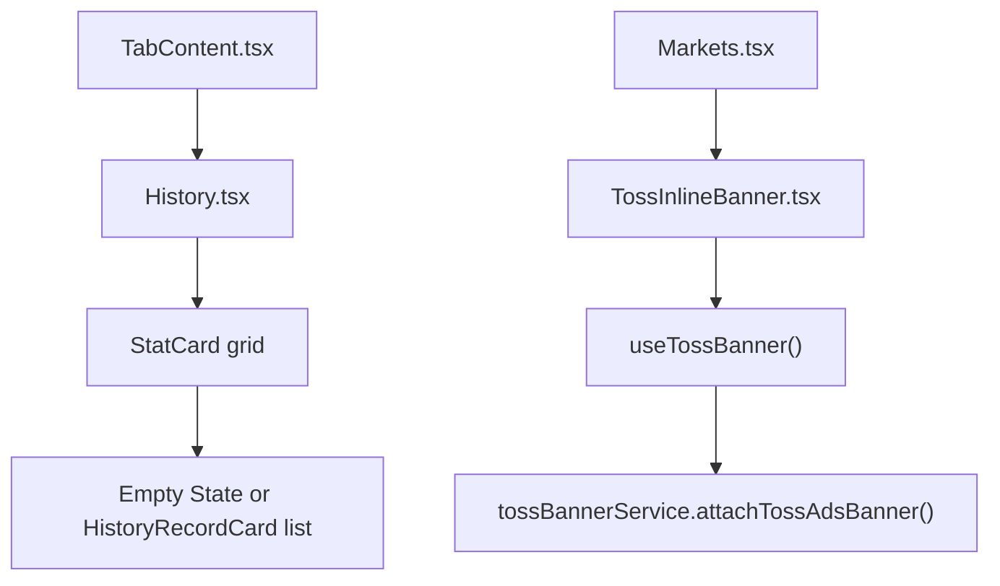

# 투자이력 리스트형 배너 계획서

**상태**: 초안 완료, 운영 코드 미적용  
**작성 목적**: `History.tsx`(투자 이력 화면)에 토스 가이드 기준의 리스트형 배너를 안전하게 추가하기 전에, 로컬 구조에 맞는 반영 지점과 AST-수준 치환 스니펫을 확정합니다.  
**범위**: `services/ads/adPlacements.ts`, `vite-env.d.ts`, `components/TossInlineBanner.tsx`, `components/History.tsx`, `components/TabContent.tsx` 설계와 시뮬레이션 가능한 운영 반영 스니펫까지입니다.  
**비범위**: 전면 광고(`services/ads/interstitialPlacementConfig.ts`), 보상형 광고, 운영 코드 직접 수정은 이번 문서 범위에서 제외합니다. (투자이력 배너용 콘솔 그룹 ID는 본문·스니펫에 반영됨.)

---

## 0. 프롬프트 검토와 로컬 보정

원문 프롬프트는 배너 ID를 `services/ads/interstitialPlacementConfig.ts`에 두라고 제안했지만, 현재 로컬 구조에서 그 파일은 **전면 광고 전용 placement 정의 SSOT** 입니다. 배너 adGroupId는 이미 `services/ads/adPlacements.ts`가 단일 소스이므로, 투자 이력 전용 배너 ID도 같은 파일에 추가해야 중복과 도메인 오염을 피할 수 있습니다.

- **원문 지시**: `interstitialPlacementConfig.ts` 또는 관련 상수 파일에 `HISTORY_BANNER_AD_GROUP_ID` 추가
- **로컬 현실**: 배너 ID SSOT는 `services/ads/adPlacements.ts`, `interstitialPlacementConfig.ts`는 interstitial 전용
- **안전한 보정**: `HISTORY_BANNER_AD_GROUP_ID`는 `services/ads/adPlacements.ts`에 추가하고, `interstitialPlacementConfig.ts`는 **변경하지 않음**

이 보정은 기능 축소가 아니라 **현 시스템 구조에 맞춘 안전한 병합**입니다.

---

## 1. 정책 고정

- 투자 이력 배너는 **`StatCard` 그리드 바로 아래**, 그리고 **빈 상태(Empty State) 또는 `HistoryRecordCard` 목록 바로 위**에 배치합니다.
- 투자 이력이 **0건이어도 배너 슬롯은 항상 렌더링**합니다.
- 현재 정책상 배너는 **무료 경험에서만** 노출하지만, 그 판단은 `TossInlineBanner` 내부가 아니라 **상위 정책 계층이 계산한 `shouldShowAd` / `shouldShowAds` boolean** 으로만 전달합니다.
- 디자인 정책은 마켓 탭과 동일하게 **`theme: 'auto'`, `tone: 'grey'`, `variant: 'card'`** 로 고정합니다.
- 배너 형식은 토스 가이드의 **리스트형 배너 고정형**을 따르며, **권장 높이 96px**을 고정 슬롯으로 확보합니다.
- 투자 이력 탭 배너용 광고 그룹은 콘솔 라이브 ID **`ait.v2.live.59f9f0b02a5b4114`** 를 SSOT로 보관하되, **비프로덕션 빌드에서는 토스 공식 리스트형 테스트 ID `ait-ad-test-banner-id` 가 자동 선택**되도록 런타임 실드를 둡니다.
- `History.tsx` 안에서 `h-[96px]` 같은 리터럴을 JSX에 직접 뿌리지 않고, **이름 있는 상수**로 분리해 intent를 고정합니다.
- 배너 SDK 초기화/부착 로직은 기존 `useTossBanner` + `attachTossAdsBanner` 경로를 재사용합니다. `History.tsx`에서 SDK를 직접 다루지 않습니다.

---

## 2. 토스 가이드 정합성

아래 두 문서와 현재 구현을 맞춥니다.

- [개발하기 | 앱인토스 개발자센터](https://developers-apps-in-toss.toss.im/ads/develop.html)
- [BannerAd / WebView 배너 광고 레퍼런스](https://developers-apps-in-toss.toss.im/bedrock/reference/framework/%EA%B4%91%EA%B3%A0/BannerAd.html)

가이드에서 이번 설계에 직접 영향을 주는 핵심 규칙은 다음과 같습니다.

- 토스 문서상 리스트형 배너 테스트 ID는 **`ait-ad-test-banner-id`** 이며, 비프로덕션 빌드에서는 이 값을 기본으로 사용해야 라이브 광고 어뷰징 리스크를 막을 수 있습니다([BannerAd](https://developers-apps-in-toss.toss.im/bedrock/reference/framework/%EA%B4%91%EA%B3%A0/BannerAd.html)).
- `TossAds.attachBanner` 대상 엘리먼트 내부는 **비어 있어야** 합니다.
- 컨테이너 `width`는 항상 **`100%`** 여야 합니다.
- 고정형 리스트 배너는 **`height: 96px` 권장** 입니다.
- 스타일 프리셋은 `theme`, `tone`, `variant` 로 제어하며, `variant: 'card'` 는 카드형 UI를 의미합니다.

현재 `TossInlineBanner` 는 이미 `attachBanner` 기반이므로, 이번 작업은 **새 배너 시스템을 만들지 않고 기존 래퍼를 고정 슬롯까지 확장**하는 쪽이 가장 안전합니다.

---

## 3. 현재 구조와 삽입 위치

현재 데이터/렌더 흐름은 아래와 같습니다.



핵심 관찰:

- `TabContent.tsx` 는 이미 `paidTier` 를 계산하고 있으므로, 여기서 `shouldShowAds` 를 만들고 `History.tsx` 로 넘기는 것이 가장 자연스럽습니다.
- `History.tsx` 는 `StatCard` 아래에 바로 기록 목록을 렌더링하므로, 그 사이가 정확한 삽입 지점입니다.
- `TossInlineBanner.tsx` 는 현재 마켓 탭에서만 사용되며, **고정 높이 슬롯 prop** 이 없고, 현재 스니펫 기준으로는 **티어 정책까지 내부에서 판단**하고 있어 역할이 과합니다.
- 배너 ID SSOT 는 `services/ads/adPlacements.ts` 입니다.

---

## 4. 설계 원칙

- **SSOT 유지**: 배너 ID는 `adPlacements.ts` 에만 둡니다.
- **정책/표현 분리**: 광고 노출 자격은 상위에서 `shouldShowAd` boolean 으로 계산하고, `TossInlineBanner.tsx` 는 그 값을 받아 렌더링만 담당합니다.
- **SRP 유지**: `History.tsx` 는 위치 결정과 prop 연결만 담당하고, SDK 부착 세부사항은 `TossInlineBanner.tsx` 가 계속 담당합니다.
- **OCP 유지**: `TossInlineBanner.tsx` 에 `containerClassName` 을 추가하여, 마켓 탭의 인라인 배너 동작은 그대로 두고 투자 이력 화면만 고정형으로 확장합니다. 동시에 `currentTier` 의 도메인 의존성을 제거해, 향후 엔터프라이즈·B2B 무료 예외가 생겨도 UI 컴포넌트 수정 없이 정책층만 확장되게 합니다.
- **런타임 실드 필수**: 라이브 배너 ID를 직접 export 하지 않고, `import.meta.env` 기반 해석 함수를 통해 **프로덕션만 라이브 ID**, 그 외는 **공식 테스트 ID** 로 강제합니다.
- **Strict TS 유지**: 현재 `TossInlineBanner.tsx` 의 `any` 콜백 타입은 문서 스니펫에서 제거합니다.
- **레이아웃 안정성**: 고정형 리스트 배너는 슬롯 높이를 먼저 확보해야 하므로, `attachBanner` 대상 엘리먼트 자체에 `h-[96px] min-h-[96px]` 클래스를 적용합니다.
- **스타일 일관성**: 인라인 `style` 객체로 여백을 주지 않고, Tailwind 클래스(`my-6`, `w-full`)로 시스템 레이아웃과 합류시킵니다.
- **책임 경계 보호**: `History.tsx` 의 기존 VM 매핑/정산 표시 책임은 그대로 두고, 배너는 독립 슬롯으로만 삽입합니다. Strategy 도메인 구조를 더 깊게 끌어오지 않습니다.
- **정책 일관성**: 빈 상태에서도 배너 슬롯을 렌더링해 “상시 노출” 요구를 충족합니다.

---

## 5. 운영 반영 스니펫

### 5.1 `services/ads/interstitialPlacementConfig.ts`

이번 작업에서는 **변경하지 않습니다**. 이 파일은 전면 광고 placement 정의 전용이며, 배너 adGroupId 를 여기에 추가하면 interstitial 도메인과 banner 도메인이 섞입니다.

실제 반영 대상은 아래 `services/ads/adPlacements.ts` 입니다.

### 5.2 `services/ads/adPlacements.ts`

```ts
import { parseViteBooleanEnvFlag } from '@/utils/envViteFlags';
import { getViteImportMetaEnv, isViteProdBuild } from '@/utils/viteImportMetaEnv';

/**
 * 광고 플레이스먼트 ID 단일 소스.
 * 콘솔에서 발급한 광고 그룹 ID를 사용합니다. 변경 시 이 파일만 수정하면 됩니다.
 */

/** 전면형 광고 그룹 ID (콘솔 전면형 · 운영 빌드) */
export const INTERSTITIAL_LIVE_AD_GROUP_ID = 'ait.v2.live.3f570e10ec374139';

/** 배너형 광고 그룹 ID (콘솔 배너형 - 이미지 강조) */
export const BANNER_AD_GROUP_ID = 'ait.v2.live.b1d77d31f3b14d57';

/** @see https://developers-apps-in-toss.toss.im/bedrock/reference/framework/%EA%B4%91%EA%B3%A0/BannerAd.html */
export const TOSS_LIST_BANNER_TEST_AD_GROUP_ID = 'ait-ad-test-banner-id';

/** 투자 이력 탭 배너 광고 그룹 ID (콘솔 발급 · 라이브). */
export const HISTORY_BANNER_LIVE_AD_GROUP_ID = 'ait.v2.live.59f9f0b02a5b4114';

/**
 * 비프로덕션에서는 테스트 ID를 기본값으로 강제해 라이브 광고 트래픽 오염을 막습니다.
 * 필요 시 `.env`의 `VITE_TOSS_HISTORY_BANNER_USE_TEST=true` 로 프로덕션에서도 테스트 ID를 강제할 수 있습니다.
 */
export function getResolvedHistoryBannerAdGroupId(): string {
  const env = getViteImportMetaEnv();
  const useTest = parseViteBooleanEnvFlag(
    env?.VITE_TOSS_HISTORY_BANNER_USE_TEST,
  );

  if (useTest) {
    return TOSS_LIST_BANNER_TEST_AD_GROUP_ID;
  }

  if (isViteProdBuild()) {
    return HISTORY_BANNER_LIVE_AD_GROUP_ID;
  }

  return TOSS_LIST_BANNER_TEST_AD_GROUP_ID;
}

/** 보상형 광고 AI인식 그룹 ID (콘솔 보상형 광고 AI인식) */
export const REWARD_UNLOCK_AI_AD_GROUP_ID = 'ait.v2.live.f71d668772bf4bf4';
```

설계 메모:

- 기존 배너/전면/보상형 ID 구조를 그대로 따릅니다.
- 이 저장소는 이미 interstitial에서 `parseViteBooleanEnvFlag()` + `getViteImportMetaEnv()` + `isViteProdBuild()` 패턴을 사용하므로, 배너도 같은 방식을 재사용해야 일관됩니다.
- `process.env.NODE_ENV` 기반 예시는 이 Vite 저장소의 실제 패턴과 어긋나므로, 계획서 스니펫에서는 채택하지 않습니다.
- 개발·로컬·QR 테스트 빌드에서 실수로 라이브 광고를 호출하는 것을 원천 차단하려면, “라이브 상수 직접 사용” 대신 “해석 함수만 사용” 계약이 안전합니다.

### 5.3 `vite-env.d.ts`

```ts
/// <reference types="vite/client" />

import type {
  BooleanEnvFlag,
  NumericEnvString,
} from './types/viteEnvContract';

declare global {
  interface ImportMetaEnv {
    readonly VITE_SUPABASE_URL: string;
    readonly VITE_SUPABASE_ANON_KEY: string;
    readonly VITE_SITE_URL?: string;

    readonly VITE_GEMINI_API_KEY_FREE?: string;
    readonly VITE_GEMINI_API_KEY_PAID?: string;
    readonly VITE_GEMINI_API_KEY?: string;
    readonly VITE_GEMINI_EDGE_URL?: string;

    readonly VITE_FIREBASE_API_KEY?: string;
    readonly VITE_FIREBASE_AUTH_DOMAIN?: string;
    readonly VITE_FIREBASE_PROJECT_ID?: string;
    readonly VITE_FIREBASE_STORAGE_BUCKET?: string;
    readonly VITE_FIREBASE_MESSAGING_SENDER_ID?: string;
    readonly VITE_FIREBASE_APP_ID?: string;
    readonly VITE_FIREBASE_VAPID_KEY?: string;

    readonly VITE_TELEGRAM_BOT_USERNAME?: string;
    readonly VITE_RAILWAY_BFF_URL?: string;

    readonly VITE_PLAN_AMOUNT_PRO?: NumericEnvString;
    readonly VITE_PLAN_AMOUNT_PREMIUM?: NumericEnvString;

    readonly VITE_BACKTEST_MULTI_URL?: string;
    readonly VITE_BACKTEST_NO_STOP_MULTI_URL?: string;

    readonly VITE_TOSS_INTERSTITIAL_USE_TEST?: BooleanEnvFlag;
    readonly VITE_TOSS_HISTORY_BANNER_USE_TEST?: BooleanEnvFlag;
  }

  interface ImportMeta {
    readonly env: ImportMetaEnv;
  }
}
```

설계 메모:

- 새로운 env key를 선언하지 않으면 `env?.VITE_TOSS_HISTORY_BANNER_USE_TEST` 가 타입 계약 밖으로 밀려 strict TS 일관성이 깨집니다.
- 프로젝트가 이미 `BooleanEnvFlag` 를 쓰고 있으므로 동일 규약으로 맞춥니다.

### 5.4 `components/TossInlineBanner.tsx`

```tsx
import React, {
  type ReactElement,
  useCallback,
  useEffect,
  useRef,
  useState,
} from 'react';
import {
  useTossBanner,
  type TossAdsAttachBannerOptions,
  type TossAdsAttachBannerResult,
  type TossAdsBannerCallbackPayload,
} from '../hooks/useTossBanner';
import { BANNER_AD_GROUP_ID } from '../services/ads/adPlacements';

export type TossInlineBannerVariant = 'card' | 'expanded';

export interface TossInlineBannerProps {
  adGroupId?: string;
  shouldShowAd: boolean;
  isInTossApp: boolean;
  className?: string;
  containerClassName?: string;
  variant?: TossInlineBannerVariant;
}

export function TossInlineBanner(props: TossInlineBannerProps): ReactElement | null {
  const {
    adGroupId = BANNER_AD_GROUP_ID,
    shouldShowAd,
    isInTossApp,
    className,
    containerClassName,
    variant = 'card',
  } = props;

  if (!isInTossApp || !shouldShowAd) {
    return null;
  }

  const { isSupported, isInitialized, attachBanner } = useTossBanner();
  const [targetElement, setTargetElement] = useState<HTMLDivElement | null>(null);
  const [hasAttached, setHasAttached] = useState(false);
  const [isFailed, setIsFailed] = useState(false);
  const attachedRef = useRef<TossAdsAttachBannerResult | null>(null);

  const setRef = useCallback((element: HTMLDivElement | null): void => {
    setTargetElement(element);
  }, []);

  const handleBannerFailure = useCallback(
    (_payload?: TossAdsBannerCallbackPayload): void => {
      // 광고 No Fill / 렌더 실패는 사용자 액션 오류가 아니라 슬롯 비활성화 사유이므로 조용히 숨깁니다.
      setIsFailed(true);
    },
    [],
  );

  useEffect(() => {
    if (
      !isSupported ||
      !isInitialized ||
      targetElement == null ||
      isFailed ||
      attachedRef.current != null
    ) {
      return;
    }

    let isCancelled = false;
    let firstFrameId: number | null = null;
    let secondFrameId: number | null = null;

    const attachSafely = (): void => {
      if (isCancelled || targetElement == null) {
        return;
      }

      if (typeof document !== 'undefined' && !document.body.contains(targetElement)) {
        return;
      }

      const options: TossAdsAttachBannerOptions = {
        theme: 'auto',
        tone: 'grey',
        variant,
        callbacks: {
          onNoFill: handleBannerFailure,
          onAdFailedToRender: handleBannerFailure,
        },
      };

      const attached = attachBanner(adGroupId, targetElement, options);
      if (attached == null) {
        setIsFailed(true);
        return;
      }

      attachedRef.current = attached;
      setHasAttached(true);
    };

    try {
      firstFrameId = window.requestAnimationFrame(() => {
        secondFrameId = window.requestAnimationFrame(attachSafely);
      });
    } catch {
      attachSafely();
    }

    return () => {
      isCancelled = true;
      if (firstFrameId != null) {
        window.cancelAnimationFrame(firstFrameId);
      }
      if (secondFrameId != null) {
        window.cancelAnimationFrame(secondFrameId);
      }
    };
  }, [
    adGroupId,
    attachBanner,
    handleBannerFailure,
    isFailed,
    isInitialized,
    isSupported,
    targetElement,
    variant,
  ]);

  useEffect(() => {
    if (!isFailed) {
      return;
    }

    const attached = attachedRef.current;
    if (attached == null) {
      return;
    }

    try {
      attached.destroy();
    } catch {
      // SDK destroy 실패는 화면 전체 실패로 확대하지 않습니다.
    } finally {
      attachedRef.current = null;
    }
  }, [isFailed]);

  useEffect(() => {
    return () => {
      const attached = attachedRef.current;
      if (attached == null) {
        return;
      }

      try {
        attached.destroy();
      } catch {
        // 언마운트 시 슬롯 정리 실패를 삼키되, 앱 흐름은 유지합니다.
      } finally {
        attachedRef.current = null;
      }
    };
  }, []);

  if (!isSupported || isFailed) {
    return null;
  }

  const resolvedWrapperClassName = [className, hasAttached ? 'my-6 w-full' : '']
    .filter((value): value is string => value != null && value !== '')
    .join(' ');

  const resolvedContainerClassName = ['w-full', containerClassName]
    .filter((value): value is string => value != null && value !== '')
    .join(' ');

  return (
    <div className={resolvedWrapperClassName}>
      <div ref={setRef} className={resolvedContainerClassName} />
    </div>
  );
}
```

설계 메모:

- `containerClassName` 을 inner slot에 적용해야 토스 가이드의 “attach 대상 엘리먼트 width/height 제어”와 정확히 맞습니다.
- `shouldShowAd` 로 계약을 바꾸면 `TossInlineBanner` 는 더 이상 티어/요금제 문자열을 알 필요가 없어집니다.
- `my-6 w-full` 로 wrapper 여백을 Tailwind 체계 안으로 흡수해, 인라인 스타일과 숫자 객체 누수를 없앱니다.
- `any` 를 제거해 strict TS 위반을 방지합니다.

### 5.5 `components/History.tsx`

```tsx
import React, { useCallback, useMemo } from 'react';
import type { AppLang, Portfolio } from '../types';
import { Calendar, CheckCircle2, ChevronRight, Trash2 } from 'lucide-react';
import { useTossApp } from '../contexts/TossAppContext';
import { TDS_DIALOG_MESSAGES } from '../constants/tdsDialogMessages';
import { getHistoryMessages } from '../constants/messages/historyMessages';
import {
  formatSignedPercent,
  formatSignedUsdValue,
  formatUsdValue,
  getRounded,
} from '../src/utils/financialCalculations';
import {
  buildClosedStrategySettlementSummary,
  calculateAggregateHistoryRoi,
} from '../utils/portfolioSettlement';
import { getResolvedHistoryBannerAdGroupId } from '../services/ads/adPlacements';
import { TdsConfirmDialog } from './tds-adapter/TdsConfirmDialog';
import { useAsyncTdsConfirm } from './tds-adapter/useAsyncTdsConfirm';
import { showErrorToast } from './tds-adapter/showErrorToast';
import HistoryHeaderActions from './HistoryHeaderActions';
import { TossInlineBanner } from './TossInlineBanner';

const HISTORY_LIST_BANNER_CONTAINER_CLASS_NAME = 'h-[96px] min-h-[96px]';

interface HistoryProps {
  lang: AppLang;
  portfolios: Portfolio[];
  shouldShowAds: boolean;
  onOpenDetails: (id: string) => void;
  onDeleteHistory?: (portfolioId: string) => Promise<void> | void;
  onClearHistory?: () => Promise<void> | void;
}

// ...중략: HistoryRecordVm / HistoryRecordCard / StatCard / 계산 유틸은 기존 유지...

export default function History({
  lang,
  portfolios,
  shouldShowAds,
  onOpenDetails,
  onDeleteHistory,
  onClearHistory,
}: HistoryProps): React.ReactElement {
  const copy = getHistoryMessages(lang);
  const { isInTossApp } = useTossApp();
  const historyDialog = useAsyncTdsConfirm(lang);
  const historyBannerAdGroupId = getResolvedHistoryBannerAdGroupId();
  const labels = TDS_DIALOG_MESSAGES[lang]?.actions;
  const deleteLabel = TDS_DIALOG_MESSAGES[lang]?.history?.deleteRecordButton ?? '';

  const handleRequestDeleteRecord = useCallback(
    (portfolioId: string): void => {
      const messages = TDS_DIALOG_MESSAGES[lang]?.history;
      const actionLabels = TDS_DIALOG_MESSAGES[lang]?.actions;

      if (messages == null || actionLabels == null || onDeleteHistory == null) {
        const errorMessage = TDS_DIALOG_MESSAGES[lang]?.common?.refundActionFailed;
        if (errorMessage != null && errorMessage !== '') {
          showErrorToast(errorMessage);
        }
        return;
      }

      historyDialog.open({
        title: messages.deleteRecordTitle ?? '',
        body: messages.deleteRecordBody ?? '',
        confirmLabel: messages.deleteRecordConfirm ?? '',
        tone: 'danger',
        action: () => Promise.resolve(onDeleteHistory(portfolioId)),
      });
    },
    [historyDialog.open, lang, onDeleteHistory],
  );

  const sortedPortfolios = useMemo(
    () =>
      [...portfolios].sort((a, b) => {
        const aDate = a.closedAt != null ? new Date(a.closedAt).getTime() : 0;
        const bDate = b.closedAt != null ? new Date(b.closedAt).getTime() : 0;
        return bDate - aDate;
      }),
    [portfolios],
  );

  const recordVms = useMemo(
    () =>
      sortedPortfolios.map((portfolio) => buildHistoryRecordVm(portfolio, copy)),
    [copy, sortedPortfolios],
  );

  const totalProfit = useMemo(
    () => recordVms.reduce((sum, vm) => sum + vm.profitAmount, 0),
    [recordVms],
  );

  const aggregateRoi = useMemo(
    () =>
      calculateAggregateHistoryRoi(
        recordVms.map((vm) => ({
          totalInvested: vm.totalInvested,
          profit: vm.profitAmount,
        })),
      ),
    [recordVms],
  );

  const totalProfitColor =
    getRounded(totalProfit) >= 0 ? 'text-emerald-500' : 'text-rose-500';

  return (
    <div className="space-y-10 animate-in fade-in duration-700">
      <header className="flex flex-col md:flex-row md:items-center justify-between gap-6">
        <div>
          <h2 className="text-3xl font-black dark:text-white uppercase tracking-tight">
            {copy.historyTitle}
          </h2>
          <p className="text-sm font-bold text-slate-500 mt-1 uppercase tracking-widest">
            {copy.historySubtitle}
          </p>
        </div>
        <div className="flex gap-3 flex-wrap justify-end">
          {onClearHistory != null ? (
            <HistoryHeaderActions
              lang={lang}
              canClearHistory
              onClearHistory={onClearHistory}
            />
          ) : null}
        </div>
      </header>

      <div className="grid grid-cols-1 sm:grid-cols-3 gap-6">
        <StatCard
          label={copy.totalProfitLabel}
          value={formatSignedUsdValue(totalProfit)}
          color={totalProfitColor}
        />
        <StatCard
          label={copy.yieldLabel}
          value={formatSignedPercent(aggregateRoi)}
          color="text-blue-500"
        />
        <StatCard
          label={copy.closedStrategiesLabel}
          value={recordVms.length.toString()}
          color="text-slate-500"
        />
      </div>

      <TossInlineBanner
        adGroupId={historyBannerAdGroupId}
        shouldShowAd={shouldShowAds}
        isInTossApp={isInTossApp}
        variant="card"
        containerClassName={HISTORY_LIST_BANNER_CONTAINER_CLASS_NAME}
      />

      <div className="space-y-4">
        {recordVms.length === 0 ? (
          <div className="text-center py-32 glass rounded-[3rem] border-2 border-dashed border-white/5">
            <Calendar className="mx-auto mb-6 opacity-10" size={64} />
            <p className="text-slate-500 font-bold uppercase tracking-widest">
              {copy.noHistoryLabel}
            </p>
          </div>
        ) : (
          recordVms.map((vm) => (
            <HistoryRecordCard
              key={vm.id}
              vm={vm}
              isInTossApp={isInTossApp}
              detailsLabel={copy.detailsLabel}
              totalInvestedLabel={copy.totalInvestedLabel}
              totalYieldLabel={copy.totalYieldLabel}
              investedFormulaLabel={copy.investedFormulaLabel}
              yieldFormulaLabel={copy.yieldFormulaLabel}
              deleteLabel={deleteLabel}
              onOpenDetails={onOpenDetails}
              onRequestDelete={
                onDeleteHistory != null ? handleRequestDeleteRecord : undefined
              }
            />
          ))
        )}
      </div>

      {labels != null ? (
        <TdsConfirmDialog {...historyDialog.dialogProps} labels={labels} />
      ) : null}
    </div>
  );
}
```

설계 메모:

- 배너를 `space-y-4` 목록 바깥에 두면, **빈 상태 / 리스트 모두 동일한 삽입 위치**를 보장합니다.
- `History.tsx` 는 `shouldShowAds` 만 받아 배너 위치와 렌더만 담당하고, 티어/계약 해석은 상위 계층에 남겨 둡니다.
- `HISTORY_LIST_BANNER_CONTAINER_CLASS_NAME` 으로 권장 96px를 이름 있는 정책 상수로 고정합니다.
- `getResolvedHistoryBannerAdGroupId()` 를 통해 렌더 시점 adGroupId를 읽으면, 비프로덕션에서 테스트 ID가 강제되어 실수로 라이브 광고를 붙이는 사고를 줄일 수 있습니다.
- 이번 변경은 배너 슬롯 추가에 한정되며, `HistoryRecordVm` 구성이나 Strategy 정산 계산 책임은 넓히지 않습니다.

### 5.6 `components/TabContent.tsx`

```tsx
import React, { useCallback } from 'react';
import type { Portfolio } from '@/types';
import { APP_HASH, APP_SHELL_MESSAGES } from '@/constants/appShellMessages';
import { resolvePaidTier } from '@/utils/appEntryHelpers';

import Landing from '@/components/Landing';
import Pricing from '@/components/Pricing';
import Privacy from '@/components/Privacy';
import Terms from '@/components/Terms';

const Dashboard = React.lazy(() => import('@/components/Dashboard'));
const Markets = React.lazy(() => import('@/components/Markets'));
const Backtest = React.lazy(() => import('@/components/Backtest'));
const History = React.lazy(() => import('@/components/History'));

export type ActiveTab =
  | 'dashboard'
  | 'markets'
  | 'history'
  | 'backtest'
  | 'pricing'
  | 'privacy'
  | 'terms';

export interface TabContentProps {
  activeTab: ActiveTab;
  lang: 'ko' | 'en';
  user: { id: string; email: string } | null;
  activePortfolios: Portfolio[];
  portfolios: Portfolio[];
  closedPortfolios: Portfolio[];
  canAccessPaidStocks: boolean;
  currentTier: string;
  totalValuation: number;
  totalValuationChange: number;
  totalValuationChangePct: number;
  onDailyExecutionSummaryChange: (summary: string | null) => void;
  onOpenLogin: () => void;
  onOpenSignup: () => void;
  onContinueWithToss: () => void;
  onRequestOpenCreator: () => void;
  onOpenAlarm: (id: string) => void;
  onOpenDetails: (id: string) => void;
  onOpenQuickInput: (
    id: string,
    activeSection: 1 | 2 | 3 | undefined,
  ) => void;
  onOpenExecution: (id: string) => void;
  onOpenAIImage: (id: string) => void;
  onClosePortfolio: (id: string) => void;
  onDeletePortfolio: (id: string) => Promise<void>;
  onUpdatePortfolio: (portfolio: Portfolio) => Promise<void>;
  onDeleteHistory: (portfolioId: string) => Promise<void>;
  onClearHistory: () => Promise<void>;
  onSelectCheckoutPlan: (planId: 'pro' | 'premium') => void;
  onBackToDashboard: (hash: string) => void;
  onOpenPricingTab: () => void;
}

const SuspenseFallback = React.memo(({ message }: { message: string }) => (
  <div className="flex min-h-[50vh] items-center justify-center font-bold text-slate-500 dark:text-slate-400">
    {message}
  </div>
));
SuspenseFallback.displayName = 'SuspenseFallback';

const TabContentComponent: React.FC<TabContentProps> = (props) => {
  const {
    activeTab,
    lang,
    user,
    activePortfolios,
    portfolios,
    closedPortfolios,
    canAccessPaidStocks,
    currentTier,
    totalValuation,
    totalValuationChange,
    totalValuationChangePct,
    onDailyExecutionSummaryChange,
    onOpenLogin,
    onOpenSignup,
    onContinueWithToss,
    onRequestOpenCreator,
    onOpenAlarm,
    onOpenDetails,
    onOpenQuickInput,
    onOpenExecution,
    onOpenAIImage,
    onClosePortfolio,
    onDeletePortfolio,
    onUpdatePortfolio,
    onDeleteHistory,
    onClearHistory,
    onSelectCheckoutPlan,
    onBackToDashboard,
    onOpenPricingTab,
  } = props;

  const copy = APP_SHELL_MESSAGES[lang];
  const paidTier = resolvePaidTier(currentTier);
  const shouldShowAds = paidTier === 'free';

  const handlePricingUpgrade = useCallback(
    (planId: 'pro' | 'premium') => {
      if (user?.id == null) {
        onOpenLogin();
        return;
      }
      onSelectCheckoutPlan(planId);
    },
    [user?.id, onOpenLogin, onSelectCheckoutPlan],
  );

  const handlePrivacyBack = useCallback(() => {
    onBackToDashboard(APP_HASH.privacy);
  }, [onBackToDashboard]);

  const handleTermsBack = useCallback(() => {
    onBackToDashboard(APP_HASH.terms);
  }, [onBackToDashboard]);

  switch (activeTab) {
    case 'dashboard':
      if (user == null) {
        return (
          <Landing
            lang={lang}
            onOpenSignup={onOpenSignup}
            onOpenLogin={onOpenLogin}
            onContinueWithToss={onContinueWithToss}
          />
        );
      }

      return (
        <React.Suspense
          fallback={<SuspenseFallback message={copy.loadingDashboard} />}
        >
          <Dashboard
            lang={lang}
            portfolios={activePortfolios}
            onClosePortfolio={onClosePortfolio}
            onDeletePortfolio={onDeletePortfolio}
            onUpdatePortfolio={onUpdatePortfolio}
            onOpenCreator={onRequestOpenCreator}
            onOpenAlarm={onOpenAlarm}
            onOpenDetails={onOpenDetails}
            onOpenQuickInput={onOpenQuickInput}
            onOpenExecution={onOpenExecution}
            onOpenAIImage={onOpenAIImage}
            totalValuation={totalValuation}
            totalValuationChange={totalValuationChange}
            totalValuationChangePct={totalValuationChangePct}
            onDailyExecutionSummaryChange={onDailyExecutionSummaryChange}
          />
        </React.Suspense>
      );

    case 'markets':
      return (
        <React.Suspense
          fallback={<SuspenseFallback message={copy.loadingGeneric} />}
        >
          <Markets
            lang={lang}
            portfolios={portfolios}
            canAccessPaidStocks={canAccessPaidStocks}
            currentTier={paidTier}
          />
        </React.Suspense>
      );

    case 'backtest':
      return (
        <React.Suspense
          fallback={<SuspenseFallback message={copy.loadingBacktest} />}
        >
          <Backtest
            lang={lang}
            currentTier={paidTier}
            onRequestUpgrade={onOpenPricingTab}
          />
        </React.Suspense>
      );

    case 'pricing':
      return (
        <Pricing
          lang={lang}
          currentTier={paidTier}
          onUpgrade={handlePricingUpgrade}
        />
      );

    case 'history':
      return (
        <React.Suspense
          fallback={<SuspenseFallback message={copy.loadingGeneric} />}
        >
          <History
            lang={lang}
            portfolios={closedPortfolios}
            shouldShowAds={shouldShowAds}
            onOpenDetails={onOpenDetails}
            onDeleteHistory={onDeleteHistory}
            onClearHistory={onClearHistory}
          />
        </React.Suspense>
      );

    case 'privacy':
      return <Privacy lang={lang} onBack={handlePrivacyBack} />;

    case 'terms':
      return <Terms lang={lang} onBack={handleTermsBack} />;

    default: {
      const exhaustiveCheck: never = activeTab;
      void exhaustiveCheck;
      return <SuspenseFallback message={copy.loadingGeneric} />;
    }
  }
};

TabContentComponent.displayName = 'TabContent';

export const TabContent = React.memo(TabContentComponent);
```

설계 메모:

- `History.tsx` 에서 무료/유료 정책을 독립적으로 판단하려면, 상위 컨테이너가 이미 계산한 `paidTier` 를 재사용하는 것이 가장 단순합니다.
- 새 전역 상태나 context 추가 없이 boolean prop 한 줄로 정책을 주입하므로 영향 범위가 작습니다.
- 향후 무료 예외 티어가 생기면 `const shouldShowAds = ...` 계산식만 바꾸면 되고, `TossInlineBanner.tsx` 는 수정하지 않아도 됩니다.

### 5.7 추가 영향 파일 메모: `components/Markets.tsx`

이번 계획서의 핵심 범위는 `History.tsx` 이지만, `TossInlineBanner` 계약을 `currentTier` → `shouldShowAd` 로 바꾸면 **기존 호출부인 `Markets.tsx` 도 함께 마이그레이션해야 타입 계약이 닫힙니다**.

실제 운영 반영 시 최소 수정 예시는 아래와 같습니다.

```tsx
const shouldShowAds = currentTier === 'free';

<TossInlineBanner
  shouldShowAd={shouldShowAds}
  isInTossApp={isInTossApp}
  variant="card"
/>
```

설계 메모:

- 이 스니펫은 **히스토리 배너 작업으로 인해 깨질 수 있는 기존 호출부 보호용 메모**입니다.
- 장기적으로는 마켓 탭도 상위 정책 계층에서 `shouldShowAds` 를 주입받도록 정렬하는 편이 더 좋습니다.

---

## 6. 반영 순서

1. `services/ads/adPlacements.ts` 에 테스트/라이브 배너 ID와 `getResolvedHistoryBannerAdGroupId()` 추가  
   검증: 비프로덕션 기본값이 테스트 ID, 프로덕션 기본값이 라이브 ID인지 확인

2. `vite-env.d.ts` 에 `VITE_TOSS_HISTORY_BANNER_USE_TEST` 선언 추가  
   검증: env 키 접근이 strict TS 계약 안에 들어오는지 확인

3. `components/TossInlineBanner.tsx` 에 `containerClassName` 지원 및 `any` 제거  
   검증: 마켓 탭 호출부 수정 없이 타입 에러가 없는지 확인

4. `components/History.tsx` 에 `shouldShowAds` prop + 배너 삽입  
   검증: 빈 상태 / 기록 목록 둘 다에서 배너 위치가 동일한지 확인

5. `components/TabContent.tsx` 에 `const shouldShowAds = paidTier === 'free'` 계산 및 전달  
   검증: `HistoryProps` 누락으로 인한 TS 에러가 없는지 확인

6. `components/Markets.tsx` 기존 호출부를 `shouldShowAd` 계약으로 정렬  
   검증: `TossInlineBannerProps` 변경으로 인한 기존 호출부 TS 에러가 없는지 확인

---

## 7. 가상 런타임 시뮬레이션

시나리오 A. **광고 허용 정책(`shouldShowAds === true`) + 토스 앱 + 비프로덕션 빌드 + 투자 이력 0건**

- `TabContent` 가 상위 정책식에서 `shouldShowAds === true` 를 계산해 `History` 로 전달합니다.
- `History` 는 `getResolvedHistoryBannerAdGroupId()` 로 테스트 ID를 받고, `StatCard` 아래에 `TossInlineBanner` 를 먼저 렌더링한 뒤 그 아래에 Empty State 를 렌더링합니다.
- `TossInlineBanner` 는 `attachBanner` 대상 div 에 `w-full h-[96px] min-h-[96px]` 를 적용한 뒤 `theme: 'auto'`, `tone: 'grey'`, `variant: 'card'` 로 부착을 시도합니다.
- 결과: 빈 상태 여부와 무관하게 고정형 리스트 배너 슬롯이 먼저 확보되고, 라이브 광고 ID는 호출되지 않습니다.

시나리오 B. **광고 허용 정책(`shouldShowAds === true`) + 토스 앱 + 프로덕션 빌드 + 투자 이력 N건**

- 배너는 동일한 위치에 렌더링되고, `getResolvedHistoryBannerAdGroupId()` 는 라이브 ID `ait.v2.live.59f9f0b02a5b4114` 를 반환합니다.
- 리스트 렌더링 키는 기존 `vm.id` 를 유지하므로 안정성 변화가 없습니다.

시나리오 C. **광고 비허용 정책(`shouldShowAds === false`) 또는 토스 앱 외 환경**

- `TossInlineBanner` 는 `!isInTossApp || !shouldShowAd` 가드로 즉시 `null` 을 반환합니다.
- `History` 본문과 기록 목록은 그대로 동작하며, 광고 슬롯만 빠집니다.

---

## 8. 잠재 리스크와 방어 포인트

- **TS 리스크 1**: `TossInlineBannerProps` 를 `shouldShowAd` 계약으로 바꾸면 기존 `Markets.tsx` 호출부가 즉시 타입 에러가 납니다.  
  → 본 문서는 `Markets.tsx` 동기 마이그레이션 메모를 함께 남깁니다.

- **TS 리스크 2**: 현재 `TossInlineBanner.tsx` 의 `any` 콜백은 팀 규칙과 충돌합니다.  
  → `TossAdsBannerCallbackPayload` 로 대체합니다.

- **TS 리스크 3**: 새 env 키를 선언하지 않으면 `import.meta.env` 접근이 타입 계약 밖으로 밀려납니다.  
  → `vite-env.d.ts` 스니펫을 함께 반영합니다.

- **레이아웃 리스크 1**: 높이를 outer wrapper 가 아니라 attach 대상 div 에 주지 않으면 고정형 배너 슬롯이 정확히 확보되지 않을 수 있습니다.  
  → `containerClassName` 을 inner div 에 적용합니다.

- **아키텍처 리스크 1**: 배너 ID를 `interstitialPlacementConfig.ts` 에 넣으면 전면 placement와 배너 ID 책임이 섞입니다.  
  → `adPlacements.ts` 단일 소스를 유지합니다.

- **아키텍처 리스크 2**: `TossInlineBanner.tsx` 가 티어 문자열을 직접 해석하면, 정책 계층과 UI 계층이 동시에 무료/예외 규칙을 들고 있게 됩니다.  
  → 정책 판단은 상위의 `shouldShowAds` 계산으로 올리고, 배너 UI는 boolean 명령만 받습니다.

- **운영 리스크 1**: 로컬·QA 빌드에서 라이브 광고 ID가 직접 붙으면 토스 정책 위반 및 계정 리스크가 생길 수 있습니다.  
  → `getResolvedHistoryBannerAdGroupId()` 가 비프로덕션 기본값을 테스트 ID로 강제합니다.

- **가드레일 1**: `History.tsx` 는 이미 Strategy/정산 표시용 VM을 만들고 있으므로, 배너 추가를 빌미로 Strategy 구조 의존성을 더 늘리면 안 됩니다.  
  → 배너는 독립 슬롯으로만 삽입하고 기존 VM 계산과 교차시키지 않습니다.

---

## 9. Mental Compile 결과

- `TossInlineBanner` 가 `shouldShowAd` boolean 만 받도록 바뀌면 정책/UI 경계가 분리되고, `History.tsx` 와 `TabContent.tsx` 는 단순 prop 계약만 맞추면 됩니다.
- `getResolvedHistoryBannerAdGroupId()` 가 interstitial와 동일한 env 해석 패턴을 재사용하므로, 이 저장소 기준에서 환경 분리 방식도 일관됩니다.
- 고정형 슬롯 높이를 `TossInlineBanner` 의 attach 대상 div 에 주고, wrapper 여백도 Tailwind 클래스로 처리하므로 인라인 스타일 기반 레이아웃 흔들림 가능성이 낮습니다.
- `interstitialPlacementConfig.ts` 를 건드리지 않고 `adPlacements.ts` 를 확장하므로, 기존 전면 광고 프리로드/노출 시스템과 충돌하지 않습니다.
