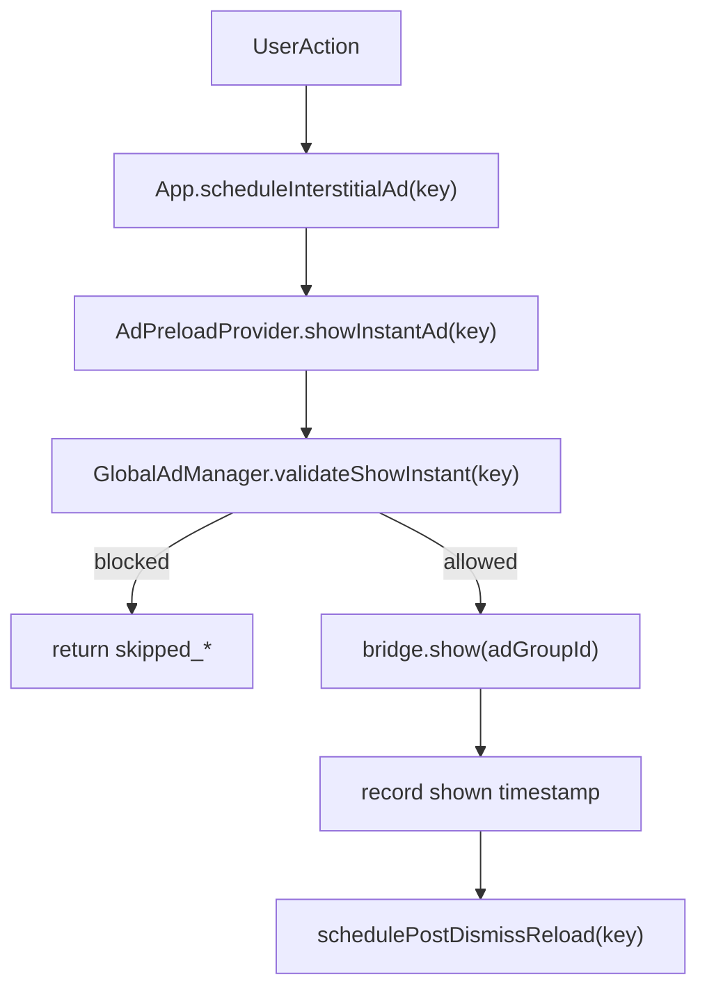

# 전면광고 60초 쿨타임 계획서

**상태**: 초안 완료, 운영 코드 미적용  
**작성 목적**: 전면광고(interstitial)에만 60초 전역 쿨타임을 적용하는 설계를 확정하고, 실제 서비스 코드 반영 전에 `docs2` 시뮬레이션 스니펫으로 검증 가능한 기준을 남깁니다.  
**범위**: `services/ads/globalAdManager.ts`에 들어갈 설계와 `docs2/ad-preload-simulation-snippets.ts` 시뮬레이션 초안까지입니다.  
**비범위**: 보상형 광고(`services/ads/rewardAdService.ts`), 배너, 운영 앱 코드 직접 수정은 이번 문서 범위에서 제외합니다.

---

## 1. 정책 고정

- 전면광고만 전역 쿨타임을 적용합니다. **기본값은 60초(`60_000ms`)**이며, A/B·Remote Config 등은 `GlobalAdManagerOptions.globalCooldownMs`로 주입합니다.
- 기준 시점은 **마지막 성공 노출(`shown`) 완료 시각**입니다.
- 마지막 성공 노출 후 `globalCooldownMs`(미주입 시 `60_000ms`) 안에는 어떤 placement key로 호출해도 전면광고를 띄우지 않습니다.
- 쿨타임 중 들어온 전략 저장, 거래 저장, 알람 저장, 정산 상세 트리거는 **버립니다**. 대기열에 저장하지 않습니다.
- 쿨타임이 끝났다고 자동으로 광고를 띄우지 않습니다. **만료 후 새로운 트리거가 다시 발생했을 때만** 다음 광고 시도를 허용합니다.
- 기존 `deferFirstInterstitialAttemptOncePerSession` 정책은 유지합니다. 즉, 이번 변경은 첫 시도 면제 위에 얹는 **전역 재노출 제한**입니다.

---

## 2. 현재 구조와 삽입 위치

현재 전면광고 실제 노출 시도는 모두 아래 경로로 수렴합니다.



관련 SSOT는 아래 파일들입니다.

- `App.tsx`
- `services/ads/AdPreloadProvider.tsx`
- `services/ads/globalAdManager.ts`
- `services/ads/interstitialPlacementConfig.ts`

이번 정책은 `App.tsx`가 아니라 `GlobalAdManager.showInstant()` 진입부에 둡니다.

- 이유 1: 모든 실제 전면 노출 시도가 이 메서드로 모입니다.
- 이유 2: 추후 다른 화면이 `manager.showInstant()`를 직접 호출해도 동일 정책이 유지됩니다.
- 이유 3: `App.tsx`에 placement별 중복 쿨타임 분기가 생기지 않아 DRY를 지킬 수 있습니다.

---

## 3. 설계 원칙

- `preload`는 유지합니다. 즉, 쿨타임 구간 동안 **show만 금지**하고 `prime/load/reload`는 계속 동작시켜 다음 트리거에서 즉시 노출 가능한 상태를 노립니다.
- **쿨타임 길이는 설정(Config)과 로직(Logic)을 분리**합니다. `GlobalAdManagerOptions.globalCooldownMs`로 주입 가능하게 열어두고, 미주입 시에만 기본값 `60_000ms`를 씁니다. 이렇게 하면 `App.tsx`·Remote Config·실험 그룹별 값 변경이 클래스 내부 하드코딩 없이 가능합니다(OCP).
- **방어적 프로그래밍(Defensive Programming)**: Remote Config·외부 레이어를 신뢰하지 않습니다. 생성자에서 `Math.max(0, options.globalCooldownMs ?? DEFAULT_…)`로 **하한 0 클램프**하여, 음수·잘못된 주입이 있어도 `GlobalAdManager`가 스스로 유효한 쿨타임만 보관합니다(구글/메타 계열 스탠다드).
- **시스템 시계 역전 방어**: NTP 동기화·수동 시각 변경 등으로 `nowMs < lastInterstitialShowCompletedAtMs`가 되면 `elapsedMs`가 음수가 될 수 있습니다. `Math.max(0, nowMs - last...)`로 경과 시간을 하한 0으로 고정하지 않으면 남은 쿨타임이 비정상적으로 커지는 수학적 결함이 생깁니다(Rule 1).
- 쿨타임 거절은 `skipped_not_ready`와 별도 코드로 분리합니다. 그래야 시뮬레이션과 QA에서 정책이 정확히 보입니다.
- 쿨타임 거절 시 `prime(key)`를 다시 호출하지 않습니다. 이미 프리로드는 독립적으로 돌고 있고, 쿨타임은 노출 정책이지 로딩 실패가 아니기 때문입니다.

---

## 4. 운영 코드에 들어갈 핵심 스니펫

### 4.1 `GlobalAdManagerOptions` 확장, 기본 쿨타임, 상태, 헬퍼

```ts
/** 미주입 시 전역 전면 쿨타임 기본값 — 리터럼을 생성자에만 흩뿌리지 않기 위한 이름 있는 상수(Rule 8). */
const DEFAULT_INTERSTITIAL_GLOBAL_COOLDOWN_MS = 60_000;

export interface GlobalAdManagerOptions {
  readonly audioManager: AppAudioManager;
  readonly now?: () => number;
  readonly deferFirstInterstitialAttemptOncePerSession?: boolean;
  readonly onDrainError?: (error: unknown) => void;
  readonly initialTier: UserTier;
  /**
   * 전역 전면 광고 노출 성공 직후 쿨타임(ms). A/B·Remote Config에서 주입.
   * 미주입 시 `DEFAULT_INTERSTITIAL_GLOBAL_COOLDOWN_MS`. 음수는 생성자에서 0으로 클램프.
   */
  readonly globalCooldownMs?: number;
}

export type AdResultCode =
  | 'none'
  | 'loaded'
  | 'shown'
  | 'skipped_unsupported'
  | 'skipped_ineligible_tier'
  | 'skipped_not_ready'
  | 'skipped_first_action_exemption'
  | 'skipped_show_in_progress'
  | 'skipped_global_cooldown'
  | 'load_timeout'
  | 'load_error'
  | 'show_timeout'
  | 'failed_to_show'
  | 'show_error';

export class GlobalAdManager {
  private lastInterstitialShowCompletedAtMs: number | null = null;
  private readonly globalCooldownMs: number;

  public constructor(
    private readonly bridge: FullScreenAdBridge,
    definitions: readonly InterstitialPlacementDefinition[],
    options: GlobalAdManagerOptions,
  ) {
    // …기존 audioManager, nowFn, tier 등 초기화…
    this.globalCooldownMs = Math.max(
      0,
      options.globalCooldownMs ?? DEFAULT_INTERSTITIAL_GLOBAL_COOLDOWN_MS,
    );
  }

  private getRemainingInterstitialCooldownMs(nowMs: number): number {
    if (this.lastInterstitialShowCompletedAtMs == null) {
      return 0;
    }

    // Rule 1: 시계 역전(NTP·수동 변경) 시 음수 경과 방지
    const elapsedMs = Math.max(
      0,
      nowMs - this.lastInterstitialShowCompletedAtMs,
    );
    if (elapsedMs >= this.globalCooldownMs) {
      return 0;
    }

    return this.globalCooldownMs - elapsedMs;
  }
}
```

설계 메모:

- `lastInterstitialShowCompletedAtMs`는 placement별이 아니라 **전면 전체** 기준입니다.
- 전역 단위로 두어야 `trade_save` 직후 `alarm_save`가 바로 이어져도 동일 정책으로 막을 수 있습니다.
- `getRemainingInterstitialCooldownMs()`는 숫자 계산만 담당합니다. 상태 변경과 로깅을 섞지 않아 SRP를 유지합니다.
- 운영 반영 시 `App.tsx`의 `new GlobalAdManager(..., { …, globalCooldownMs: remoteOrExperimentMs })` 형태로 값을 넘기면 됩니다. 매니저 본문은 실험 분기를 모르고, **주입값 무결성은 생성자 클램프로 자체 보장**합니다(OCP + 방어적 프로그래밍).

### 4.2 `validateShowInstant` 삽입 위치

```ts
private validateShowInstant(
  key: InterstitialPlacementKey,
):
  | {
      ok: true;
      definition: InterstitialPlacementDefinition;
      slot: SlotRuntime;
    }
  | { ok: false; code: AdResultCode } {
  const definition = this.definitions.get(key);
  const slot = this.slots.get(key);
  if (definition == null || slot == null) {
    return { ok: false, code: 'show_error' };
  }

  if (!this.bridge.isSupported()) {
    return { ok: false, code: 'skipped_unsupported' };
  }

  if (!isTierEligible(definition, this.currentTier)) {
    return { ok: false, code: 'skipped_ineligible_tier' };
  }

  if (this.deferFirstInterstitialAttemptOncePerSession) {
    if (!this.hasConsumedDeferredFirstInterstitialAttempt) {
      this.hasConsumedDeferredFirstInterstitialAttempt = true;
      return { ok: false, code: 'skipped_first_action_exemption' };
    }
  }

  const nowMs = this.nowFn();
  if (this.getRemainingInterstitialCooldownMs(nowMs) > 0) {
    return { ok: false, code: 'skipped_global_cooldown' };
  }

  if (slot.isShowLocked) {
    return { ok: false, code: 'skipped_show_in_progress' };
  }

  if (slot.snapshot.phase !== 'ready') {
    return { ok: false, code: 'skipped_not_ready' };
  }

  return { ok: true, definition, slot };
}
```

이 순서가 중요한 이유:

- `skipped_first_action_exemption`은 첫 행동 면제를 유지해야 하므로 쿨타임보다 먼저 평가합니다.
- `skipped_global_cooldown`은 `phase !== 'ready'`보다 먼저 평가합니다. 그래야 쿨타임 중에는 슬롯 준비 상태와 무관하게 결과 코드가 일관되게 남습니다.

### 4.3 성공 시각 기록

```ts
const completedAtMs = this.nowFn();
this.lastInterstitialShowCompletedAtMs = completedAtMs;
this.updateSnapshot(key, {
  phase: 'cooldown',
  lastShowCompletedAtMs: completedAtMs,
  lastResultCode: 'shown',
  lastErrorMessage: null,
});
```

설계 메모:

- `bridge.show(...)` 성공 직후 한 번만 기록합니다.
- 실패 케이스는 쿨타임을 시작하지 않습니다. 사용자는 광고를 실제로 보지 않았기 때문입니다.

### 4.4 거절 처리

```ts
if (code === 'skipped_global_cooldown') {
  this.updateSnapshot(key, {
    lastResultCode: 'skipped_global_cooldown',
    lastErrorMessage: null,
  });
  return;
}
```

설계 메모:

- 이 분기에서는 `prime(key)`를 다시 호출하지 않습니다.
- `show`만 막는 정책인데 여기서 재프라임을 걸면 placement별 상태 전이가 불필요하게 흔들립니다.

---

## 5. 시뮬레이션 파일에 반영할 스니펫

목표 파일은 `docs2/ad-preload-simulation-snippets.ts`입니다. 이 파일은 운영 코드가 아니라, 계획을 가상 브리지로 재현하는 문서 겸 샌드박스 역할을 합니다.

### 5.1 가상 브리지 관측 포인트

```ts
export class VirtualFullScreenAdBridge implements FullScreenAdBridge {
  private readonly loadCursor = new Map<string, number>();
  private readonly showCursor = new Map<string, number>();

  public getShowAttemptCount(adGroupId: string): number {
    return this.showCursor.get(adGroupId) ?? 0;
  }
}
```

이 메서드는 아래 두 가지를 검증하기 위해 필요합니다.

- 쿨타임 중 막힌 시도는 실제 `bridge.show(...)` 호출 수를 증가시키지 않는지
- 쿨타임 만료 후에도 **새 트리거가 없으면 자동 노출이 발생하지 않는지**

### 5.2 가상 시간 기반 시뮬레이션

```ts
export interface CooldownSimulationResult {
  firstShow: InstantShowResult;
  blockedWithinCooldown: InstantShowResult;
  showCallCountBeforeIdleWait: number;
  showCallCountAfterIdleWait: number;
  shownAfterCooldownWithNewTrigger: InstantShowResult;
  finalSnapshots: ReadonlyArray<AdSlotSnapshot>;
}

export async function runVirtualCooldownSimulation(): Promise<CooldownSimulationResult> {
  let nowMs = 1_000_000;
  const bridge = new VirtualFullScreenAdBridge(
    {
      [TOSS_INTERSTITIAL_TEST_AD_GROUP_ID]: [
        { delayMs: 120, shouldSucceed: true },
        { delayMs: 120, shouldSucceed: true },
        { delayMs: 120, shouldSucceed: true },
        { delayMs: 120, shouldSucceed: true },
      ],
    },
    {
      [TOSS_INTERSTITIAL_TEST_AD_GROUP_ID]: [
        { delayMs: 80, shouldSucceed: true },
        { delayMs: 80, shouldSucceed: true },
      ],
    },
  );

  const manager = new GlobalAdManager(bridge, INTERSTITIAL_PLACEMENT_DEFINITIONS, {
    audioManager: DOCUMENT_SIMULATION_SILENT_AUDIO,
    deferFirstInterstitialAttemptOncePerSession: false,
    initialTier: 'free',
    now: () => nowMs,
    // 선택: 명시 주입으로 60초 시나리오 고정. 생략 시에도 기본값 60_000ms와 동일.
    globalCooldownMs: 60_000,
  });

  manager.primeRoute('dashboard');
  await waitForSlotPhase(manager, INTERSTITIAL_PLACEMENT_KEYS.STRATEGY_SAVE, 'ready');
  await waitForSlotPhase(manager, INTERSTITIAL_PLACEMENT_KEYS.TRADE_SAVE, 'ready');

  const firstShow = await manager.showInstant(
    INTERSTITIAL_PLACEMENT_KEYS.STRATEGY_SAVE,
  );

  nowMs += 30_000;
  const blockedWithinCooldown = await manager.showInstant(
    INTERSTITIAL_PLACEMENT_KEYS.TRADE_SAVE,
  );

  const showCallCountBeforeIdleWait = bridge.getShowAttemptCount(
    TOSS_INTERSTITIAL_TEST_AD_GROUP_ID,
  );

  nowMs += 31_000;
  await new Promise<void>((resolve) => {
    setTimeout(resolve, 150);
  });

  const showCallCountAfterIdleWait = bridge.getShowAttemptCount(
    TOSS_INTERSTITIAL_TEST_AD_GROUP_ID,
  );

  const shownAfterCooldownWithNewTrigger = await manager.showInstant(
    INTERSTITIAL_PLACEMENT_KEYS.TRADE_SAVE,
  );

  return {
    firstShow,
    blockedWithinCooldown,
    showCallCountBeforeIdleWait,
    showCallCountAfterIdleWait,
    shownAfterCooldownWithNewTrigger,
    finalSnapshots: manager.getSnapshots(),
  };
}
```

설계 메모:

- `now: () => nowMs`를 주입해 실제 60초를 기다리지 않고 가상 시간만 전진시킵니다.
- 첫 성공 노출 후 30초 시점에는 `skipped_global_cooldown`을 기대합니다.
- 61초 시점으로 시간을 밀어도, 새 `showInstant(...)` 호출이 오기 전까지는 `bridge.show(...)` 호출 수가 그대로여야 합니다.

---

## 6. 시뮬레이션 완료 기준

- `firstShow.code === 'shown'`
- `blockedWithinCooldown.code === 'skipped_global_cooldown'`
- `showCallCountBeforeIdleWait === showCallCountAfterIdleWait`
- `shownAfterCooldownWithNewTrigger.code === 'shown'`
- 마지막 스냅샷에서 `trade_save.lastResultCode`가 마지막 성공 시도 기준으로 갱신됩니다.
- (권장) `nowFn`이 마지막 성공 시각보다 과거로 점프하는 시나리오에서, `getRemainingInterstitialCooldownMs`가 음수 경과로 쿨타임이 비정상 연장되지 않고 `elapsedMs === 0` 취급에 가깝게 동작하는지 확인합니다.
- (권장) `globalCooldownMs`에 음수를 주입했을 때 생성자 이후 `this.globalCooldownMs === 0`이 되어 전역 쿨타임이 사실상 비활성화되는지 확인합니다.

---

## 7. 수동 QA 체크리스트

- 무료 티어에서 첫 전면 시도는 기존 면제 정책대로 한 번 건너뛰는지 확인
- 첫 실제 전면 성공 직후 60초 안에 `strategy_save`, `trade_save`, `alarm_save`, `settlement_detail` 어떤 경로로 재시도해도 노출되지 않는지 확인
- 쿨타임 중 액션을 여러 번 반복해도 60초 만료 즉시 광고가 자동으로 뜨지 않는지 확인
- 60초가 지난 뒤 새로운 액션이 들어왔을 때만 다시 전면 노출이 가능한지 확인
- `prime/load/reload`는 계속 살아 있어 쿨타임 해제 후 첫 트리거가 준비된 광고를 재사용하는지 확인
- 보상형 광고 흐름은 영향이 없는지 확인

---

## 8. 구현 시 실제 변경 대상

- 운영 반영 1순위: `services/ads/globalAdManager.ts` (`globalCooldownMs` 생성자 `Math.max(0, …)` 클램프, `getRemaining…` 경과 `Math.max(0, …)`)
- 시뮬레이션 반영: `docs2/ad-preload-simulation-snippets.ts`
- `App.tsx`: 싱글턴 `GLOBAL_INTERSTITIAL_AD_MANAGER` 생성 시 필요 시 `globalCooldownMs`만 주입(실험·Remote Config 연동 지점)
- `services/ads/AdPreloadProvider.tsx`: 변경 없음(티어·show 래핑만 유지)

이번 단계의 산출물은 운영 코드가 아니라, 위 변경을 안전하게 옮기기 위한 문서와 시뮬레이션 스니펫입니다.
