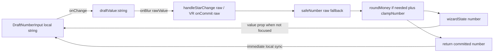

# PHASE D — Local Draft Number Input Plan

## 문서 메타

| 항목 | 내용 |
|------|------|
| 상태 | Draft — 구현 전 설계 문서 |
| 목적 | Strategy Setup 숫자 입력 UX 버그를 **Local Draft Pattern**으로 해결하기 위한 아키텍처·통합·검증 기준을 고정한다. |
| 소스 수정 | 본 문서 단계에서는 **`.ts`/`.tsx` 소스를 수정하지 않는다.** 구현은 별도 PR/태스크에서 진행한다. |
| 비목표 | `WizardState` / `StrategyWizardDraftInput` 전역 타입을 `string`으로 확장하는 것, 전 앱 모든 숫자 입력 일괄 마이그레이션 |

---

## 1. Objective

### 1.1 UX 문제 (As-Is)

새 포트폴리오·전략 생성 마법사에서 숫자 필드의 `onChange`마다 부모가 **`safeNumber` + `clampNumber`(및 `roundMoney`)**를 적용해 **전역 상태를 즉시 `number`로 갱신**하고 있다. 그 결과:

- 사용자가 Backspace로 필드를 **완전히 비우려 하면**, 빈 문자열이 `safeNumber(..., fallback)`에 의해 **즉시 기본값**으로 되돌아가거나, `clampNumber`에 의해 **최소/최대**로 밀린다.
- 입력 UI는 `value={number}`로 **제어된 컴포넌트**이므로, 중간 상태인 `""`, `"12."` 같은 **transient string**을 표현할 수 없다.

관련 SSOT:

- [components/strategyCreator/useStrategyCreatorController.tsx](components/strategyCreator/useStrategyCreatorController.tsx) — `handleMaShortPeriodChange`, `handleDailyBuyAmountChange`, `handleTargetReturnRateChange`, `stepHandlers` 등
- [src/components/StrategyCreator/utils.ts](src/components/StrategyCreator/utils.ts) — `safeNumber` (빈 문자열 → `fallback` 설계)

### 1.2 해결 방향 (To-Be): Local Draft Pattern

- **전역 `WizardState`의 숫자 필드 타입은 그대로 `number`로 유지**한다.
- **임시 문자열 상태(`draft`)는 입력 컴포넌트 내부에만** 둔다 (`useState<string>`).
- **`onChange`**: 로컬 `draft`만 갱신하고, **부모/`wizardState`는 갱신하지 않는다.** 이때 UI 레벨에서 **입력 원천 sanitization**을 적용해 `-`는 전역 차단하고, `.`은 `allowDecimal`이 `true`인 필드에서만 허용한다.
- **`onBlur`**: `onCommit(raw: string)` 한 번만 호출하고, 부모 핸들러에서 **`safeNumber` → (필요 시) `roundMoney` → `clampNumber`/필드별 하한** 순으로 **committed number**만 `wizardState`에 반영한다.
- 외부 `value`(committed number)가 바뀔 때(초기화, 다른 경로 업데이트) 로컬 `draft`를 맞추되, **포커스 중에는 외부 동기화로 타이핑을 덮어쓰지 않는다** (Rule 2, Rule 10).

이렇게 하면 “0 금지”·범위 클램프는 **blur 이후**에만 적용되고, 타이핑 중에는 빈 칸·중간 입력이 가능해진다.

### 1.3 Core Principles 매핑 (11항 요약)

| Principle | 본 설계에서의 반영 |
|-----------|-------------------|
| Rule 1 (금융·숫자 안전) | `onChange`에서 `-`를 차단해 UI 드래프트를 비음수로 유지하고, `onBlur`에서 `safeNumber`/`clampNumber`/`roundMoney`로 **NaN·비유한·범위 밖**을 제거한다. `withdraw` 같은 액션 기반 부호는 입력값이 아니라 **비즈니스 로직**이 결정한다. |
| Rule 2 (React) | draft 동기화는 `useEffect`로만; 렌더 본문에서 ref/state 부작용 없음. |
| Rule 3 (I18N) | 라벨/에러 문구는 기존 SSOT 유지; 새 컴포넌트는 **문자열 하드코딩 없이** `aria-label` 등은 props로 주입. |
| Rule 4 (A11y) | `type="text"` + `inputMode` 조합으로 모바일 키패드를 제어하되, `id`/`htmlFor` 연결과 `aria-label` 전달은 부모에서 유지한다. |
| Rule 5–6 (DRY/SRP) | 반복되는 draft 로직은 **한 컴포넌트**로; 부모는 “commit 시 파싱”만 담당. |
| Rule 7 (TS) | `any` 금지, `unknown` 불필요 시 사용 안 함. |
| Rule 8 (네이밍·매직 넘버) | 파일 상단 `SCREAMING_SNAKE` 상수로 빈 문자열 등만 표현. |
| Rule 10 (State colocation) | draft는 입력 컴포넌트에만 존재. |

---

## 2. Core Component Implementation

### 2.1 제안 파일 경로

- [components/common/DraftNumberInput.tsx](components/common/DraftNumberInput.tsx)  
  MA / MultiSplit / Meta / VR 등 Strategy Setup에서 **2회 이상** 쓰이므로 `common`에 두는 것이 DRY에 맞다.

### 2.2 입력 정책 고정

- **음수(`-`)는 모든 Strategy Setup 숫자 입력에서 차단**한다.
- **소수점(`.`)은 제한적으로만 허용**한다. 기본값은 `false`이며, 현재 계획상 대표 대상은 **수수료율(Fee)** 이다.
- 주식 수량, 분할 횟수, 기간(일/주), 최소 주문 수량 등은 **정수 전용(Integer-only)** 으로 유지한다.
- **VR Strategy의 `bandUpperPct`, `bandLowerPct`, `g`, `poolUsagePct`는 모두 정수 전용**으로 고정한다. 이 필드들은 모두 `DraftNumberInput`에 **`allowDecimal={false}`** 를 사용해야 한다.
- `withdraw`/`deltaCash`처럼 도메인상 인출 행위를 뜻하는 값도 **입력 state는 절댓값**으로 유지하고, 실제 음수 부호는 최종 전략 빌드 로직이 부여한다.

### 2.3 Rule 1 - `onBlur`에서의 보증

부모 `onCommit` 핸들러(또는 그 안에서 호출하는 유틸)는 다음을 **반드시** 수행한다:

1. `safeNumber(raw, fallback)` — `trim()` 후 `""`는 **0이 아니라 `fallback`**; `NaN`/비유한 파싱도 `fallback`.
2. 금액·퍼센트 필드는 기존과 동일하게 `roundMoney` 등 프로젝트 규칙 적용.
3. `clampNumber(parsed, min, max)` — 부모가 **범위 밖 값을 state에 넣지 않음**.
4. 그 결과 **`wizardState`에는 `number`이며 `Number.isFinite`가 보장**된다 (VR `minOrderQty` 등 필드별 추가 하한은 기존 제품 규칙대로 동일 레이어에서 처리).
5. 음수 부호가 필요한 도메인(`withdraw`)도 부모 state에는 **절댓값만** 저장하고, 실제 부호는 `buildVrBandStrategy` 같은 비즈니스 계층에서 결정한다.

### 2.4 Rule 2 - `useEffect` 무한 루프 방지

- 동기화 `useEffect`의 의존성은 **`value` (committed number)만** 둔다.
- 포커스 중(`isFocusedRef.current === true`)이면 **early return**으로 외부 `value` 반영을 건너뛴다.
- `setDraftValue`는 **`previous === nextDraft ? previous : nextDraft`** 형태로 불필요한 리렌더를 줄인다.
- **렌더 바디에서 `ref.current = ...` 같은 직접 변이는 금지**한다. 최신 `draftValue` 전달은 `handleBlur`가 `draftValue`를 dependency로 캡처하는 방식으로 해결한다.
- **중요:** `useEffect`만으로 blur 이후 교정을 보장하면 안 된다. `clampNumber("999") -> 100` 이후 사용자가 다시 `"999"`를 입력하면, 부모 state가 이미 `100`인 경우 React가 **동일 값 bail-out**을 수행해 child `useEffect`가 다시 실행되지 않을 수 있다.
- 따라서 `handleBlur`는 부모가 정규화한 **committed value를 동기적으로 돌려받아** 로컬 `draftValue`를 즉시 교정해야 한다. 이 방식은 부모 state가 실제로 바뀌지 않은 경우에도 UI와 committed state의 불일치를 남기지 않는다.

### 2.5 `DraftNumberInput.tsx` - simulation-ready snippet

아래는 **문서용 완전 스니펫**이다. 구현 시 프로젝트의 `className`/props 네이밍에 맞게 조정한다.

```tsx
import React, { useCallback, useEffect, useRef, useState } from 'react';

const EMPTY_DRAFT = '';

function formatCommittedNumberForDraft(value: number): string {
  if (!Number.isFinite(value)) {
    return EMPTY_DRAFT;
  }
  return String(value);
}

export interface DraftNumberInputProps {
  id?: string;
  value: number;
  onCommit: (rawValue: string) => number;
  allowDecimal?: boolean;
  className?: string;
  ariaLabel?: string;
  ariaInvalid?: boolean;
  disabled?: boolean;
}

export function DraftNumberInput(props: DraftNumberInputProps): React.ReactElement {
  const {
    id,
    value,
    onCommit,
    allowDecimal = false,
    className,
    ariaLabel,
    ariaInvalid,
    disabled,
  } = props;

  const [draftValue, setDraftValue] = useState<string>(() =>
    formatCommittedNumberForDraft(value),
  );
  const isFocusedRef = useRef(false);

  useEffect(() => {
    // 포커스 중에는 외부 committed value가 변해도 사용자의 타이핑을 덮어쓰지 않는다.
    if (isFocusedRef.current) {
      return;
    }
    const nextDraft = formatCommittedNumberForDraft(value);
    setDraftValue((previous) => (previous === nextDraft ? previous : nextDraft));
  }, [value]);

  const handleChange = useCallback((event: React.ChangeEvent<HTMLInputElement>) => {
    const rawValue = event.target.value;
    let sanitized = rawValue.replace(/[^0-9.]/g, '');

    if (!allowDecimal) {
      sanitized = sanitized.replace(/\./g, '');
    } else {
      const decimalParts = sanitized.split('.');
      if (decimalParts.length > 2) {
        sanitized = `${decimalParts[0]}.${decimalParts.slice(1).join('')}`;
      }
    }

    setDraftValue(sanitized);
  }, [allowDecimal]);

  const handleFocus = useCallback(() => {
    isFocusedRef.current = true;
  }, []);

  const handleBlur = useCallback(() => {
    isFocusedRef.current = false;
    const committedValue = onCommit(draftValue);
    setDraftValue(formatCommittedNumberForDraft(committedValue));
  }, [draftValue, onCommit]);

  return (
    <input
      id={id}
      type="text"
      inputMode={allowDecimal ? 'decimal' : 'numeric'}
      className={className}
      value={draftValue}
      onChange={handleChange}
      onFocus={handleFocus}
      onBlur={handleBlur}
      disabled={disabled}
      aria-label={ariaLabel}
      aria-invalid={ariaInvalid ?? false}
    />
  );
}
```

**비고:**

- `onChange`의 regex sanitization은 **입력 원천 차단** 계층이다. 최종 숫자 보증은 여전히 `onBlur`의 `onCommit` 경로가 책임진다.
- `type="text"` + `inputMode`를 쓰는 이유는 브라우저별 `type="number"`의 `e`, `E`, `-`, locale 처리 차이를 피하고, 허용 문자 정책을 **일관되게 통제**하기 위해서다.
- `handleBlur`는 부모가 반환한 `committedValue`로 즉시 `setDraftValue(...)`를 수행하므로, **부모 state가 동일 값으로 bail out되더라도** blur 직후 UI가 정답값으로 교정된다.
- **금지:** `setDraftValue(formatCommittedNumberForDraft(value))`처럼 현재 props `value`로 되감는 방식은 사용하지 않는다. 부모 업데이트가 아직 반영되기 전의 **이전 value**로 잠깐 되돌아가는 stale sync 위험이 있기 때문이다.

---

## 3. Integration & Refactoring Strategy

### 3.1 데이터 흐름



### 3.2 MA / MultiSplit / NoStop / Meta (string 핸들러 유지)

현재 뷰는 `onMaShortPeriodChange(event.target.value)`처럼 **문자열**을 넘긴다. 구현 시:

- [components/strategyCreator/steps/MaWizardStepViews.tsx](components/strategyCreator/steps/MaWizardStepViews.tsx) 의 raw `<input type="number">`를 `DraftNumberInput`으로 교체한다.
- `onCommit={(raw) => onMaShortPeriodChange(raw)}` 형태로 연결한다.
- [components/strategyCreator/useStrategyCreatorController.tsx](components/strategyCreator/useStrategyCreatorController.tsx) 의 기존 `handleMaShortPeriodChange` 등은 **로직을 유지**하되, 의미상 “**blur 시에만** 호출된다”로 바뀐다.
- 단, 동일 값 bail-out에도 UI 교정이 필요하므로 각 `handle*Change(raw)`는 **부모에 반영한 최종 committed number를 반환**해야 한다. 즉, 계약은 `(raw: string) => number`가 된다.

[components/strategyCreator/steps/SingleStockStrategyStepViews.tsx](components/strategyCreator/steps/SingleStockStrategyStepViews.tsx) 의 `LabeledNumberField`는 다음 중 하나로 정리한다.

- **옵션 A (권장):** `LabeledNumberField` 내부에서 `DraftNumberInput`을 사용하고, `onChange` prop 이름을 `onCommit`으로 바꾸거나 의미를 문서화한다.
- **옵션 B:** `LabeledNumberField`는 유지하고, 숫자 필드만 `DraftNumberInput`으로 직접 교체한다.

#### Before (개념) — 매 키입력마다 부모 갱신

```tsx
<input
  type="number"
  value={maShortPeriod}
  onChange={(event) => onMaShortPeriodChange(event.target.value)}
  className={STRATEGY_CREATOR_STYLES.textInput}
/>
```

#### After (개념) — 타이핑은 로컬, blur에서만 commit

```tsx
<DraftNumberInput
  id="ma-short-period"
  value={maShortPeriod}
  onCommit={onMaShortPeriodChange}
  className={STRATEGY_CREATOR_STYLES.textInput}
/>
```

`onMaShortPeriodChange` 시그니처는 구현 단계에서 `(value: string) => number`로 바뀌며, 반환값은 `clampNumber(safeNumber(...))` 결과와 동일해야 한다.

#### Fee 입력 - 소수점 허용 예시

```tsx
<DraftNumberInput
  value={typeof meta.feeRatePercent === 'number' ? meta.feeRatePercent : 0}
  allowDecimal
  onCommit={onFeeRatePercentChange}
  className={STRATEGY_CREATOR_STYLES.textInput}
/>
```

### 3.3 “다음” / “저장” 클릭 시 커밋 누락 방지

이 계획에서는 커밋 누락을 **후속 과제**로 미루지 않는다. Strategy Creator의 Primary 액션(`다음`, `저장`, `전략 시작`)은 **표준 `button`의 `onClick` 이벤트**를 사용해야 하며, 이 전제 아래 **입력 필드의 `onBlur`가 버튼 `onClick`보다 먼저 동기적으로 실행**되도록 설계한다.

즉, 사용자가 숫자 필드에서 타이핑 중 커서를 둔 채 바로 Primary 버튼을 눌러도:

1. 입력 필드 `onBlur`
2. `DraftNumberInput.onCommit(raw)`
3. 부모 `handle*Change(raw)` → `safeNumber` / `roundMoney` / `clampNumber`
4. Primary 버튼 `onClick`

순서로 처리되어, **최종 `wizardState`가 마지막 draft를 반영한 상태에서만** 다음 단계 이동 또는 저장이 실행되어야 한다.

따라서 본 Phase D 구현에서는 다음을 명시적으로 금지한다.

- Primary 버튼에서 `onPointerDown`, `onMouseDown` 등 **blur보다 먼저 실행될 수 있는 조기 액션 처리**
- blur 이전 draft flush를 우회하는 임의의 직접 저장 로직

이 제약은 Local Draft Pattern의 일부이며, 별도 보완책이 아니라 **필수 구현 계약**이다.

### 3.4 VR Band — number 즉시 변환 제거 및 commit 시그니처 통일

현재 [components/strategies/VrBandStrategyForm.tsx](components/strategies/VrBandStrategyForm.tsx) 는 `Number(e.target.value)` + `Math.max`/`Math.min`을 **onChange**에서 수행하고, [components/strategyCreator/useStrategyCreatorController.tsx](components/strategyCreator/useStrategyCreatorController.tsx) 의 `handleVr*`는 다시 `Math.max(0, value)` 등을 적용해 **이중 방어**가 있다.

향후 구현 권장:

- VR 필드도 `DraftNumberInput`(또는 동일 패턴)으로 통일하고, props는 **`onCommit: (raw: string) => void`** 로 맞춘다.
- VR 필드도 `DraftNumberInput`(또는 동일 패턴)으로 통일하고, props는 **`onCommit: (raw: string) => number`** 로 맞춘다.
- `deltaCash`/인출 관련 입력은 UI에서 `-`를 허용하지 않고 **절댓값 draft**만 저장한다.
- **클램프·음수 방지·최소 주문 1주** 등은 **한 레이어**에서만 수행하도록 정리한다 (컨트롤러의 `safeNumber`+`clamp` 또는 VR 전용 normalize 함수 - 기존 제품 규칙 준수).
- VR의 `bandUpperPct`, `bandLowerPct`, `g`, `poolUsagePct`는 **Poka-yoke 정책상 정수 전용**으로 바꾸며, 모두 **`allowDecimal={false}`** 를 강제한다.
- 위 4개 필드는 현재 수학 엔진(`toDecimalRate` 등)이 정수 퍼센트를 내부 계산용 소수 비율로 바꾸므로, **이번 Phase D의 관심사는 계산 로직이 아니라 UI 입력 제한**이다.
- 즉, VR에서 `allowDecimal`을 켜는 후보는 위 4개 필드가 아니며, 이 계획 문서 기준으로는 **VR bands / G / pool usage에 소수점 입력을 허용하지 않는다.**

#### VR Integer-only 예시

```tsx
<DraftNumberInput
  value={vrBandUpperPct}
  allowDecimal={false}
  onCommit={onVrBandUpperPctChange}
  className={VR_INPUT_CLASS_NAME}
/>

<DraftNumberInput
  value={vrBandLowerPct}
  allowDecimal={false}
  onCommit={onVrBandLowerPctChange}
  className={VR_INPUT_CLASS_NAME}
/>

<DraftNumberInput
  value={vrG}
  allowDecimal={false}
  onCommit={onVrGChange}
  className={VR_INPUT_CLASS_NAME}
/>

<DraftNumberInput
  value={vrPoolUsagePct}
  allowDecimal={false}
  onCommit={onVrPoolUsagePctChange}
  className={VR_INPUT_CLASS_NAME}
/>
```

### 3.5 타입·계약

- [components/strategyCreator/types/ui.ts](components/strategyCreator/types/ui.ts) 의 `maShortPeriod: number` 등 **뷰로 내려오는 값은 계속 `number`**.
- `DraftNumberInput`의 `onCommit` 계약은 **`(raw: string) => number`** 이다.
- 부모 `handle*Change`는 **문자열 raw를 받아 committed number를 계산하고**, 그 값을 state에 반영한 뒤 **같은 값을 반환**해야 한다.
- 이 반환 계약은 blur 직후 child 로컬 draft를 즉시 교정하기 위한 것이며, React의 **동일 값 bail-out**과 무관하게 UI/상태 정합성을 유지한다.

---

## 4. Verification Checklist

구현 완료 후 아래를 수동·자동으로 확인한다.

### 4.1 UX

- [ ] 숫자 필드에서 전체 선택 후 삭제 시, **포커스 유지 중**에는 칸이 비어 있을 수 있다 (`""`).
- [ ] 정수 전용 필드에서 `-`, `.`, `e`, 알파벳을 입력/붙여넣기해도 draft에 남지 않는다.
- [ ] 소수점 허용 필드에서만 `.`이 1개까지 허용되고, `1.2.3` 입력은 `1.23`으로 정규화된다.
- [ ] VR의 `bandUpperPct`, `bandLowerPct`, `g`, `poolUsagePct`는 **반드시 정수 전용**이며, `.` 입력이 즉시 거부된다.
- [ ] VR의 위 4개 필드에 `12.5`, `0.7`, `15.0` 같은 값을 붙여넣어도 draft에는 소수점이 남지 않는다.
- [ ] 빈 칸에서 blur 시 **`safeNumber("", fallback)`**에 따라 **크래시 없이** 기본값(또는 필드 정책상 최소값)으로 복구된다.
- [ ] 공백만 입력 후 blur 시 `trim` 후 `""`와 동일하게 취급되어 안전하게 복구된다.
- [ ] 범위 밖 숫자 입력 후 blur 시 **`clampNumber`**로 min/max에 맞춰진다.
- [ ] 같은 잘못된 큰 값을 **연속해서 두 번 이상** 입력해도, 두 번째 blur에서도 UI가 즉시 clamped 값으로 되돌아간다.
- [ ] 부분 익절 % 등 **하한이 1**인 필드에서, 타이핑 중 `0`만 잠시 있는 것은 허용되고 blur 후에만 1로 정규화되는지(정책이 그렇다면).
- [ ] `withdraw`/`deltaCash` 계열 입력은 사용자가 음수를 넣으려 해도 UI draft/state 모두 절댓값으로 유지된다.

### 4.2 기술·원칙

- [ ] `WizardState` / draft 타입에 **`string` 필드가 누수되지 않음** (draft는 컴포넌트 로컬만).
- [ ] `useEffect` 동기화가 포커스 가드 없이 타이핑을 덮어쓰지 않음.
- [ ] `value` prop 변경 시 무한 렌더 루프가 없음 (`setDraftValue` guarded 업데이트).
- [ ] blur 직후 local draft 교정이 **현재 props `value`가 아니라 부모가 반환한 committed value**를 기준으로 동작한다.
- [ ] Primary 액션 버튼은 **표준 `onClick` 기반**으로 유지되며, `onPointerDown`/`onMouseDown`에서 저장·다음 단계 이동을 실행하지 않는다.
- [ ] TypeScript **`any` 없음**, 불필요한 `useMemo` 추가 없음.
- [ ] JSX에 **3단 중첩 삼항 연산자** 없음.

### 4.3 회귀

- [ ] `buildPortfolioDraftFromWizardState` / `validatePortfolioSetupInput` 경로가 **이전과 동등한 숫자 의미**를 갖는지(특히 메타 `roundMoney` 필드).
- [ ] VR 제출 전 검증(`initialCapital` 등 > 0)이 여전히 동작한다.

### 4.4 접근성

- [ ] 기존 `id`/`htmlFor` 연결이 유지되거나, `aria-label`이 props로 전달된다.

---

## 5. 참고 문서·코드

- [docs2/PHASE_C_MA_MICROCOPY_PLAN.md](docs2/PHASE_C_MA_MICROCOPY_PLAN.md) — Phase 문서 톤·구조 참고
- [components/strategyCreator/useStrategyCreatorController.tsx](components/strategyCreator/useStrategyCreatorController.tsx)
- [src/components/StrategyCreator/utils.ts](src/components/StrategyCreator/utils.ts) — `safeNumber`
- 거래 모달의 raw string + 파싱 패턴 참고(개념만): [src/utils/tradeModalCalculations.ts](src/utils/tradeModalCalculations.ts) (`parseTradeNumericInput` — Strategy Creator와 요구가 다를 수 있어 **직접 재사용 여부는 구현 시 판단**)

---

## 6. 구현 순서 제안 (참고)

1. `DraftNumberInput.tsx` 추가 및 스토리북/로컬 스모크(선택).
2. `MaWizardStepViews` 단기/장기 기간부터 교체 → QA.
3. `MaSections` RSI·부분익절, `SingleStockStrategyStepViews` 메타·멀티스플릿 순.
4. `VrBandStrategyForm` 통일 및 VR 핸들러 이중 clamp 정리.
5. Primary 클릭 시 blur 순서 엣지 케이스가 남으면 2차 이슈로 flush 전략 추가.

---

*End of PHASE D Local Draft Input Plan.*
