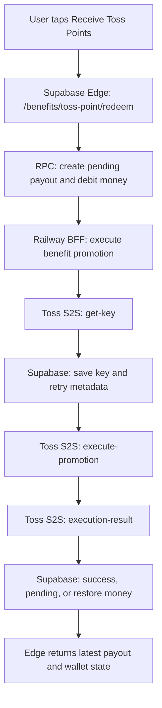
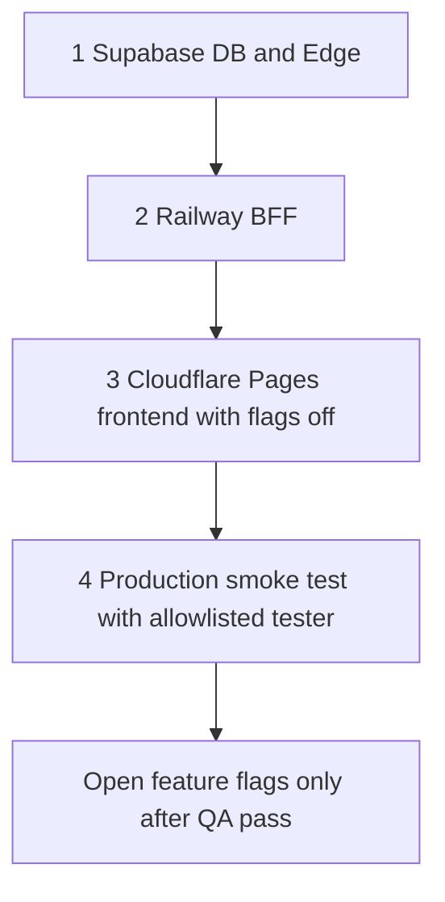

# Toss Point Phase 4B Runbook

이 문서는 `docs2/toss_point/toss_point_reward_plan.md`의 Phase 4B 실행 문서입니다.
Phase 4A가 내부 API, 화면, 광고 연동을 마친 뒤에도 실제 토스 포인트 지급망은 바로 고객에게 열지 않습니다. 먼저 Railway BFF에서 mTLS 기반 S2S 지급을 구현하고, Feature Flag를 닫은 상태로 Supabase, Railway, Cloudflare Pages를 순서대로 배포합니다.

## 1. Phase 4B 기술 설계도

### 1.1 아키텍처 결정

토스 포인트 실지급은 Supabase Edge Function이 아니라 Railway BFF에서 처리합니다.

이유는 다음과 같습니다.

| 결정 근거 | 내용 |
|---|---|
| mTLS 인증 | Apps in Toss 파트너 API는 클라이언트 인증서와 개인키가 필요한 서버 간 통신입니다. 현재 프로젝트의 mTLS HTTPS Agent는 `server/src/tossClient.ts`에 있으며 Node.js `https.Agent`를 사용합니다. |
| 비밀키 격리 | `TOSS_CLIENT_CERT`, `TOSS_CLIENT_KEY`, `SUPABASE_SERVICE_ROLE_KEY`는 클라이언트와 Edge 공개 코드 경계 밖에 있어야 합니다. |
| 장애 관찰성 | BFF는 Fastify request log와 correlation id를 이미 사용하므로 Toss 응답, retry, rollback 상태를 한 흐름으로 추적하기 좋습니다. |
| 트랜잭션 분리 | DB row lock 안에서는 pending 생성과 상태 갱신만 수행하고, 외부 Toss API 호출은 lock 밖에서 수행해야 합니다. BFF가 이 오케스트레이션을 담당합니다. |
| 기존 배포 구조 | Railway의 배포 대상은 `server/`이며, 이미 Toss 로그인/결제 검증용 BFF로 사용 중입니다. |

권장 호출 경로는 다음과 같습니다.



프론트엔드는 계속 Supabase Edge Function만 호출합니다. BFF 호출은 Edge 또는 서버 내부 재시도 작업자가 수행하며, Edge to BFF 호출에는 내부 shared secret을 붙입니다. 이렇게 하면 사용자 인증, 혜택 미션 API, 지갑 조회는 Supabase Edge에 남기고, mTLS가 필요한 Toss 통신만 Railway BFF로 격리할 수 있습니다.

### 1.1.1 정책 확인 메모

이번 설계는 아래 전제를 만족하는 범위에서 운영합니다.

| 정책 메모 | 운영 전제 |
|---|---|
| 내부 리워드 명칭 | 미니앱 내부 누적 단위는 `머니`로 표기합니다. `포인트`, `출금`, `인출`, `환전` 같은 현금화 오인 표현은 사용하지 않습니다. |
| 토스 포인트 지급 표현 | 실제 지급 단계에서는 `토스 포인트 지급` 또는 `토스 포인트 받기`로만 표기합니다. |
| 교환 구조 전제 | 내부 `머니` 누적 후 토스 포인트 지급 구조는 토스 측 사전 확인을 받은 정책 전제에서만 운영합니다. 현금성 전환이나 상시 환전 서비스처럼 보이지 않도록, 앱 유입/참여 목적의 한시적 프로모션으로만 운영합니다. |
| 5,000P 한도 해석 | 현재 운영 전제는 `1회 지급 한도 5,000P`입니다. 동일 유저가 기간 중 여러 번 받을 수 있더라도 각 요청은 5,000P를 넘지 않도록 서버가 강제합니다. |
| 최종 기준 | 공개 문서와 별도로 토스 측 답변을 받은 항목은 해당 확인 내용을 우선 운영 메모로 남기고, 검수 재확인 요청 시 즉시 근거를 제출할 수 있게 보관합니다. |

정책 오해를 줄이기 위해 고객-facing 문구에는 아래를 함께 명시합니다.

- 지급 조건
- 지급 시점
- 지급 제한
- `본 프로모션은 사전 고지 없이 중단될 수 있습니다`
- 예산 소진 또는 종료 시 지급 불가 안내

### 1.2 BFF 내부 모듈 구성

Phase 4B에서 추가할 최소 모듈은 아래와 같습니다.

| 파일 후보 | 책임 |
|---|---|
| `server/src/routes/benefitPromotionRoute.ts` | 내부 API 라우트. Edge에서 호출한 지급 실행 요청을 검증합니다. |
| `server/src/toss/benefitPromotionClient.ts` | Toss S2S 3단계 호출 전담. `tossClient`를 재사용합니다. |
| `server/src/services/benefitPromotionService.ts` | pending payout 조회, retry gate, Toss 호출, 성공/실패 확정 오케스트레이션. |
| `server/src/services/benefitPromotionRepository.ts` | Supabase Admin RPC/table 접근 전담. |
| `server/src/utils/promotionRetryPolicy.ts` | 지수 백오프와 최대 재시도 정책. 프론트와 공유하지 않습니다. |

서비스 경계는 명확히 나눕니다.

- Route는 인증과 body 검증만 수행합니다.
- Toss client는 HTTP 호출과 Toss error normalization만 수행합니다.
- Service는 상태 머신을 수행합니다.
- Repository는 Supabase RPC와 table update만 수행합니다.

### 1.3 내부 API 계약

Edge 또는 운영 재시도 작업자가 Railway BFF에 호출하는 내부 API입니다.

```text
POST /benefits/toss-point/execute-promotion
Authorization: Bearer {BENEFIT_BFF_INTERNAL_SECRET}
Content-Type: application/json
X-Correlation-ID: {correlationId}

{
  "userId": "{auth.users.id}",
  "redeemRequestId": "{client generated id}",
  "payoutId": "{benefit_toss_point_payouts.id}"
}
```

검증 규칙:

- `Authorization`의 내부 secret이 없거나 다르면 401로 종료합니다.
- `userId`, `redeemRequestId`, `payoutId`는 필수입니다.
- `payoutId`는 UUID 형식이어야 합니다.
- body에 문서화되지 않은 필드가 들어오면 거절합니다.
- BFF는 `payoutId`, `userId`, `redeemRequestId`가 같은 row만 처리합니다.

응답 예시:

```json
{
  "success": true,
  "status": "success",
  "payoutId": "00000000-0000-4000-8000-000000000000",
  "redeemRequestId": "benefit-2026-04-30-abc",
  "tossPointAmount": 100,
  "moneyBalance": 1200,
  "nextPromotionRetryAt": null
}
```

### 1.4 Toss S2S 3단계 구현 흐름

모든 Toss 호출은 `server/src/tossClient.ts`의 mTLS axios client를 재사용합니다.

```text
Base URL: https://apps-in-toss-api.toss.im
Required header: x-toss-user-key: {tossUserKey}
Required header: Content-Type: application/json
```

#### Step 1. get-key

```text
POST /api-partner/v1/apps-in-toss/promotion/execute-promotion/get-key
```

BFF 처리:

1. Supabase에서 `userId`에 연결된 `toss_user_key`를 조회합니다.
2. pending payout이 처리 가능한 상태인지 확인합니다.
3. `next_promotion_retry_at`이 미래이면 Toss API를 호출하지 않고 pending 상태를 반환합니다.
4. 기존 `toss_promotion_key_expires_at`이 아직 유효하면 새 key를 발급하지 않습니다.
5. key가 없거나 만료되었으면 `get-key`를 호출합니다.
6. 발급 시각과 만료 시각을 Supabase에 저장합니다.

`key`는 1시간 유효로 취급합니다.

#### Step 2. execute-promotion

```text
POST /api-partner/v1/apps-in-toss/promotion/execute-promotion
```

요청 body:

```json
{
  "promotionCode": "{TOSS_BENEFIT_PROMOTION_CODE}",
  "key": "{issuedPromotionKey}",
  "amount": 100
}
```

주의사항:

- `amount`는 내부 `머니`가 아니라 Toss Point 수량입니다.
- `1,000머니 -> 100P`이면 `amount = 100`입니다.
- 각 지급 요청의 1회 최대 지급량은 `5,000P`입니다.
- 동일 `redeemRequestId`의 pending payout은 새 payout을 만들지 않고 같은 row를 재시도합니다.
- 동일 유저가 여러 번 받는 경우에도 각 요청마다 서버가 `amount <= 5000`을 강제합니다.

#### Step 3. execution-result

```text
POST /api-partner/v1/apps-in-toss/promotion/execution-result
```

요청 body:

```json
{
  "promotionCode": "{TOSS_BENEFIT_PROMOTION_CODE}",
  "key": "{issuedPromotionKey}"
}
```

결과 처리:

| Toss result | DB 처리 | 사용자 상태 |
|---|---|---|
| `SUCCESS` | payout `success`, `completed_at` 저장 | 지급 완료 |
| `PENDING` | payout `pending`, `next_promotion_retry_at` 유지 또는 갱신 | 지급 확인 중 |
| `FAILED` | 복구 가능 실패이면 restore ledger 생성 후 payout `failed` | 머니 원복 안내 |
| timeout/network | payout `pending`, retry metadata 갱신 | 나중에 다시 받기 |

### 1.5 Supabase 보상 트랜잭션 설계

외부 Toss API 호출은 DB row lock을 잡은 상태에서 실행하지 않습니다. 대신 짧은 DB 트랜잭션 여러 개로 나눕니다.

#### Transaction A: pending 생성과 머니 차감

이미 Phase 2의 `lock_and_create_pending_toss_redeem` RPC가 담당합니다.

1. `benefit_wallets` row를 `FOR UPDATE`로 잠급니다.
2. `1,000머니 -> 100P`, 1회 최대 `5,000P` 기준으로 차감 금액을 계산합니다.
3. `benefit_toss_point_payouts.status = 'pending'` row를 생성합니다.
4. `benefit_ledger_entries.source = 'toss_redeem_debit'` 음수 원장을 생성합니다.
5. wallet에서 머니를 차감하고 commit합니다.

#### Transaction A-2: key/retry metadata 저장

BFF가 Toss `get-key` 호출 전후로 수행합니다.

1. `benefit_toss_point_payouts` row를 `FOR UPDATE`로 짧게 잠급니다.
2. 이미 `success` 또는 `failed`이면 외부 API 호출 없이 종료합니다.
3. `next_promotion_retry_at`이 미래이면 외부 API 호출 없이 pending 상태를 반환합니다.
4. key가 새로 발급되면 `toss_promotion_key`, `toss_promotion_key_issued_at`, `toss_promotion_key_expires_at`을 저장합니다.
5. `promotion_attempt_count`, `last_promotion_attempt_at`을 갱신합니다.

#### Transaction B: 성공 확정

`execution-result`가 성공이면 수행합니다.

1. payout row를 `FOR UPDATE`로 잠급니다.
2. 이미 `success`이면 idempotent success로 반환합니다.
3. 이미 `failed`이면 재지급하지 않고 failed 상태를 반환합니다.
4. `status = 'success'`, `completed_at = now()`로 저장합니다.
5. wallet은 추가 변경하지 않습니다. 이미 Transaction A에서 차감된 상태가 최종 상태입니다.

#### Transaction C: 실패 원복

복구 확정 실패이면 수행합니다.

1. payout row와 wallet row를 `FOR UPDATE`로 잠급니다.
2. payout이 이미 `failed`이고 restore ledger가 있으면 기존 결과를 반환합니다.
3. `benefit_ledger_entries.source = 'toss_redeem_restore'`, `source_id = redeem_request_id`로 양수 복구 원장을 생성합니다.
4. wallet `money_balance`를 `redeemed_money`만큼 복구합니다.
5. payout에 `status = 'failed'`, `toss_error_code`, `toss_error_message`, `completed_at`을 저장합니다.

복구 원장은 반드시 unique key `(user_id, source, source_id)`로 중복 원복을 막습니다.

### 1.6 실패별 정책

| 실패 상황 | 대표 조건 | BFF 처리 |
|---|---|---|
| 프로모션 없음 | `4100` | failed 처리 또는 운영 설정 오류로 차단. 고객 노출 전이면 feature flag를 계속 닫습니다. |
| 프로모션 종료/비활성 | `4109`, 종료일 경과 | restore ledger로 원복 후 failed. 프론트는 현재 받을 수 없는 혜택으로 안내합니다. |
| 예산 부족 | `4112` | restore ledger로 원복 후 failed. 운영자는 예산 충전 후 새 요청만 허용합니다. |
| 동일 key 중복 | `4113` | 같은 `redeem_request_id`에서 새 key를 1회 발급 후 재시도합니다. |
| 지급 내역 없음 | `4111` | result 조회 대상 없음으로 기록하고 payout 상태를 재확인합니다. |
| 1회 한도 초과 | `4114` | 정책 계산 오류로 간주하고 원복 후 failed. 서버 계산 상 발생하면 안 됩니다. |
| 최대 지급 금액 예산 초과 | `4116` | 원복 후 failed. 프로모션 설정/예산 확인이 필요합니다. |
| 내부 시스템 오류 | `4110`, 5xx | 즉시 원복하지 않고 pending + retry schedule을 우선 적용합니다. |
| 네트워크/timeout | 연결 실패, timeout | pending 유지, `next_promotion_retry_at` 이후 재시도합니다. |

자동 재시도는 무한 반복하지 않습니다.

```text
initial delay: 1s
multiplier: 2
max delay: 30s
max automatic attempts: 5
```

최대 자동 시도 횟수를 넘으면 pending으로 유지하고 운영 대사 대상에 올립니다. 복구 불가능한 실패가 명확한 경우에만 원복 후 failed로 닫습니다.

### 1.6.1 고객 안내 및 표현 가이드

프로모션 검수와 사용자 오인 방지를 위해 고객 안내 문구는 아래 기준을 따릅니다.

| 항목 | 가이드 |
|---|---|
| 내부 재화 명칭 | `머니`만 사용 |
| 금지 표현 | `포인트`, `환전`, `출금`, `인출`, `현금처럼`, `수익 보장` |
| 토스 지급 CTA | `토스 포인트 받기`, `토스 포인트 지급 요청` |
| 조건 고지 | 예: `1,000머니 이상일 때 요청 가능`, `1회 최대 5,000P`, `예산 소진 시 조기 종료 가능` |
| 시점 고지 | 즉시 지급, 지급 확인 중, 재시도 예정 시각 등 상태를 분리 표기 |
| 제한 고지 | 동일 요청 중복 지급 불가, 예산/종료일/오류 상황에 따른 제한 고지 |

혜택 탭 노출형 프로모션으로 운영할 경우 콘솔 입력값도 아래 조건을 맞춥니다.

- 미션명은 12자 이내 `~하기` 형식
- 이동 URL은 `intoss:///ScreenName`
- 조건과 지급 방식은 고정 지급 기준으로 명확히 고지

### 1.7 mTLS 인증서 운영

Railway에는 mTLS 인증서를 환경변수로 등록합니다.

필수 변수:

| 변수 | 설명 |
|---|---|
| `TOSS_CLIENT_CERT` | Apps in Toss mTLS 클라이언트 인증서 PEM 전체 내용 |
| `TOSS_CLIENT_KEY` | 인증서 개인키 PEM 전체 내용 |
| `TOSS_API_URL` | 기본값은 `https://apps-in-toss-api.toss.im` |

PEM 사용 규칙:

- Railway Variables에는 인증서와 개인키 전체를 secret으로 등록합니다.
- 줄바꿈은 실제 줄바꿈 또는 `\n` 이스케이프 형태로 등록합니다.
- 서버는 현재처럼 `.replace(/\\n/g, "\n")`로 정규화합니다.
- 로그에 인증서 원문, private key, 일부 prefix도 출력하지 않습니다.

PFX만 받은 경우:

1. 운영 PC에서 PEM 인증서와 개인키로 변환합니다.
2. 변환된 PEM 내용을 `TOSS_CLIENT_CERT`, `TOSS_CLIENT_KEY`에 등록합니다.
3. PFX 비밀번호가 필요한 구조라면 `TOSS_CLIENT_PFX_PASSPHRASE`를 별도 secret으로 등록하고, Node `https.Agent` 구성 변경이 필요합니다.
4. 현재 코드가 PEM 기반이므로, 가능하면 PEM 인증서/개인키를 Railway에 등록하는 방식을 우선합니다.

금지사항:

- 인증서 파일을 Git에 커밋하지 않습니다.
- `.env` 예시 외 실제 인증서 내용을 문서나 로그에 붙이지 않습니다.
- Supabase Edge secret이나 Cloudflare Pages env에 mTLS private key를 등록하지 않습니다.

## 2. 프로덕션 배포 런북

### 2.1 배포 원칙

첫 배포는 고객에게 혜택 탭이 노출되지 않는 상태로 진행합니다.

Feature Flag 기본값:

```text
VITE_BENEFIT_TAB_ENABLED=false
VITE_TOSS_PROMOTION_APPROVED=false
VITE_BENEFIT_API_READY=false
```

이 세 값이 모두 열리기 전까지 `/benefits` 직접 진입도 대시보드로 되돌아가야 합니다.

배포 순서:



### 2.2 1단계: Supabase

#### DB migration 적용

적용 대상:

- `supabase/migrations/20260512145105_create_benefit_reward_tables.sql`
- `supabase/migrations/20260512153000_create_benefit_rpcs.sql`
- `supabase/migrations/20260515103000_create_benefit_promotion_execution_rpcs.sql`

적용 전 확인:

- 운영 Supabase 프로젝트가 맞는지 확인합니다.
- `benefit_*` 테이블이 기존 운영 테이블과 충돌하지 않는지 확인합니다.
- migration은 운영 DB 백업 또는 PITR 설정 확인 후 실행합니다.

#### Edge Function 배포

대상:

```text
supabase/functions/benefits
```

배포:

```bash
npx supabase functions deploy benefits
```

JWT 검증은 기본적으로 켠 상태를 유지합니다. 특별히 로컬 디버깅이 아닌 운영 배포에서 `--no-verify-jwt`를 사용하지 않습니다.

#### Supabase Secrets

필수:

| Secret | 설명 |
|---|---|
| `SUPABASE_URL` | 운영 Supabase URL |
| `SUPABASE_ANON_KEY` | 사용자 JWT 검증용 anon key |
| `SUPABASE_SERVICE_ROLE_KEY` | RPC 호출용 service role key |
| `TOSS_BENEFIT_PROMOTION_CODE` | 승인된 단일 Toss promotion code |

Phase 4B 추가:

| Secret | 설명 |
|---|---|
| `RAILWAY_BFF_URL` | Edge가 호출할 Railway BFF base URL |
| `BENEFIT_BFF_INTERNAL_SECRET` | Edge to BFF 내부 호출 shared secret |

설정 예:

```bash
npx supabase secrets set TOSS_BENEFIT_PROMOTION_CODE=...
npx supabase secrets set RAILWAY_BFF_URL=https://your-bff.railway.app
npx supabase secrets set BENEFIT_BFF_INTERNAL_SECRET=...
```

#### Supabase 배포 후 확인

- `benefits` Edge Function이 401 없이 인증된 테스트 JWT를 처리하는지 확인합니다.
- Feature Flag가 닫혀 있으므로 일반 고객 UI에는 노출되지 않아야 합니다.
- `benefit_wallets`, `benefit_toss_point_payouts`, `benefit_ledger_entries`에 RLS가 켜져 있고 클라이언트 직접 접근이 불가능한지 확인합니다.

### 2.3 2단계: Railway

#### 배포 대상

Railway Root Directory는 `server`입니다.

```text
Root Directory: server
Build Command: npm install && npm run build
Start Command: npm start
```

#### Railway 필수 환경변수

기존 필수:

| Variable | 설명 |
|---|---|
| `PORT` | Railway가 자동 주입하면 생략 가능 |
| `CORS_ORIGIN` | 운영 Cloudflare Pages origin |
| `SUPABASE_URL` | 운영 Supabase URL |
| `SUPABASE_SERVICE_ROLE_KEY` | 운영 service role key |
| `TOSS_API_URL` | 기본값 `https://apps-in-toss-api.toss.im` |
| `TOSS_CLIENT_CERT` | mTLS client certificate PEM |
| `TOSS_CLIENT_KEY` | mTLS private key PEM |

Phase 4B 추가:

| Variable | 설명 |
|---|---|
| `TOSS_BENEFIT_PROMOTION_CODE` | 승인된 혜택용 promotion code |
| `BENEFIT_BFF_INTERNAL_SECRET` | Supabase Edge와 동일한 내부 secret |
| `BENEFIT_PROMOTION_RETRY_MAX_ATTEMPTS` | 기본 5 |
| `BENEFIT_PROMOTION_RETRY_INITIAL_DELAY_MS` | 기본 1000 |
| `BENEFIT_PROMOTION_RETRY_MAX_DELAY_MS` | 기본 30000 |

선택:

| Variable | 설명 |
|---|---|
| `TOSS_CLIENT_ID` | Toss API가 요구할 때만 사용 |
| `LOG_LEVEL` | 운영 기본 `info` 권장 |

#### Railway 배포 후 확인

- `/health`가 200을 반환하는지 확인합니다.
- mTLS 인증서 누락 경고가 로그에 없는지 확인합니다.
- 내부 API는 secret 없이 401을 반환해야 합니다.
- secret이 있는 내부 API는 테스트 payout이 없을 때 404 또는 처리 불가 상태를 명확히 반환해야 합니다.

### 2.4 3단계: Cloudflare Pages

#### 프론트 환경변수

고객 노출 차단 상태:

| Variable | 값 | 설명 |
|---|---:|---|
| `VITE_BENEFIT_TAB_ENABLED` | `false` | 혜택 탭 숨김 |
| `VITE_TOSS_PROMOTION_APPROVED` | `false` | 프로모션 승인 전 차단 |
| `VITE_BENEFIT_API_READY` | `false` | 서버 최종 QA 전 차단 |
| `VITE_BENEFIT_PREVIEW_ENABLED` | `false` | QA 전용 토스 앱 환경 감지 우회. 운영 출시 전 반드시 false |

기존 필수:

| Variable | 설명 |
|---|---|
| `VITE_SUPABASE_URL` | 운영 Supabase URL |
| `VITE_SUPABASE_ANON_KEY` | 운영 anon key |
| `VITE_RAILWAY_BFF_URL` | 기존 로그인/결제 BFF URL. Phase 4B 프론트가 직접 S2S를 호출하지 않더라도 기존 Toss 기능에 필요합니다. |

광고 관련:

| Variable | 설명 |
|---|---|
| `VITE_TOSS_INTERSTITIAL_USE_TEST` | 운영 빌드에서는 보통 미설정 또는 `false` |

주의:

- `TOSS_CLIENT_CERT`, `TOSS_CLIENT_KEY`, `SUPABASE_SERVICE_ROLE_KEY`는 Cloudflare Pages에 등록하지 않습니다.
- `TOSS_BENEFIT_PROMOTION_CODE`도 가능하면 서버 secret으로만 둡니다. 프론트 표시에 필요하지 않습니다.

#### 프론트 배포 후 확인

- 일반 계정으로 접속했을 때 하단 네비게이션에 `혜택` 탭이 없어야 합니다.
- `/benefits` 직접 접근 시 대시보드로 돌아가야 합니다.
- 기존 대시보드, 이력, 시세, 로그인, 결제 흐름이 깨지지 않아야 합니다.

### 2.5 4단계: 운영 서버 S2S 테스트

운영 테스트는 고객 노출 없이 진행합니다.

#### 사전 준비

1. Toss 테스트 가능 계정의 `toss_user_key`를 확보합니다.
2. 해당 사용자의 Supabase auth user id를 확인합니다.
3. 테스트 계정만 혜택 API를 직접 호출할 수 있게 합니다. 일반 고객 Feature Flag는 계속 닫아 둡니다.
4. 테스트용 머니 잔액을 DB에서 수동 부여해야 한다면, 반드시 ledger와 wallet을 함께 맞춥니다. 임의로 wallet 숫자만 수정하지 않습니다.
5. 테스트 promotion budget과 1회 한도 `5,000P`를 확인합니다.

#### Smoke Test A: pending 생성까지만 확인

1. 테스트 JWT로 `POST /functions/v1/benefits/toss-point/redeem`을 호출합니다.
2. `benefit_toss_point_payouts.status = 'pending'` row가 생성되는지 확인합니다.
3. `benefit_ledger_entries.source = 'toss_redeem_debit'`가 1개만 생성되는지 확인합니다.
4. wallet `money_balance`가 정확히 차감되는지 확인합니다.
5. 같은 `redeemRequestId`로 다시 호출해 중복 차감이 없는지 확인합니다.

#### Smoke Test B: Railway S2S 성공 경로

1. Edge 또는 내부 QA 도구로 BFF `/benefits/toss-point/execute-promotion`을 호출합니다.
2. Railway 로그에서 correlation id 기준으로 `get-key`, `execute-promotion`, `execution-result` 순서를 확인합니다.
3. 성공이면 payout `status = 'success'`, `completed_at` 저장을 확인합니다.
4. wallet은 추가 변경되지 않아야 합니다.
5. Toss 쪽 지급 내역과 DB payout을 대사합니다.
6. 승인 완료 후 `TEST_{promotionCode}`로 최소 1회 성공 테스트가 남아 있는지 콘솔에서 함께 확인합니다.

#### Smoke Test C: retry gate

1. 네트워크 timeout 또는 Toss 5xx를 테스트 환경에서 재현합니다.
2. payout이 `pending`으로 유지되는지 확인합니다.
3. `promotion_attempt_count`, `last_promotion_attempt_at`, `next_promotion_retry_at`이 저장되는지 확인합니다.
4. `next_promotion_retry_at` 이전 재호출이 Toss API를 다시 호출하지 않는지 로그로 확인합니다.
5. retry 가능 시각 이후 같은 `redeemRequestId`로 이어서 처리되는지 확인합니다.

#### Smoke Test D: 실패 원복

1. 복구 확정 에러 케이스를 테스트합니다. 예산 부족, 종료된 promotion, 1회 한도 초과 설정 오류가 대표 케이스입니다.
2. payout이 `failed`로 종료되는지 확인합니다.
3. `benefit_ledger_entries.source = 'toss_redeem_restore'`가 1개 생성되는지 확인합니다.
4. wallet `money_balance`가 Transaction A 이전 수준으로 복구되는지 확인합니다.
5. 같은 요청을 재호출해 중복 원복이 없는지 확인합니다.

#### Smoke Test E: 고객 노출 차단

1. Cloudflare Pages env에서 `VITE_BENEFIT_TAB_ENABLED=false`를 유지합니다.
2. 운영 앱 일반 계정에서 하단 네비게이션에 혜택 탭이 없는지 확인합니다.
3. `/benefits` 직접 URL 진입이 차단되는지 확인합니다.
4. QA 완료 전에는 flag를 열지 않습니다.

### 2.6 출시 전 최종 게이트

아래가 모두 통과해야 고객 노출을 열 수 있습니다.

| 게이트 | 기준 |
|---|---|
| DB 원장 | debit, restore, success가 모두 idempotent |
| Toss S2S | get-key, execute, result 순서와 `x-toss-user-key` 확인 |
| Retry | timeout이 무한 재시도로 이어지지 않음 |
| Rollback | 실패 확정 시 머니가 정확히 복구됨 |
| Feature Flag | flag off에서 고객 노출 없음 |
| 광고 QA | 보상형 광고 완료 전 추가 문제 해금 없음 |
| 문구 QA | 토스 포인트, 머니, 혜택 표현이 심사 기준과 충돌하지 않음 |
| 예산 QA | promotion budget, 요청별 `5,000P` 한도, 운영 일 한도 확인 |
| 정책 QA | 내부 `머니`와 토스 포인트가 혼동되지 않고, 교환/현금화 오인 표현이 없음 |

### 2.7 고객 노출 순서

1. `VITE_BENEFIT_API_READY=true`를 먼저 운영 프론트에 반영합니다.
2. 내부 테스트 계정 또는 제한된 배포 환경에서만 `/benefits` 접근을 검증합니다.
3. `VITE_TOSS_PROMOTION_APPROVED=true`를 반영합니다.
4. 마지막으로 `VITE_BENEFIT_TAB_ENABLED=true`를 반영합니다.
5. 노출 직후 1시간 동안 Railway logs, Supabase payout/ledger, Toss promotion dashboard를 대사합니다.

문제가 발생하면 즉시 `VITE_BENEFIT_TAB_ENABLED=false`로 되돌립니다. 이미 생성된 pending payout은 BFF retry/대사 정책으로 별도 처리하고, 고객 UI만 먼저 닫습니다.

## 3. 운영자가 직접 해야 할 작업

- Toss 콘솔에서 혜택용 단일 promotion code, 예산, 종료일, 1회 한도를 확정합니다.
- 토스 측 정책 확인 답변과 검수 근거를 운영 문서나 티켓에 보관합니다.
- Apps in Toss mTLS 인증서와 개인키를 발급받아 Railway secret으로 등록합니다.
- Supabase 운영 프로젝트에 migration과 `benefits` Edge Function을 배포합니다.
- Railway `server/` BFF를 배포하고 Phase 4B secrets를 등록합니다.
- Cloudflare Pages는 Feature Flag를 닫은 상태로 먼저 배포합니다.
- 테스트 계정의 `toss_user_key`와 auth user id를 확인합니다.
- `TEST_{promotionCode}`로 최소 1회 지급 테스트를 완료합니다.
- 운영 smoke test A-E를 고객 노출 전 완료합니다.
